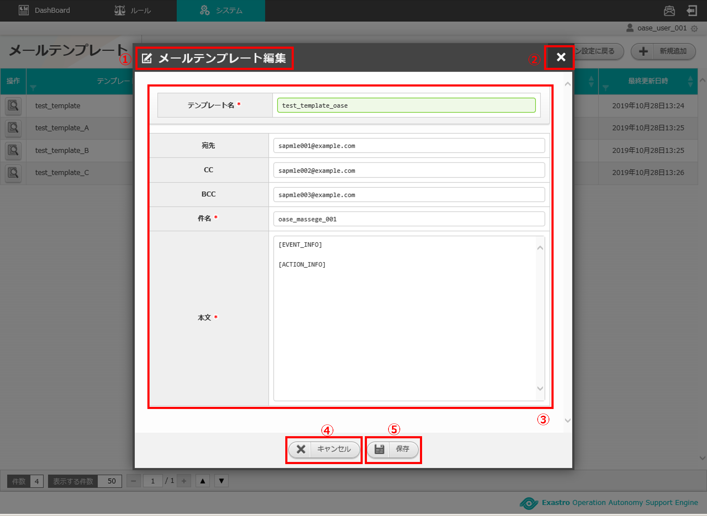
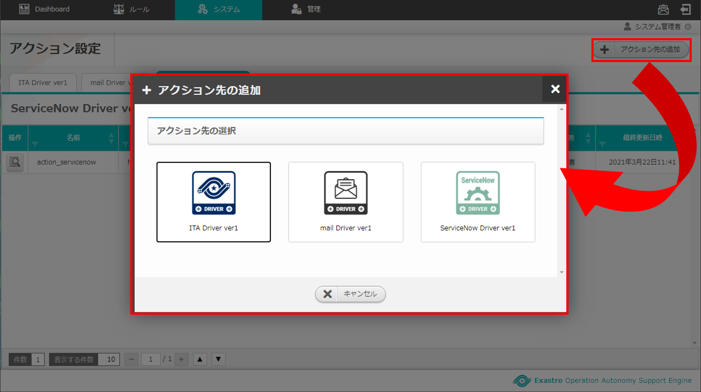
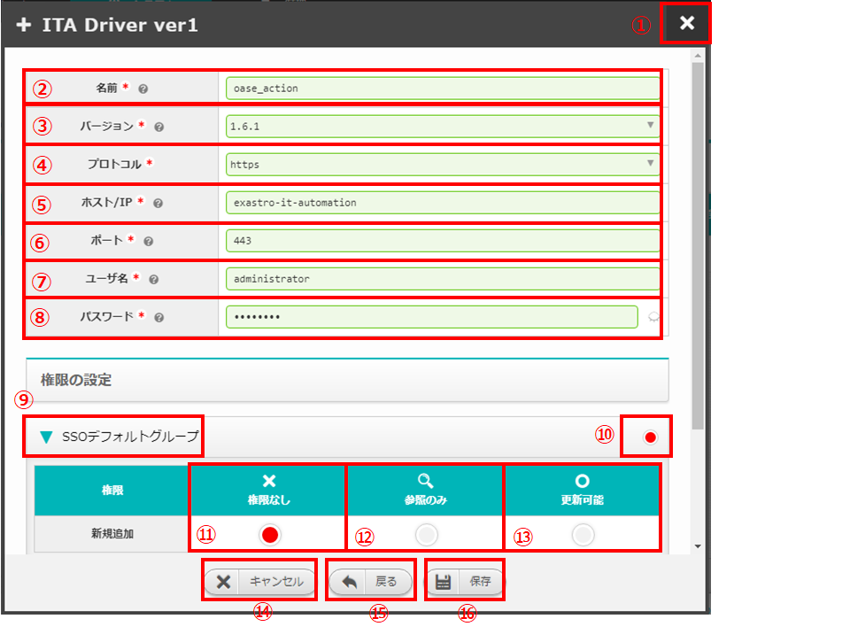
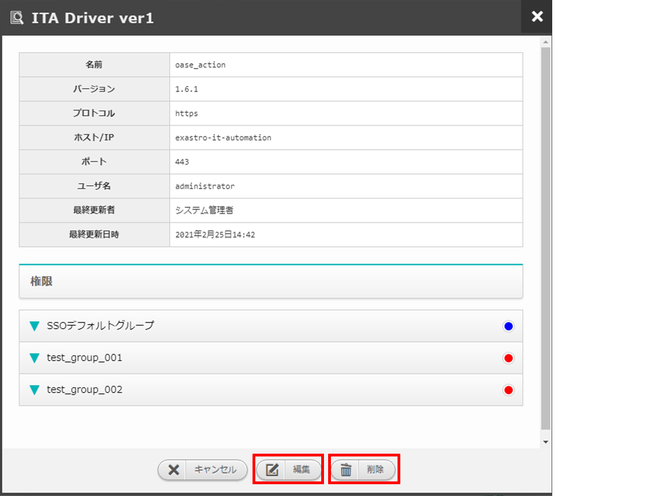
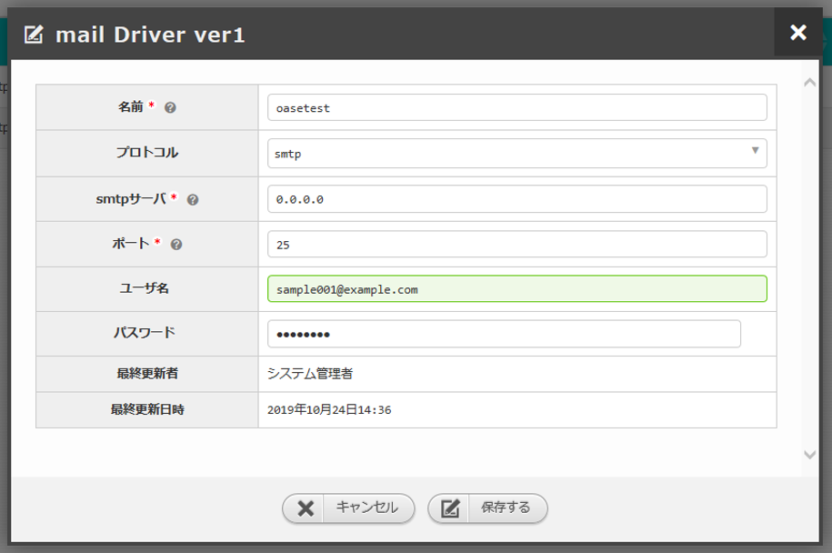

==================================================
2 OASE アクション設定画面のメニュー 、画面構成
==================================================

本章では、OASE アクション設定画面の画面構成と、各構成要素について説明します。

2.1 基本画面構成
================ 

アクション設定画面の画面構成は次のとおりです。

   
   図 2.1-1 画面構成

アクション設定画面の各構成要素と、その機能は次の表のとおりです。

.. csv-table:: 表 2.1-1 機能説明
   :header: No., 構成要素, 説明
   :widths: 5, 20, 60

   1, 作業画面名, 現在表示している作業画面の名称です。
   2, アクション先の追加ボタン,インストール済のドライバに対して、アクション先の情報を追加することができます。
   3, ドライバタブ名,現在表示しているドライバタブの名称です。左からドライバをインストールした順に表示されます。 
   4, 一覧, アクション先に登録されている情報が表示されます。

ドライバがインストールされていない場合は以下のように表示されます。

   
   図 2.1-2 画面構成

アクション先が1件も登録されていない場合は以下のように表示されます。

   
   図 2.1-3 画面構成

アクション先の追加画面の画面構成は次のとおりです。

   
   図 2.1-4 画面構成

アクション先の追加画面の各構成要素と、その機能は次の表のとおりです。

.. csv-table:: 表 2.1-4 機能説明
   :header: No., 構成要素, 説明
   :widths: 5, 20, 60

   1, 作業画面名, 現在表示している作業画面の名称です。
   2, 閉じるボタン,アクション先の追加画面を閉じてアクション設定画面に戻ります。
   3,アクション先,インストール済のドライバが表示されます。
   4,キャンセルボタン,アクション先の追加画面を閉じてアクション設定画面に戻ります。

ITAドライバ新規追加画面の画面構成は次のとおりです。

.. _screen_action_ITA_new:

   図 2.1-5 画面構成

ITAドライバ新規追加画面の各構成要素と、その機能は次の表のとおりです。

.. csv-table:: 表 2.1-5 機能説明
   :header: No., 構成要素, 説明
   :widths: 5, 20, 60

   1, 作業画面名, 現在表示している作業画面の名称です。
   2, 閉じるボタン,新規追加画面を閉じてアクション設定画面に戻ります。
   3, 名前,任意のアクション先名を入力できます。
   4, プロトコル,「http」または「https」を選択できます。
   5, ホスト/IP,通信に用いるホスト名およびIPアドレスを入力できます。
   6, ポート,通信に用いるポート番号を入力できます。
   7, ユーザ名,認証に必要なユーザ名を入力できます。
   8, パスワード,認証に必要なパスワードを入力することができます。
   9, キャンセルボタン,新規追加画面を閉じてアクション設定画面に戻ります。
   10, 戻るボタン,新規追加画面を閉じてアクション先の追加画面に戻ります。
   11, 保存するボタン,入力したアクション先情報を保存してアクション設定画面に戻ります。

ITAドライバタブの画面構成は次のとおりです。

   図 2.1-6 画面構成

ITAドライバタブの各構成要素と、その機能は次の表のとおりです。

.. csv-table:: 表 2.1-6 機能説明
   :header: No., 構成要素, 説明
   :widths: 5, 20, 60

   1, ITAドライバタブ,現在表示しているドライバの名称とそのバージョンです。 バージョンごとにタブが追加されます。 例)「ITA Driver ver1」タブ、「ITA Driver ver2」タブ…
   2, ドライバ名,現在表示している作業画面の名称です。
   3, 一覧,ITAドライバに設定した情報が表示されます。

ITAドライバ操作画面の画面構成は次のとおりです。

   図 2.1-7 画面構成

ITAドライバ操作画面の各構成要素と、その機能は次の表のとおりです。

.. csv-table:: 表 2.1-7 機能説明
   :header: No., 構成要素, 説明
   :widths: 5, 20, 60

   1, 作業画面名,現在表示している作業画面の名称です。
   2, 閉じるボタン,操作画面を閉じてアクション設定画面に戻ります。
   3, 一覧,ITAドライバに設定した情報が表示されます。
   4, キャンセルボタン,操作画面を閉じてアクション設定画面に戻ります。
   5, 編集ボタン,ITAドライバに設定した情報を編集することができます。
   6, 削除ボタン,ITAドライバに設定した情報を削除することができます。

ITAドライバ編集画面の画面構成は次のとおりです。

   図 2.1-8 画面構成

ITAドライバ編集画面の各構成要素と、その機能は次の表のとおりです。

.. csv-table:: 表 2.1-8 機能説明
   :header: No., 構成要素, 説明
   :widths: 5, 20, 60

   1, 作業画面名,現在表示している作業画面の名称です。
   2, 閉じるボタン,操作画面を閉じてアクション設定画面に戻ります。
   3, 入力欄,ITAドライバに設定した情報が表示されます。詳細は前述の「ITAドライバ新規追加画面」 :ref:`screen_action_ITA_new` を参照ください。
   4, 自動更新欄,最終更新者および最終更新日時が自動で反映されます。
   5, キャンセルボタン,操作画面を閉じてアクション設定画面に戻ります。
   6, 保存するボタン,入力したアクション先情報を保存してアクション設定画面に戻ります。

mailドライバ新規追加画面の画面構成は次のとおりです。

.. _screen_action_new:

   
   図 2.1-9 画面構成

mailドライバ新規追加画面の各構成要素と、その機能は次の表のとおりです。

.. csv-table:: 表 2.1-9 機能説明
   :header: No., 構成要素, 説明
   :widths: 5, 20, 60

   1, 作業画面名, 現在表示している作業画面の名称です。
   2, 閉じるボタン,新規追加画面を閉じてアクション設定画面に戻ります。
   3, 名前,任意のアクション先名を入力できます。
   4, プロトコル,「smtp」または「smtp_auth」を選択できます。
   5, smtpサーバ,通信に用いるホスト名およびIPアドレスを入力できます。
   6, ポート,通信に用いるポート番号を入力できます。
   7, ユーザ名,メールの送信元となるユーザ名を入力できます。
   8, パスワード,認証に必要なパスワードを入力することができます。
   9 ,キャンセルボタン,新規追加画面を閉じてアクション設定画面に戻ります。
   10, 戻るボタン,新規追加画面を閉じてアクション先の追加画面に戻ります。
   11, 保存するボタン,入力したアクション先情報を保存してアクション設定画面に戻ります。

mailドライバタブの画面構成は次のとおりです。

   
   図 2.1-10 画面構成

mailドライバタブの各構成要素と、その機能は次の表のとおりです。

.. csv-table:: 表 2.1-10 機能説明
   :header: No., 構成要素, 説明
   :widths: 5, 20, 60

   1, mailドライバタブ,現在表示しているドライバの名称とそのバージョンです。 バージョンごとにタブが追加されます。　例）「mail Driver ver1」タブ、「mail Driver ver2」タブ… 
   2, ドライバ名,現在表示している作業画面の名称です。
   3,メールテンプレートボタン,OASEからの通知メールについて設定することができます。
   4,一覧,mailドライバに設定した情報が表示されます。

mailドライバ操作画面の画面構成は次のとおりです。

   
   図 2.1-11 画面構成

mailドライバ操作画面の各構成要素と、その機能は次の表のとおりです。

.. csv-table:: 表 2.1-11 機能説明
   :header: No., 構成要素, 説明
   :widths: 5, 20, 60

   1, 作業画面名,現在表示している作業画面の名称です。
   2, 閉じるボタン,操作画面を閉じてアクション設定画面に戻ります。
   3, 一覧,mailドライバに設定した情報が表示されます。
   4, キャンセルボタン,操作画面を閉じてアクション設定画面に戻ります。
   5, 編集するボタン,mailドライバに設定した情報を編集することができます。
   6, 削除するボタン,mailドライバに設定した情報を削除することができます。

mailドライバ編集画面の画面構成は次のとおりです。

   
   図 2.1-12 画面構成

mailドライバ編集画面の各構成要素と、その機能は次の表のとおりです。

.. csv-table:: 表 2.1-12 機能説明
   :header: No., 構成要素, 説明
   :widths: 5, 20, 60

   1, 作業画面名,現在表示している作業画面の名称です。
   2, 閉じるボタン,操作画面を閉じてアクション設定画面に戻ります。
   3, 入力欄,mailドライバに設定した情報が表示されます。詳細は前述の「mailドライバ新規追加画面」　 :ref:`screen_action_new` を参照ください。
   4, 自動更新欄,最終更新者および最終更新日時が自動で反映されます。
   5, キャンセルボタン,操作画面を閉じてアクション設定画面に戻ります。
   6, 保存するボタン,入力したアクション先情報を保存してアクション設定画面に戻ります。

メールテンプレート画面の画面構成は次のとおりです。

   
   図 2.1-13 画面構成

メールテンプレート画面の各構成要素と、その機能は次の表のとおりです。

.. csv-table:: 表 2.1-13 機能説明
   :header: No., 構成要素, 説明
   :widths: 5, 25, 55

   1, 作業画面名, 現在表示している作業画面の名称です。
   2, アクション設定に戻るボタン, メールテンプレート画面からアクション設定画面に戻ります。
   3, 新規追加ボタン, 新規にメールテンプレートを作成することができます。
   4, 一覧, メールテンプレートの一覧が表示されます。

メールテンプレートが1件も登録されていない場合は以下のように表示されます。

   図 2.1-14 画面構成

メールテンプレート新規追加画面の画面構成は次のとおりです。

.. _screen_action_mail_template_new:

   図 2.1-15 画面構成

メールテンプレート新規追加画面の各構成要素と、その機能は次の表のとおりです。

.. csv-table:: 表 2.1-15 機能説明
   :header: No., 構成要素, 説明
   :widths: 5, 20, 60

   1, 作業画面名, 現在表示している作業画面の名称です。
   2, 閉じるボタン, メールテンプレート新規画面を閉じてメールテンプレート画面に戻ります。
   3, テンプレート名, 任意のテンプレート名を入力することができます。
   4, 宛先, 送信先のメールアドレスを入力することができます。
   5, CC, 送信先のメールアドレスを入力することができます。
   6, BCC, 送信先のメールアドレスを入力することができます。
   7, 件名, メールの件名を入力することができます。
   8, 本文, メールの本文を入力することができます。
   9, キャンセルボタン, メールテンプレート新規画面を閉じてメールテンプレート画面に戻ります。
   10, 保存ボタン, 入力したメールテンプレート情報を保存してメールテンプレート画面に戻ります。

メールテンプレート操作画面の画面構成は次のとおりです。

   
   図 2.1-16 画面構成

メールテンプレート操作画面の各構成要素と、その機能は次の表のとおりです。

.. csv-table:: 表 2.1-16 機能説明
   :header: No., 構成要素, 説明
   :widths: 5, 20, 60

   1, 作業画面名, 現在表示している作業画面の名称です。
   2, 閉じるボタン, メールテンプレート詳細画面を閉じてメールテンプレート画面に戻ります。
   3, 一覧, メールテンプレートに設定した情報が表示されます。
   4, キャンセルボタン, 詳細画面を閉じてメールテンプレート画面に戻ります。
   5, 削除ボタン, メールテンプレートに設定した情報を削除することができます。
   6, 編集ボタン, メールテンプレートに設定した情報を編集することができます。

メールテンプレート編集画面の画面構成は次のとおりです。

   
   図 2.1-17 画面構成

メールテンプレート編集画面の各構成要素と、その機能は次の表のとおりです。

.. csv-table:: 表 2.1-17 機能説明
   :header: No., 構成要素, 説明
   :widths: 5, 20, 60

   1, 作業画面名, 現在表示している作業画面の名称です。
   2, 閉じるボタン, メールテンプレート編集画面を閉じてメールテンプレート画面に戻ります。
   3, 入力欄, メールテンプレートに設定した情報が表示されます。詳細は前述の「メールテンプレート新規追加画面」 :ref:`screen_action_mail_template_new` を参照ください。
   4, キャンセルボタン, 編集画面を閉じてメールテンプレート画面に戻ります。
   5, 保存ボタン, 編集したメールテンプレート情報を保存してメールテンプレート画面に戻ります。

2.2 アクション設定画面の操作方法
==================================

構成要素に対する操作方法を説明します。

(1)アクション設定画面
----------------------
| 登録されているアクション先を一覧で表示します。
| アクション先の追加ボタンについては各権限ごとに異なります。ここでは共通機能について説明します。

「操作」ボタン
^^^^^^^^^^^^^^^

   図 2.2-1-1 ドライバ「mail Driver ver1」のアクション先「oasetest」の画面

.. note::
   アクション設定画面のアクセス権限が「更新可能」以外の場合「編集する」ボタンおよび「削除する」ボタンは表示されません。

.. note::
   ドライバごとに異なる項目については後述を参照してください。

(2)アクション先追加画面
------------------------
* ドライバごとにアクション先を設定します。
* アクション先の接続情報を新規に追加することができます。
* アクション設定画面のアクセス権限が「更新可能」の場合のみ、「アクション先の追加」画面を表示することができます。

   図 2.2-2-1 アクセス権限が「更新可能」の場合表示される「アクション先の追加ボタン」と選択画面

(3)ITAドライバ
------------------------

新規追加画面
^^^^^^^^^^^^
ITAドライバのアクション先を新規で追加します。

.. _action_ITA_new:

   図 2.2-3-1 新規追加画面に表示される項目

.. csv-table:: 表 2.2-3-1 機能説明
   :header: No., 構成要素, 説明
   :widths: 5, 20, 60

   1, 閉じるボタン,新規追加画面を閉じてアクション設定画面に戻ります。
   2, 名前,入力必須項目です。OASEで管理する名前を設定してください。64文字以内で入力して下さい。
   3, プロトコル,接続先に合わせてプルダウンメニューから「http」および「https」を選択してください。
   4, ホスト/IP,入力必須項目です。ホスト名もしくはIPアドレスを入力して下さい。128文字以内で入力して下さい。
   5, ポート,入力必須項目です。ポート番号（0～65535）を設定してください。
   6, ユーザ名,入力必須項目です。認証可能ユーザを設定してください。64文字以内で入力して下さい。
   7, パスワード, 入力必須項目です。認証可能パスワードを設定してください。64文字以内で入力して下さい。
   8, キャンセルボタン,新規追加画面を閉じてアクション設定画面に戻ります。
   9, 戻るボタン,新規追加画面を閉じてアクション先の追加画面に戻ります。
   10, 保存するボタン,入力したアクション先情報を保存してアクション設定画面に戻ります。

一覧
^^^^
ITAドライバのアクション先が一覧で表示されます。

.. _action_ITA_disp:

   図 2.2-3-2 一覧に表示される項目

.. csv-table:: 表 2.2-3-2 機能説明
   :header: No., 構成要素, 説明
   :widths: 5, 20, 60

   1, 名前,アクション先名が表示されます。
   2, プロトコル,通信に用いるプロトコルが表示されます。
   3, ホスト/IP,通信に用いるホスト名およびIPアドレスが表示されます。
   4, ポート,通信に用いるポート番号が表示されます。
   5, ユーザ名,認証に必要なユーザ名が表示されます。
   6, 最終更新者,アクション先の名前、プロトコル、ホスト/IP、ポート、ユーザ名およびパスワードを更新したユーザの名前が表示されます。
   7, 最終実行日時,アクション先の名前、プロトコル、ホスト/IP、ポート、ユーザ名およびパスワードを更新した日時が表示されます。

操作画面
^^^^^^^^
* 一覧にある「操作」列のボタンを押下すると、アクション先の詳細が表示されます。
* アクション設定画面のアクセス権限が「更新可能」の場合のみ、「編集」ボタンおよび「削除」ボタンを表示することができます。

   図 2.2-3-3 アクセス権限が「更新可能」の場合表示される「編集」ボタンと「削除」ボタン

編集画面
^^^^^^^^
| ITAドライバの既存アクション先を編集により更新します。
| 編集画面の画面構成は新規追加画面と同様です。
| 詳細は前述の「アクション設定画面のITAドライバ新規追加画面」 :ref:`action_ITA_new` および、「アクション設定画面のITAドライバ一覧画面」 :ref:`action_ITA_disp` をご参照ください。

   図 2.2-3-4 「ITA Driver ver1」の編集画面

(4)mailドライバ
------------------------

新規追加画面
^^^^^^^^^^^^^
mailドライバのアクション先を新規で追加します。

.. _action_new:

   図 2.2-4-1 新規追加画面に表示される項目

.. csv-table:: 表 2.2-4-1 機能説明
   :header: No., 構成要素, 説明
   :widths: 5, 20, 60

   1, 閉じるボタン,新規追加画面を閉じてアクション設定画面に戻ります。
   2, 名前,入力必須項目です。OASEで管理する名前を設定してください。64文字以内で入力して下さい。
   3, プロトコル,接続先に合わせてプルダウンメニューから「smtp」および「smtp_auth」を選択してください。
   4, smtpサーバ,入力必須項目です。ホスト名もしくはIPアドレスを入力して下さい。128文字以内で入力して下さい。
   5, ポート,入力必須項目です。ポート番号（0～65535）を設定してください。
   6, ユーザ名,任意入力項目です。認証可能ユーザを設定してください。64文字以内で入力して下さい。
   7, パスワード,任意入力項目です。認証可能パスワードを設定してください。64文字以内で入力して下さい。
   8, キャンセルボタン,新規追加画面を閉じてアクション設定画面に戻ります。
   9, 戻るボタン,新規追加画面を閉じてアクション先の追加画面に戻ります。
   10, 保存するボタン,入力したアクション先情報を保存してアクション設定画面に戻ります。

一覧
^^^^
mailドライバのアクション先が一覧で表示されます。

.. _action_disp:

   図 2.2-4-2 一覧に表示される項目

.. csv-table:: 表 2.2-4-2 機能説明
   :header: No., 構成要素, 説明
   :widths: 5, 20, 60

   1, 名前,アクション先名が表示されます。
   2, プロトコル,通信に用いるプロトコルが表示されます。
   3, smtpサーバ,通信に用いるホスト名およびIPアドレスが表示されます。
   4, ポート,通信に用いるポート番号が表示されます。
   5, ユーザ名,メールの送信元となるユーザ名が表示されます。
   6, 最終更新者,アクション先の名前、プロトコル、smtpサーバ、ポート、ユーザ名およびパスワードを更新したユーザの名前が表示されます。
   7, 最終実行日時,アクション先の名前、プロトコル、smtpサーバ、ポート、ユーザ名およびパスワードを更新した日時が表示されます。

操作画面
^^^^^^^^^
* 一覧にある「操作」列のボタンを押下すると、アクション先の詳細が表示されます。
* アクション設定画面のアクセス権限が「更新可能」の場合のみ、「編集する」ボタンおよび「削除する」ボタンを表示することができます。

   図 2.2-4-3 アクセス権限が「更新可能」の場合表示される「編集する」ボタンと「削除する」ボタン

編集画面
^^^^^^^^^
| mailドライバの既存アクション先を編集により更新します。
| 編集画面の画面構成は新規追加画面と同様です。
| 詳細は前述の「アクション設定画面のmailドライバ新規追加画面」 :ref:`action_new` および、「アクション設定画面のmailドライバ一覧画面」 :ref:`action_disp` をご参照ください。

   図 2.2-4-4 「mail Driver ver1」の編集画面

(5)メールテンプレート画面
---------------------------
* OASEから自動送信されるメールについて、宛先や件名などを設定することができます。
* メールテンプレートの新規追加および、すでに登録されているメールテンプレートを編集、削除することができます。
* 新規追加ボタンおよび編集ボタンについては各権限ごとに異なります。

「操作」ボタン
^^^^^^^^^^^^^^^

   図 2.2-5-1 メールテンプレート「test_templete」の詳細画面

.. note::
   アクション設定画面のアクセス権限が「更新可能」以外の場合「削除」ボタンおよび「編集」ボタンは表示されません。

一覧
^^^^

* 登録されているメールテンプレートを一覧で表示します。

   図 2.2-5-2 新規追加画面に表示される項目

.. csv-table:: 表 2.2-5-2 機能説明
   :header: No., 構成要素, 説明
   :widths: 5, 20, 60

   1, アクション設定に戻るボタン,メールテンプレート画面からアクション設定画面に戻ります。
   2, テンプレート名,メールテンプレートのテンプレート名が表示されます。
   3, 件名,メールテンプレートの件名が表示されます。
   4, 最終更新者,メールテンプレートのテンプレート名、宛先、CC、BCC、件名および本文を更新したユーザの名前が表示されます。
   5, 最終更新日時,メールテンプレートのテンプレート名、宛先、CC、BCC、件名および本文を更新した日時が表示されます。

.. note::
   アクション設定画面のアクセス権限が「更新可能」以外の場合「新規追加」ボタンは表示されません。

操作画面
^^^^^^^^^

* メールテンプレートを削除および編集します。
* 一覧にある「操作」列のボタンを押下すると、メールテンプレート詳細が表示されます。
* アクション設定画面のアクセス権限が「更新可能」の場合のみ、「削除」ボタンおよび「編集」ボタンを表示することができます。

   図 2.2-5-3 アクセス権限が「更新可能」の場合表示される「削除」ボタンと「編集」ボタン

新規追加画面
^^^^^^^^^^^^^
* メールテンプレートを新規で追加します。
* アクション設定画面のアクセス権限が「更新可能」の場合のみ、新規追加画面を表示することができます。

   図 2.2-5-4 アクセス権限が「更新可能」の場合表示される「新規追加」ボタン

.. _mailtemplate_new:

   図 2.2-5-5 新規追加画面に表示される項目

.. csv-table:: 表 2.2-5-5 機能説明
   :header: No., 構成要素, 説明
   :widths: 5, 20, 60

   1, 閉じるボタン,新規追加画面を閉じてメールテンプレート画面に戻ります。
   2, テンプレート名,入力必須項目です。64文字以内で入力してください。
   3, 宛先,任意入力項目です。512文字以内で入力してください。
   4, CC,任意入力項目です。512文字以内で入力してください。
   5, BCC,任意入力項目です。512文字以内で入力してください。
   6, 件名,入力必須項目です。128文字以内で入力してください。
   7, 本文,入力必須項目です。512文字以内で入力してください。[ACTION_INFO] および[EVENT_INFO]タグを使用することができます。本文にタグを挿入することで、自動送信されるメールに「リクエスト情報」および「イベント情報」を記述することができます。
   8, キャンセルボタン,新規追加画面を閉じてメールテンプレート画面に戻ります。
   9, 保存ボタン,  変更内容を保存して新規追加画面を閉じ、メールテンプレート画面に戻ります。 

   図 2.2-5-6 [ACTION_INFO] および[EVENT_INFO]タグを使用した時のメール本文

.. note::
   [ACTION_INFO]タグを挿入した場合、メール本文には「リクエスト情報（トレースID、ルール種別名、リクエストユーザ、リクエストサーバ）」が、実行された内容に沿って記述されます。[EVENT_INFO]タグを挿入した場合、メール本文には「イベント情報（イベント発生日時、条件名、ルール名）」が、実行された内容に沿って記述されます。

編集画面
^^^^^^^^^
* メールテンプレートを編集により更新します。
* アクション設定画面のアクセス権限が「更新可能」の場合のみ、編集画面を表示することができます。
* 編集画面の画面構成は新規追加画面と同様です。
* 詳細は前述の「アクション設定画面のメールテンプレート新規追加画面」 :ref:`mailtemplate_new` をご参照ください。

   図 2.2-5-7  「test_template」の編集画面
