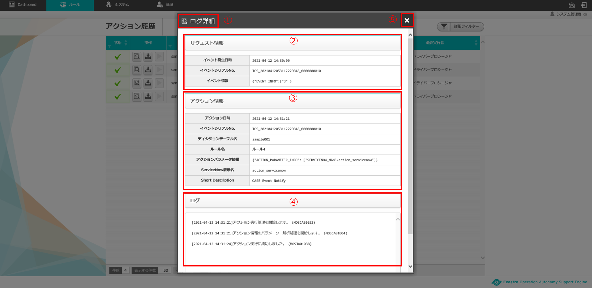
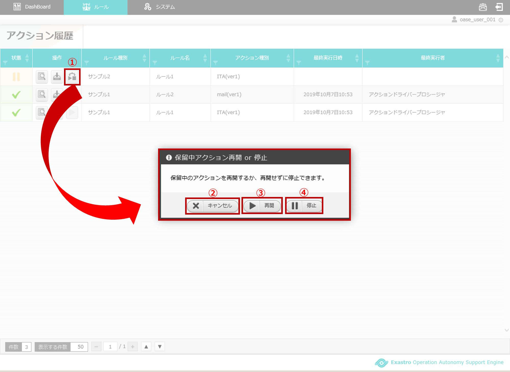
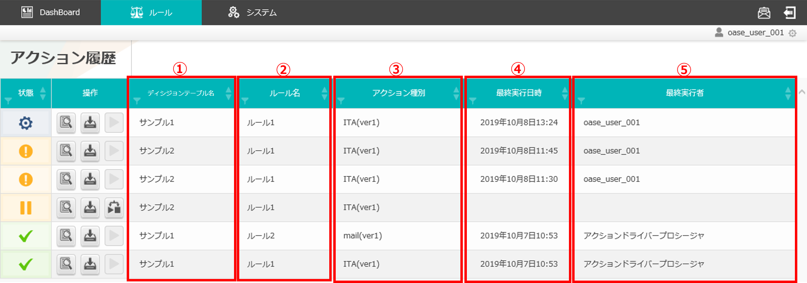
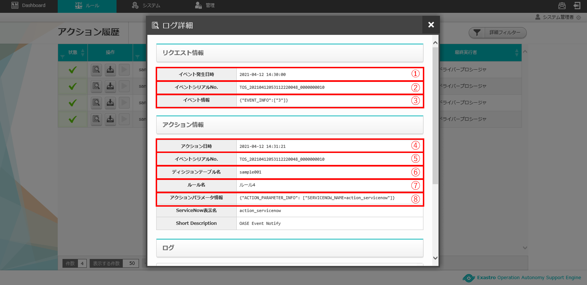
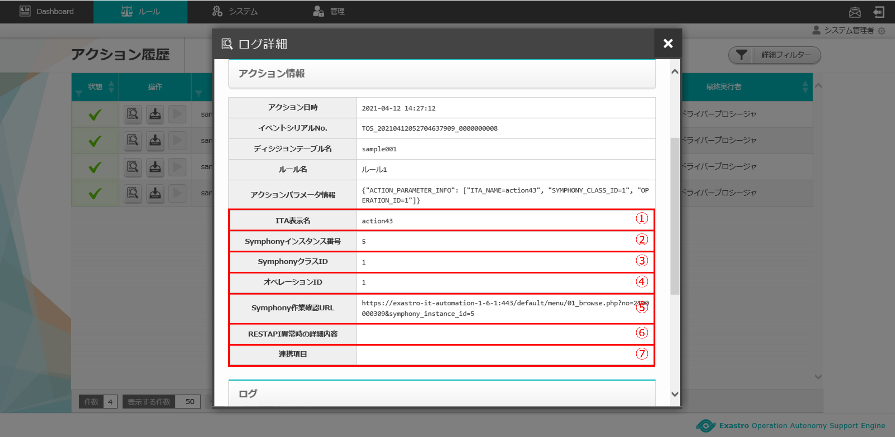
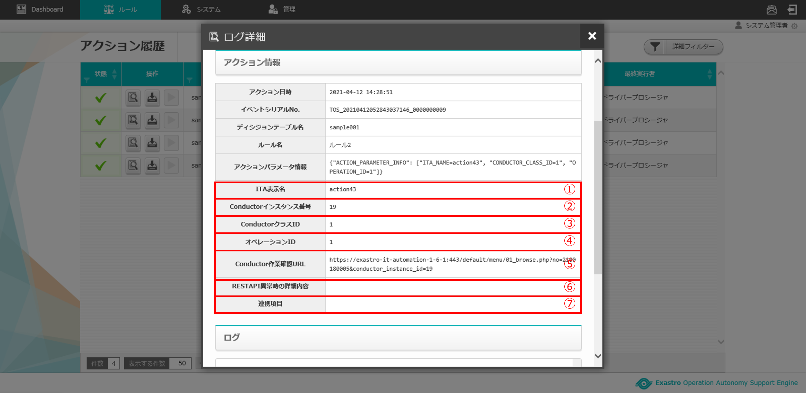
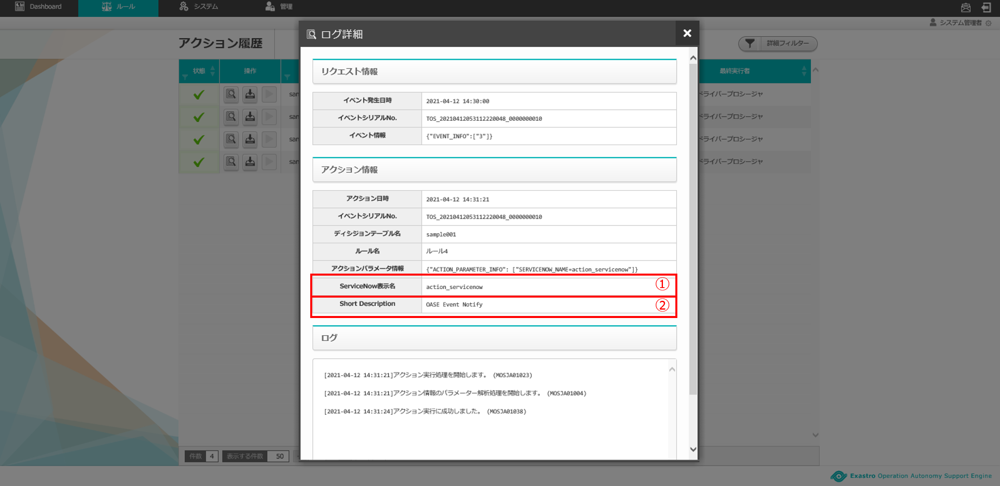
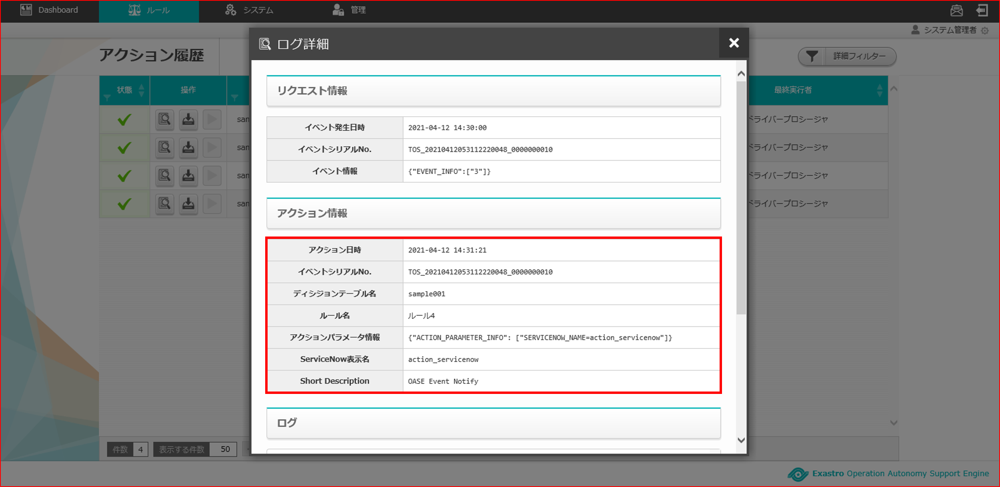

========================================
2 OASE アクション履歴画面の画面構成
========================================

本章では、OASE アクション履歴画面の画面構成と、各構成要素について説明します。

2.1 基本画面構成
================

| アクション履歴画面の画面構成は次のとおりです。

   図 2.1-1 一覧画面構成

| アクション履歴画面の各構成要素と、その機能は次の表のとおりです。

.. csv-table:: 表 2.1-1 機能説明
   :header: No., 構成要素, 説明
   :widths: 5, 20, 60

   1, 作業画面名, 現在表示している作業画面の名称です。
   2, 一覧, アクション履歴の情報が表示されます。

.. note::
    ディシジョンテーブル画面のディシジョンテーブル名毎に設定するグループ権限の中にある、
    「アクション履歴」が「権限なし」のグループに所属しているユーザの場合は、
    アクション履歴画面の一覧に対象となるディシジョンテーブル名の履歴情報は表示されません。

| 一覧で表示される状態のアイコンは次のとおりです。

.. list-table:: 表 2.1-1-1 ステータスアイコン
    :widths: 5, 20, 60
    :header-rows: 1

    * - No.
      - アイコン
      - 説明
    * - 1
      - .. figure:: ../images/action_history/check.png
           :scale: 20%
      - アクション正常終了の時に表示されるステータスアイコンです。
    * - 2
      - .. figure:: ../images/action_history/gear.png
           :scale: 20%
      - アクション実行中に表示されるステータスアイコンです。
    * - 3
      - .. figure:: ../images/action_history/cross.png
           :scale: 20%
      - アクション強制終了の時に表示されるステータスアイコンです。
    * - 4
      - .. figure:: ../images/action_history/stop.png
           :scale: 20%
      - アクション承認待ちの時に表示されるステータスアイコンです。
    * - 5
      - .. figure:: ../images/action_history/square.png
           :scale: 20%
      - アクション承認待ちキャンセル時に表示されるステータスアイコンです。
    * - 6
      - .. figure:: ../images/action_history/attention.png
           :scale: 20%
      - Exastro実行時でエラーになった時に表示されるステータスアイコンです。
    * - 7
      - .. figure:: ../images/action_history/prevent.png
           :scale: 39%
      - アクション抑止済の時に表示されるステータスアイコンです。

| アクション履歴の詳細画面の画面構成は次のとおりです。

   図 2.1-2 詳細画面構成

| アクション履歴の詳細画面の各構成要素と、その機能は次の表のとおりです。

.. csv-table:: 表 2.1-3 機能説明
   :header: No., 構成要素, 説明
   :widths: 5, 20, 60

   1, 作業画面名,現在表示している作業画面の名称です。
   2, リクエスト情報,リクエスト情報を表示します。
   3, アクション情報,アクション情報を表示します。ドライバ毎に表示される内容が異なります。
   4, ログ,アクション実行内容をログとして表示します。
   5, 閉じるボタン,ログ詳細画面を閉じてアクション履歴画面に戻ります。

2.2 アクション履歴画面の操作方法
================================

構成要素に対する操作方法を説明します。

(1)アクション履歴画面
---------------------
| 実行されたアクションの履歴を一覧で表示します。
| ここでは共通機能について説明します。

詳細表示ボタン
^^^^^^^^^^^^^^
* アクション履歴の詳細情報が表示されます。
* 大枠として「リクエスト情報」と「アクション情報」、「ログ」の3つに分かれています。
* 「アクション情報」はアクション種別により表示される情報が異なります。

   図 2.2-1-1 「ディシジョンテーブル名：test12」の詳細表示ボタンを押下した場合に表示される画面

ダウンロードボタン
^^^^^^^^^^^^^^^^^^
* 詳細表示ボタンで表示される詳細情報をテキストファイルとして、ダウンロードすることができます。

   図 2.2-1-2 「ディシジョンテーブル名：サンプル1」のダウンロードボタン

承認・却下ボタン
^^^^^^^^^^^^^^^^
* ディシジョンテーブルファイルのアクション実行前パラメータ情報を記述したルールがアクションされた際、アクション実行を保留中にすることができます。
* アクション履歴画面の承認・却下ボタンから、アクション実行を行うか、実行せずに停止させるかを選択することができます。

   図 2.2-1-3 「ディシジョンテーブル名：サンプル1」の承認・却下ボタン

.. csv-table:: 表 2.2-1-3 承認・却下ボタン説明
   :header: No., 構成要素, 説明
   :widths: 5, 20, 60

   1, 承認・却下ボタン,保留中のアクションを承認または却下を行うことができます。
   2, 保留ボタン,アクション履歴画面に戻ります。
   3, 承認ボタン,保留中のアクションを承認して実行します。
   4, 却下ボタン,保留中のアクションを却下して停止します。

.. note::
    保留中のアクションを却下した後、そのアクションは実行することが出来なくなります。
    また、同じイベント情報に複数のルールがヒットしていて、保留中のアクションを却下した場合、
    保留中のアクションの後に実行されるアクションも却下して停止されます。
    なお、ディシジョンテーブル画面で設定する権限が「更新可能」でないユーザは承認・却下ボタンの押下が出来ません。
    ルールが削除された場合も承認・却下ボタンの押下が出来ません。

アクション再実行ボタン
^^^^^^^^^^^^^^^^^^^^^^
* エラーとなったアクションで再実行可能な場合、再度アクションを実行することができます。
* アクション再実行ボタンを押下すると「アクションを再実行しますがよろしいですか？」と確認メッセージが表示されます。
* 「OK」を選択すると、アクションが再実行され、アクション履歴画面に戻ります。

   図 2.2-1-4 「ディシジョンテーブル名：サンプル1」のアクション再実行ボタン

.. note::
    ディシジョンテーブル画面で設定する権限が「更新可能」でないユーザはアクション再実行ボタンの押下が出来ません。
    ルールが削除された場合もアクション再実行ボタンの押下が出来ません。

一覧
^^^^

   図 2.2-1-5 一覧に表示される項目

.. csv-table:: 表 2.2-1-5 一覧説明
   :header: No., 構成要素, 説明
   :widths: 5, 20, 60

   1, ディシジョンテーブル名,アクションされたディシジョンテーブル名が表示されます。
   2, ルール名,アクションされたルール名が表示されます。
   3, 発生事象,アクションされた発生事象が表示されます。
   4, 対処概要,アクションされた対処概要が表示されます。
   5, アクション開始日時,アクションが実行された開始日時が表示されます。
   6, 最終実行日時,アクションが実行された日時が表示されます。
   7, アクション種別,実行されたアクションドライバ名がバージョン付で表示されます。
   8, 最終実行者,アクションを実行したユーザの名前が表示されます。

(2)アクション履歴詳細画面
-------------------------
| アクション履歴画面の一覧から各アクションの履歴詳細を確認することができます。

共通項目
^^^^^^^^
* 履歴詳細画面における、共通項目は次のとおりです。

   図 2.2-2-1-1 アクション履歴詳細画面(共通項目)

   図 2.2-2-1-2 アクション履歴詳細画面(共通項目)

.. csv-table:: 表 2.2-2-1 アクション履歴詳細画面(共通項目)の説明
   :header: No., 構成要素, 説明
   :widths: 5, 20, 60

   1, イベント発生日時,アクションが実行される起因となった、イベントの発生日時を表示します。
   2, イベントシリアルNo.,リクエスト情報の識別子です。
   3, イベント情報,リクエストされてきたイベント情報を表示します。
   4, アクション日時,アクション実行日時を表示します。
   5, イベントシリアルNo.,アクション情報の識別子です。項目2と同じ値が付与されます。
   6, ディシジョンテーブル名,アクション実行されたディシジョンテーブル名を表示します。
   7, ルール名,アクション実行されたルール名を表示します。
   8, 発生事象,アクション実行された発生事象が表示されます。
   9, 対処概要,アクション実行された対処概要が表示されます。
   10, アクションパラメータ情報,アクションを行ったパラメータ情報を表示します。
   11, ログ情報,アクション実行のログを表示します。出力されるログにはメッセージIDが付与されています。

固有項目(ドライバ毎)
^^^^^^^^^^^^^^^^^^^^
* 履歴詳細画面における、Exastro IT Automation (以降、ITAと略) の項目は次の通りです。

   図 2.2-2-2 固有項目(ITA Symphony実行の場合)

.. csv-table:: 表 2.2-2-2 固有項目(ITA Symphony実行の場合)の説明
   :header: No., 構成要素, 説明
   :widths: 5, 20, 60

   1, ITA表示名,ディシジョンテーブルファイルに記載した、ITA_NAMEが表示されます。
   2, Symphonyインスタンス番号,ITAで実行されたSymphony作業一覧のIDが表示されます。
   3, Symphony,ITAで実行されたSymphonyクラス一覧のIDと名称が表示されます。
   4, オペレーション,ITAで実行された投入オペレーション一覧のIDと名称が表示されます。
   5, Symphony作業確認URL,ITAの実行結果参照用の、Symphony作業確認のURLが表示されます。
   6, RESTAPI異常時の詳細内容,OASE-ITA間のREST結果が異常であった場合、エラー内容が表示されます。
   7, 連携項目,メニューID指定によるITAアクションを実施した際に、ITA側に連携した値が表示されます。

   図 2.2-2-3 固有項目(ITA Conductor実行の場合)

.. csv-table:: 表 2.2-2-3 固有項目(ITA Conductor実行の場合)の説明
   :header: No., 構成要素, 説明
   :widths: 5, 20, 60

   1, ITA表示名,ディシジョンテーブルファイルに記載した、ITA_NAMEが表示されます。
   2, Conductorインスタンス番号,ITAで実行されたConductor作業一覧のIDが表示されます。
   3, Conductor,ITAで実行されたConductorクラス一覧のIDと名称が表示されます。
   4, オペレーション,ITAで実行された投入オペレーション一覧のIDと名称が表示されます。
   5, Conductor作業確認URL,ITAの実行結果参照用の、Conductor作業確認のURLが表示されます。
   6, RESTAPI異常時の詳細内容,OASE-ITA間のREST結果が異常であった場合、エラー内容が表示されます。
   7, 連携項目,メニューID指定によるITAアクションを実施した際に、ITA側に連携した値が表示されます。

* 履歴詳細画面における、mail の項目は次の通りです。

.. figure:: ../images/action_history/action_history_13.png
   :scale: 100%
   :align: center

   図 2.2-2-4 固有項目(mail)

.. csv-table:: 表 2.2-2-4 固有項目(mail)の説明
   :header: No., 構成要素, 説明
   :widths: 5, 20, 60

   1, メールテンプレート名,アクション実行により送信されたメールテンプレート名が表示されます。
   2, 送信先メールアドレス,アクション実行により送信されたメールアドレスが表示されます。

.. note::
    送信先メールアドレスはディシジョンテーブルファイルに記入したメールアドレスか、
    メールテンプレートで記入したメールアドレスか、わかるように表示しています。

* 履歴詳細画面における、ServiceNow の項目は次の通りです。

   図 2.2-2-5 固有項目(ServiceNow)

.. csv-table:: 表 2.2-2-5 固有項目(ServiceNow)の説明
   :header: No., 構成要素, 説明
   :widths: 5, 20, 60

   1, ServiceNow表示名, ディシジョンテーブルファイルに記載した、SERVICENOW_NAMEが表示されます。
   2, sys_id, ServiceNow側で付与された、インシデントやワークフローのIDが表示されます。
   3, Short Description, ServiceNowへ連携した、Short Descriptionが表示されます。

ドライバのアンインストールについて
^^^^^^^^^^^^^^^^^^^^^^^^^^^^^^^^^^
* アクション実行されていたドライバをアンインストールすると、ドライバ固有の項目が表示されなくなります。

   図 2.2-2-5 ドライバアンインストールについて
