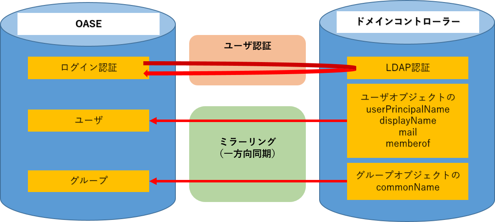

=================================
システム構成
=================================

AD連携機能は、組織でお使いのドメインを構成するドメインコントローラと連携します。

※ userPrincipalName … ActiveDirectory上のログインID

※ displayName       … 表示名

※ commonName        … オブジェクト名（上図では、グループオブジェクトの名称）

※ memberof          … ユーザが所属するグループ名

