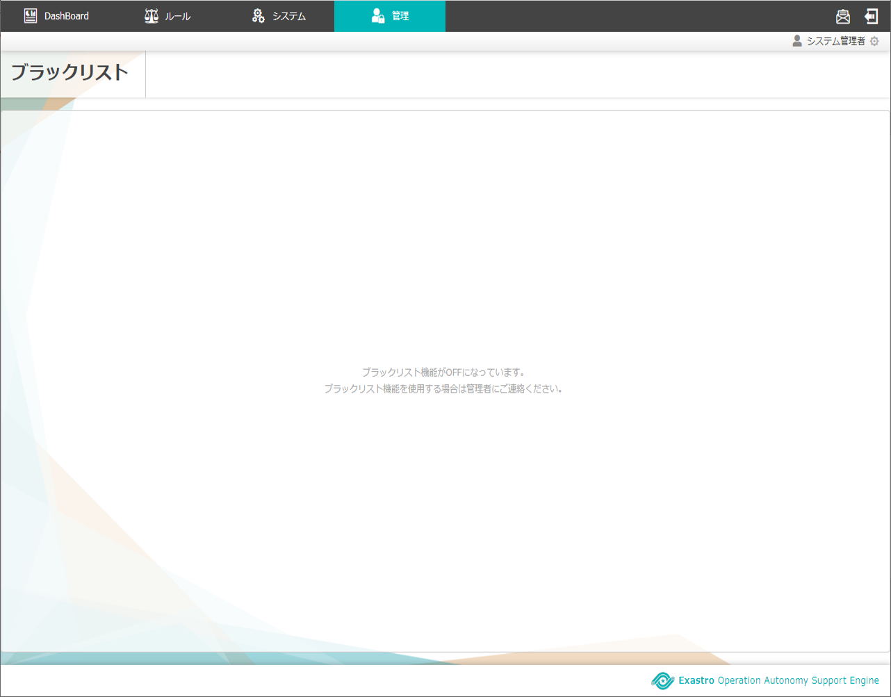
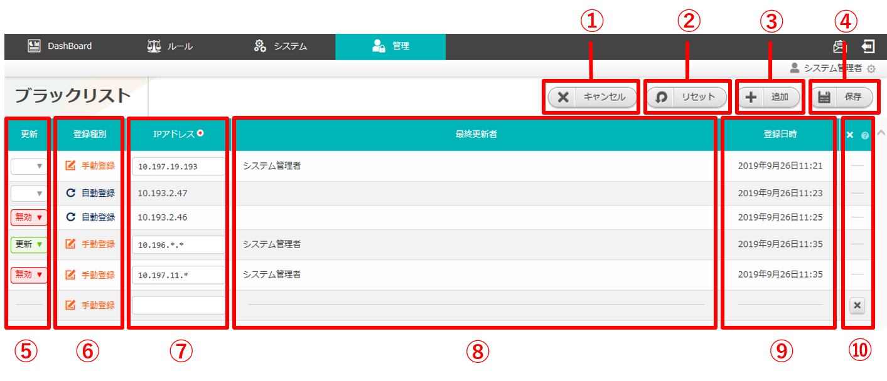

==============================================
2 OASE ブラックリスト画面のメニュー 、画面構成
==============================================

本章では、OASE ブラックリスト画面の画面構成と、各構成要素について説明します。

2.1 基本画面構成
================ 

ブラックリスト画面の画面構成は次のとおりです。

   図 2.1-1 画面構成

ブラックリスト画面の各構成要素と、その機能は次の表のとおりです。

.. csv-table:: 表 2.1-1 機能説明
   :header: No., 構成要素, 説明
   :widths: 5, 20, 60

   1, 作業画面名, 現在表示している作業画面の名称です。
   2, 編集ボタン,編集画面に遷移し、ブラックリストの追加、編集、無効化をします。
   3, 一覧, 現在ブラックリストに登録されている情報が表示されます。

ブラックリスト機能がOFFになっている場合は以下のように表示されます。

   図 2.1-2 画面構成

ブラックリストにIPアドレスが1件も登録されていない場合は以下のように表示されます。

   図 2.1-3 画面構成

| ブラックリストの編集画面の画面構成は次のとおりです。

   図 2.1-4 画面構成

ブラックリストの編集画面の各構成要素と、その機能は次の表のとおりです。

.. csv-table:: 表 2.1-4 機能説明
   :header: No., 構成要素, 説明
   :widths: 5, 20, 60

   1, 作業画面名, 現在表示している作業画面の名称です。
   2, キャンセルボタン,編集作業をキャンセルし、ブラックリスト画面に戻ります。
   3, リセットボタン,編集途中の内容を編集前の値にリセットします。
   4, 追加ボタン,ブラックリスト入力欄を1行ずつ追加します。
   5, 保存ボタン,編集内容を保存します。
   6, 更新メニュー,既存の手動登録されたブラックリストに対し「更新」または「無効」を選択できます。既存の自動登録されたブラックリストに対しては「無効」のみ選択できます。※「4.追加ボタン」押下による新規追加ブラックリストには表示されません。
   7, IPアドレス,任意のIPアドレスを入力できます。
   8, 削除ボタン,追加した行を削除します。

2.2 ブラックリスト画面の操作方法
================================

構成要素に対する操作方法を説明します。

(1)ブラックリスト画面
---------------------
| 登録されているブラックリストを一覧で表示します。
| ここでは共通機能について説明します。

一覧
^^^^

   図 2.2-1-1 ブラックリスト画面の一覧の各項目

.. csv-table:: 表 2.2-1-1 機能説明
   :header: No., 構成要素, 説明
   :widths: 5, 20, 60

   1, 登録種別,'手動登録'または'自動登録'が表示されます。システム設定＞パスワード設定＞同一IP連続ログイン試行上限の上限を超えたIPアドレスはブラックリストに自動登録されます。
   2, IPアドレス,IPアドレスが表示されます。
   3, 最終更新者,ブラックリストの情報を更新したユーザの名前が表示されます。自動登録の場合は空欄です。
   4, 登録日時,ブラックリストに登録された日時が表示されます。

.. note::
   システム設定＞パスワード設定＞メール通知種別に該当するユーザのみ、ブラックリスト画面を表示することができます。

(2)ブラックリスト編集画面
-------------------------
| ブラックリストを新規追加および、すでに登録されているブラックリストを更新、無効化することができます。

入力欄
^^^^^^

   図 2.2-2-1 ブラックリスト編集画面の各項目

.. csv-table:: 表 2.2-2-1 機能説明
   :header: No., 構成要素, 説明
   :widths: 5, 20, 60

   1,キャンセル,変更内容を破棄してブラックリスト編集画面を閉じ、ブラックリスト画面に戻ります。
   2,リセット,値を変更する前のブラックリスト編集画面に戻ります。
   3,追加, 編集欄が1行追加されます。
   4,保存,変更内容を保存してブラックリスト編集画面を閉じ、ブラックリスト画面に戻ります。
   5, 更新,既存の手動登録されたブラックリストを更新する場合はプルダウンメニューから「更新」を選択してください。また、無効にする場合は「無効」を選択してください。既存の自動登録されたブラックリストは更新できません。選択状態で「保存ボタン」を押下すると、選択した内容が反映されます。※新規追加行にはプルダウンメニューは表示されません。
   6, 登録種別,自動入力です。
   7, IPアドレス,入力必須項目です。ワイルドカードを使用できます。
   8, 最終更新者,ブラックリストの情報を更新したユーザの名前が表示されます。
   9, 登録日時,ブラックリストに登録された日時が表示されます。
   10, 追加行削除ボタン,ブラックリスト編集画面の「追加ボタン」を押下した場合、欄内に押下可能な「×」ボタンが表示されます。「×」ボタンを押下すると、追加行が削除されます。

.. note::
   システム設定＞パスワード設定＞メール通知種別に該当するユーザのみ、ブラックリスト編集画面を表示することができます。

