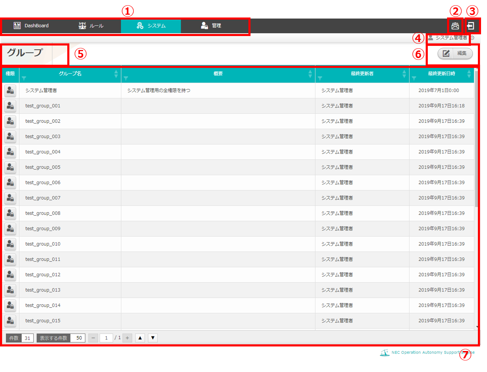
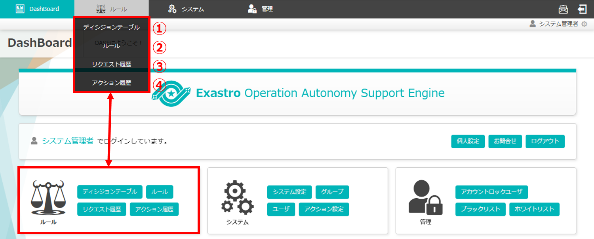
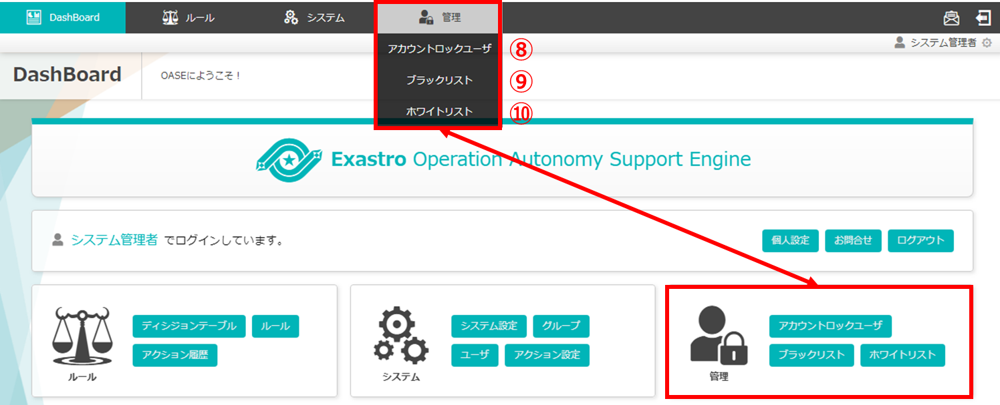
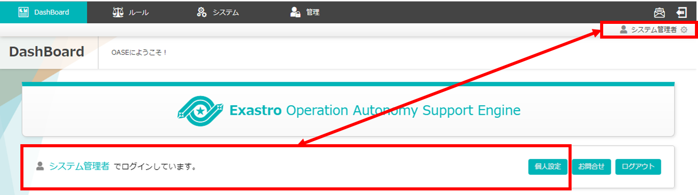

====================================
2 OASE 共通画面のメニュー 、画面構成
====================================

本章では、OASE 共通画面の画面構成と、各構成要素について説明します。

2.1 基本画面構成
================ 

(1)ヘッダ
---------

ヘッダおよび操作部の画面構成は次のとおりです。

   

   
   図 2.1-1-1 画面構成

ヘッダおよび操作部の各構成要素と、その機能は次の表のとおりです。

.. csv-table:: 表 2.1-1-1 機能説明
   :header: No., 構成要素, 説明
   :widths: 5, 20, 60

   1, メニューバー, ログインしているユーザのアクセス権限によって表示されるメニューが異なります。 
   2, ログアウト, 現在ログインしているユーザからログアウトし、ログイン画面に移ります。
   3, ログイン情報, 現在ログインしているユーザのユーザ名が表示されます。
   4, 作業画面名, 現在表示している作業画面の名称です。
   5, 作業画面メニュー部, 作業画面ごとのメニューが表示されます。ご使用端末の画面サイズによっては、ハンバーガーアイコンで表示される場合もあります。※メニューを持たない画面の場合は何も表示されません。
   6, 操作部, メニューバーで選択した画面が表示されます。※アクセス権限が「権限なし」の場合は表示されません。　※URLに誤りがある場合は正しく表示されません。

(2)テーブル
-----------

テーブルの画面構成は次のとおりです。

   
   図 2.1-2-1 画面構成

テーブルの各構成要素と、その機能は次の表のとおりです。

.. csv-table:: 表 2.1-2-1 機能説明
   :header: No., 構成要素, 説明
   :widths: 5, 20, 60

   1, フィルタ, 「特定の文字列」「正規表現」「小・大文字」「単語強調」の条件で表示対象を絞り込むことができます。
   2, ソート,昇順・降順の切り替えができます。
   3,件数,登録されているグループの全件数が表示されます。
   4,表示する件数,1画面で表示するグループ数の上限を「10」「25」「50」「100」のいずれかに指定して表示することができます。
   5,ページ送り,表示件数が複数ページに渡る場合、「-」「+」でページ遷移ができます。
   6,最上部・最下部へ移動,ページ内でスクロールが発生する場合、「▲」「▼」の押下で移動ができます。

(3)アクセス権限が「権限なし」の場合（403）
------------------------------------------
403 Fordidden 画面の構成は次のとおりです。

   
   図 2.1-3-1 アクセス権限が「権限なし」の画面を表示しようとした場合

.. csv-table:: 表 2.1-3-1 機能説明
   :header: No., 構成要素, 説明
   :widths: 5, 20, 60

   1, 作業画面名, 現在表示している作業画面の名称です。
   2, 操作部,メニューバーで選択した画面が表示されます。※アクセス権限が「権限なし」の場合は表示されません。　※URLに誤りがある場合は正しく表示されません。

(4)ページが見つからなかった場合(404)
-------------------------------------
404 Not Found 画面の構成は次のとおりです。

   
   図 2.1-4-1 誤ったURLを指定したためページが見つからなかった場合

.. csv-table:: 表 2.1-4-1 機能説明
   :header: No., 構成要素, 説明
   :widths: 5, 20, 60

   1, 作業画面名, 現在表示している作業画面の名称です。
   2, 操作部,メニューバーで選択した画面が表示されます。※アクセス権限が「権限なし」の場合は表示されません。　※URLに誤りがある場合は正しく表示されません。

2.2 共通画面の操作方法
======================

構成要素に対する操作方法を説明します。

(1)ヘッダ
---------
| ここではOASE 内のすべての画面に対しアクセス権限が「更新可能」である
| システム管理者アカウントでログインした場合の
| DashBoard 画面を例に共通機能について説明します。

メニューバー
^^^^^^^^^^^^
画面上部のメニューバーと同様のメニューボタンが DashBoard 画面の操作部にも表示されます。

   
   図 2.2-1-1 メニューバー「ルール」のプルダウンリスト

.. csv-table:: 表 2.2-1-1 機能説明
   :header: No., 構成要素, 説明
   :widths: 5, 20, 60

   1, ルール [ディシジョンテーブル], あらかじめ既知の事象を登録する「ディシジョンテーブル」画面を表示します。
   2, ルール [トークン払い出し], トークンを払い出す「トークン払い出し」画面を表示します。
   3, ルール [ルール], 作成したルールを運用する「ルール」画面を表示します。
   4, ルール [リクエスト履歴], OASEが受信したリクエストを表示する「リクエスト履歴」画面を表示します。
   5, ルール [アクション履歴], 実際にアクションした結果を表示する「アクション履歴」画面を表示します。

   
   図 2.2-1-2 メニューバー「システム」のプルダウンリスト

.. csv-table:: 表 2.2-1-2 機能説明
   :header: No., 構成要素, 説明
   :widths: 5, 20, 60

   6, システム [システム設定], OASEに関する各機能を設定する「システム設定」画面を表示します。
   7, システム [SSO設定], シングルサインオンの設定を行う「SSO設定」画面を表示します。
   8, システム [グループ], 各ユーザに対するアクセス権限の設定およびグループを作成する「グループ」画面を表示します。
   9, システム [ユーザ], OASEを使用するユーザを作成する「ユーザ」画面を表示します。
   10, システム [監視アダプタ], 監視ツールと連携するアダプタに関する設定を行う「監視アダプタ」画面を表示します。
   11, システム [アクション設定], アクションを実行するドライバに関する設定を行う「アクション設定」画面を表示します。

   
   図 2.2-1-3 メニューバー「管理」のプルダウンリスト

.. csv-table:: 表 2.2-1-3 機能説明
   :header: No., 構成要素, 説明
   :widths: 5, 20, 60

   12, 管理 [アカウントロックユーザ], アカウントロック対象となったユーザ一覧を表示する「アカウントロックユーザ」画面を表示します。
   13, 管理 [ブラックリスト], ブラックリスト対象とするIPアドレスを設定および一覧を表示する「ブラックリスト」画面を表示します。
   14, 管理 [ホワイトリスト], ホワイトリスト対象とするIPアドレスを設定および一覧を表示する「ホワイトリスト」画面を表示します。

ログアウト
^^^^^^^^^^
* 押下すると「ログアウトします。よろしいですか？」と確認メッセージが表示されます。
* 「OK」を選択すると、現在ログインしているユーザからログアウトし、ログイン画面に移ります。

   
   図 2.2-1-4 メニューバー「ログアウト」

ログイン情報(個人設定)
^^^^^^^^^^^^^^^^^^^^^^
ログインしているユーザのアカウント情報の表示および設定を行う「個人設定」画面を表示します。

   
   図 2.2-1-5 メニューバー「ログイン情報(個人設定)」

(2)テーブル
-----------
| ここではグループ画面を例に共通機能について説明します。

ソート
^^^^^^
それぞれの項目「グループ名」「概要」「最終更新者」「最終更新日時」において
昇順・降順での並び替えができます。

   図 2.2-2-1 項目「グループ名」で昇順にソートした例

フィルタ
^^^^^^^^
* それぞれの項目においてフィルタをかけることができます。
* 「グループ名」「概要」「最終更新者」の項目では、プルダウンメニューから選択する方法と、条件指定での検索ができます。
* フィルタのマークから、「5本線のアイコン」を押下するとグループの一覧が表示され、選択（ctrlキー押下しながら複数選択可能）したグループのみが表示されます。
* フィルタのマークから「虫眼鏡のアイコン」を押下すると条件検索ができます。
* 条件として「正規表現」「小・大文字」で絞り込みができ、「単語強調」にチェックを入れると、どの値が検索に該当したのかマークされます。
* 「最終更新日時」の項目では、日付を指定する方法と、条件指定での検索ができます。
* フィルタのマークから、「時計のアイコン」を押下すると日付の範囲を「AからB」「A以降」「A以前」と定めることができます。また、日付はカレンダー形式で指定ができます。
* フィルタのマークから「虫眼鏡のアイコン」を押下すると条件検索ができます。
* 条件として「正規表現」「小・大文字」で絞り込みができ、「単語強調」にチェックを入れると、どの値が検索に該当したのかマークされます。
* フィルタ機能は黄色いアイコンを押下することで解除できます。

   図 2.2-2-2 項目「グループ名」で任意のグループ名を複数選択した例

   図 2.2-2-3 項目「グループ名」で条件「正規表現（3～5を含む）」の検索をした例

   図 2.2-2-4 項目「最終更新日時」で条件「AからB」の範囲を指定する例

表示する件数
^^^^^^^^^^^^
* 1画面に表示する件数を「10件」「25件」「50件」「100件」のいずれか指定することができます。
* グループ画面から離れたり、画面を更新するとデフォルトの50件表示に戻ります。

ページ送り
^^^^^^^^^^
「表示する件数」が「件数」を下回る場合、複数ページに渡り表示されます。

   図 2.2-2-5 件数31件だが1画面で表示する件数が25件であるため2ページになっている例

画面最上部・最下部
^^^^^^^^^^^^^^^^^^
ブラウザのサイズおよびグループの登録件数により縦スクロールバーが有効になる場合、ボタンの押下で画面の最上部または最下部へ移動することができます。

   図 2.2-2-6 「最上部へ移動」「最下部へ移動」ができるボタン

(3)アクセス権限が「権限なし」の場合（403）
------------------------------------------
* OASE 内の各画面を表示する際、アクセス権限が「権限なし」の画面を開いた場合、「このページを表示する権限がありません。」と記載された画面が表示されます。
* アクセス権限を「参照のみ」または「更新可能」に変更すると解消されます。

(4)ページが見つからなかった場合(404)
--------------------------------------
* OASE 内の各画面を表示する際、存在しないページをリクエストした場合、「要求されたURLはこのサーバで見つかりませんでした。」と記載された画面が表示されます。
* 指定したURLに間違いがないか、ページの移動や削除でURLが無効になっていないか確認し、有効なURLを指定することで解消されます。
