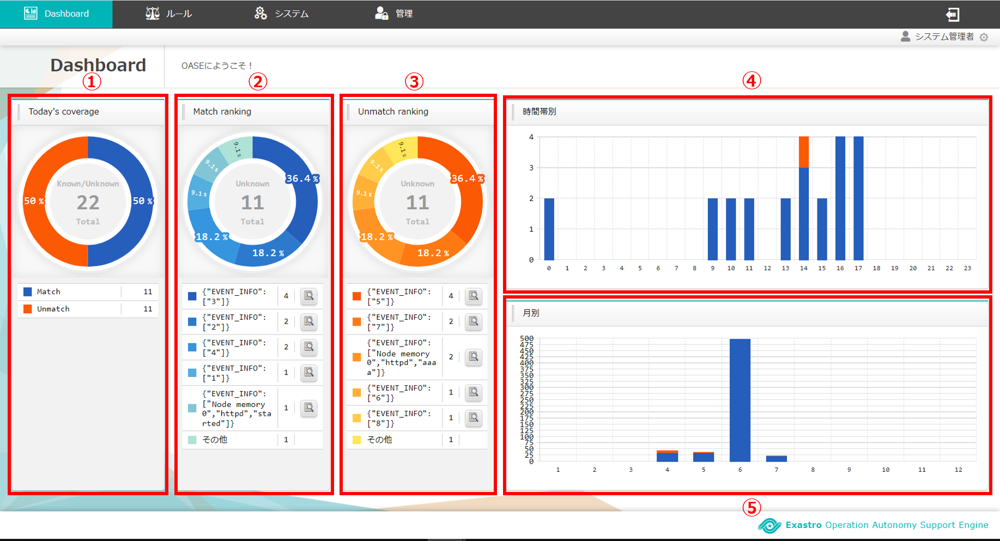
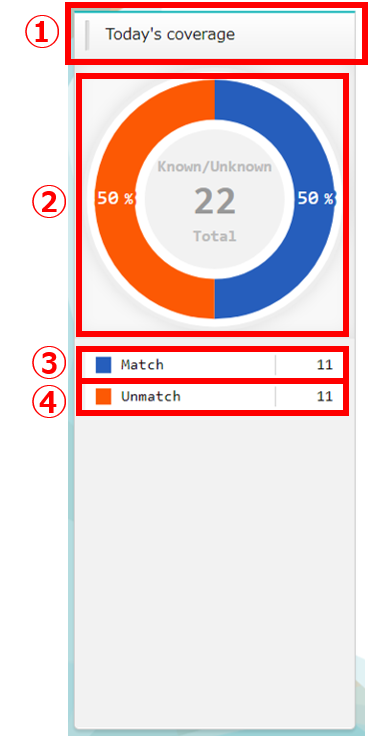
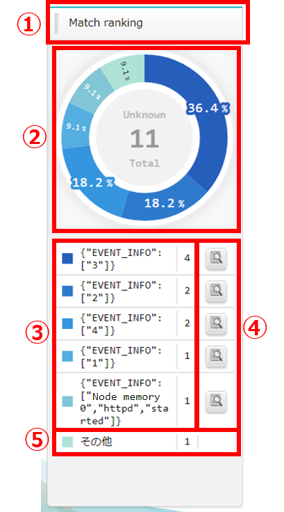
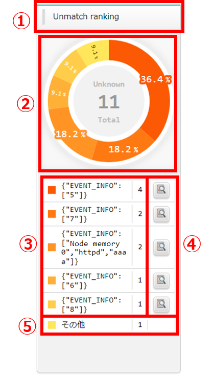
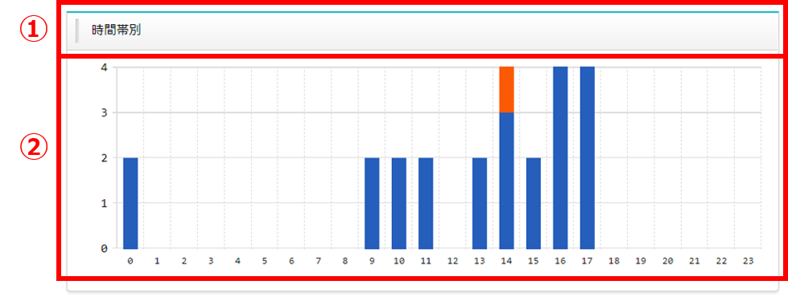
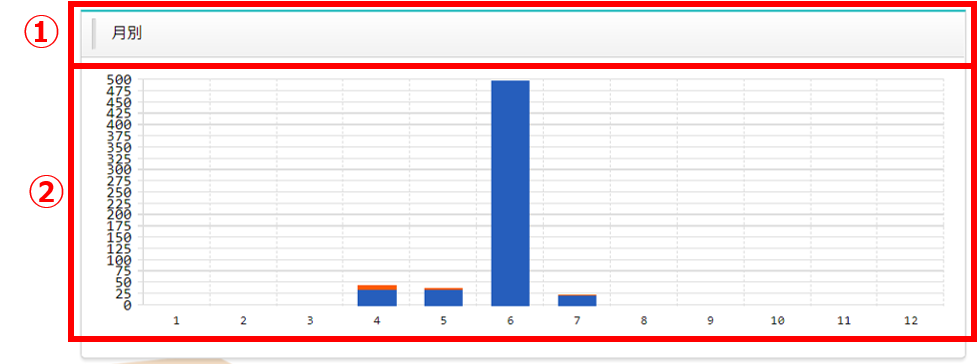

=====================================================
2 OASE Dashboard画面のメニュー 、画面構成
=====================================================

本章では、OASE Dashboard画面の画面構成と、各構成要素について説明します。

2.1 基本画面構成
================

Dashboard画面の画面構成は次のとおりです。

   図 2.1-1 画面構成

Dashboard画面の各構成要素と、その機能は次の表のとおりです。

.. csv-table:: 表 2.1-1 機能説明
   :header: No., 構成要素, 説明
   :widths: 5, 20, 60

   1, カバレッジ(24h), 直近24時間以内に発生しているルールのマッチ、アンマッチの件数の円グラフを表示します。
   2, マッチ ランキング(24h), 直近24時間以内に発生しているルールマッチのランキングと円グラフを表示します。
   3, アンマッチ ランキング(24h), 直近24時間以内に発生しているルールアンマッチのランキングと円グラフを表示します。
   4, リクエスト件数(時間帯別), 前日24時までの直近30日間の時間帯別のルールのマッチ、アンマッチの件数の棒グラフを表示します。
   5, リクエスト件数(月別), 前月の直近12カ月の月別のルールのマッチ、アンマッチの件数の棒グラフを表示します。

カバレッジ(24h)の画面構成は次のとおりです。

   図 2.1-2 画面構成

カバレッジ(24h)の各構成要素は次の表のとおりです。

.. csv-table:: 表 2.1-2 機能説明
   :header: No., 構成要素, 説明
   :widths: 5, 20, 60

   1, 項目名, 現在表示しているグラフの名称です。
   2, 円グラフ, ディシジョンテーブルのルールにマッチ/アンマッチした直近24時間の件数の円グラフです。
   3, Match, ディシジョンテーブルのルールにマッチした直近24時間の件数です。
   4, Unmatch, ディシジョンテーブルのルールにアンマッチした直近24時間の件数です。

マッチ ランキング(24h)の画面構成は次のとおりです。

   図 2.1-3 画面構成

マッチ ランキング(24h)の各構成要素は次の表のとおりです。

.. csv-table:: 表 2.1-3 機能説明
   :header: No., 構成要素, 説明
   :widths: 5, 20, 60

   1, 項目名, 現在表示しているグラフとランキングの名称です。
   2, 円グラフ, ディシジョンテーブルのルールにマッチした直近24時間の件数の円グラフです。
   3, ランキング項目, 件数上位1から5位のディシジョンテーブル名とイベント情報と件数です。
   4, 詳細情報, ボタンを押下すると対象のイベント情報にフィルタリングされたリクエスト履歴のページに遷移します。
   5, その他, 6位以下をまとめた件数です。

アンマッチ ランキング(24h)の画面構成は次のとおりです。

   図 2.1-4 画面構成

アンマッチ ランキング(24h)の各構成要素は次の表のとおりです。

.. csv-table:: 表 2.1-4 機能説明
   :header: No., 構成要素, 説明
   :widths: 5, 20, 60

   1, 項目名, 現在表示しているグラフとランキングの名称です。
   2, 円グラフ, ディシジョンテーブルのルールにアンマッチした直近24時間の件数の円グラフです。
   3, ランキング項目, 件数上位1から5位のディシジョンテーブル名とイベント情報と件数です。
   4, 詳細情報, ボタンを押下すると対象のイベント情報にフィルタリングされたリクエスト履歴のページに遷移します。
   5, その他, 6位以下をまとめた件数です。

リクエスト件数(時間帯別)の画面構成は次のとおりです。

   図 2.1-5 画面構成

リクエスト件数(時間帯別)の各構成要素は次の表のとおりです。

.. csv-table:: 表 2.1-5 機能説明
   :header: No., 構成要素, 説明
   :widths: 5, 20, 60

   1, 項目名, 現在表示しているグラフの名称です。
   2, 棒グラフ, 30日間の時間帯別のディシジョンテーブルのルールにマッチ/アンマッチした件数の棒グラフです。縦軸が件数、横軸が時間(24時間表記)です。

リクエスト件数(月別)の画面構成は次のとおりです。

   図 2.1-6 画面構成

リクエスト件数(月別)の各構成要素は次の表のとおりです。

.. csv-table:: 表 2.1-6 機能説明
   :header: No., 構成要素, 説明
   :widths: 5, 20, 60

   1, 項目名, 現在表示しているグラフの名称です。
   2, 棒グラフ, 12カ月分のディシジョンテーブルのルールにマッチ/アンマッチした件数を月別にした棒グラフです。縦軸が件数、横軸が月です。
