=====================================================
2 OASE ディシジョンテーブル画面のメニュー 、画面構成
=====================================================

本章では、OASE ディシジョンテーブル画面の画面構成と、各構成要素について説明します。

2.1 基本画面構成
================

ディシジョンテーブル画面の画面構成は次のとおりです。

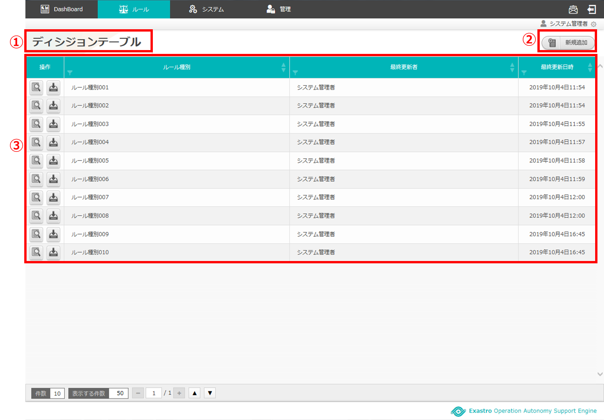

   図 2.1-1 画面構成

ディシジョンテーブル画面の各構成要素と、その機能は次の表のとおりです。

.. csv-table:: 表 2.1-1 機能説明
   :header: No., 構成要素, 説明
   :widths: 5, 20, 60

   1, 作業画面名, 現在表示している作業画面の名称です。
   2, 新規追加ボタン,新規追加画面に遷移し、ディシジョンテーブルの基本情報、権限、ルール条件、未知事象通知を登録します。
   3, 一覧, 現在登録されているディシジョンテーブルが表示されます。

ディシジョンテーブルが1件も登録されていない場合は以下のように表示されます。

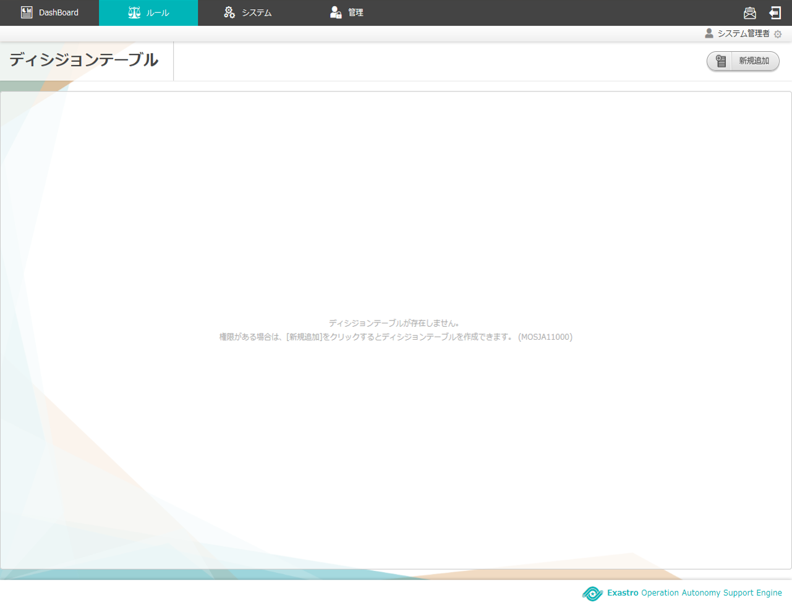

   図 2.1-2 画面構成

新規追加（基本情報・権限タブ）画面の画面構成は次のとおりです。

.. _label_tab_1:
   
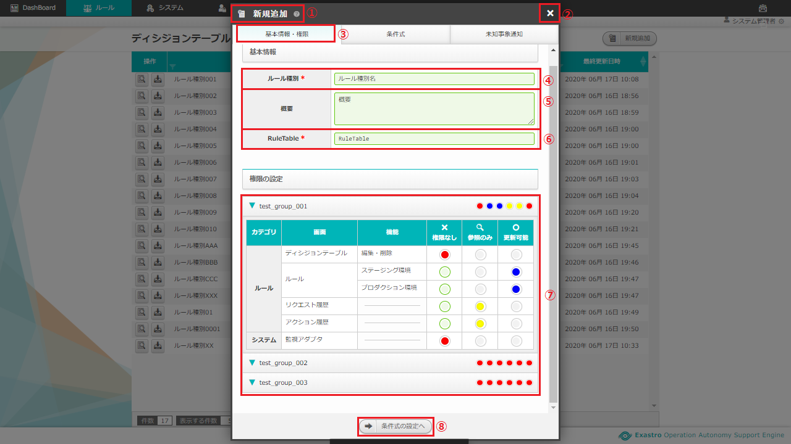

   図 2.1-3 画面構成

新規追加（基本情報・権限タブ）画面の各構成要素と、その機能は次の表のとおりです。

.. csv-table:: 表 2.1-2 機能説明
   :header: No., 構成要素, 説明
   :widths: 5, 20, 60

   1, 作業画面名, 現在表示している作業画面の名称です。
   2, 閉じるボタン, 新規追加画面を閉じてディシジョンテーブル画面に戻ります。
   3, 作業タブ名, 現在表示している作業タブの名称です。
   4, ディシジョンテーブル名, 任意のディシジョンテーブル名を入力できます。
   5, 概要, ディシジョンテーブルの概要を入力できます。
   6, 権限一覧, ディシジョンテーブルに対しどのような権限を付与するか「権限なし（赤色）」「参照のみ（黄色）」「更新可能（青色）」いずれかをラジオボタンで選択することができます。
   7, 条件式の設定へボタン, 基本情報・権限タブの情報を保持したまま条件式タブへ遷移します。

システム管理者グループ以外にグループが1件も登録されていない場合、権限一覧には以下のように表示されます。

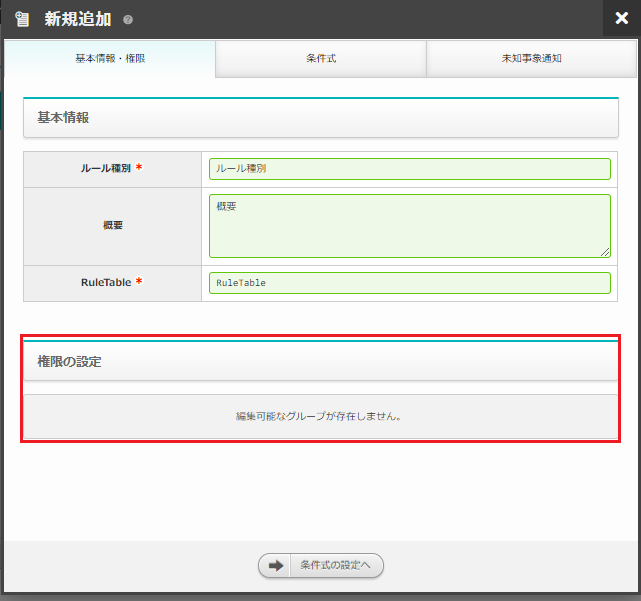

   図 2.1-4 画面構成

新規追加（条件式タブ）画面の画面構成は次のとおりです。

.. _label_tab_2:

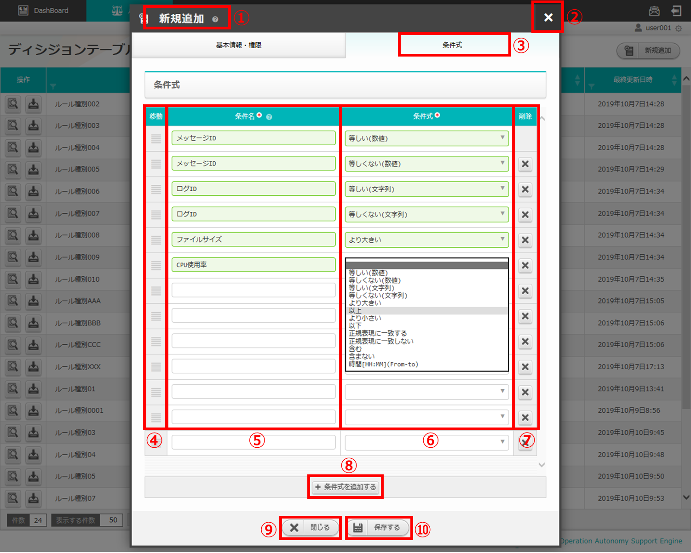

   図 2.1-5 画面構成

新規追加（条件式タブ）画面の各構成要素と、その機能は次の表のとおりです。

.. csv-table:: 表 2.1-3 機能説明
   :header: No., 構成要素, 説明
   :widths: 5, 20, 60

   1, 作業画面名,現在表示している作業画面の名称です。
   2, 閉じるボタン,新規追加画面を閉じてディシジョンテーブル画面に戻ります。
   3, 作業タブ名,現在表示している作業タブの名称です。
   4, 移動,ドラッグアンドドロップで条件式を並び替えることができます。
   5, 条件名,任意の条件名を入力できます。
   6, 条件式,プルダウンから任意の条件式を選択できます。
   7, 削除ボタン,追加した行を削除します。
   8, 条件式を追加するボタン,条件式入力欄を1行ずつ追加します。
   9, 未知事象通知の設定へ,未知事象通知設定タブに遷移します。

新規追加（未知事象通知タブ）画面の画面構成は次のとおりです。

.. _label_tab_3:

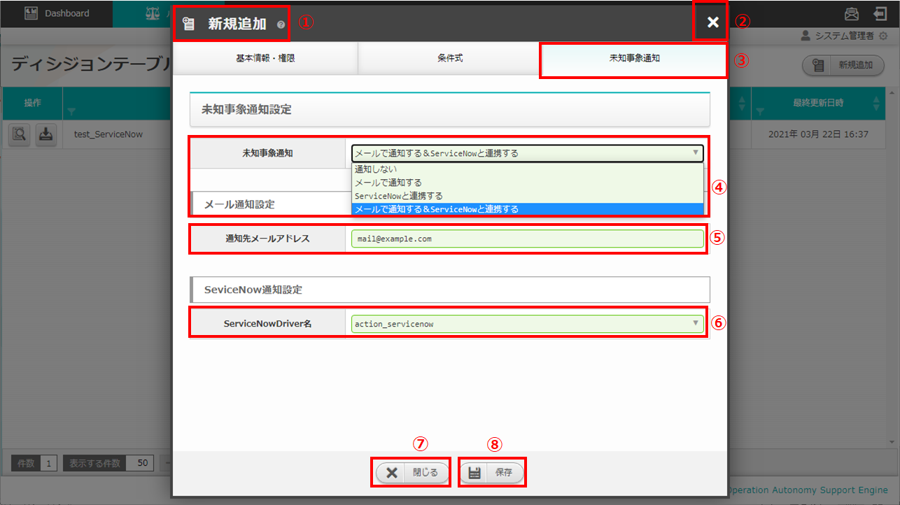

   図 2.1-6 画面構成

新規追加（未知事象通知タブ）画面の各構成要素と、その機能は次の表のとおりです。

.. csv-table:: 表 2.1-4 機能説明
   :header: No., 構成要素, 説明
   :widths: 5, 20, 60

   1, 作業画面名, 現在表示している作業画面の名称です。
   2, 閉じるボタン, 新規追加画面を閉じてディシジョンテーブル画面に戻ります。
   3, 作業タブ名, 現在表示している作業タブの名称です。
   4, 未知事象通知, 未知事象が発生した際の通知先を選択できます。
   5, 通知先メールアドレス, 通知先のメールアドレスを入力できます。
   6, ServiceNowDriver名, ServiceNowの接続先をプルダウン選択できます。
   7, 閉じるボタン, 新規追加画面を閉じてディシジョンテーブル画面に戻ります。
   8, 保存するボタン, 新規追加情報を保存してディシジョンテーブル画面に戻ります。

ディシジョンテーブル詳細（基本情報・権限タブ）画面の画面構成は次のとおりです。

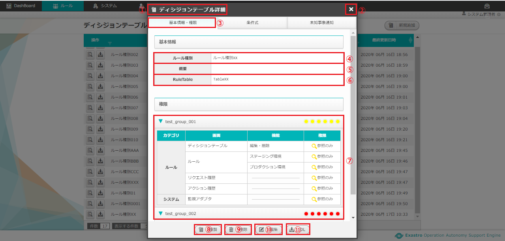

   図 2.1-7 画面構成

ディシジョンテーブル詳細（基本情報・権限タブ）画面の各構成要素と、その機能は次の表のとおりです。

.. csv-table:: 表 2.1-5 機能説明
   :header: No., 構成要素, 説明
   :widths: 5, 20, 60

   1, 作業画面名,現在表示している作業画面の名称です。
   2, 閉じるボタン,新規追加画面を閉じてディシジョンテーブル画面に戻ります。
   3, 作業タブ名,現在表示している作業タブの名称です。
   4, ディシジョンテーブル名,ディシジョンテーブル画面で選択したディシジョンテーブル名が表示されます。
   5, 概要,ディシジョンテーブル画面で選択したディシジョンテーブルの概要が表示されます。
   6, 権限,ディシジョンテーブル画面で選択したディシジョンテーブルに対してどのグループにどのような権限が設定されているか表示されます。
   7, 複製ボタン,ディシジョンテーブル画面で選択したディシジョンテーブルと同様のディシジョンテーブルを追加することができます。
   8, 削除ボタン,ディシジョンテーブル画面で選択したディシジョンテーブルを削除しディシジョンテーブル詳細画面を閉じてディシジョンテーブル画面に戻ります。
   9, 編集ボタン,ディシジョンテーブル画面で選択したディシジョンテーブルを編集することができます。
   10, DLボタン,ディシジョンテーブル画面で選択したディシジョンテーブルをエクセルファイルでダウンロードすることができます。

ディシジョンテーブル詳細（条件式タブ）画面の画面構成は次のとおりです。

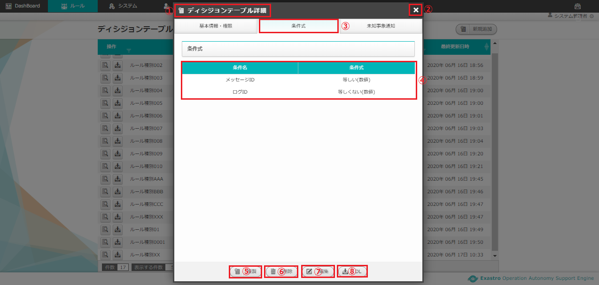

   図 2.1-8 画面構成

ディシジョンテーブル詳細（条件式タブ）画面の各構成要素と、その機能は次の表のとおりです。

.. csv-table:: 表 2.1-6 機能説明
   :header: No., 構成要素, 説明
   :widths: 5, 20, 60

   1, 作業画面名,現在表示している作業画面の名称です。
   2, 閉じるボタン,新規追加画面を閉じてディシジョンテーブル画面に戻ります。
   3, 作業タブ名,現在表示している作業タブの名称です。
   4, 条件式,ディシジョンテーブル画面で選択したディシジョンテーブルの条件式が表示されます。
   5, 複製ボタン,ディシジョンテーブル画面で選択したディシジョンテーブルと同様のディシジョンテーブルを追加することができます。
   6, 削除ボタン,ディシジョンテーブル画面で選択したディシジョンテーブルを削除しディシジョンテーブル詳細画面を閉じてディシジョンテーブル画面に戻ります。
   7, 編集ボタン,ディシジョンテーブル画面で選択したディシジョンテーブルを編集することができます。
   8, DLボタン,ディシジョンテーブル画面で選択したディシジョンテーブルをエクセルファイルでダウンロードすることができます。

ディシジョンテーブル詳細（未知事象通知タブ）画面の画面構成は次のとおりです。

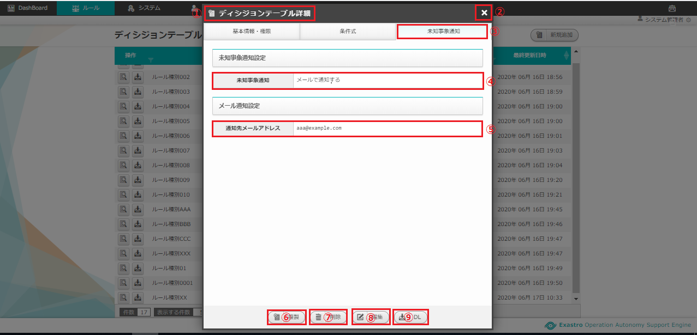

   図 2.1-9 画面構成

ディシジョンテーブル詳細（未知事象通知タブ）画面の各構成要素と、その機能は次の表のとおりです。

.. csv-table:: 表 2.1-7 機能説明
   :header: No., 構成要素, 説明
   :widths: 5, 20, 60

   1, 作業画面名, 現在表示している作業画面の名称です。
   2, 閉じるボタン, 新規追加画面を閉じてディシジョンテーブル画面に戻ります。
   3, 作業タブ名, 現在表示している作業タブの名称です。
   4, 未知事象通知, 未知事象が発生した際の通知先が表示されます。
   5, 通知先メールアドレス, 通知先のメールアドレスが表示されます。
   6, ServiceNowDriver名, 連携するServiceNowの接続先ドライバ名が表示されます。
   7, 複製ボタン, ディシジョンテーブル画面で選択したディシジョンテーブルと同様のディシジョンテーブルを追加することができます。
   8, 削除ボタン, ディシジョンテーブル画面で選択したディシジョンテーブルを削除しディシジョンテーブル詳細画面を閉じてディシジョンテーブル画面に戻ります。
   9, 編集ボタン, ディシジョンテーブル画面で選択したディシジョンテーブルを編集することができます。
   10, DLボタン, ディシジョンテーブル画面で選択したディシジョンテーブルをエクセルファイルでダウンロードすることができます。

| ディシジョンテーブル複製画面の画面構成は新規追加画面同様です。
| 詳細は前述の「新規追加（基本情報・権限）画面」 :ref:`label_tab_1` 、
| 「新規追加（条件式タブ）画面」 :ref:`label_tab_2` 、
| 「新規追加（未知事象通知タブ）画面」 :ref:`label_tab_3` をご参照ください。

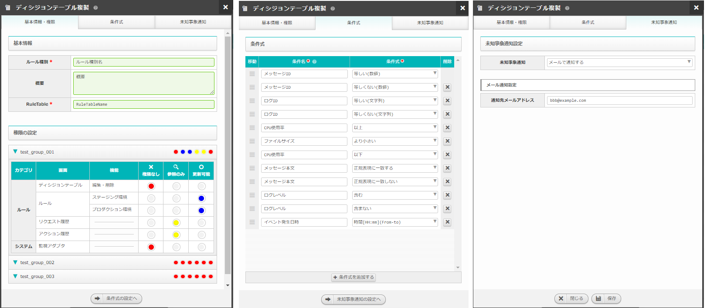

   図 2.1-10 ディシジョンテーブル複製画面

ディシジョンテーブル編集画面の画面構成は次のとおりです。

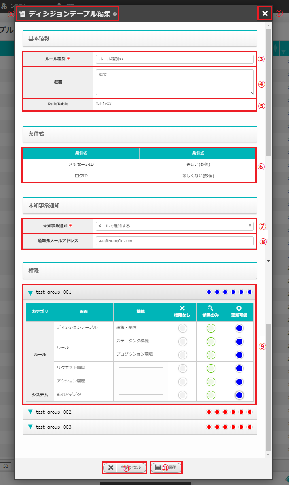

   図 2.1-11 画面構成

ディシジョンテーブル編集画面の各構成要素と、その機能は次の表のとおりです。

.. csv-table:: 表 2.1-8 機能説明
   :header: No., 構成要素, 説明
   :widths: 5, 20, 60

   1, 作業画面名, 現在表示している作業画面の名称です。
   2, 閉じるボタン, 変更内容を破棄してディシジョンテーブル編集画面を閉じ、ディシジョンテーブル画面に戻ります。
   3, ディシジョンテーブル名, ディシジョンテーブル画面で選択したディシジョンテーブルのディシジョンテーブル名が表示され、編集可能です。
   4, 概要, ディシジョンテーブル画面で選択したディシジョンテーブルの概要が表示され、編集可能です。
   5, 条件式, ディシジョンテーブル画面で選択したディシジョンテーブルの条件式が表示されます。※編集できません。
   6, 未知事象通知, ディシジョンテーブル画面で選択した未知事象通知設定が表示され、編集可能です。
   7, 通知先メールアドレス, ディシジョンテーブル画面で入力したメールアドレスが表示され、編集可能です。
   8, ServiceNowDriver名, ディシジョンテーブル画面で選択した接続先ServiceNowドライバ名が表示され、編集可能です。
   9, 権限, ディシジョンテーブル画面で選択したディシジョンテーブルに対してどのグループにどのような権限が設定されているか表示され、編集可能です。
   10, キャンセルボタン, 変更内容を破棄してディシジョンテーブル編集画面を閉じ、ディシジョンテーブル画面に戻ります。
   11, 保存するボタン, 変更内容を保存してディシジョンテーブル編集画面を閉じ、ディシジョンテーブル画面に戻ります。

2.2 ディシジョンテーブル画面の操作方法
========================================

構成要素に対する操作方法を説明します。

(1)ディシジョンテーブル画面
----------------------------
| 登録されているディシジョンテーブルを一覧で表示します。
| 新規追加ボタンについては各権限ごとに異なります。ここでは共通機能について説明します。

詳細表示ボタン
^^^^^^^^^^^^^^
選択したルール種別の詳細を表示します。

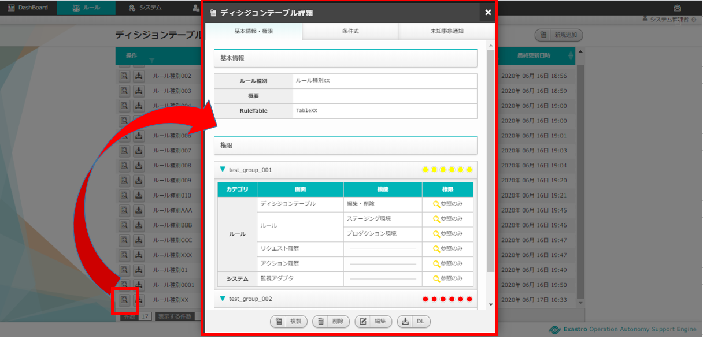

   図 2.2-1-1 「sample005」の詳細表示ボタンを押下した場合に表示される画面

ダウンロードボタン
^^^^^^^^^^^^^^^^^^
新規追加および複製、編集で更新したディシジョンテーブルをエクセルファイルでダウンロードすることができます。

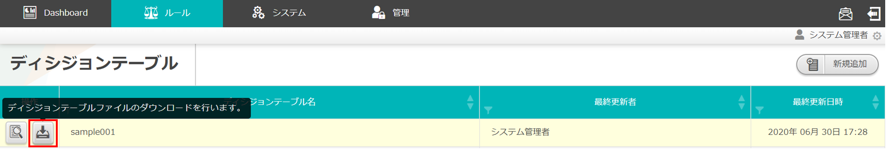

   図 2.2-1-2 「ルール種別：sample001」のダウンロードボタン

一覧
^^^^
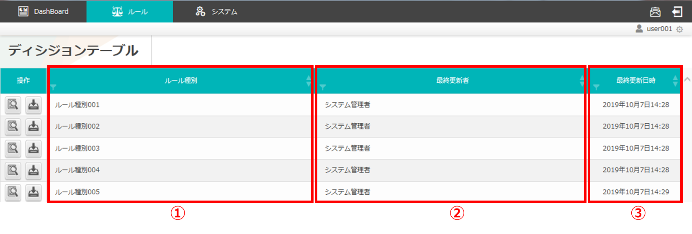

   図 2.2-1-3 ディシジョンテーブル画面の一覧の各項目

.. csv-table:: 表 2.2-1-1 機能説明
   :header: No., 構成要素, 説明
   :widths: 5, 20, 60

   1, ディシジョンテーブル名,ディシジョンテーブル名が表示されます。
   2, 最終更新者,ディシジョンテーブルを更新したユーザの名前が表示されます。
   3, 最終更新日時,ディシジョンテーブルを更新した日時が表示されます。

.. note::
   ディシジョンテーブル画面へのアクセス権限が「更新可能」以外の場合、新規追加ボタンは表示されません。

権限
^^^^^
* 権限によってディシジョンテーブル画面に表示されるディシジョンテーブルが異なります。

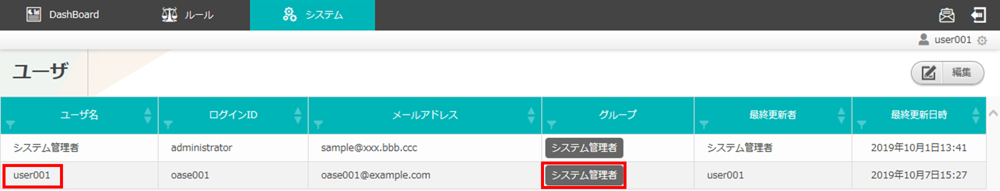

   図 2.2-1-4 ユーザ(user001)の権限が「システム管理者」に設定されている

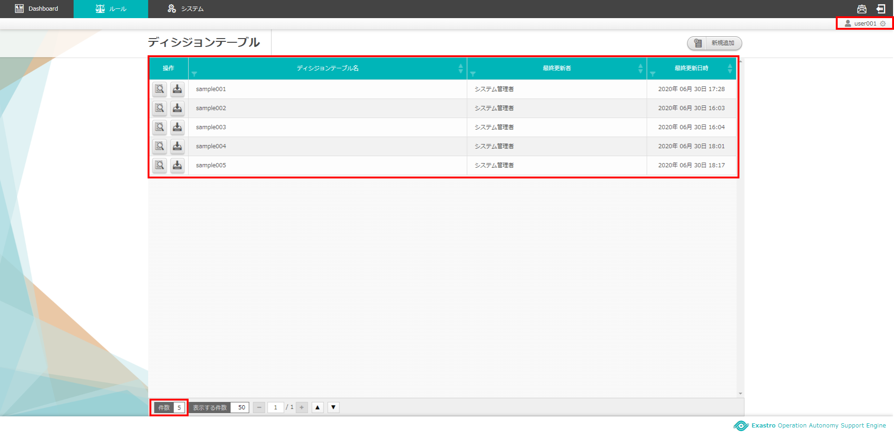

   図 2.2-1-5 ディシジョンテーブル画面にすべてのディシジョンテーブル(5件)が表示される

* ディシジョンテーブル画面のアクセス権限が「更新可能」のユーザであってもすべてのディシジョンテーブルは表示されません。
* ディシジョンテーブルに対する権限が「参照のみ」または「更新可能」である場合のみ、対象のディシジョンテーブルが表示されます。

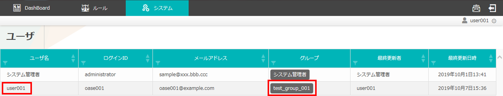

   図 2.2-1-7 ユーザ(user001)の権限が「test_group_001」に設定されている

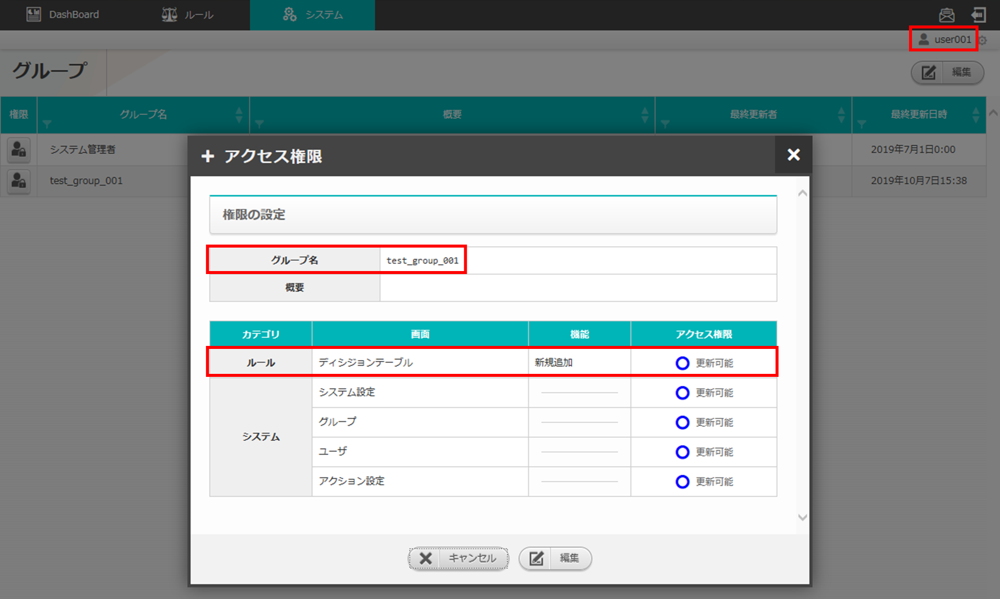

   図 2.2-1-8 「グループ名：test_group_001」の「ディシジョンテーブル画面」に関する「アクセス権限」は「更新可能」

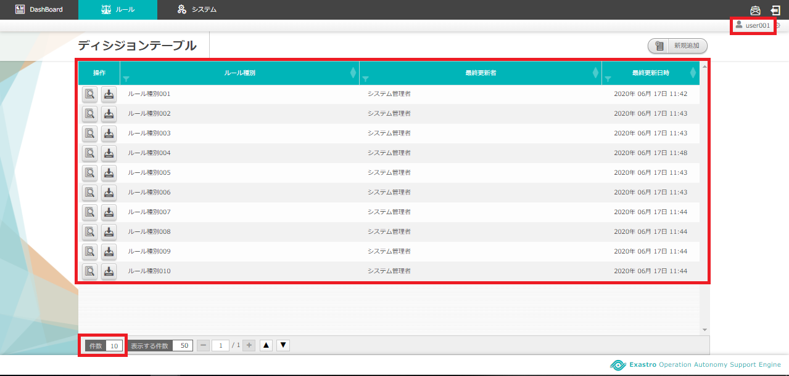

   図 2.2-1-9 ディシジョンテーブル画面には参照権限以上あるディシジョンテーブル(3件)が表示される

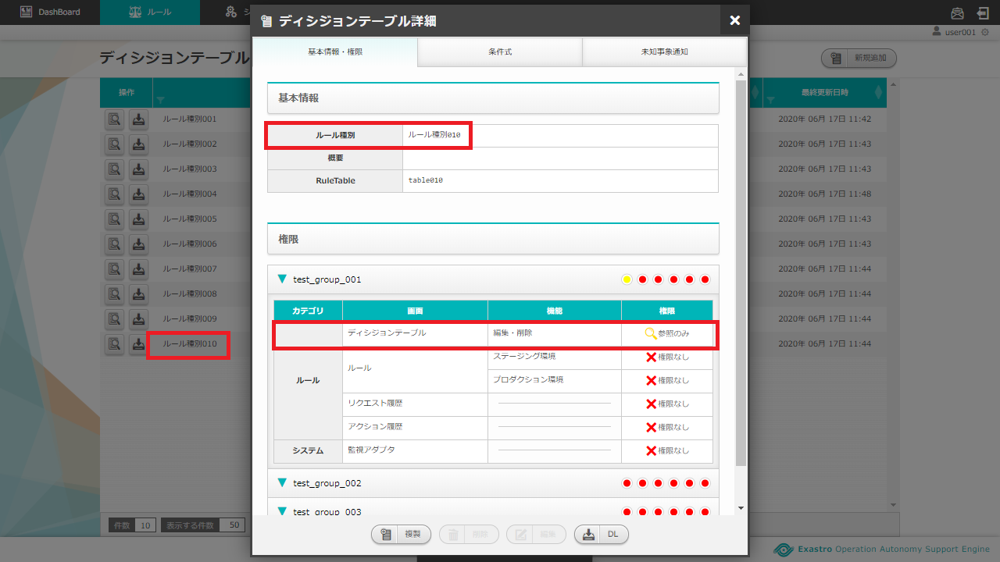

   図 2.2-1-10 「グループ名：test_group_001」が「sample003」に対し参照権限があるためディシジョンテーブル画面に表示される

(2)新規追加画面（基本情報・権限タブ）
--------------------------------------
ディシジョンテーブル画面へのアクセス権限が「更新可能」の場合のみ、新規追加画面を表示することができます。

.. _label_stab_1:

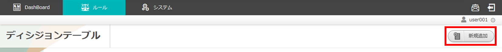

   図 2.2-2-1 アクセス権限が「更新可能」であるため「新規追加ボタン」が表示される

入力欄
^^^^^^^
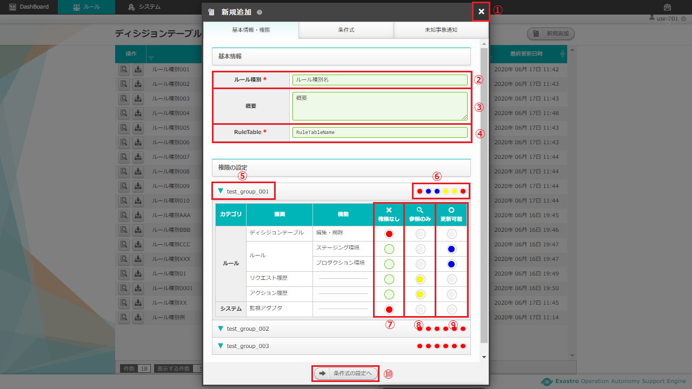

   図 2.2-2-2 新規追加画面（基本情報・権限タブ）

.. csv-table:: 表 2.2-2-1 機能説明
   :header: No., 構成要素, 説明
   :widths: 5, 20, 60

   1, 閉じるボタン,新規追加画面を閉じてディシジョンテーブル画面に戻ります。
   2, ディシジョンテーブル名,入力必須項目です。64文字以内で入力してください。
   3, 概要,任意入力項目です。4000文字以内で入力してください。
   4, グループ,グループごとに省略されている画面を表示することで権限を設定することができます。
   5, 権限一覧,ディシジョンテーブルに対しグループがどのような権限を持っているか簡易的に表示しています。左から「ディシジョンテーブル（編集・削除）」「ルール（ステージング環境）」「ルール（プロダクション環境）」「リクエスト履歴」「アクション履歴」「監視アダプタ」の権限を表しています。
   6, 権限なし,ラジオボタンを有効にし保存すると、対象のディシジョンテーブルを表示する権限を失います。
   7, 参照のみ,ラジオボタンを有効にし保存すると、対象のディシジョンテーブルを表示（一部操作）することができます。
   8, 更新可能,ラジオボタンを有効にし保存すると、対象のディシジョンテーブルを編集および処理の実行ができます。
   9, 条件式の設定へボタン,基本情報・権限タブの情報を保持したまま条件式タブへ遷移します。

(3)新規追加画面（条件式タブ）
-------------------------------
ディシジョンテーブル画面へのアクセス権限が「更新可能」の場合のみ、新規追加画面を表示することができます。

入力欄
^^^^^^^
.. _label_stab_2:

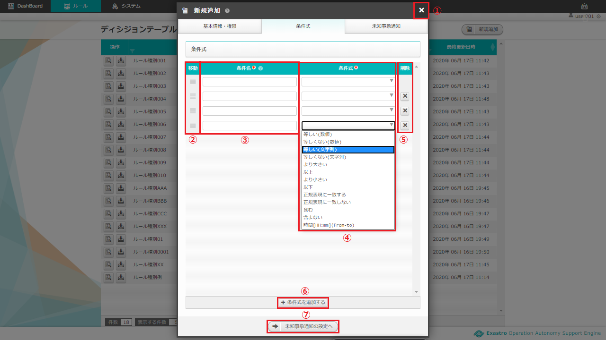

   図 2.2-3-1 新規追加画面（条件式タブ）

.. csv-table:: 表 2.2-3-1 機能説明
   :header: No., 構成要素, 説明
   :widths: 5, 20, 60

   1, 閉じるボタン,新規追加画面を閉じてディシジョンテーブル画面に戻ります。
   2, 移動,ドラッグアンドドロップで条件式を並び替えることができます。
   3, 条件名,入力必須項目です。32文字以内で入力してください。なお、記号は使用できません。
   4, 条件式,プルダウンメニューから選択してください。
   5, 削除,「条件式を追加するボタン」を押下した場合、欄内に押下可能な「×」ボタンが表示されます。「×」ボタンを押下すると、追加行が削除されます。
   6, 条件式を追加するボタン,条件式入力欄を1行ずつ追加します。
   7, 未知事象通知の設定へボタン,未知事象通知タブに遷移する。

条件式
^^^^^^^
どのような条件に合致するか設定し値に応じて判定されます。

.. _label_table_1:

.. csv-table:: 表 2.2-3-2 機能説明
   :header: No., 構成要素, 説明,記述例
   :widths: 5, 15, 20,15

   1, 等しい(数値),記述された数値と等しい場合、判定されます。,1、2、3
   2, 等しくない(数値),記述された数値と等しくない場合、判定されます。,5、6、7
   3, 等しい(文字列),記述された文字列と等しい場合、判定されます。,abc、ああ
   4, 等しくない(文字列),記述された文字列と等しくない場合、判定されます。,abc、ああ
   5, より大きい,記述された数値より大きい場合、判定されます。,1、2、3
   6, 以上,記述された数値以上の場合、判定されます。,5、6、7
   7, より小さい,記述された数値より小さい場合、判定されます。,8、9、10
   8, 以下,記述された数値以下の場合、判定されます。,8、9、10
   9, 正規表現に一致する,記述された正規表現に一致する場合、判定されます。,^.*エラーが発生しました。.*$
   10, 正規表現に一致しない,記述された正規表現に一致しない場合、判定されます。,^.*エラーが発生しました。.*$
   11, 含む,記述された値が含まれる場合、判定されます。,abc、1、ああ
   12, 含まない,記述された値が含まれない場合、判定されます。,abc、1、ああ
   13, 時間[HH:mm](From-to),イベント発生日時の時分がfromからtoの間である場合、判定されます。時分が1桁の場合は頭に0を入力してください。,06:00、 01:01

(4)新規追加画面（未知事象通知タブ）
--------------------------------------
ディシジョンテーブル画面へのアクセス権限が「更新可能」の場合のみ、新規追加画面を表示することができます。

入力欄
^^^^^^^
.. _label_stab_3:

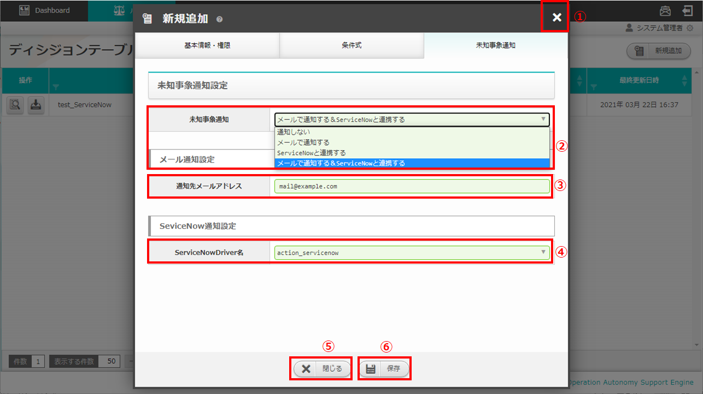

   図 2.2-4-1 新規追加画面（未知事象通知タブ）

.. csv-table:: 表 2.2-4-1 機能説明
   :header: No., 構成要素, 説明
   :widths: 5, 20, 60

   1, 閉じるボタン, 新規追加画面を閉じてディシジョンテーブル画面に戻ります。
   2, 未知事象通知, プルダウンメニューから選択してください。
   3, 通知先メールアドレス, 任意入力項目です。512文字以内で入力してください。
   4, ServiceNowDriver名, 任意選択項目です。プルダウンメニューから接続先ServiceNowドライバ名を選択してください。
   5, 閉じるボタン, 新規追加画面を閉じてディシジョンテーブル画面に戻ります。
   6, 保存するボタン, 新規追加情報を保存してディシジョンテーブル画面に戻ります。

(5)ディシジョンテーブル詳細画面
--------------------------------
| 登録されているディシジョンテーブルの詳細を表示します。
| 削除ボタンおよび編集ボタンについては各権限ごとに異なります。ここでは共通機能について説明します。

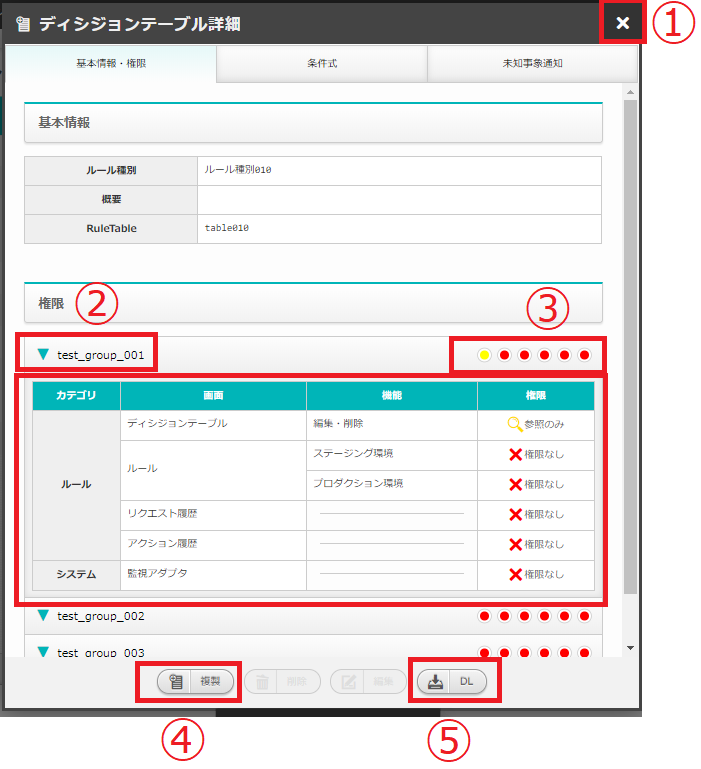

   図 2.2-5-1 ディシジョンテーブル詳細画面

.. csv-table:: 表 2.2-5-1 機能説明
   :header: No., 構成要素, 説明
   :widths: 5, 20, 60

   1, 閉じるボタン,新規追加画面を閉じてディシジョンテーブル画面に戻ります。
   2, グループ,グループごとに省略されている画面を表示することができます。
   3, 権限,ディシジョンテーブルに対しグループがどのような権限を持っているか簡易的に表示しています。左から「ディシジョンテーブル（編集・削除）」「ルール（ステージング環境）」「ルール（プロダクション環境）」「リクエスト履歴」「アクション履歴」「監視アダプタ」の権限を表しています。
   4, 複製ボタン,既存のディシジョンテーブルと同様のディシジョンテーブルを追加することができます。ただし、ディシジョンテーブル名は改めて入力が必要です。
   5, DLボタン,ディシジョンテーブル画面で選択したディシジョンテーブルをエクセルファイルでダウンロードすることができます。

複製
^^^^
* 既存のディシジョンテーブルを基にディシジョンテーブルを新規追加することができます。
* 権限、条件式および未知事象通知の情報を引き継いだディシジョンテーブル複製画面が表示されます。
* ルール種別名およびRuleTable名は新たに記入が必要です。

| 記入方法は前述の「(2)新規追加画面（基本情報・権限タブ）」 :ref:`label_stab_1` 、
| 「(3)新規追加画面（条件式タブ）」 :ref:`label_stab_2` 、
| 「(4)新規追加画面（未知事象通知タブ）」 :ref:`label_stab_3` をご参照ください。

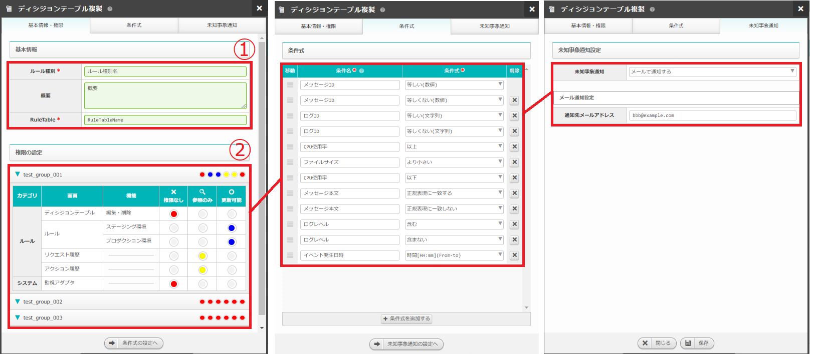

   図 2.2-5-2 ディシジョンテーブル複製画面

.. csv-table:: 表 2.2-5-2 機能説明
   :header: No., 構成要素, 説明
   :widths: 5, 20, 60

   1,新規入力箇所,複製時点では値が入力されていないため入力が必要です。
   2,複製箇所,複製元の情報を引き継いだ値が入力されています。内容の更新が可能です。

編集・削除
^^^^^^^^^^^
ディシジョンテーブルの編集・削除における権限が「更新可能」である場合、ディシジョンテーブル詳細画面に「削除」「編集」ボタンが表示されます。

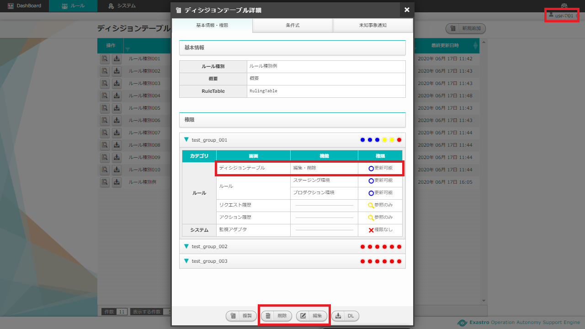

   図 2.2-5-3 user001が権限「更新可能」のtest_group_001に設定されている場合

ディシジョンテーブルの編集・削除における権限が「更新可能」以外である場合、ディシジョンテーブル詳細画面に「削除」「編集」ボタンは表示されません。

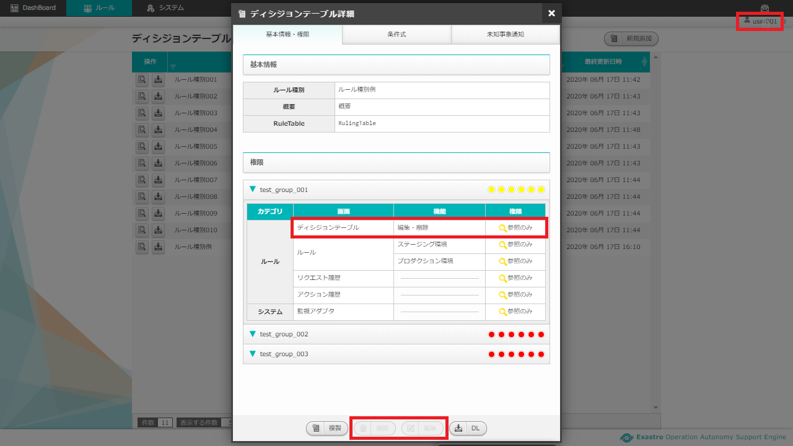

   図 2.2-5-4 user001が権限「参照のみ」のtest_group_001に設定されている場合

(6)ディシジョンテーブル編集画面
--------------------------------

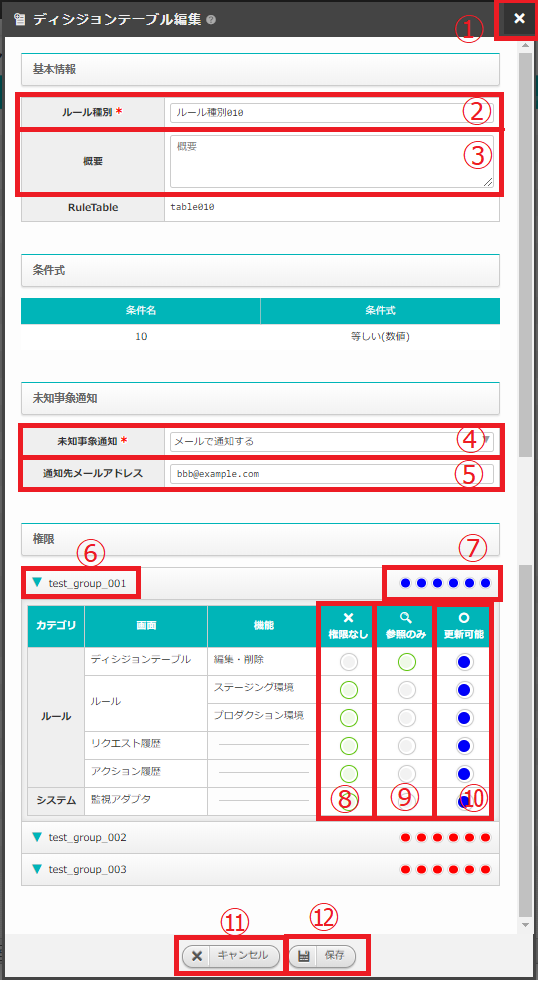

   図 2.2-6-1 ディシジョンテーブル編集画面

.. csv-table:: 表 2.2-6-1 機能説明
   :header: No., 構成要素, 説明
   :widths: 5, 20, 60

   1, 閉じるボタン, 変更内容を破棄してディシジョンテーブル編集画面を閉じ、ディシジョンテーブル画面に戻ります。
   2, ディシジョンテーブル名, ディシジョンテーブル画面で選択したディシジョンテーブルのディシジョンテーブル名が表示され、編集可能です。入力必須項目です。64文字以内で入力してください。
   3, 概要, ディシジョンテーブル画面で選択したディシジョンテーブルの概要が表示され、編集可能です。任意入力項目です。4000文字以内で入力してください。
   4, 未知事象通知, プルダウンメニューから選択してください。
   5, 通知先メールアドレス, 任意入力項目です。512文字以内で入力してください。
   6, ServiceNowDriver名, 任意選択項目です。プルダウンメニューから接続先ServiceNowドライバ名を選択してください。
   7, グループ, グループごとに省略されている画面を表示することができます。
   8, 権限, ディシジョンテーブルに対しグループがどのような権限を持っているか簡易的に表示しています。左から「ディシジョンテーブル（編集・削除）」「ルール（ステージング環境）」「ルール（プロダクション環境）」「リクエスト履歴」「アクション履歴」「監視アダプタ」の権限を表しています。
   9, 権限なし, ラジオボタンを有効にし保存すると、対象のディシジョンテーブルを表示する権限を失います。
   10, 参照のみ, ラジオボタンを有効にし保存すると、対象のディシジョンテーブルを表示（一部操作）することができます。
   11, 更新可能, ラジオボタンを有効にし保存すると、対象のディシジョンテーブルを編集および処理の実行ができます。
   12, キャンセルボタン, 変更内容を破棄してディシジョンテーブル編集画面を閉じ、ディシジョンテーブル画面に戻ります。
   13, 保存するボタン, 変更内容を保存してディシジョンテーブル編集画面を閉じ、ディシジョンテーブル画面に戻ります。

