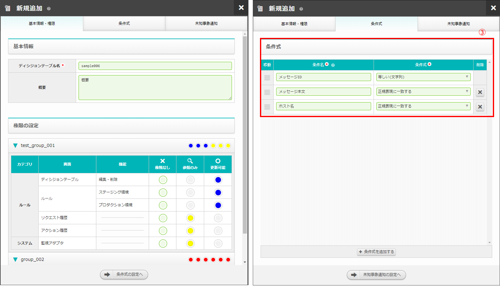
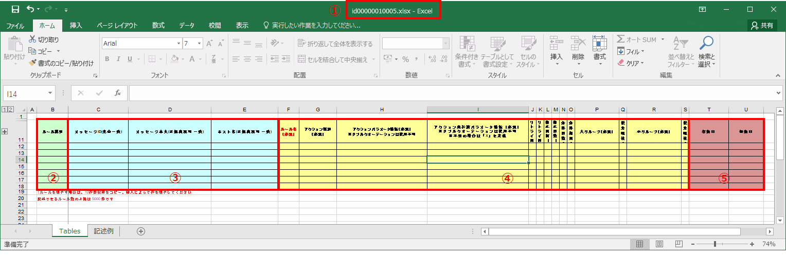
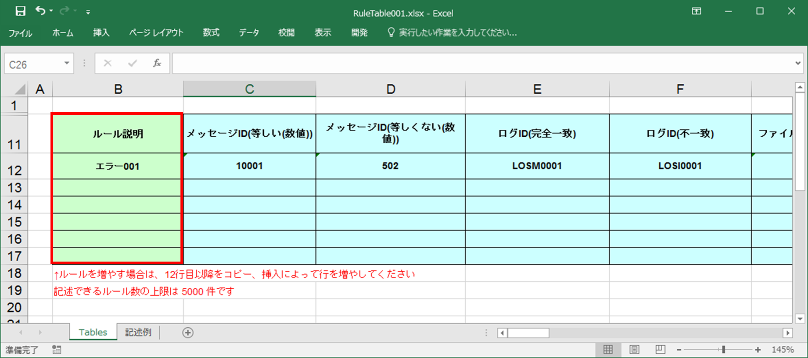
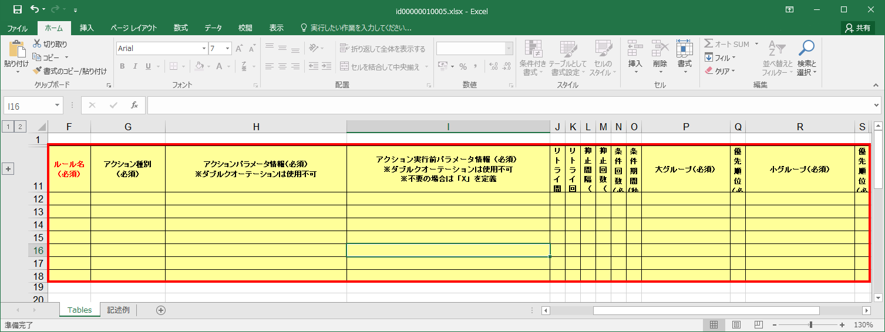
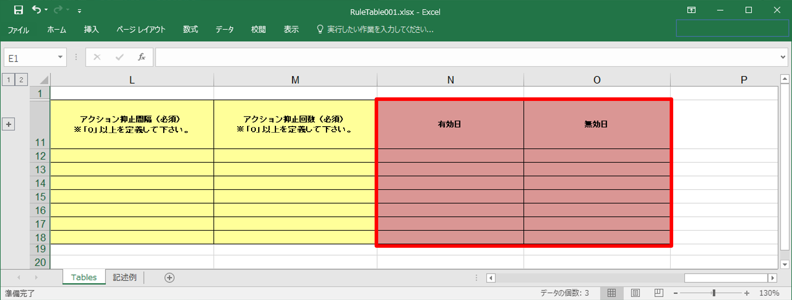
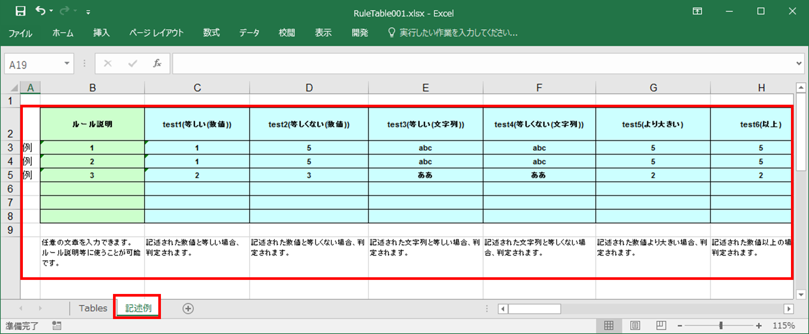

==============================================
3 OASE ディシジョンテーブルファイルの説明
==============================================

本章では、ディシジョンテーブルファイルについて説明します。

3.1 ディシジョンテーブルファイルとは
======================================
* ディシジョンテーブル画面でディシジョンテーブルを登録したうえで、ダウンロードしたディシジョンテーブルファイルを編集しルール画面にアップロードすることで、テストリクエストおよびルールマッチング結果によるアクションの実行を行うことができます。
* ディシジョンテーブルファイルでは、実行されるアクションについて条件を設定できます。

(1)Tablesシート全体
--------------------

テストリクエストおよびルールマッチング結果によるアクションの実行を行うため、ディシジョンテーブルファイルのTablesシートに判定の基準となる条件を記述する必要があります。

   図 3.1-1-1 ディシジョンテーブル新規追加画面

   図 3.1-1-2 ディシジョンテーブルファイル(Tablesシート)

.. csv-table:: 表 3.1-1-2 機能説明
   :header: No., 構成要素, 説明
   :widths: 5, 20, 60

   1, ファイル名,ディシジョンテーブル画面で新規追加および複製時に自動生成された文字列がエクセルファイルの初期ファイル名になります。
   2, コメント部,ダウンロードしたエクセルファイルの背景色緑色の箇所です。
   3, 条件部(条件式),ディシジョンテーブル画面で新規追加および複製時に入力した条件式は生成されるエクセルファイルの条件部（背景色水色箇所）になります。
   4, アクション部,ダウンロードしたエクセルファイルの背景色黄色の箇所です。入力必須項目です。
   5, アクション条件部,ダウンロードしたエクセルファイルの背景色赤色の箇所です。

(2)コメント部
---------------------
* Tablesシートの背景色緑色の箇所です。

   図 3.1-2-1 ディシジョンテーブルファイル(Tablesシート)のコメント部

| **ルール説明**

* 任意の文章を入力できます。ルール説明等に使うことが可能です。

**記述例**
::

  エラー001

(3)条件部
---------------------
* Tablesシートの背景色水色の箇所です。
* 記入方法は前述の :ref:`label_table_1` をご参照ください。

   図 3.1-3-1 ディシジョンテーブルファイル(Tablesシート)の条件部

.. note::
       ディシジョンテーブル画面で新規追加および複製時に入力した"時間[HH:mm](From-to)"は、エクセルファイルでは"[HH:mm](from)"と"[HH:mm](to)"の2列に分かれます。開始日時と終了日時をそれぞれ入力して下さい。

.. note::
       条件部を空欄にすると、どのような値でも条件にマッチします。しかし、１つのルールに対して全ての条件部を空欄にすることはできません。

(4)アクション部
---------------------
* Tablesシートの背景色黄色の箇所です。
* ルール名ごとにどのようなアクションを実行するか設定することができます。
* アクションを実行してよいか、実行する前に事前承認メールを送る設定をすることができます。
* アクションの実行が失敗した場合何回リトライするか、リトライの間隔および回数を設定することができます。
* 同一アクションを何度も実行するのを避けたい場合、抑止の間隔および回数を設定することで制御できます。
* アクション種別ごとに記入方法が異なります。設定内容に合わせて記入してください。
* 複数のルールをグルーピングすることで、コリレーション機能を利用することができます。

   図 3.1-4-1 ディシジョンテーブルファイル(Tablesシート)の条件部

共通
^^^^^

| **ルール名（必須）**

* 一意となる名称を記入してください。

**記述例**

::
  
  rule1

| **アクション種別（必須）**

* 実行したいアクション種別をプルダウンで選択してください。

**記述例**

::
  
 mail(ver1)

| **アクションパラメータ情報（必須）※ダブルクオーテーションは使用不可**

記入方法は後述の :ref:`labelCap1` 、 :ref:`labelCap2` および :ref:`labelCap3` をご参照ください。

| **アクション実行前パラメータ情報（必須）※ダブルクオーテーションは使用不可 ※不要の場合は「X」を定義**

* MAIL_NAMEは必須です。OASE画面のシステム-アクション設定-mail_driverの名前と紐づけます。
* 「MAIL_TO=,MAIL_CC=,MAIL_BCC=」は送信したいメールアドレスを記述してください。
* 「MAIL_TEMPLATE=」はテンプレート名を記述してください。未記入の場合はデフォルトのメールが送信されます。
* 宛先やテンプレート名は空白でも良いですが、記述例のように、「MAIL_TO=,MAIL_CC=,MAIL_BCC=,MAIL_TEMPLATE=」の記述は必要です。また、MAIL_TOにメールアドレスの指定、またはMAIL_TEMPLATEで指定したテンプレートに宛先があること、のどちらかが必要です。
* 2つ以上、送信したいアドレスがある場合は「;」でつなげてください。
* MAIL_TEMPLATEはOASE画面のシステム-アクション設定-メールテンプレートのテンプレート名と紐づけます。
* 不要の場合はXを記述してください。
* MAIL_TO、MAIL_CC、MAIL_BCCの値に {{ VAR_条件名 }} と記入すると条件部の値を当てはめることができます。
* {{ VAR_条件名 }} の条件名には :doc:`02_screen_structure` の新規追加画面にて入力された条件名を記入してください。

**記述例**

::

 MAIL_NAME=oasetest,MAIL_TO=aaa@aaa.com;bbb@bbb.com,MAIL_CC=ccc@ccc.com,MAIL_BCC=ddd@ddd.com,MAIL_TEMPLATE=test_template

::

 MAIL_NAME=oasetest,MAIL_TO=,MAIL_CC=,MAIL_BCC=,MAIL_TEMPLATE=

::

 MAIL_NAME=oasetest,MAIL_TO={{ VAR_条件名 }},MAIL_CC=ccc@ccc.com,MAIL_BCC=ddd@ddd.com,MAIL_TEMPLATE=test_template

::
  
 X

  
| **アクションリトライ間隔（必須）※「1」以上を定義して下さい。**

* アクションのリトライ間隔を記述します。
* リトライ間隔の単位は秒になります。

**記述例**

::
  
 1

| **アクションリトライ回数（必須）※「1」以上を定義して下さい。**

* アクションのリトライ回数を記述します。

**記述例**

::
  
 1

| **アクション抑止間隔（必須）※「0」以上を定義して下さい。**

* アクションの抑止間隔を記述します。
* 抑止間隔の単位は秒になります。

**記述例**

::
  
 0

| **アクション抑止回数（必須）※「0」以上を定義して下さい。**

* アクションの抑止回数を記述します。

**記述例**

::
  
 0

| **条件回数（必須）**

* アクションの条件回数を記述します。

**記述例**

::

 3

::

 X

| **条件期間(秒)（必須）**

* アクションの条件期間を記述します。

**記述例**

::

 300

::

 X

| **大グループ（必須）**

* グルーピングしたいルールに対してグループ名を記述します。

**記述例**

::

 group1

::

 X

| **優先順位（必須）**

* 大グループでグルーピングしたルールの優先順位を記述します。1が最優先になります。

**記述例**

::

 1

::

 X

| **小グループ（必須）**

* 大グループからさらにグルーピングしたいルールに対してグループ名を記述します。

**記述例**

::

 group10

::

 X

| **優先順位（必須）**

* 小グループでグルーピングしたルールの優先順位を記述します。1が最優先になります。

**記述例**

::

 1

::

 X

.. _labelCap1:

ITAドライバ
^^^^^^^^^^^^^^

| **アクションパラメータ情報（必須）※ダブルクオーテーションは使用不可**

* ITA_NAMEおよびSYMPHONY_CLASS_IDまたはCONDUCTOR_CLASS_IDは必須です。
* ITA_NAMEはOASE画面のシステム-アクション設定-ITA_driverの名前と紐づけます。
* SYMPHONY_CLASS_IDはITA画面のSymphony-Symphonyクラス一覧のSymphonyクラスIDと紐づけます。
* CONDUCTOR_CLASS_IDはITA画面のConductor-Conductorクラス一覧のConductorクラスIDと紐づけます。
* OPERATION_IDはITA画面の基本コンソール-投入オペレーション一覧のオペレーションIDと紐づけます。
* SERVER_LISTは実行対象となるホスト名を記述します。ホスト名はITA画面の基本コンソール-機器一覧のホスト名と紐づけます。複数記載する場合はコロン(:)で区切って記述します。
* MENU_IDはITAで作成されたパラメータシートのメニューIDと紐づけます。メニューIDはITA画面の管理コンソール-メニュー管理から確認できます。複数記載する場合はコロン(:)で区切って記述します。
* HOSTGROUP_NAMEはMENU_IDに紐づいたホストグループIDを記載します。MENU_IDと併せてコロン（:）で区切って記載します。1つのMENU_IDに複数のホストグループを紐づける場合はアンド（&）で区切って記載します。
* 複数のMENU_IDを設定する場合はパイプ（|）で区切って記載します。HOST_NAMEにつきましても、HOSTGROUP_NAMEと同様です。
* CONVERT_FLGはTRUEまたはFALSEを設定します。MENU_ID指定の時に必須になります。
* SYMPHONY_CLASS_ID,CONDUCTOR_CLASS_ID,OPERATION_ID,SERVER_LIST,MENU_IDの値に {{ VAR_条件名 }} と記入すると条件部の値を当てはめることができます。
* {{ VAR_条件名 }} の条件名には :doc:`02_screen_structure` の新規追加画面にて入力された条件名を記入してください。

| **OPERATION_IDを指定した場合**
| ITAに事前に準備しておいた [ オペレーション - Symphony ] で作業を実行できます。
| ITAに事前に準備しておいた [ オペレーション - Conductor ] で作業を実行できます。

| **SERVER_LISTを指定した場合**
| ITAのSymphonyまたはConductorに対して、OASEから作業対象ホストを指定して作業を実行できます。
| (ITAでのオペレーションは自動払い出しになります)

| **MENU_IDを指定した場合**
| ITAのパラメータシートと連携して、指定したSymphonyまたはConductorに対して作業を実行できます。
| (ITAでのオペレーションは自動払い出しになります)
| MENU_ID指定の場合は、CONVERT_FLGが必須になります。

| **MENU_ID指定かつCONVERT_FLGがTRUEの場合**
| 条件部におけるルールの記述を以下のように加工した場合、使用することができます。
| ・始めの条件を作業対象ホスト名でマッチングできるようにする。
| ・2番目以降の条件をパラメータシートに連携する値でマッチングできるようにする。
| ルールにマッチングされた値がそのままパラメータシートへ登録を行います。
| パラメータシートへ値が登録される順番はイベント情報の順番になります。

| **MENU_ID指定かつCONVERT_FLGがFALSEの場合**
| 条件部におけるルールの記述を加工せずに使用することができます。
| ITAのパラメータシートへ連携される値はマッチングされた文言から指定された抽出条件によって抽出します。
| 抽出する値には作業対象ホストが必要です。
| パラメータシートへ値が登録される順番はメニューID毎に指定することができます。

**記述例**

::

 ITA_NAME=action43,SYMPHONY_CLASS_ID=2,OPERATION_ID=10

::

 ITA_NAME=action43,SYMPHONY_CLASS_ID={{ VAR_条件名 }},OPERATION_ID=10

::

 ITA_NAME=action43,SYMPHONY_CLASS_ID=2,SERVER_LIST=hostname1:hostname2

::

 ITA_NAME=action43,SYMPHONY_CLASS_ID=2,MENU_ID=1,CONVERT_FLG=TRUE

::

 ITA_NAME=action43,SYMPHONY_CLASS_ID=2,MENU_ID=1:2,CONVERT_FLG=FALSE

::

 ITA_NAME=action43,SYMPHONY_CLASS_ID=2,MENU_ID=1:2:3:4,HOSTGROUP_NAME=1:HG1,HOST_NAME=2:H2&H3|3:H4|4:H5&H6&H7,CONVERT_FLG=FALSE

::

 ITA_NAME=action43,CONDUCTOR_CLASS_ID=2,OPERATION_ID=10

::

 ITA_NAME=action43,CONDUCTOR_CLASS_ID={{ VAR_条件名 }},OPERATION_ID=10

::

 ITA_NAME=action43,CONDUCTOR_CLASS_ID=2,SERVER_LIST=hostname1:hostname2

::

 ITA_NAME=action43,CONDUCTOR_CLASS_ID=2,MENU_ID=1,CONVERT_FLG=TRUE

::

 ITA_NAME=action43,CONDUCTOR_CLASS_ID=2,MENU_ID=1:2,CONVERT_FLG=FALSE

::

 ITA_NAME=action43,CONDUCTOR_CLASS_ID=2,MENU_ID=1:2:3:4,HOSTGROUP_NAME=1:HG1,HOST_NAME=2:H2&H3|3:H4|4:H5&H6&H7,CONVERT_FLG=FALSE

.. note::
   OPERATION_ID,SERVER_LIST,MENU_IDを同時に設定した場合エラーとなります。

.. _labelCap2:

mailドライバ
^^^^^^^^^^^^^^

| **アクションパラメータ情報（必須）※ダブルクオーテーションは使用不可**

* MAIL_NAMEは必須です。OASE画面のシステム-アクション設定-mail_driverの名前と紐づけます。
* 「MAIL_TO=,MAIL_CC=,MAIL_BCC=」は送信したいメールアドレスを記述してください。
* 「MAIL_TEMPLATE=」はテンプレート名を記述してください。
* 宛先やテンプレート名は空白でも良いですが、記述例のように、「MAIL_TO=,MAIL_CC=,MAIL_BCC=,AIL_TEMPLATE=」の記述は必要です。また、MAIL_TOにメールアドレスの指定、またはMAIL_TEMPLATEで指定したテンプレートに宛先があること、のどちらかが必要です。
* 2つ以上、送信したいアドレスがある場合は「;」でつなげてください。
* MAIL_TEMPLATEはOASE画面のシステム-アクション設定-メールテンプレートのテンプレート名と紐づけます。
* MAIL_TO、MAIL_CC、MAIL_BCCの値に {{ VAR_条件名 }} と記入すると条件部の値を当てはめることができます。
* {{ VAR_条件名 }} の条件名には :doc:`02_screen_structure` の新規追加画面にて入力された条件名を記入してください。

**記述例**

::

 MAIL_NAME=oasetest,MAIL_TO=aaa@aaa.com;bbb@bbb.com,MAIL_CC=ccc@ccc.com,MAIL_BCC=ddd@ddd.com,MAIL_TEMPLATE=test_template

::

 MAIL_NAME=oasetest,MAIL_TO=,MAIL_CC=,MAIL_BCC=,MAIL_TEMPLATE=test_template

::

 MAIL_NAME=oasetest,MAIL_TO={{ VAR_条件名 }},MAIL_CC=ccc@ccc.com,MAIL_BCC=ddd@ddd.com,MAIL_TEMPLATE=test_template

.. _labelCap3:

ServiceNowドライバ
^^^^^^^^^^^^^^^^^^

| **アクションパラメータ情報（必須）※ダブルクオーテーションは使用不可**

* SERVICENOW_NAMEは必須です。OASE画面のシステム-アクション設定-ServiceNow_driverの名前と紐づけます。

**記述例**

::

 SERVICENOW_NAME=ServiceNowTest

(5)アクション条件部
---------------------

*  Tablesシートの背景色赤色の箇所です。

   図 3.3-5-1 ディシジョンテーブルファイル(Tablesシート)のアクション条件部

| **有効日**

* ルールの有効日を設定できます。
* 有効日を設定しない場合は空欄にします。
* yyyy-mm-dd HH:mm形式で入力して下さい。
* 有効日を2020-01-01 01:00に設定した場合、2020-01-01 01:00:01以降のイベントにマッチします。

**記述例**

::

 2010-01-01 01:00

| **無効日**

* ルールの無効日を設定できます。
* 無効日を設定しない場合は空欄にします。
* yyyy-mm-dd HH:mm形式で入力して下さい。
* 無効日を2020-01-01 01:00に設定した場合2020-01-01 01:00:00以降のイベントはマッチしません。

**記述例**

::

 2020-01-01 23:59

(6)exampleシート
---------------------

* ディシジョンテーブルファイルのTablesシートに記述すべき値の例が記載されたシートです。
* 項目によっては記述フォーマットについても例が記載されています。

   図 3.1-6-1 ディシジョンテーブルファイル(exampleシート)
