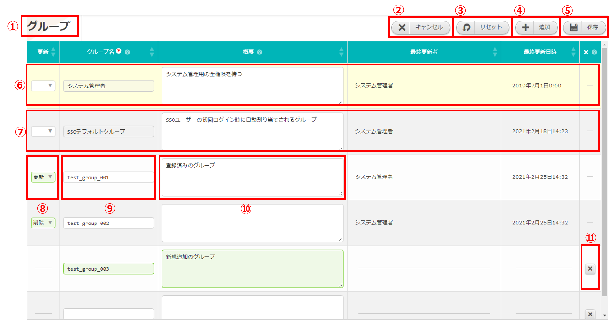
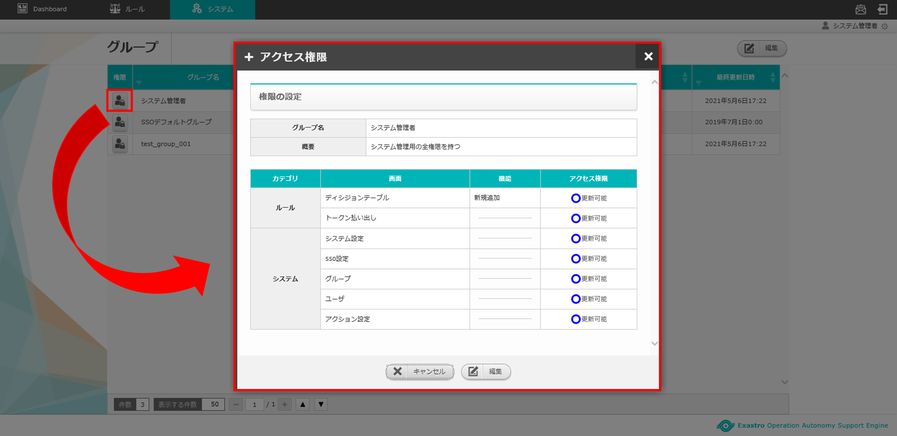

========================================
2 OASE グループ画面のメニュー 、画面構成
========================================

本章では、OASE グループ画面の画面構成と、各構成要素について説明します。

2.1 基本画面構成
================ 

グループ画面の画面構成は次のとおりです。

   
   図 2.1-1 画面構成

グループ画面の各構成要素と、その機能は次の表のとおりです。

.. csv-table:: 表 2.1-1 機能説明
   :header: No., 構成要素, 説明
   :widths: 5, 20, 60

   1, 作業画面名, 現在表示している作業画面の名称です。
   2, 編集ボタン,編集画面に遷移し、グループの追加、編集、削除をします。※AD連携時には表示されません。
   3, 一覧, グループに登録されている情報が表示されます。

| グループの編集画面の画面構成は次のとおりです。
| ※AD連携時には表示されません。

   図 2.1-2 画面構成

グループの編集画面の各構成要素と、その機能は次の表のとおりです。

.. csv-table:: 表 2.1-2 機能説明
   :header: No., 構成要素, 説明
   :widths: 5, 20, 60

   1, 作業画面名, 現在表示している作業画面の名称です。
   2, キャンセルボタン,編集作業をキャンセルし、グループ画面に戻ります。
   3, リセットボタン,編集途中の内容を編集前の値にリセットします。
   4, 追加ボタン,グループ情報入力欄を1行ずつ追加します。
   5, 保存ボタン,編集内容を保存します。
   6, システム管理者欄,システム管理者権限を持つグループはデフォルトで登録されています。※編集不可。
   7, SSOデフォルトグループ欄,外部の認証プロバイダを使用してログインしたユーザに割り当てられます。このグループはデフォルトで登録されています。※削除不可、更新は可能。
   8, 更新,既存のグループに対し「更新」または「削除」を選択できます。※「4.追加ボタン」押下による新規追加グループには表示されません。
   9, グループ名,任意のグループ名を入力できます。
   10, 概要,グループの概要を入力できます。
   11, 削除ボタン,追加した行を削除します。

   

アクセス権限画面の画面構成は次のとおりです。

   図 2.1-3 画面構成

アクセス権限画面の各構成要素と、その機能は次の表のとおりです。

.. csv-table:: 表 2.1-3 機能説明
   :header: No., 構成要素, 説明
   :widths: 5, 20, 60

   1, 作業画面名, 現在表示している作業画面の名称です。
   2, 閉じるボタン,アクセス権限画面を閉じてグループ画面に戻ります。
   3, グループ名,グループ画面で選択したグループの名前が表示されます。
   4, 概要,グループ画面で選択したグループの概要が表示されます。
   5, 権限一覧,OASE 内の各画面に対しどのような権限を持っているのか「更新可能」「参照のみ」「権限なし」の3通りで表示されます。
   6, キャンセルボタン,アクセス権限画面を閉じてグループ画面に戻ります。
   7, 編集ボタン,権限一覧の情報を変更する場合に編集画面に移ります。

アクセス権限の編集画面の画面構成は次のとおりです。

   図 2.1-4 画面構成

アクセス権限の編集画面の各構成要素と、その機能は次の表のとおりです。

.. csv-table:: 表 2.1-4 機能説明
   :header: No., 構成要素, 説明
   :widths: 5, 20, 60

   1, 作業画面名, 現在表示している作業画面の名称です。
   2, 閉じるボタン,アクセス権限画面を閉じてグループ画面に戻ります。
   3, グループ名,グループ画面で選択したグループの名前が表示されます。
   4, 概要,グループ画面で選択したグループの概要が表示されます。
   5, 権限一覧,OASE 内の各画面に対しどのような権限を付与するか「更新可能」「参照のみ」「権限なし」いずれかをラジオボタンで選択することができます。
   6, キャンセルボタン,アクセス権限画面を閉じてグループ画面に戻ります。
   7, 保存ボタン,編集したアクセス権限情報を保存してグループ画面に移ります。

2.2 グループ画面の操作方法
==========================

構成要素に対する操作方法を説明します。

(1)グループ画面
---------------
| 登録されているグループを一覧で表示します。
| 編集ボタンについては各権限ごとに異なります。ここでは共通機能について説明します。

権限ボタン
^^^^^^^^^^
* 初期状態では「システム管理者」および「SSOデフォルトグループ」の情報がセットされています。※「システム管理者」のアクセス権限の編集はできません。
* 「システム管理者」はOASE 内の各画面へのアクセス権限がすべて「更新可能」となっています。
* 「グループ」画面の権限があるユーザの場合、「システム管理者」以外の「アクセス権限」画面上に「キャンセルボタン」と「編集ボタン」が表示されます。

   図 2.2-1-1 「グループ名：システム管理者」の権限ボタンを押下した場合に表示される画面

一覧
^^^^

   図 2.2-1-2 一覧に表示される項目

.. csv-table:: 表 2.2-1-2 機能説明
   :header: No., 構成要素, 説明
   :widths: 5, 20, 60

   1, グループ名,グループのグループ名が表示されます。
   2, 概要,グループの概要が表示されます。
   3, 最終更新者,グループのアクセス権限およびグループ名、概要を更新したユーザの名前が表示されます。
   4, 最終更新日時,グループのアクセス権限およびグループ名、概要を更新した日時が表示されます。

.. note::

    AD連携時はグループ画面の編集ボタンが表示されません。また、AD連携をしていない状態でも、グループ画面へのアクセス権限が「更新可能」以外の場合、同様に編集ボタンは表示されません。 

(2)グループ編集画面
-------------------
| グループを新規追加および、すでに登録されているグループを更新、削除することができます。
| グループ画面へのアクセス権限が「更新可能」の場合のみ、グループ編集画面を表示することができます。

   図 2.2-2-1 アクセス権限が「更新可能」の場合表示される「編集ボタン」

システム管理者
^^^^^^^^^^^^^^
* 初期値としてセットされています
* 「グループ名：システム管理者」の「アクセス権限」及び「グループ名」は変更できません。
* 「グループ名：システム管理者」の「概要」を変更することができます。

SSOデフォルトグループ
^^^^^^^^^^^^^^^^^^^^^
* 初期値としてセットされています
* 「グループ名：SSOデフォルトグループ」の「グループ名」は変更できません。
* 「グループ名：SSOデフォルトグループ」の「アクセス権限」及び「概要」を変更することができます。

入力欄
^^^^^^

   図 2.2-2-2 グループ編集画面の各項目

.. csv-table:: 表 2.2-2-2 機能説明
   :header: No., 構成要素, 説明
   :widths: 5, 20, 60

   1, キャンセル,変更内容を破棄してグループ編集画面を閉じ、グループ画面に戻ります。
   2, リセット,値を変更する前のグループ編集画面に戻ります。
   3, 追加,編集欄が1行追加されます。
   4, 保存,更新列の値が「更新」のみの場合、更新内容が反映されたグループ画面に移ります。更新列の値に「削除」が含まれる場合、対象のグループが削除されたグループ画面に移ります。
   5, 更新,既存のグループを更新する場合はプルダウンメニューから「更新」を選択してください。また、削除する場合は「削除」を選択してください。選択状態で「保存ボタン」を押下すると、選択した内容が反映されます。※新規追加行にはプルダウンメニューは表示されません。
   6, グループ名,入力必須項目です。64文字以内で入力してください。
   7, 概要,任意入力項目です。4000文字以内で入力してください。
   8, 最終更新者,グループ編集画面の「保存ボタン」を押下したユーザ名が自動で反映されます。
   9, 最終更新日時,グループ編集画面の「保存ボタン」を押下した時刻が自動で反映されます。
   10, 追加行削除ボタン,グループ編集画面の「追加ボタン」を押下した場合、欄内に押下可能な「×」ボタンが表示されます。「×」ボタンを押下すると、追加行が削除されます。

.. note::

    　ユーザが1つのグループのみに所属している場合、そのグループを削除すると、そのグループに所属するユーザも合わせて削除されます。ただし、ユーザが複数のグループに所属している場合は1つのグループを削除してもユーザは削除されません。

(3)アクセス権限画面
-------------------
| 登録されているグループがOASE 内の各画面に対しどのようなアクセス権限を付与されているか一覧で表示します。
| キャンセルボタンおよび編集ボタンについては各権限ごとに異なります。ここでは共通機能について説明します。

   図 2.2-3-1 アクセス権限画面の各項目

.. csv-table:: 表 2.2-3-1 機能説明
   :header: No., 構成要素, 説明
   :widths: 5, 20, 60

   1, 閉じるボタン,アクセス権限画面を閉じてグループ画面に戻ります。
   2, グループ編集画面の入力値,グループ名および概要を変更する場合は、グループ画面の「編集」ボタンを押下し、グループ編集画面から更新してください。
   3, アクセス権限一覧,グループ画面のアクセス権限が「更新可能」である場合、アクセス権限の編集画面から「権限なし」「参照のみ」「更新可能」のいずれかを設定することができます。

.. note::

    「グループ名：システム管理者」のキャンセルボタン、編集ボタンは表示されません。 ※アクセス権限の編集はできません。

.. note::

    AD連携設定の有無に関わらず、グループ画面へのアクセス権限が「更新可能」以外の場合、キャンセルボタン、編集ボタンは表示されません。 

(4)アクセス権限編集画面
-----------------------
| OASE 内の各画面に対しどのようなアクセス権限を付与するか編集することができます。
| グループ画面へのアクセス権限が「更新可能」の場合のみ、アクセス権限編集画面を表示することができます。

   図 2.2-4-1 アクセス権限が「更新可能」の場合表示される「キャンセルボタン」「編集ボタン」

入力欄
^^^^^^

   図 2.2-4-2 アクセス権限編集画面の各項目

.. csv-table:: 表 2.2-4-2 機能説明
   :header: No., 構成要素, 説明
   :widths: 5, 20, 60

   1, 閉じるボタン,アクセス権限編集画面を閉じてグループ画面に戻ります。
   2, 権限なし,ラジオボタンを有効にし保存すると、OASE 内のその画面を表示する権限を失います。
   3, 参照のみ,ラジオボタンを有効にし保存すると、OASE 内のその画面を表示（一部編集）することができます。
   4, 更新可能,ラジオボタンを有効にし保存すると、OASE 内のその画面で「追加」「更新」「削除」などの編集および処理を実行できます。
   5, キャンセルボタン,アクセス権限編集画面を閉じてグループ画面に戻ります。
   6, 保存ボタン,編集した権限情報を保存してグループ画面に移ります。

