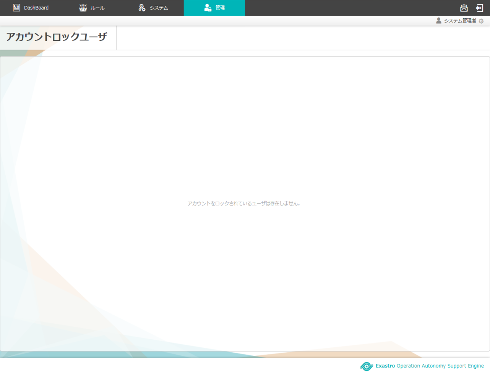

==========================================================
2 OASE アカウントロックユーザ画面のメニュー 、画面構成
==========================================================

本章では、OASE アカウントロックユーザ画面の画面構成と、各構成要素について説明します。

2.1 基本画面構成
================ 

アカウントロックユーザ画面の画面構成は次のとおりです。

   
   図 2.1-1 画面構成

アカウントロックユーザ画面の各構成要素と、その機能は次の表のとおりです。

.. csv-table:: 表 2.1-1 機能説明
   :header: No., 構成要素, 説明
   :widths: 5, 20, 60

   1, 作業画面名, 現在表示している作業画面の名称です。
   2,一覧,現在アカウントロックユーザに登録されている情報が表示されます。
   

アカウントロックされたユーザが1件も登録されていない場合は以下のように表示されます。

   
   図 2.1-2 画面構成

2.2 アカウントロックユーザ画面の操作方法
==========================================

構成要素に対する操作方法を説明します。

アカウントロックユーザ画面
-------------------------------
登録されているアカウントロックユーザを一覧で表示します。

   
   図 2.2-1 画面構成

.. csv-table:: 表 2.2-1 機能説明
   :header: No., 構成要素, 説明
   :widths: 5, 20, 60

   1, 解除ボタン,アカウントロックを解除し、更新内容が反映されたアカウントロックユーザ画面に戻ります。 

.. note::

    AD連携時はメニューバーにアカウントロックユーザ画面へ遷移するメニューボタンが表示されません。また、AD連携をしていない状態でも、アカウントロックユーザ画面へのアクセス権限が「更新可能」以外の場合、同様に表示されません。 

