========================================
2 OASE ログイン画面のメニュー 、画面構成
========================================

本章では、OASE ログイン画面の画面構成と、各構成要素について説明します。

2.1 基本画面構成
================ 

ログイン画面の画面構成は次のとおりです。

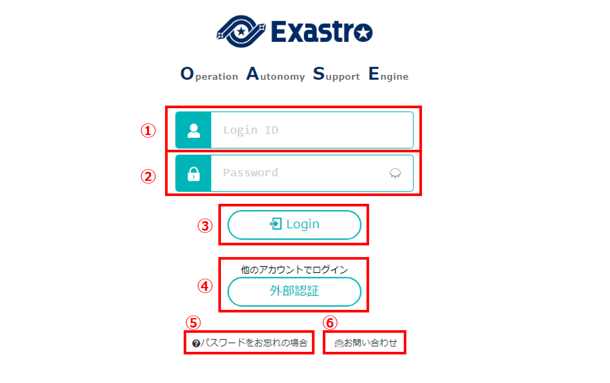

   図 2.1-1 画面構成

ログイン画面の各構成要素と、その機能は次の表のとおりです。

.. csv-table:: 表 2.1-1 機能説明
   :header: No., 構成要素, 説明
   :widths: 5, 20, 60

   1, ログインID, ログインIDを入力できます。
   2, パスワード,ログインパスワードを入力できます。
   3, Loginボタン,ログインできます。
   4, パスワードをお忘れの場合ボタン,パスワードをリセットすることができます。※AD連携時には表示されません。
   5, お問い合わせボタン,メールによるお問い合わせをすることができます。

初期パスワード変更画面の画面構成は次のとおりです。

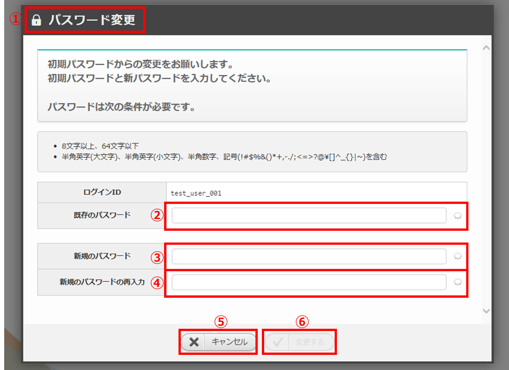

   図 2.1-2 画面構成

初期パスワード変更画面の各構成要素と、その機能は次の表のとおりです。

.. csv-table:: 表 2.1-2 機能説明
   :header: No., 構成要素, 説明
   :widths: 5, 20, 60

   1, 作業画面名, 現在表示している作業画面の名称です。
   2, 既存のパスワード, 既存のパスワードを入力できます。
   3, 新規のパスワード,新規のパスワードを入力できます。
   4, 新規のパスワードの再入力,新規のパスワードを再入力することができます。
   5, キャンセルボタン,パスワード変更をキャンセルし、ログイン画面に戻ります。
   6, 変更するボタン,パスワードを変更します。
   
パスワード有効期限切れ画面の画面構成は次のとおりです。

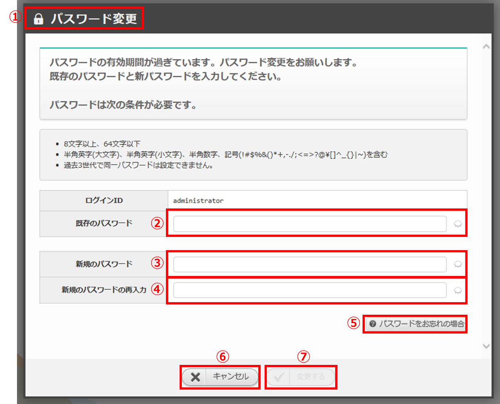

   図 2.1-3 画面構成

パスワード有効期限切れ画面の各構成要素と、その機能は次の表のとおりです。

.. csv-table:: 表 2.1-3 機能説明
   :header: No., 構成要素, 説明
   :widths: 5, 20, 60

   1, 作業画面名, 現在表示している作業画面の名称です。
   2, 既存のパスワード, 既存のパスワードを入力できます。
   3, 新規のパスワード,新規のパスワードを入力できます。
   4, 新規のパスワードの再入力,新規のパスワードを再入力することができます。
   5, 変更するボタン,パスワードを変更します。
   6, キャンセルボタン,パスワード変更をキャンセルし、ログイン画面に戻ります。
   7, パスワードをお忘れの場合ボタン,パスワードリセット画面に遷移します。

パスワードリセット画面の画面構成は次のとおりです。

.. _login_01:
   
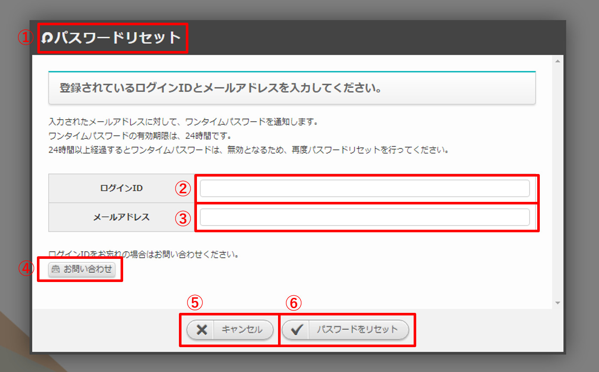

   図 2.1-4 画面構成

パスワードリセット画面の各構成要素と、その機能は次の表のとおりです。

.. csv-table:: 表 2.1-4 機能説明
   :header: No., 構成要素, 説明
   :widths: 5, 20, 60

   1, 作業画面名, 現在表示している作業画面の名称です。
   2, ログインID,ログインIDを入力できます。
   3, メールアドレス,メールアドレスを入力できます。
   4, お問い合わせボタン,メールによるお問い合わせをすることができます。
   5, キャンセルボタン,パスワードリセットをキャンセルし、ログイン画面に戻ります。
   6, パスワードをリセットボタン,パスワードをリセットします。

.. note::

    　AD連携時は、初期パスワード変更画面、パスワード有効期限切れ画面、パスワードリセット画面が表示されません。

2.2 ログイン画面の操作方法
==========================

構成要素に対する操作方法を説明します。

(1)ログイン画面
---------------
| ログインすることができます。

入力欄
^^^^^^
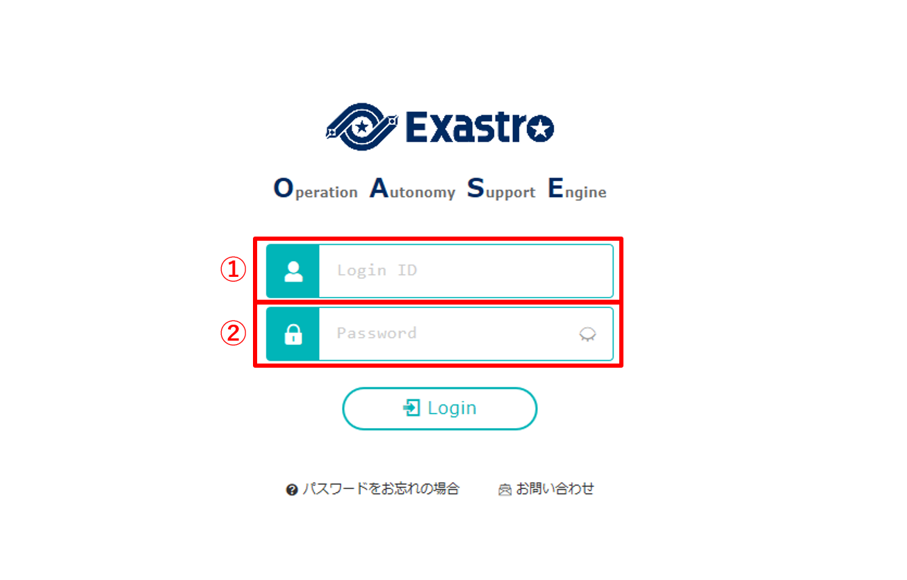

   図 2.2-1-1 ログイン画面の各項目

.. csv-table:: 表 2.2-1-1 機能説明
   :header: No., 構成要素, 説明
   :widths: 5, 20, 60

   1, ログインID,入力必須項目です。
   2, パスワード,入力必須項目です。

ログイン
^^^^^^^^
* ログインIDとパスワードを入力し、Loginボタンを押下するとログインしDashBoadに移ります。

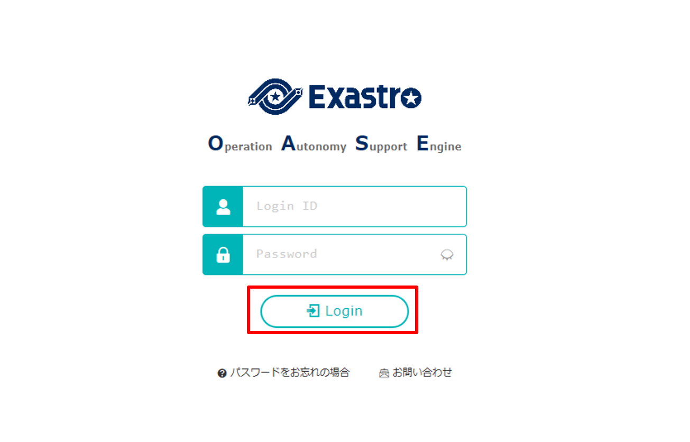

   図 2.2-1-2 Loginボタン

(2)初期パスワード変更画面
-------------------------
| 初期パスワードを変更できます。

入力欄
^^^^^^
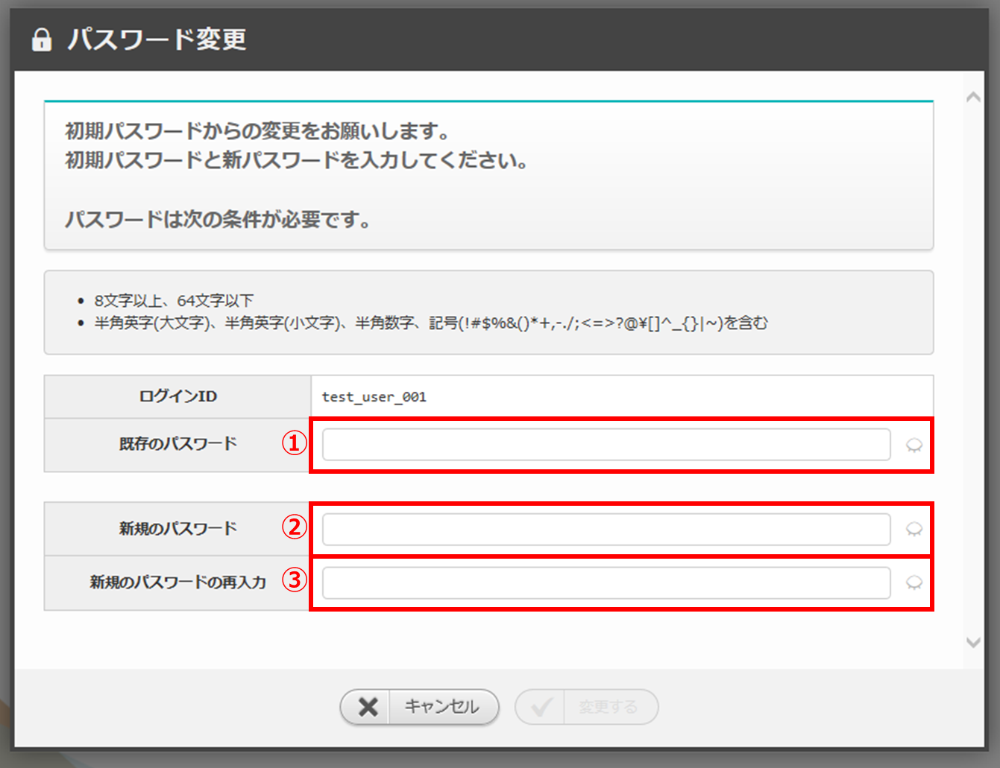

   図 2.2-2-1 初期パスワード変更画面の各項目

.. csv-table:: 表 2.2-2-1 機能説明
   :header: No., 構成要素, 説明
   :widths: 5, 20, 60

   1, 既存のパスワード,入力必須項目です。
   2, 新規のパスワード,"入力必須項目です。8文字以上、64文字以下で入力して下さい。ただし、半角英字(大文字)、半角英字(小文字)、半角数字、記号(!#$%&()*+,-./;<=>?@\[]^_{}|~)をそれぞれ1文字以上含めて下さい。"
   3, 新規のパスワードの再入力,入力必須項目です。

変更する
^^^^^^^^
* 変更するボタンを押下すると確認メッセージが表示されます。
* 「パスワードを変更します。よろしいですか？」とメッセージが表示され、「OK」を選択すると「変更されました。」というメッセージが表示された後、ログイン画面に移ります。

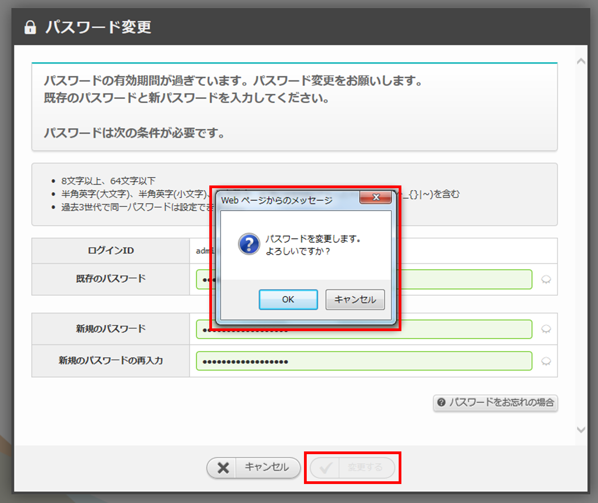

   図 2.2-2-2 変更してよいか確認するメッセージが表示される

(3)パスワード有効期限切れ画面
-----------------------------
| パスワードの有効期限が切れた場合パスワードの変更を促す画面が表示されます。

入力欄
^^^^^^
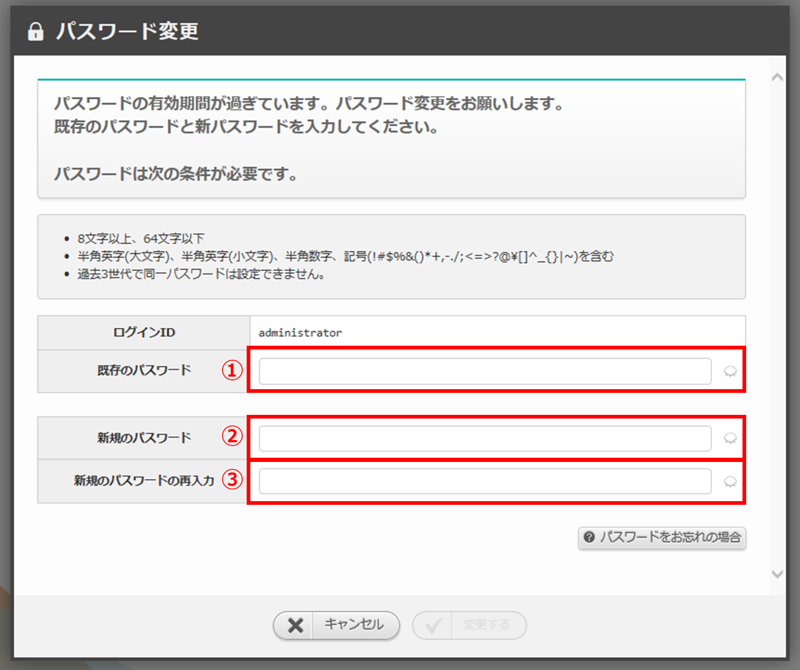

   図 2.2-3-1 パスワード有効期限切れ画面の各項目

.. csv-table:: 表 2.2-3-1 機能説明
   :header: No., 構成要素, 説明
   :widths: 5, 20, 60

   1, 既存のパスワード,入力必須項目です。
   2, 新規のパスワード,"入力必須項目です。8文字以上、64文字以下で入力して下さい。ただし、半角英字(大文字)、半角英字(小文字)、半角数字、記号(!#$%&()*+,-./;<=>?@\[]^_{}|~)をそれぞれ1文字以上含めて下さい。過去3世代で同一パスワードは設定できません。(世代数はシステム設定により異ります)"
   3, 新規のパスワードの再入力,入力必須項目です。

変更する
^^^^^^^^
* 変更するボタンを押下すると確認メッセージが表示されます。
* 「パスワードを変更します。よろしいですか？」とメッセージが表示され、「OK」を選択すると「変更されました。」というメッセージが表示された後、ログイン画面に移ります。

   図 2.2-3-2 変更してよいか確認するメッセージが表示される

パスワードをお忘れの場合
^^^^^^^^^^^^^^^^^^^^^^^^
* フォームに入力がある場合、パスワードをお忘れの場合ボタンを押下すると「変更を破棄してパスワードリセットへ移動しますがよろしいですか？」と確認するメッセージが表示されます。
* 「OK」ボタンを選択するとパスワードリセット画面に移ります。

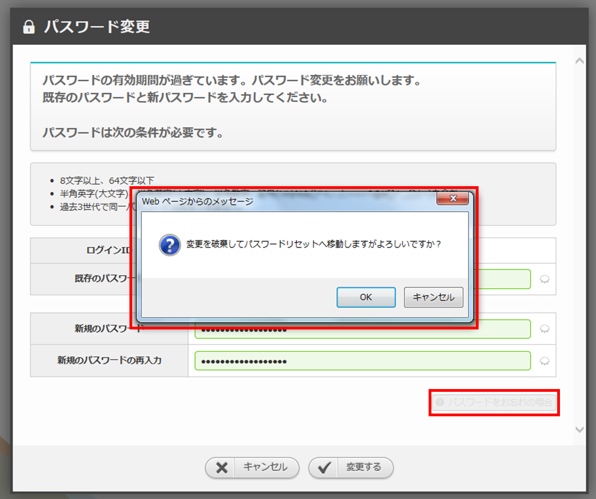

   図 2.2-3-3 破棄してよいか確認するメッセージが表示される

(4)パスワードリセット画面
-------------------------
| パスワードをリセットできます。

入力欄
^^^^^^
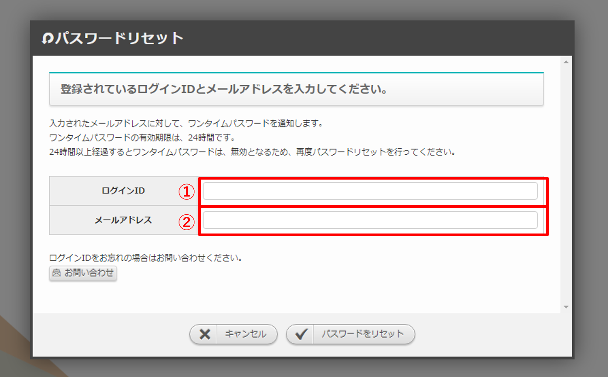

   図 2.2-4-1 パスワードリセット画面の各項目

.. csv-table:: 表 2.2-4-1 機能説明
   :header: No., 構成要素, 説明
   :widths: 5, 20, 60

   1, ログインID,入力必須項目です。
   2, メールアドレス,入力必須項目です。

キャンセル
^^^^^^^^^^

* フォームに入力がある場合、キャンセルボタンを押下すると「パスワードリセットを中断しますがよろしいですか？」と確認するメッセージが表示されます。
* 「OK」を選択すると、ログイン画面に戻ります。

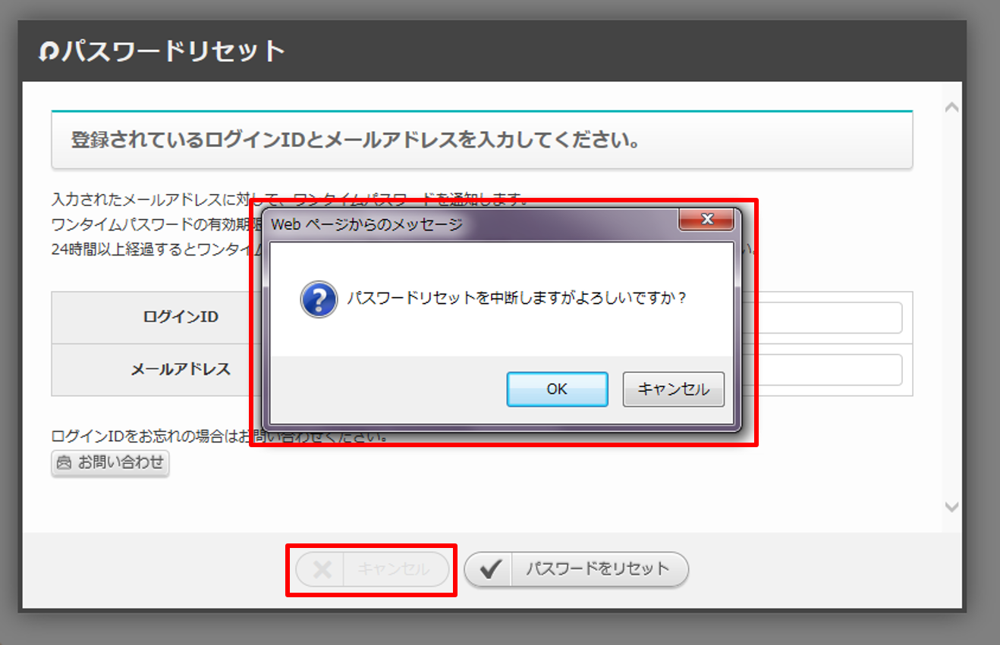

   図 2.2-4-2 キャンセルボタン

パスワードをリセット
^^^^^^^^^^^^^^^^^^^^

* パスワードをリセットボタンを押下すると確認メッセージが表示されます。
* 「パスワードをリセットします。よろしいですか？」とメッセージが表示され、「OK」を選択すると「パスワードがリセットされました。」というメッセージが表示された後、ログイン画面に移ります。
* ワンタイムパスワードの有効期限はシステム設定により異なります。

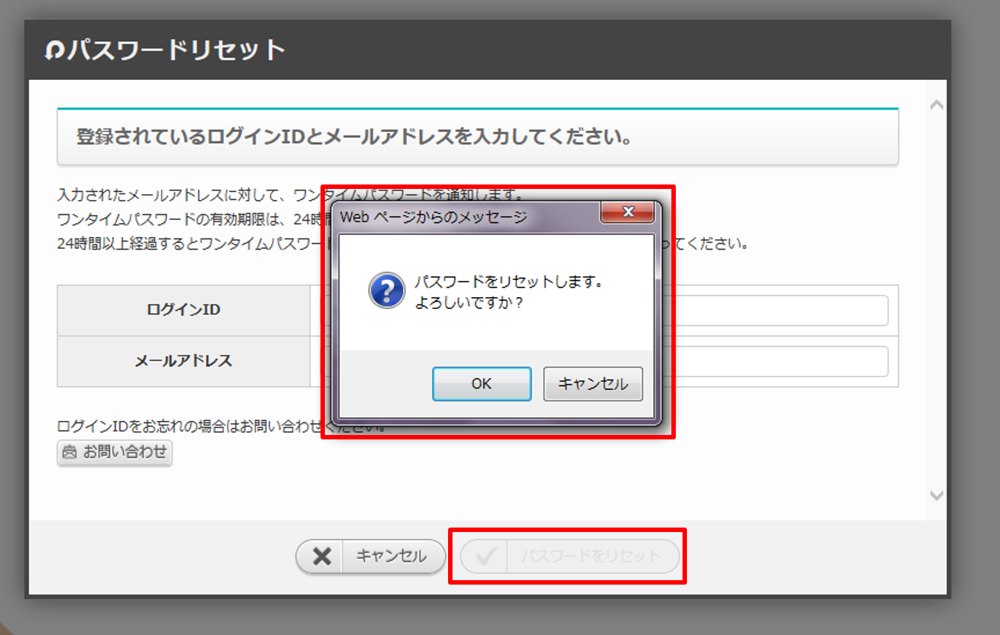

   図 2.2-4-3 パスワードをリセットボタン

