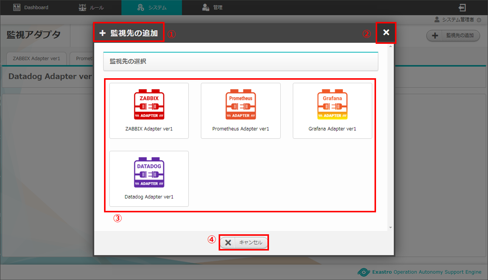
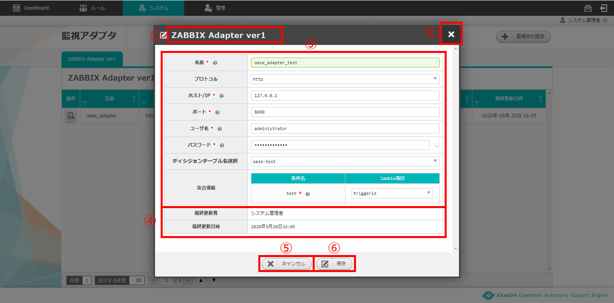

==================================================
2 OASE 監視アダプタ画面のメニュー 、画面構成
==================================================

本章では、OASE 監視アダプタ画面の画面構成と、各構成要素について説明します。

2.1 基本画面構成
================

アダプタがインストールされていない場合は以下のように表示されます。

.. figure:: ../images/monitoring_adapter/monitoring_adapter_01.png
   :scale: 100%
   :align: center

   図 2.1-1 画面構成

監視先が1件も登録されていない場合は以下のように表示されます。

.. figure:: ../images/monitoring_adapter/monitoring_adapter_02.png
   :scale: 100%
   :align: center

   図 2.1-2 画面構成

監視先の追加画面の画面構成は次のとおりです。

   
   図 2.1-3 画面構成

監視先の追加画面の各構成要素と、その機能は次の表のとおりです。

.. csv-table:: 表 2.1-3 機能説明
   :header: No., 構成要素, 説明
   :widths: 5, 20, 60

   1, 作業画面名, 現在表示している作業画面の名称です。
   2, 閉じるボタン,監視先の追加画面を閉じて監視アダプタ画面に戻ります。
   3, 監視先,インストール済のアダプタが表示されます。
   4, キャンセルボタン,監視先の追加画面を閉じて監視アダプタ画面に戻ります。

Zabbixアダプタ新規追加画面の画面構成は次のとおりです。

.. _screen_monitoring_adapter_Zabbix_new:

.. figure:: ../images/monitoring_adapter/monitoring_adapter_04.png
   :scale: 100%
   :align: center

   図 2.1-4 画面構成

Zabbixアダプタ新規追加画面の各構成要素と、その機能は次の表のとおりです。

.. csv-table:: 表 2.1-4 機能説明
   :header: No., 構成要素, 説明
   :widths: 5, 20, 60

   1, 作業画面名, 現在表示している作業画面の名称です。
   2, 閉じるボタン,新規追加画面を閉じてアクション設定画面に戻ります。
   3, 名前,任意の監視先名を入力できます。
   4, プロトコル,「http」または「https」を選択できます。
   5, ホスト/IP,通信に用いるホスト名およびIPアドレスを入力できます。
   6, ポート,通信に用いるポート番号を入力できます。
   7, ユーザ名,認証に必要なユーザ名を入力できます。
   8, パスワード,認証に必要なパスワードを入力することができます。
   9, ルール種別選択,ルール種別を選択します。
   10, 突合情報,ディシジョンテーブルの条件名とZabbix項目の紐づけを行います。
   11, キャンセルボタン,新規追加画面を閉じて監視アダプタ画面に戻ります。
   12, 戻るボタン,新規追加画面を閉じて監視先の追加画面に戻ります。
   13, 保存ボタン,入力した監視先情報を保存して監視アダプタ画面に戻ります。

Zabbixアダプタタブの画面構成は次のとおりです。

.. figure:: ../images/monitoring_adapter/monitoring_adapter_05.png
   :scale: 100%
   :align: center

   図 2.1-5 画面構成

Zabbixアダプタタブの各構成要素と、その機能は次の表のとおりです。

.. csv-table:: 表 2.1-5 機能説明
   :header: No., 構成要素, 説明
   :widths: 5, 20, 60

   1, Zabbixアダプタタブ,現在表示しているアダプタの名称とそのバージョンです。 バージョンごとにタブが追加されます。
   2, アダプタ名,現在表示している作業画面の名称です。
   3, 一覧,ZABBIXアダプタに設定した情報が表示されます。

Zabbixアダプタ操作画面の画面構成は次のとおりです。

   図 2.1-6 画面構成

Zabbixアダプタ操作画面の各構成要素と、その機能は次の表のとおりです。

.. csv-table:: 表 2.1-6 機能説明
   :header: No., 構成要素, 説明
   :widths: 5, 20, 60

   1, 作業画面名,現在表示している作業画面の名称です。
   2, 閉じるボタン,操作画面を閉じて監視アダプタ画面に戻ります。
   3, 一覧,監視アダプタに設定した情報が表示されます。
   4, キャンセルボタン,操作画面を閉じて監視アダプタ画面に戻ります。
   5, 編集ボタン,監視アダプタに設定した情報を編集することができます。
   6, 削除ボタン,監視アダプタに設定した情報を削除することができます。

Zabbixアダプタ編集画面の画面構成は次のとおりです。

   図 2.1-7 画面構成

Zabbixアダプタ編集画面の各構成要素と、その機能は次の表のとおりです。

.. csv-table:: 表 2.1-7 機能説明
   :header: No., 構成要素, 説明
   :widths: 5, 20, 60

   1, 作業画面名,現在表示している作業画面の名称です。
   2, 閉じるボタン,操作画面を閉じて監視アダプタ画面に戻ります。
   3, 入力欄,Zabbixアダプタに設定した情報が表示されます。詳細は前述の「Zabbixアダプタ新規追加画面」 :ref:`screen_monitoring_adapter_Zabbix_new` を参照ください。
   4, 自動更新欄,最終更新者および最終更新日時が自動で反映されます。
   5, キャンセルボタン,操作画面を閉じて監視アダプタ画面に戻ります。
   6, 保存ボタン,入力した監視先情報を保存して監視アダプタ画面に戻ります。

