==================================================
2 OASE 監視アダプタ画面のメニュー 、画面構成
==================================================

本章では、OASE 監視アダプタ画面の画面構成と、各構成要素について説明します。

2.1 基本画面構成
================

アダプタがインストールされていない場合は以下のように表示されます。

   図 2.1-1 画面構成

監視先が1件も登録されていない場合は以下のように表示されます。

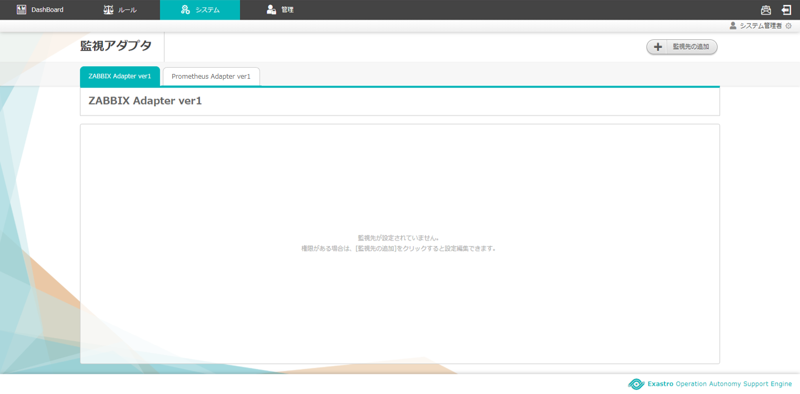

   図 2.1-2 画面構成

監視先の追加画面の画面構成は次のとおりです。

.. figure:: ../images/monitoring_adapter/monitoring_adapter_03.png
   :scale: 100%
   :align: center
   
   図 2.1-3 画面構成

監視先の追加画面の各構成要素と、その機能は次の表のとおりです。

.. csv-table:: 表 2.1-3 機能説明
   :header: No., 構成要素, 説明
   :widths: 5, 20, 60

   1, 作業画面名, 現在表示している作業画面の名称です。
   2, 閉じるボタン,監視先の追加画面を閉じて監視アダプタ画面に戻ります。
   3, 監視先,インストール済のアダプタが表示されます。
   4, キャンセルボタン,監視先の追加画面を閉じて監視アダプタ画面に戻ります。

Zabbixアダプタ新規追加画面の画面構成は次のとおりです。

.. _screen_monitoring_adapter_Zabbix_new:

   図 2.1-4 画面構成

Zabbixアダプタ新規追加画面の各構成要素と、その機能は次の表のとおりです。

.. csv-table:: 表 2.1-4 機能説明
   :header: No., 構成要素, 説明
   :widths: 5, 20, 60

   1, 作業画面名, 現在表示している作業画面の名称です。
   2, 閉じるボタン,新規追加画面を閉じて監視アダプタ画面に戻ります。
   3, 名前,任意の監視先名を入力できます。
   4, プロトコル,「http」または「https」を選択できます。
   5, ホスト/IP,通信に用いるホスト名およびIPアドレスを入力できます。
   6, ポート,通信に用いるポート番号を入力できます。
   7, ユーザ名,認証に必要なユーザ名を入力できます。
   8, パスワード,認証に必要なパスワードを入力することができます。
   9, ディシジョンテーブル名選択,ディシジョンテーブル名を選択します。
   10, 突合情報,ディシジョンテーブルの条件名とZabbix項目の紐づけを行います。
   11, キャンセルボタン,新規追加画面を閉じて監視アダプタ画面に戻ります。
   12, 戻るボタン,新規追加画面を閉じて監視先の追加画面に戻ります。
   13, 保存ボタン,入力した監視先情報を保存して監視アダプタ画面に戻ります。

Zabbixアダプタタブの画面構成は次のとおりです。

.. figure:: ../images/monitoring_adapter/monitoring_adapter_05.png
   :scale: 100%
   :align: center

   図 2.1-5 画面構成

Zabbixアダプタタブの各構成要素と、その機能は次の表のとおりです。

.. csv-table:: 表 2.1-5 機能説明
   :header: No., 構成要素, 説明
   :widths: 5, 20, 60

   1, Zabbixアダプタタブ,現在表示しているアダプタの名称とそのバージョンです。 バージョンごとにタブが追加されます。
   2, アダプタ名,現在表示している作業画面の名称です。
   3, 一覧,Zabbixアダプタに設定した情報が表示されます。

Zabbixアダプタ操作画面の画面構成は次のとおりです。

.. figure:: ../images/monitoring_adapter/monitoring_adapter_06.png
   :scale: 100%
   :align: center

   図 2.1-6 画面構成

Zabbixアダプタ操作画面の各構成要素と、その機能は次の表のとおりです。

.. csv-table:: 表 2.1-6 機能説明
   :header: No., 構成要素, 説明
   :widths: 5, 20, 60

   1, 作業画面名,現在表示している作業画面の名称です。
   2, 閉じるボタン,操作画面を閉じて監視アダプタ画面に戻ります。
   3, 一覧,監視アダプタに設定した情報が表示されます。
   4, キャンセルボタン,操作画面を閉じて監視アダプタ画面に戻ります。
   5, 編集ボタン,監視アダプタに設定した情報を編集することができます。
   6, 削除ボタン,監視アダプタに設定した情報を削除することができます。

Zabbixアダプタ編集画面の画面構成は次のとおりです。

.. figure:: ../images/monitoring_adapter/monitoring_adapter_07.png
   :scale: 100%
   :align: center

   図 2.1-7 画面構成

Zabbixアダプタ編集画面の各構成要素と、その機能は次の表のとおりです。

.. csv-table:: 表 2.1-7 機能説明
   :header: No., 構成要素, 説明
   :widths: 5, 20, 60

   1, 作業画面名,現在表示している作業画面の名称です。
   2, 閉じるボタン,操作画面を閉じて監視アダプタ画面に戻ります。
   3, 入力欄,Zabbixアダプタに設定した情報が表示されます。詳細は前述の「Zabbixアダプタ新規追加画面」 :ref:`screen_monitoring_adapter_Zabbix_new` を参照ください。
   4, 自動更新欄,最終更新者および最終更新日時が自動で反映されます。
   5, キャンセルボタン,操作画面を閉じて監視アダプタ画面に戻ります。
   6, 保存ボタン,入力した監視先情報を保存して監視アダプタ画面に戻ります。

Prometheusアダプタ新規追加画面の画面構成は次のとおりです。

.. _screen_monitoring_adapter_Prometheus_new:

.. figure:: ../images/monitoring_adapter/monitoring_adapter_14.png
   :scale: 100%
   :align: center

   図 2.1-8 画面構成

Prometheusアダプタ新規追加画面の各構成要素と、その機能は次の表のとおりです。

.. csv-table:: 表 2.1-8 機能説明
   :header: No., 構成要素, 説明
   :widths: 5, 20, 60

   1, 作業画面名, 現在表示している作業画面の名称です。
   2, 閉じるボタン, 新規追加画面を閉じて監視アダプタ画面に戻ります。
   3, 名前, 任意の監視先名を入力できます。
   4, URI, PrometheusのHTTPエンドポイントを入力できます。
   5, ディシジョンテーブル名選択, ディシジョンテーブル名を選択します。
   6, 突合情報, ディシジョンテーブルの条件名と取得する項目の紐づけを行います。
   7, キャンセルボタン, 新規追加画面を閉じて監視アダプタ画面に戻ります。
   8, 戻るボタン, 新規追加画面を閉じて監視先の追加画面に戻ります。
   9, 保存ボタン, 入力した監視先情報を保存して監視アダプタ画面に戻ります。

Prometheusアダプタタブの画面構成は次のとおりです。

.. figure:: ../images/monitoring_adapter/monitoring_adapter_15.png
   :scale: 100%
   :align: center

   図 2.1-9 画面構成

Prometheusアダプタタブの各構成要素と、その機能は次の表のとおりです。

.. csv-table:: 表 2.1-9 機能説明
   :header: No., 構成要素, 説明
   :widths: 5, 20, 60

   1, Prometheusアダプタタブ,現在表示しているアダプタの名称とそのバージョンです。 バージョンごとにタブが追加されます。
   2, アダプタ名,現在表示している作業画面の名称です。
   3, 一覧,Prometheusアダプタに設定した情報が表示されます。

Prometheusアダプタ操作画面の画面構成は次のとおりです。

.. figure:: ../images/monitoring_adapter/monitoring_adapter_16.png
   :scale: 100%
   :align: center

   図 2.1-10 画面構成

Prometheusアダプタ操作画面の各構成要素と、その機能は次の表のとおりです。

.. csv-table:: 表 2.1-10 機能説明
   :header: No., 構成要素, 説明
   :widths: 5, 20, 60

   1, 作業画面名,現在表示している作業画面の名称です。
   2, 閉じるボタン,操作画面を閉じて監視アダプタ画面に戻ります。
   3, 一覧,監視アダプタに設定した情報が表示されます。
   4, キャンセルボタン,操作画面を閉じて監視アダプタ画面に戻ります。
   5, 編集ボタン,監視アダプタに設定した情報を編集することができます。
   6, 削除ボタン,監視アダプタに設定した情報を削除することができます。

Prometheusアダプタ編集画面の画面構成は次のとおりです。

.. figure:: ../images/monitoring_adapter/monitoring_adapter_17.png
   :scale: 100%
   :align: center

   図 2.1-11 画面構成

Prometheusアダプタ編集画面の各構成要素と、その機能は次の表のとおりです。

.. csv-table:: 表 2.1-11 機能説明
   :header: No., 構成要素, 説明
   :widths: 5, 20, 60

   1, 作業画面名,現在表示している作業画面の名称です。
   2, 閉じるボタン,操作画面を閉じて監視アダプタ画面に戻ります。
   3, 入力欄,Prometheusアダプタに設定した情報が表示されます。詳細は前述の「Prometheusアダプタ新規追加画面」 :ref:`screen_monitoring_adapter_Prometheus_new` を参照ください。
   4, 自動更新欄,最終更新者および最終更新日時が自動で反映されます。
   5, キャンセルボタン,操作画面を閉じて監視アダプタ画面に戻ります。
   6, 保存ボタン,入力した監視先情報を保存して監視アダプタ画面に戻ります。

Grafanaアダプタ新規追加画面の画面構成は次のとおりです。

.. _screen_monitoring_adapter_Grafana_new:

.. figure:: ../images/monitoring_adapter/monitoring_adapter_23.png
   :scale: 100%
   :align: center

   図 2.1-12 画面構成

Grafanaアダプタ新規追加画面の各構成要素と、その機能は次の表のとおりです。

.. csv-table:: 表 2.1-12 機能説明
   :header: No., 構成要素, 説明
   :widths: 5, 20, 60

   1, 作業画面名, 現在表示している作業画面の名称です。
   2, 閉じるボタン,新規追加画面を閉じて監視アダプタ画面に戻ります。
   3, 名前,任意の監視先名を入力できます。
   4, URI,GrafanaのHTTPエンドポイントを入力できます。
   5, ユーザ名,認証に必要なユーザ名を入力できます。
   6, パスワード,認証に必要なパスワードを入力することができます。
   7, ディシジョンテーブル名選択,ディシジョンテーブル名を選択します。
   8, 突合情報,ディシジョンテーブルの条件名とURIで取得する項目の紐づけを行います。
   9, キャンセルボタン,新規追加画面を閉じて監視アダプタ画面に戻ります。
   10, 戻るボタン,新規追加画面を閉じて監視先の追加画面に戻ります。
   11, 保存ボタン,入力した監視先情報を保存して監視アダプタ画面に戻ります。

Grafanaアダプタタブの画面構成は次のとおりです。

.. figure:: ../images/monitoring_adapter/monitoring_adapter_24.png
   :scale: 100%
   :align: center

   図 2.1-13 画面構成

Grafanaアダプタタブの各構成要素と、その機能は次の表のとおりです。

.. csv-table:: 表 2.1-13 機能説明
   :header: No., 構成要素, 説明
   :widths: 5, 20, 60

   1, Grafanaアダプタタブ,現在表示しているアダプタの名称とそのバージョンです。 バージョンごとにタブが追加されます。
   2, アダプタ名,現在表示している作業画面の名称です。
   3, 一覧,Grafanaアダプタに設定した情報が表示されます。

Grafanaアダプタ操作画面の画面構成は次のとおりです。

.. figure:: ../images/monitoring_adapter/monitoring_adapter_25.png
   :scale: 100%
   :align: center

   図 2.1-14 画面構成

Grafanaアダプタ操作画面の各構成要素と、その機能は次の表のとおりです。

.. csv-table:: 表 2.1-14 機能説明
   :header: No., 構成要素, 説明
   :widths: 5, 20, 60

   1, 作業画面名,現在表示している作業画面の名称です。
   2, 閉じるボタン,操作画面を閉じて監視アダプタ画面に戻ります。
   3, 一覧,監視アダプタに設定した情報が表示されます。
   4, キャンセルボタン,操作画面を閉じて監視アダプタ画面に戻ります。
   5, 編集ボタン,監視アダプタに設定した情報を編集することができます。
   6, 削除ボタン,監視アダプタに設定した情報を削除することができます。

Grafanaアダプタ編集画面の画面構成は次のとおりです。

.. figure:: ../images/monitoring_adapter/monitoring_adapter_26.png
   :scale: 100%
   :align: center

   図 2.1-15 画面構成

Grafanaアダプタ編集画面の各構成要素と、その機能は次の表のとおりです。

.. csv-table:: 表 2.1-15 機能説明
   :header: No., 構成要素, 説明
   :widths: 5, 20, 60

   1, 作業画面名,現在表示している作業画面の名称です。
   2, 閉じるボタン,操作画面を閉じて監視アダプタ画面に戻ります。
   3, 入力欄,Grafanaアダプタに設定した情報が表示されます。詳細は前述の「Grafanaアダプタ新規追加画面」 :ref:`screen_monitoring_adapter_Grafana_new` を参照ください。
   4, 自動更新欄,最終更新者および最終更新日時が自動で反映されます。
   5, キャンセルボタン,操作画面を閉じて監視アダプタ画面に戻ります。
   6, 保存ボタン,入力した監視先情報を保存して監視アダプタ画面に戻ります。

Datadogアダプタ新規追加画面の画面構成は次のとおりです。

.. _screen_monitoring_adapter_Datadog_new:

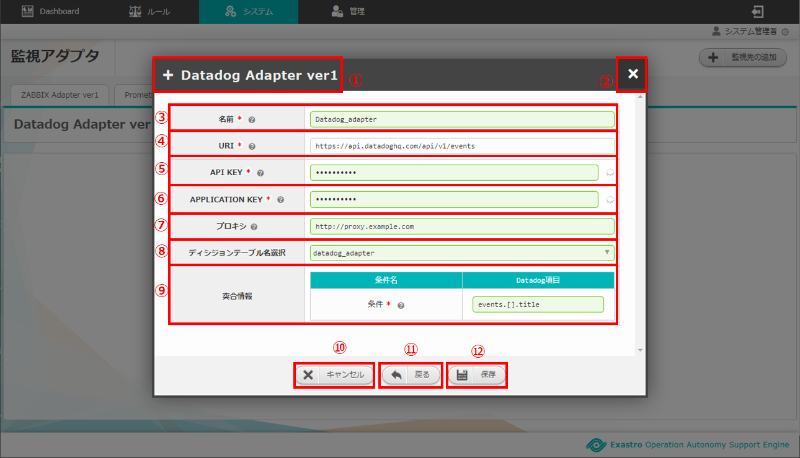

   図 2.1-16 画面構成

Datadogアダプタ新規追加画面の各構成要素と、その機能は次の表のとおりです。

.. csv-table:: 表 2.1-16 機能説明
   :header: No., 構成要素, 説明
   :widths: 5, 20, 60

   1, 作業画面名, 現在表示している作業画面の名称です。
   2, 閉じるボタン,新規追加画面を閉じて監視アダプタ画面に戻ります。
   3, 名前,任意の監視先名を入力できます。
   4, URI,DatadogのHTTPエンドポイントを入力できます。
   5, API KEY,認証に必要なAPI KEYを入力できます。
   6, APPLICATION KEY,認証に必要なAPPLICATION KEYを入力することができます。
   7, プロキシ, 通信に用いるプロキシを入力できます。
   8, ディシジョンテーブル名選択,ディシジョンテーブル名を選択します。
   9, 突合情報,ディシジョンテーブルの条件名とURIで取得する項目の紐づけを行います。
   10, キャンセルボタン,新規追加画面を閉じて監視アダプタ画面に戻ります。
   11, 戻るボタン,新規追加画面を閉じて監視先の追加画面に戻ります。
   12, 保存ボタン,入力した監視先情報を保存して監視アダプタ画面に戻ります。

Datadogアダプタタブの画面構成は次のとおりです。

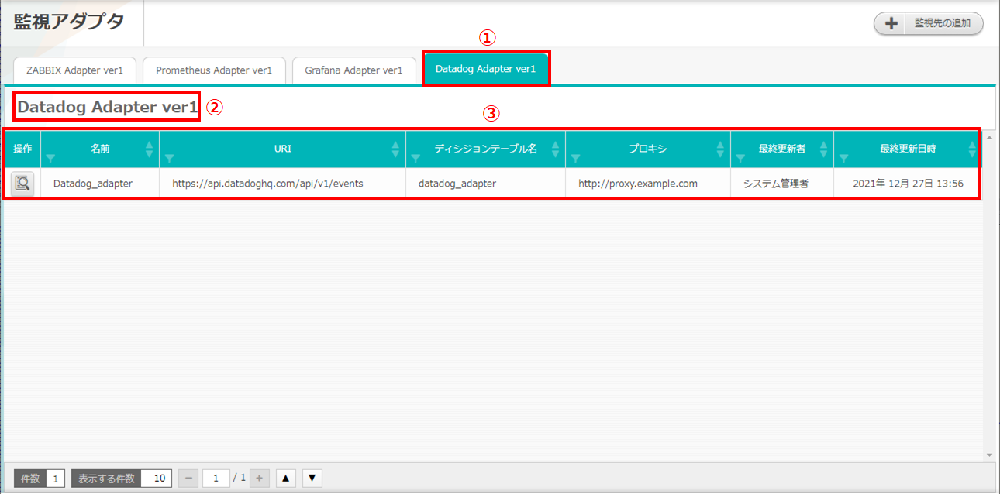

   図 2.1-17 画面構成

Datadogアダプタタブの各構成要素と、その機能は次の表のとおりです。

.. csv-table:: 表 2.1-17 機能説明
   :header: No., 構成要素, 説明
   :widths: 5, 20, 60

   1, Datadogアダプタタブ,現在表示しているアダプタの名称とそのバージョンです。 バージョンごとにタブが追加されます。
   2, アダプタ名,現在表示している作業画面の名称です。
   3, 一覧,Datadogアダプタに設定した情報が表示されます。

Datadogアダプタ操作画面の画面構成は次のとおりです。

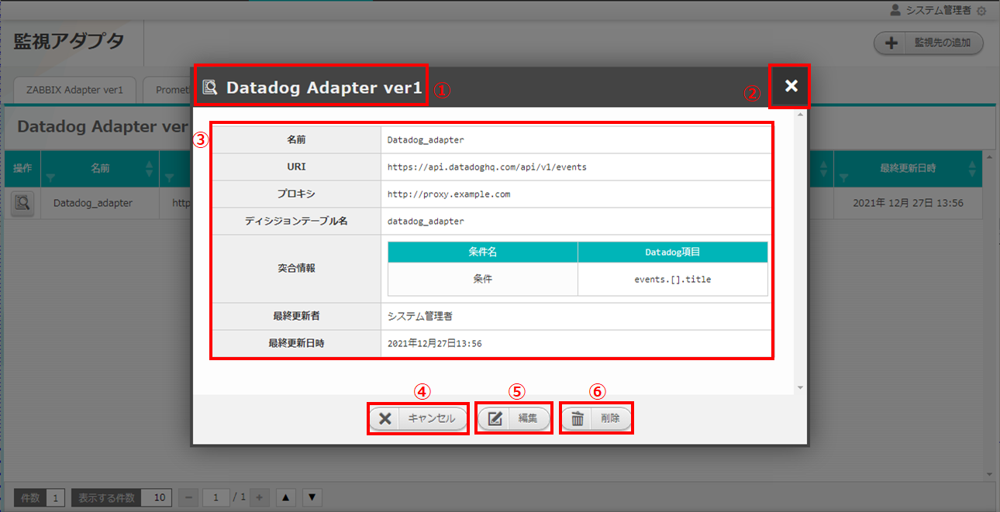

   図 2.1-18 画面構成

Datadogアダプタ操作画面の各構成要素と、その機能は次の表のとおりです。

.. csv-table:: 表 2.1-18 機能説明
   :header: No., 構成要素, 説明
   :widths: 5, 20, 60

   1, 作業画面名,現在表示している作業画面の名称です。
   2, 閉じるボタン,操作画面を閉じて監視アダプタ画面に戻ります。
   3, 一覧,監視アダプタに設定した情報が表示されます。
   4, キャンセルボタン,操作画面を閉じて監視アダプタ画面に戻ります。
   5, 編集ボタン,監視アダプタに設定した情報を編集することができます。
   6, 削除ボタン,監視アダプタに設定した情報を削除することができます。

Datadogアダプタ編集画面の画面構成は次のとおりです。

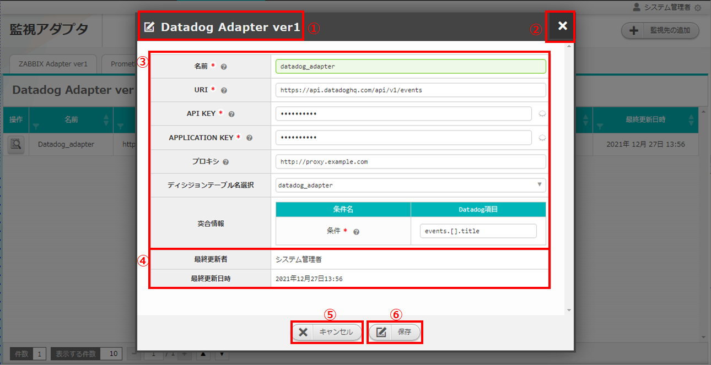

   図 2.1-19 画面構成

Datadogアダプタ編集画面の各構成要素と、その機能は次の表のとおりです。

.. csv-table:: 表 2.1-19 機能説明
   :header: No., 構成要素, 説明
   :widths: 5, 20, 60

   1, 作業画面名,現在表示している作業画面の名称です。
   2, 閉じるボタン,操作画面を閉じて監視アダプタ画面に戻ります。
   3, 入力欄,Datadogアダプタに設定した情報が表示されます。詳細は前述の「Datadogアダプタ新規追加画面」 :ref:`screen_monitoring_adapter_Datadog_new` を参照ください。
   4, 自動更新欄,最終更新者および最終更新日時が自動で反映されます。
   5, キャンセルボタン,操作画面を閉じて監視アダプタ画面に戻ります。
   6, 保存ボタン,入力した監視先情報を保存して監視アダプタ画面に戻ります。

2.2 監視アダプタ画面の操作方法
==================================

構成要素に対する操作方法を説明します。

(1)監視アダプタ画面
----------------------
| 登録されている監視先を一覧で表示します。
| 監視先の追加ボタンについては各権限ごとに異なります。ここでは共通機能について説明します。

「操作」ボタン
^^^^^^^^^^^^^^

.. figure:: ../images/monitoring_adapter/monitoring_adapter_18.png
   :scale: 100%
   :align: center

   図 2.2-1-1 監視先アダプタの画面

.. note::
   監視アダプタ画面のアクセス権限が「更新可能」以外の場合「編集する」ボタンおよび「削除する」ボタンは表示されません。

.. note::
   アダプタごとに異なる項目については後述を参照してください。

(2)監視先の追加画面
-------------------
* アダプタごとに監視先を設定します。
* 監視先の接続情報を新規に追加することができます。
* 監視アダプタ画面のアクセス権限が「更新可能」の場合のみ、「監視先の追加」画面を表示することができます。

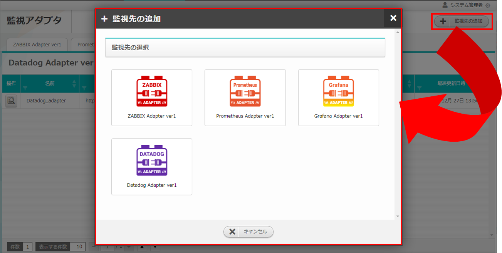

   図 2.2-2-1 監視先追加の画面

(3)Zabbixアダプタ
-----------------

新規追加画面
^^^^^^^^^^^^
Zabbixアダプタの監視先を新規で追加します。

.. _monitoring_adapter_Zabbix_new:

.. figure:: ../images/monitoring_adapter/monitoring_adapter_09.png
   :scale: 100%
   :align: center

   図 2.2-3-1 新規追加画面に表示されてる項目

.. csv-table:: 表 2.2-3-1 機能説明
   :header: No., 構成要素, 説明
   :widths: 5, 20, 60

   1, 閉じるボタン,新規追加画面を閉じて監視アダプタ画面に戻ります。
   2, 名前,入力必須項目です。OASEで管理する名前を設定してください。64文字以内で入力して下さい。
   3, プロトコル,接続先に合わせてプルダウンメニューから「http」および「https」を選択してください。
   4, ホスト/IP,入力必須項目です。ホスト名もしくはIPアドレスを入力して下さい。128文字以内で入力して下さい。
   5, ポート,入力必須項目です。ポート番号（0～65535）を設定してください。
   6, ユーザ名,入力必須項目です。認証可能ユーザを設定してください。64文字以内で入力して下さい。
   7, パスワード, 入力必須項目です。認証可能パスワードを設定してください。64文字以内で入力して下さい。
   8, ディシジョンテーブル名選択, テストリクエストの実施対象となるディシジョンテーブル名をプルダウンメニューから選択します。
   9, 条件名, 選択したディシジョンテーブル名の条件名が表示します。
   10, Zabbix項目, Zabbix項目を選択します。
   11, キャンセルボタン,新規追加画面を閉じて監視アダプタ画面に戻ります。
   12, 戻るボタン,新規追加画面を閉じて監視アダプタ画面に戻ります。
   13, 保存ボタン,入力した監視先情報を保存して監視アダプタ画面に戻ります。

一覧
^^^^
Zabbixアダプタの監視先が一覧で表示されます。

.. _monitoring_adapter_Zabbix_disp:

   図 2.2-3-2 一覧に表示される項目

.. csv-table:: 表 2.2-3-2 機能説明
   :header: No., 構成要素, 説明
   :widths: 5, 20, 60

   1, 名前,監視先名が表示されます。
   2, プロトコル,通信に用いるプロトコルが表示されます。
   3, ホスト/IP,通信に用いるホスト名およびIPアドレスが表示されます。
   4, ポート,通信に用いるポート番号が表示されます。
   5, ユーザ名,認証に必要なユーザ名が表示されます。
   6, ディシジョンテーブル名,設定しているディシジョンテーブル名が表示されます。
   7, 最終更新者,監視先の名前、プロトコル、ホスト/IP、ポート、ユーザ名およびパスワードを更新したユーザの名前が表示されます。
   8, 最終実行日時,監視先の名前、プロトコル、ホスト/IP、ポート、ユーザ名およびパスワードを更新した日時が表示されます。

操作ボタン
^^^^^^^^^^

.. figure:: ../images/monitoring_adapter/monitoring_adapter_11.png
   :scale: 100%
   :align: center

   図 2.2-3-3 「oase_adapter」の操作ボタン遷移

詳細画面
^^^^^^^^

* 一覧にある「操作」列のボタンを押下すると、監視先の詳細が表示されます。

.. figure:: ../images/monitoring_adapter/monitoring_adapter_12.png
   :scale: 100%
   :align: center

   図 2.2-3-4 「oase_adapter」の詳細画面

編集画面
^^^^^^^^

| Zabbixアダプタの既存監視先を編集により更新します。
| 編集画面の画面構成は新規追加画面と同様です。
| 詳細は前述の「監視アダプタ画面のZabbixアダプタ新規追加画面」 :ref:`monitoring_adapter_Zabbix_new` および、「監視アダプタ画面のZabbixアダプタ一覧画面」 :ref:`monitoring_adapter_Zabbix_disp` をご参照ください。

   図 2.2-3-5 「oase_adapter」の編集画面

(4)Prometheusアダプタ
---------------------

.. danger:: 注意

 | PrometheusをそのままでPrometheusアダプタを利用しますと、OASEが取得するリクエストが膨大になります。
 | Prometheus側で異常値を示すメトリクスのみアラートを上げるように設定をお願いします。

新規追加画面
^^^^^^^^^^^^
Prometheusアダプタの監視先を新規で追加します。

.. _monitoring_adapter_Prometheus_new:

.. figure:: ../images/monitoring_adapter/monitoring_adapter_19.png
   :scale: 100%
   :align: center

   図 2.2-4-1 新規追加画面に表示されている項目

.. csv-table:: 表 2.2-4-1 機能説明
   :header: No., 構成要素, 説明
   :widths: 5, 20, 60

   1, 閉じるボタン, 新規追加画面を閉じて監視アダプタ画面に戻ります。
   2, 名前, 入力必須項目です。OASEで管理する名前を設定してください。64文字以内で入力して下さい。
   3, URI, 入力必須項目です。接続先のHTTPエンドポイントを512文字以内で入力して下さい。
   4, ディシジョンテーブル名選択, イベントリクエストの実施対象となるディシジョンテーブル名をプルダウンメニューから選択します。
   5, 監視情報(イベント発生日時), 入力必須項目です。取得したいイベント発生日時を設定してください。128文字以内で入力してください。
   6, 監視情報(インスタンス情報), 入力必須項目です。取得したいインスタンス情報を設定してください。128文字以内で入力してください。
   7, 条件名, 選択したディシジョンテーブル名の条件名が表示されます。入力必須項目です。Prometheus項目欄に条件名に対してマッチングさせたいデータを設定してください。128文字以内で入力してください。
   8, キャンセルボタン, 新規追加画面を閉じて監視アダプタ画面に戻ります。
   9, 戻るボタン, 新規追加画面を閉じて監視アダプタ画面に戻ります。
   10, 保存ボタン, 入力した監視先情報を保存して監視アダプタ画面に戻ります。

一覧
^^^^
監視アダプタの監視先が一覧で表示されます。

.. _monitoring_adapter_Prometheus_disp:

   図 2.2-4-2 一覧に表示される項目

.. csv-table:: 表 2.2-4-2 機能説明
   :header: No., 構成要素, 説明
   :widths: 5, 20, 60

   1, 名前,監視先名が表示されます。
   2, URI,接続先のHTTPエンドポイントが表示されます。
   3, ディシジョンテーブル名,設定しているディシジョンテーブル名が表示されます。
   4, 最終更新者,監視先の名前、プロトコル、ホスト/IP、ポート、ユーザ名およびパスワードを更新したユーザの名前が表示されます。
   5, 最終実行日時,監視先の名前、プロトコル、ホスト/IP、ポート、ユーザ名およびパスワードを更新した日時が表示されます。

操作ボタン
^^^^^^^^^^

.. figure:: ../images/monitoring_adapter/monitoring_adapter_18.png
   :scale: 100%
   :align: center

   図 2.2-4-3 「prometheus_adapter」の操作ボタン遷移

詳細画面
^^^^^^^^

* 一覧にある「操作」列のボタンを押下すると、監視先の詳細が表示されます。

.. figure:: ../images/monitoring_adapter/monitoring_adapter_21.png
   :scale: 100%
   :align: center

   図 2.2-4-4 「prometheus_adapter」の詳細画面

編集画面
^^^^^^^^

| Prometheusアダプタの既存監視先を編集により更新します。
| 編集画面の画面構成は新規追加画面と同様です。
| 詳細は前述の「監視アダプタ画面のPrometheusアダプタ新規追加画面」 :ref:`monitoring_adapter_Prometheus_new` および、「監視アダプタ画面のPrometheusアダプタ一覧画面」 :ref:`monitoring_adapter_Prometheus_disp` をご参照ください。

.. figure:: ../images/monitoring_adapter/monitoring_adapter_22.png
   :scale: 100%
   :align: center

   図 2.2-4-5 「prometheus_adapter」の編集画面

(5)Grafanaアダプタ
---------------------

新規追加画面
^^^^^^^^^^^^

Grafanaアダプタの監視先を新規で追加します。

.. _monitoring_adapter_Grafana_new:

.. figure:: ../images/monitoring_adapter/monitoring_adapter_27.png
   :scale: 100%
   :align: center

   図 2.2-5-1 新規追加画面に表示されてる項目

.. csv-table:: 表 2.2-5-1 機能説明
   :header: No., 構成要素, 説明
   :widths: 5, 20, 60

   1, 閉じるボタン,新規追加画面を閉じて監視アダプタ画面に戻ります。
   2, 名前,入力必須項目です。OASEで管理する名前を設定してください。64文字以内で入力して下さい。
   3, URI,入力必須項目です。接続先のHTTPエンドポイントを512文字以内で入力して下さい。
   4, ユーザ名, 入力必須項目です。認証可能ユーザを設定してください。64文字以内で入力して下さい。
   5, パスワード, 入力必須項目です。認証可能パスワードを設定してください。64文字以内で入力して下さい。
   6, ディシジョンテーブル名選択, イベントリクエストの実施対象となるディシジョンテーブル名をプルダウンメニューから選択します。
   7, 監視情報(イベント発生日時), 入力必須項目です。取得したいイベント発生日時を設定してください。128文字以内で入力してください。
   8, 監視情報(インスタンス情報), 入力必須項目です。取得したいインスタンス情報を設定してください。128文字以内で入力してください。
   9, 条件名, 選択したディシジョンテーブル名の条件名が表示されます。入力必須項目です。Grafana項目欄に条件名に対してマッチングさせたいデータを設定してください。128文字以内で入力してください。
   10, キャンセルボタン,新規追加画面を閉じて監視アダプタ画面に戻ります。
   11, 戻るボタン,新規追加画面を閉じて監視アダプタ画面に戻ります。
   12, 保存ボタン,入力した監視先情報を保存して監視アダプタ画面に戻ります。

一覧
^^^^
監視アダプタの監視先が一覧で表示されます。

.. _monitoring_adapter_Grafana_disp:

.. figure:: ../images/monitoring_adapter/monitoring_adapter_28.png
   :scale: 100%
   :align: center

   図 2.2-5-2 一覧に表示される項目

.. csv-table:: 表 2.2-5-2 機能説明
   :header: No., 構成要素, 説明
   :widths: 5, 20, 60

   1, 名前, 監視先名が表示されます。
   2, URI, 接続先のHTTPエンドポイントが表示されます。
   3, ユーザ名, 接続先のユーザ名が表示されます。
   4, ディシジョンテーブル名, 設定しているディシジョンテーブル名が表示されます。
   5, 最終更新者, 監視先の名前、プロトコル、ホスト/IP、ポート、ユーザ名およびパスワードを更新したユーザの名前が表示されます。
   6, 最終実行日時, 監視先の名前、プロトコル、ホスト/IP、ポート、ユーザ名およびパスワードを更新した日時が表示されます。

操作ボタン
^^^^^^^^^^

.. figure:: ../images/monitoring_adapter/monitoring_adapter_29.png
   :scale: 100%
   :align: center

   図 2.2-5-3 「grafana_adapter」の操作ボタン遷移

詳細画面
^^^^^^^^

* 一覧にある「操作」列のボタンを押下すると、監視先の詳細が表示されます。

.. figure:: ../images/monitoring_adapter/monitoring_adapter_30.png
   :scale: 100%
   :align: center

   図 2.2-5-4 「grafana_adapter」の詳細画面

編集画面
^^^^^^^^

| Grafanaアダプタの既存監視先を編集により更新します。
| 編集画面の画面構成は新規追加画面と同様です。
| 詳細は前述の「監視アダプタ画面のGrafanaアダプタ新規追加画面」 :ref:`monitoring_adapter_Grafana_new` および、「監視アダプタ画面のGrafanaアダプタ一覧画面」 :ref:`monitoring_adapter_Grafana_disp` をご参照ください。

.. figure:: ../images/monitoring_adapter/monitoring_adapter_31.png
   :scale: 100%
   :align: center

   図 2.2-5-5 「grafana_adapter」の編集画面

(6)Datadogアダプタ
---------------------

新規追加画面
^^^^^^^^^^^^

Datadogアダプタの監視先を新規で追加します。

.. _monitoring_adapter_Datadog_new:

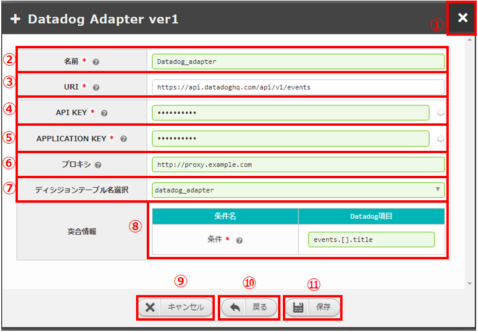

   図 2.2-6-1 新規追加画面に表示されてる項目

.. csv-table:: 表 2.2-6-1 機能説明
   :header: No., 構成要素, 説明
   :widths: 5, 20, 60

   1, 閉じるボタン, 新規追加画面を閉じて監視アダプタ画面に戻ります。
   2, 名前, 入力必須項目です。OASEで管理する名前を設定してください。64文字以内で入力して下さい。
   3, URI, 入力必須項目です。接続先のHTTPエンドポイントを512文字以内で入力して下さい。
   4, API KEY, 入力必須項目です。認証可能API KEYを設定してください。48文字以内で入力して下さい。
   5, APPLICATION KEY, 入力必須項目です。認証可能APPLICATION KEYを設定してください。48文字以内で入力して下さい。
   6, プロキシ, 任意入力項目です。通信に用いるプロキシを設定してください。256文字以内で入力してください。
   7, ディシジョンテーブル名選択, イベントリクエストの実施対象となるディシジョンテーブル名をプルダウンメニューから選択します。
   8, 条件名, 選択したディシジョンテーブル名の条件名が表示されます。入力必須項目です。Datadog項目欄に条件名に対してマッチングさせたいデータを設定してください。128文字以内で入力してください。
   9, キャンセルボタン, 新規追加画面を閉じて監視アダプタ画面に戻ります。
   10, 戻るボタン, 新規追加画面を閉じて監視アダプタ画面に戻ります。
   11, 保存ボタン, 入力した監視先情報を保存して監視アダプタ画面に戻ります。

一覧
^^^^
監視アダプタの監視先が一覧で表示されます。

.. _monitoring_adapter_Datadog_disp:

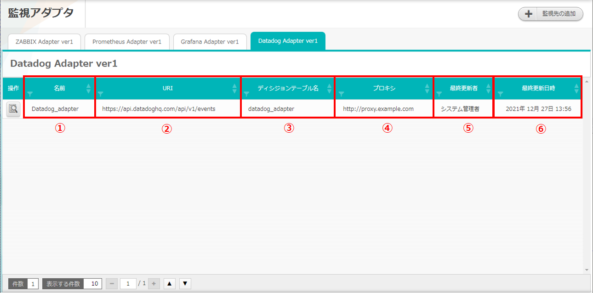

   図 2.2-6-2 一覧に表示される項目

.. csv-table:: 表 2.2-6-2 機能説明
   :header: No., 構成要素, 説明
   :widths: 5, 20, 60

   1, 名前, 監視先名が表示されます。
   2, URI, 接続先のHTTPエンドポイントが表示されます。
   3, ディシジョンテーブル名, 設定しているディシジョンテーブル名が表示されます。
   4, プロキシ, 通信に用いるプロキシが表示されます。
   5, 最終更新者, 監視先の名前、URI、API KEY、APPLICATION KEYおよびプロキシを追加/更新したユーザの名前が表示されます。
   6, 最終実行日時, 監視先の名前、URI、API KEY、APPLICATION KEYおよびプロキシを追加/更新した日時が表示されます。

操作ボタン
^^^^^^^^^^

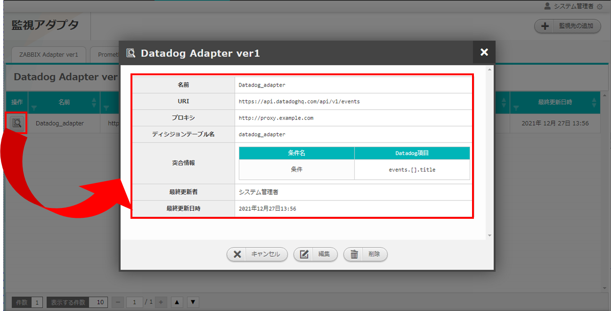

   図 2.2-6-3 「Datadog_adapter」の操作ボタン遷移

詳細画面
^^^^^^^^

* 一覧にある「操作」列のボタンを押下すると、監視先の詳細が表示されます。

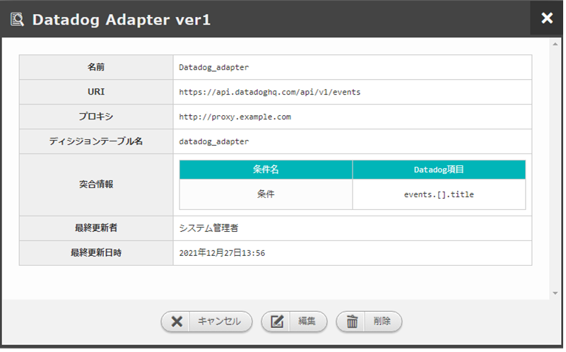

   図 2.2-6-4 「Datadog_adapter」の詳細画面

編集画面
^^^^^^^^

| Datadogアダプタの既存監視先を編集により更新します。
| 編集画面の画面構成は新規追加画面と同様です。
| 詳細は前述の「監視アダプタ画面のDatadogアダプタ新規追加画面」 :ref:`monitoring_adapter_Datadog_new` および、「監視アダプタ画面のDatadogアダプタ一覧画面」 :ref:`monitoring_adapter_Datadog_disp` をご参照ください。

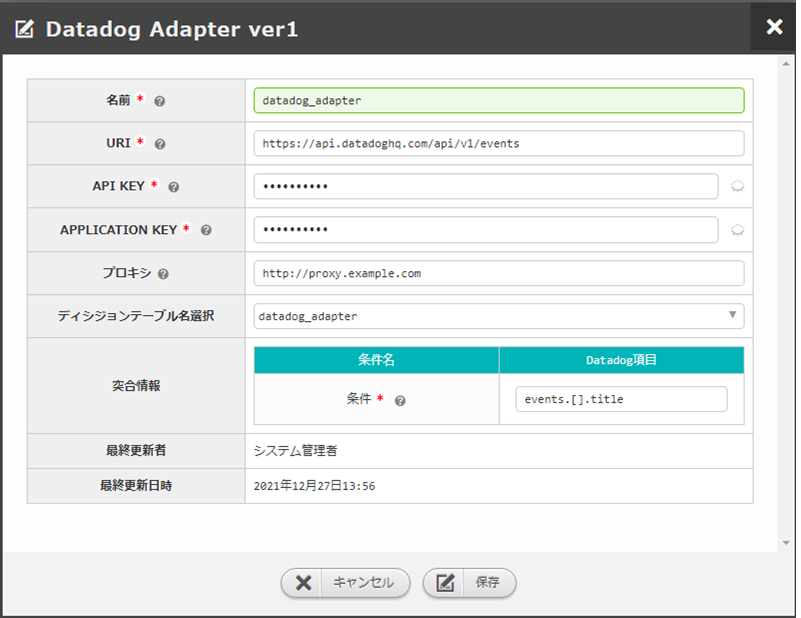

   図 2.2-6-5 「datadog_adapter」の編集画面

