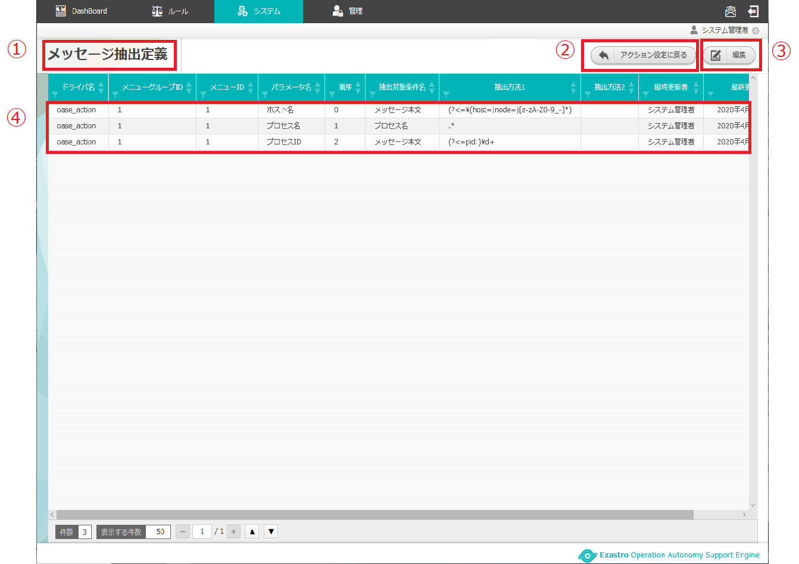
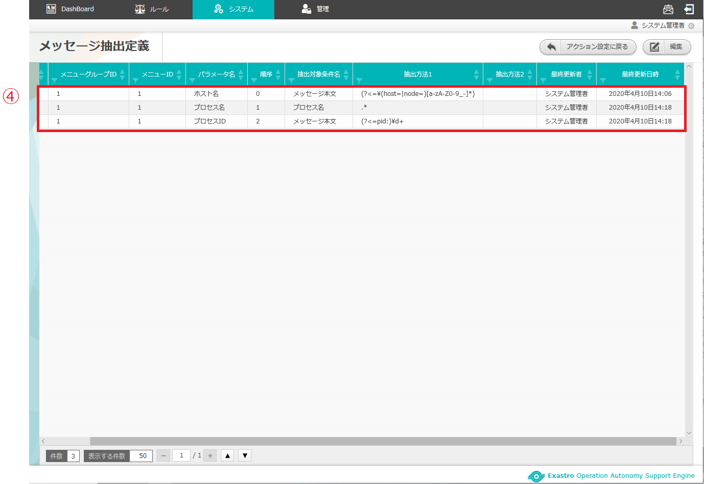
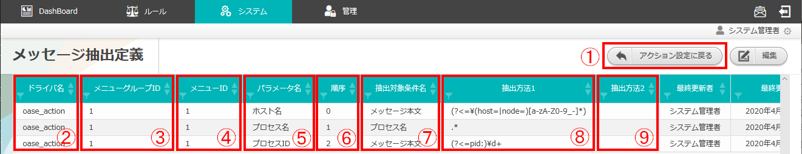

=================================================================
2 OASE 【ITAドライバ】メッセージ抽出定義画面のメニュー 、画面構成
=================================================================

| 本章では、OASE 【ITAドライバ】メッセージ抽出定義画面の画面構成と、各構成要素について説明します。

2.1 基本画面構成
================

メッセージ抽出定義画面の画面構成は次のとおりです。

   図 2.1-1 画面構成

   図 2.1-2 画面構成

メッセージ抽出定義画面の各構成要素と、その機能は次の表のとおりです。

.. csv-table:: 表 2.1-1 機能説明
   :header: No., 構成要素, 説明
   :widths: 5, 20, 60

   1, 作業画面名, 現在表示している作業画面の名称です。
   2, アクション設定に戻るボタン,メッセージ抽出定義画面からアクション設定画面に戻ります。
   3, 編集ボタン,編集画面に遷移し、メッセージ抽出定義の追加、編集、削除をします。
   4, 一覧, 現在メッセージ抽出定義に登録されている情報が表示されます。

メッセージ抽出定義が1件も登録されていない場合は以下のように表示されます。

.. figure:: ../images/parameter_sheet/parameter_sheet_02.png
   :scale: 100%
   :align: center

   図 2.1-3 画面構成

| メッセージ抽出定義の編集画面の画面構成は次のとおりです。

.. figure:: ../images/parameter_sheet/parameter_sheet_03_1.png
   :scale: 100%
   :align: center

   図 2.1-4 画面構成

.. figure:: ../images/parameter_sheet/parameter_sheet_03_2.png
   :scale: 100%
   :align: center

   図 2.1-5 画面構成

メッセージ抽出定義の編集画面の各構成要素と、その機能は次の表のとおりです。

.. csv-table:: 表 2.1-2 機能説明
   :header: No., 構成要素, 説明
   :widths: 5, 20, 60

   1, 作業画面名, 現在表示している作業画面の名称です。
   2, キャンセルボタン,変更内容を破棄してメッセージ抽出定義編集画面を閉じ、メッセージ抽出定義画面に戻ります。
   3, リセットボタン,編集途中の内容を編集前の値にリセットします。
   4, 追加ボタン,メッセージ抽出定義入力欄を1行ずつ追加します。
   5, 保存ボタン,編集内容を保存します。
   6, 更新メニュー,既存のメッセージ抽出定義に対し「更新」または「削除」を選択できます。※「4.追加ボタン」押下による新規追加行には表示されません。
   7, ドライバ名,アクション設定画面で追加したITAドライバを選択できます。
   8, メニューグループID,ITAにて設定した項番9のメニューが属するメニューグループIDを入力します。
   9, メニューID,ITAにて作成したパラメーターシートのメニューIDを入力します。
   10, パラメータ名,任意の抽出項目名を入力します。
   11, 順序,ITAにて設定したメニュー項目の表示順序を入力します。
   12, 抽出対象条件名,抽出対象となるディシジョンテーブルファイルの条件名を入力します。
   13, 抽出方法1,
   14, 抽出方法2,
   15, 削除ボタン,追加した行を削除します。

2.2 メッセージ抽出定義画面の操作方法
====================================

構成要素に対する操作方法を説明します。

(1)メッセージ抽出定義画面
-------------------------
| 登録されているメッセージ抽出定義を一覧で表示します。
| 編集ボタンについては各権限ごとに異なります。ここでは共通機能について説明します。

一覧
^^^^

* 登録されているメッセージ抽出定義を一覧で表示します。

   図 2.2-1-1 一覧画面に表示される項目

.. figure:: ../images/parameter_sheet/parameter_sheet_04_2.png
   :scale: 100%
   :align: center

   図 2.2-1-2 一覧画面に表示される項目

.. csv-table:: 表 2.2-1-1 機能説明
   :header: No., 構成要素, 説明
   :widths: 5, 20, 60

   1, アクション設定に戻るボタン,メッセージ抽出定義画面からアクション設定画面に戻ります。
   2, ドライバ名,メッセージ抽出定義のドライバ名が表示されます。
   3, メニューグループID,メッセージ抽出定義のメニューグループIDが表示されます。
   4, メニューID,メッセージ抽出定義のメニューIDが表示されます。
   5, パラメータ名,メッセージ抽出定義のパラメータ名が表示されます。
   6, 順序,メッセージ抽出定義の順序が表示されます。
   7, 抽出対象条件名,メッセージ抽出定義の抽出対象条件名が表示されます。
   8, 抽出方法1,メッセージ抽出定義の抽出方法1が表示されます。
   9, 抽出方法2,メッセージ抽出定義の抽出方法2が表示されます。
   10, 最終更新者,メッセージ抽出定義のドライバ名、メニューグループID、メニューID、パラメータ名、順序、抽出対象条件名、抽出方法1および抽出方法2を更新したユーザの名前が表示されます。
   11, 最終更新日時,メッセージ抽出定義のドライバ名、メニューグループID、メニューID、パラメータ名、順序、抽出対象条件名、抽出方法1および抽出方法2を更新した日時が表示されます。

.. note::
   アクション設定画面のアクセス権限が「更新可能」以外の場合「編集」ボタンは表示されません。

