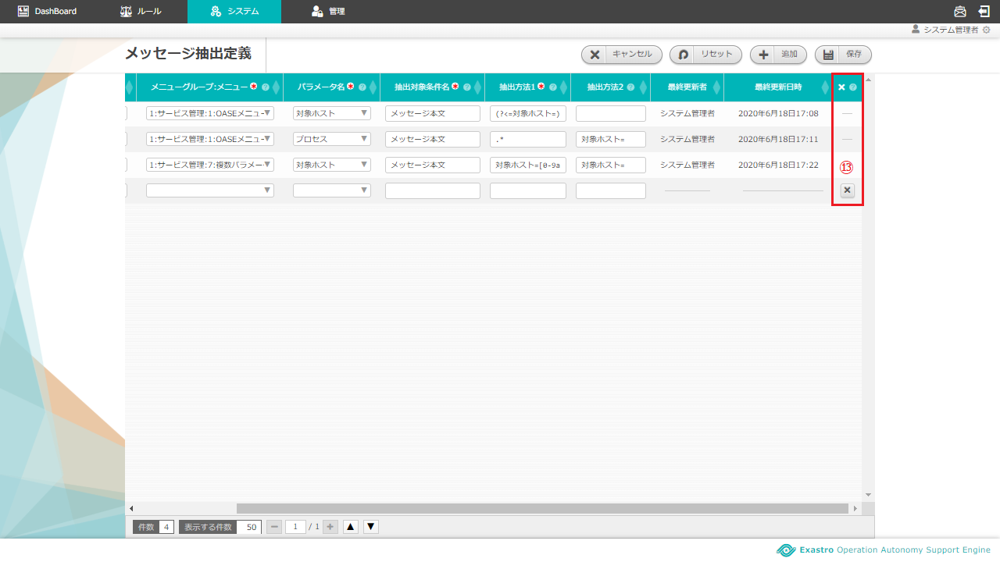

=================================================================
2 OASE 【ITAドライバ】メッセージ抽出定義画面のメニュー 、画面構成
=================================================================

| 本章では、OASE 【ITAドライバ】メッセージ抽出定義画面の画面構成と、各構成要素について説明します。

2.1 基本画面構成
================

メッセージ抽出定義画面の画面構成は次のとおりです。

.. figure:: ../images/parameter_sheet/parameter_sheet_01_1.png
   :scale: 100%
   :align: center

   図 2.1-1 画面構成

.. figure:: ../images/parameter_sheet/parameter_sheet_01_2.png
   :scale: 100%
   :align: center

   図 2.1-2 画面構成

メッセージ抽出定義画面の各構成要素と、その機能は次の表のとおりです。

.. csv-table:: 表 2.1-1 機能説明
   :header: No., 構成要素, 説明
   :widths: 5, 20, 60

   1, 作業画面名, 現在表示している作業画面の名称です。
   2, アクション設定に戻るボタン,メッセージ抽出定義画面からアクション設定画面に戻ります。
   3, 編集ボタン,編集画面に遷移し、メッセージ抽出定義の追加、編集、削除をします。
   4, 一覧, 現在メッセージ抽出定義に登録されている情報が表示されます。

メッセージ抽出定義が1件も登録されていない場合は以下のように表示されます。

.. figure:: ../images/parameter_sheet/parameter_sheet_02.png
   :scale: 100%
   :align: center

   図 2.1-3 画面構成

| メッセージ抽出定義の編集画面の画面構成は次のとおりです。

.. figure:: ../images/parameter_sheet/parameter_sheet_03_1.png
   :scale: 100%
   :align: center

   図 2.1-4 画面構成

   図 2.1-5 画面構成

メッセージ抽出定義の編集画面の各構成要素と、その機能は次の表のとおりです。

.. csv-table:: 表 2.1-2 機能説明
   :header: No., 構成要素, 説明
   :widths: 5, 20, 60

   1, 作業画面名, 現在表示している作業画面の名称です。
   2, キャンセルボタン,変更内容を破棄してメッセージ抽出定義編集画面を閉じ、メッセージ抽出定義画面に戻ります。
   3, リセットボタン,編集途中の内容を編集前の値にリセットします。
   4, 追加ボタン,メッセージ抽出定義入力欄を1行ずつ追加します。
   5, 保存ボタン,編集内容を保存します。
   6, 更新メニュー,既存のグループに対し「更新」または「削除」を選択できます。※「4.追加ボタン」押下による新規追加グループには表示されません。
   7, ドライバ名,アクション設定画面で追加したITAドライバを選択できます。
   8, メニューグループID,
   9, メニューID,
   10, パラメータ名,任意の抽出項目名を入力します。
   11, 順序,
   12, 抽出対象条件名,抽出対象となるディシジョンテーブルファイルの条件名を入力します。
   13, 抽出方法1,
   14, 抽出方法2,
   15, 削除ボタン,追加した行を削除します。

