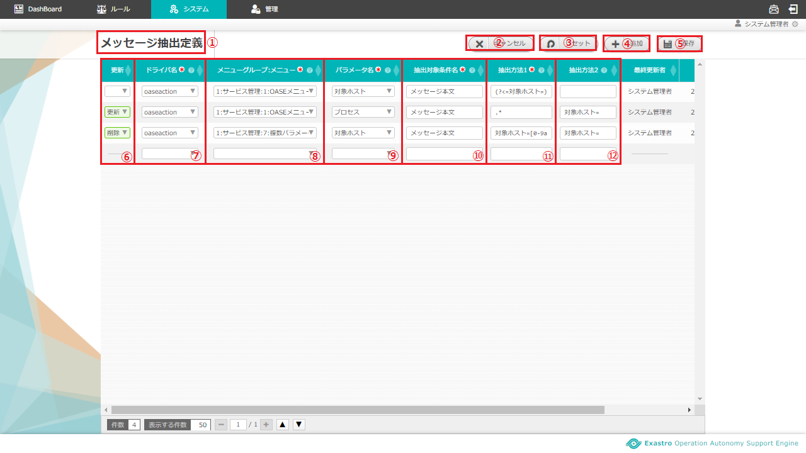
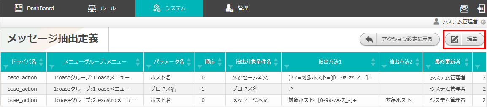
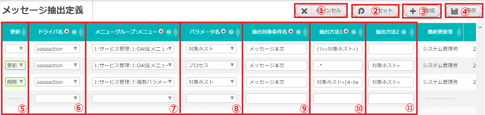
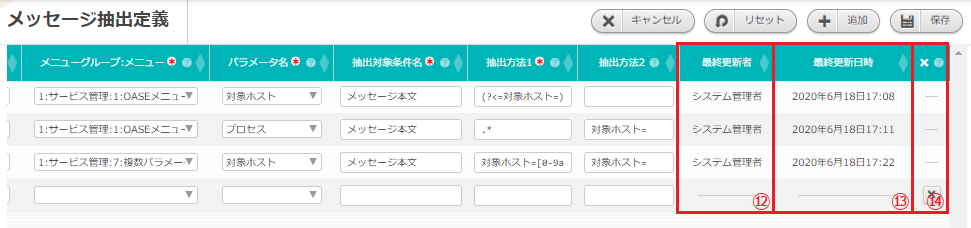

=================================================================
2 OASE 【ITAドライバ】メッセージ抽出定義画面のメニュー 、画面構成
=================================================================

| 本章では、OASE 【ITAドライバ】メッセージ抽出定義画面の画面構成と、各構成要素について説明します。

2.1 基本画面構成
================

メッセージ抽出定義画面の画面構成は次のとおりです。

   図 2.1-1 画面構成

メッセージ抽出定義画面の各構成要素と、その機能は次の表のとおりです。

.. csv-table:: 表 2.1-1 機能説明
   :header: No., 構成要素, 説明
   :widths: 5, 20, 60

   1, 作業画面名, 現在表示している作業画面の名称です。
   2, アクション設定に戻るボタン,メッセージ抽出定義画面からアクション設定画面に戻ります。
   3, 編集ボタン,編集画面に遷移し、メッセージ抽出定義の追加、編集、削除をします。
   4, 一覧, 現在メッセージ抽出定義に登録されている情報が表示されます。

メッセージ抽出定義が1件も登録されていない場合は以下のように表示されます。

   図 2.1-2 画面構成

| メッセージ抽出定義の編集画面の画面構成は次のとおりです。

   図 2.1-3 画面構成

.. figure:: ../images/parameter_sheet/parameter_sheet_03_2.png
   :scale: 100%
   :align: center

   図 2.1-4 画面構成

メッセージ抽出定義の編集画面の各構成要素と、その機能は次の表のとおりです。

.. csv-table:: 表 2.1-2 機能説明
   :header: No., 構成要素, 説明
   :widths: 5, 20, 60

   1, 作業画面名, 現在表示している作業画面の名称です。
   2, キャンセルボタン,変更内容を破棄してメッセージ抽出定義編集画面を閉じ、メッセージ抽出定義画面に戻ります。
   3, リセットボタン,編集途中の内容を編集前の値にリセットします。
   4, 追加ボタン,メッセージ抽出定義入力欄を1行ずつ追加します。
   5, 保存ボタン,編集内容を保存します。
   6, 更新メニュー,既存のメッセージ抽出定義に対し「更新」または「削除」を選択できます。※「4.追加ボタン」押下による新規追加行には表示されません。
   7, ドライバ名,アクション設定画面で追加したITAドライバを選択できます。
   8, メニューグループ:メニュー,ITAにて作成したパラメータシートのメニューを選択できます。
   9, パラメータ名,任意の抽出項目名を入力します。
   10, 順序,ITAにて設定したメニュー項目の表示順序を入力します。
   11, 抽出対象条件名,抽出対象となるディシジョンテーブルファイルの条件名を入力します。
   12, 抽出方法1,抽出対象に対して実施する正規表現を入力します。※具体例は下記「(3)抽出方法1、2の記述例と使用可能な正規表現」参照
   13, 抽出方法2,抽出方法1の結果に対して切り取る文字列を入力します。※具体例は下記「(3)抽出方法1、2の記述例と使用可能な正規表現」参照
   14, 削除ボタン,追加した行を削除します。

2.2 メッセージ抽出定義画面の操作方法
====================================

構成要素に対する操作方法を説明します。

(1)メッセージ抽出定義画面
-------------------------
| 登録されているメッセージ抽出定義を一覧で表示します。
| 編集ボタンについては各権限ごとに異なります。ここでは共通機能について説明します。

一覧
^^^^

* 登録されているメッセージ抽出定義を一覧で表示します。

   図 2.2-1-1 一覧画面に表示される項目

.. csv-table:: 表 2.2-1-1 機能説明
   :header: No., 構成要素, 説明
   :widths: 5, 20, 60

   1, アクション設定に戻るボタン,メッセージ抽出定義画面からアクション設定画面に戻ります。
   2, ドライバ名,メッセージ抽出定義のドライバ名が表示されます。
   3, メニューグループ:メニュー,メッセージ抽出定義のメニューが表示されます。
   4, パラメータ名,メッセージ抽出定義のパラメータ名が表示されます。
   5, 順序,メッセージ抽出定義の順序が表示されます。
   6, 抽出対象条件名,メッセージ抽出定義の抽出対象条件名が表示されます。
   7, 抽出方法1,メッセージ抽出定義の抽出方法1が表示されます。
   8, 抽出方法2,メッセージ抽出定義の抽出方法2が表示されます。
   9, 最終更新者,メッセージ抽出定義のドライバ名、メニューグループID、メニューID、パラメータ名、順序、抽出対象条件名、抽出方法1および抽出方法2を更新したユーザの名前が表示されます。
   10, 最終更新日時,メッセージ抽出定義のドライバ名、メニューグループID、メニューID、パラメータ名、順序、抽出対象条件名、抽出方法1および抽出方法2を更新した日時が表示されます。

.. note::
   アクション設定画面のアクセス権限が「更新可能」以外の場合「編集」ボタンは表示されません。

(2)メッセージ抽出定義編集画面
-----------------------------
| メッセージ抽出定義を新規追加および、すでに登録されているメッセージ抽出定義を更新、削除することができます。
| メッセージ抽出定義画面へのアクセス権限が「更新可能」の場合のみ、メッセージ抽出定義編集画面を表示することができます。

   図 2.2-2-1 アクセス権限が「更新可能」の場合表示される「編集ボタン」

入力欄
^^^^^^

   図 2.2-2-2 メッセージ抽出定義編集画面の各項目

   図 2.2-2-3 メッセージ抽出定義編集画面の各項目

.. csv-table:: 表 2.2-2-1 機能説明
   :header: No., 構成要素, 説明
   :widths: 5, 20, 60

   1, キャンセル,変更内容を破棄してメッセージ抽出定義編集画面を閉じ、メッセージ抽出定義画面に戻ります。
   2, リセット,値を変更する前のメッセージ抽出定義編集画面に戻ります。
   3, 追加,編集欄が1行追加されます。
   4, 保存,更新列の値が「更新」のみの場合、更新内容が反映されたメッセージ抽出定義画面に移ります。更新列の値に「削除」が含まれる場合、対象のメッセージ抽出定義が削除されたメッセージ抽出定義画面に移ります。
   5, 更新,既存のメッセージ抽出定義を更新する場合はプルダウンメニューから「更新」を選択してください。また、削除する場合は「削除」を選択してください。選択状態で「保存ボタン」を押下すると、選択した内容が反映されます。※新規追加行にはプルダウンメニューは表示されません。
   6, ドライバ名,入力必須項目です。
   7, メニューグループ:メニュー,入力必須項目です。
   8, パラメータ名,入力必須項目です。256文字以内で入力してください。
   9, 順序,入力必須項目です。※パラメータシートの登録には「ホスト名」が必要になります。「ホスト名」は「順序」に 0 を指定して、必ず設定を行ってください。
   10, 抽出対象条件名,入力必須項目です。32文字以内で入力してください。
   11, 抽出方法1,入力必須項目です。512文字以内で入力してください。
   12, 抽出方法2,任意入力項目です。512文字以内で入力してください。
   13, 最終更新者,メッセージ抽出定義編集画面の「保存ボタン」を押下したユーザ名が自動で反映されます。
   14, 最終更新日時,メッセージ抽出定義編集画面の「保存ボタン」を押下した時刻が自動で反映されます。
   15, 追加行削除ボタン,メッセージ抽出定義編集画面の「追加ボタン」を押下した場合、欄内に押下可能な「×」ボタンが表示されます。「×」ボタンを押下すると、追加行が削除されます。

(3)抽出方法1、2の記述例と使用可能な正規表現
--------------------------------------------
| 抽出方法1、2の記述例と使用可能な正規表現について説明します。

.. csv-table:: 表 2.2-3-1 抽出方法1、2の記述例
   :header: No., 抽出対象, 抽出方法1, 抽出方法2, 抽出結果, 説明
   :widths: 5, 20, 40, 40, 20, 60

   1, \(対象ホスト=XXXX\),\(\?<=対象ホスト=\)\[0\-9a\-zA\-Z\_\-\]\+,空欄\(不要のため\),XXXX,抽出する項目名が固定の場合の記述例です。
   2, \(host:XXXX\),\(\?<=\(対象ホスト=\|host:\|対象ノード=\)\)\[0\-9a\-zA\-Z\_\-\]\+,空欄\(不要のため\),XXXX,「対象ホスト」のほかに「host:」や「対象ノード=」というメッセージもある場合の記述例です。
   3, \(対象ホスト=XXXX\),対象ホスト=\[0\-9a\-zA\-Z\_\-\]\+,対象ホスト=,XXXX,抽出方法2は抽出方法1の結果から記述した文言を削除します。

.. csv-table:: 表 2.2-3-2 抽出方法1、2で使用可能な正規表現
   :header: No., 文字, 説明
   :widths: 5, 20, 80

   1, ?,直前の1文字が0個、または、1個であることを表します。
   2, \+,直前の1文字が1個以上繰り返されることを表します(最長一致)。
   3, "+?",直前の1文字が1個以上繰り返されることを表します(最短一致)。
   4, \*,直前の1文字の0回以上の繰り返しを表します。
   5, "{n,m}",直前の1文字をn回以上、m回以下繰り返すことを表します。
   6, .,任意の1文字を表します(ただし改行文字は除く)。
   7, [],カッコ内の文字列のうち、いずれか1文字を表します。
   8, [^],^がカッコ内の冒頭に配置された場合、カッコ内以外の文字列を表します。
   9, (),カッコ内の文字列をグループ化します。
   10, \|,複数のパターンを列挙します。
   11, \\A,文字列の冒頭を表します。
   12, \\z,文字列の末尾を表します。
   13, \^,行の冒頭を表します。
   14, \$,行の末尾を表します。
   15, (?=),カッコ内の正規表現が直後にある場合にのみマッチしますが、正規表現部分はマッチに含まれません。
   16, (?!),カッコ内の正規表現が直後にない場合にのみマッチしますが、正規表現部分はマッチに含まれません。
   17, (?<=),カッコ内の正規表現が直前にある場合にのみマッチしますが、正規表現部分はマッチに含まれません。
   18, (?<!),カッコ内の正規表現が直前にない場合にのみマッチしますが、正規表現部分はマッチに含まれません。
