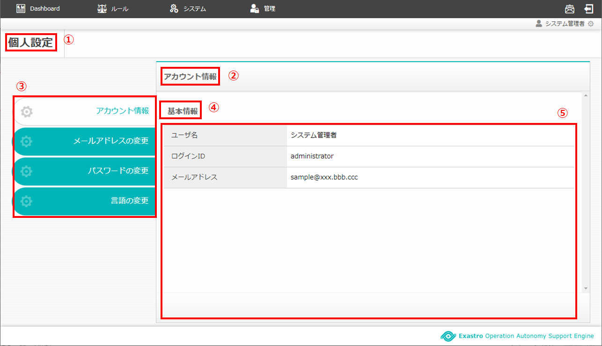
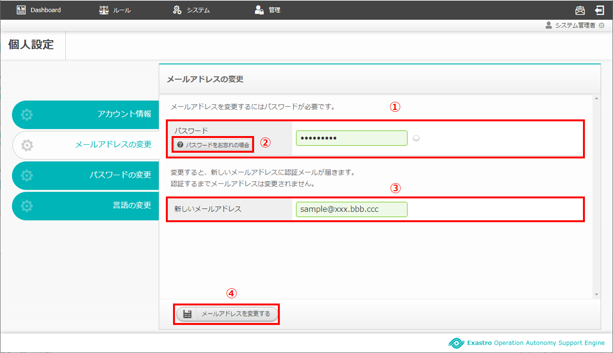

==============================================
2 OASE 個人設定画面のメニュー 、画面構成
==============================================

本章では、OASE 個人設定画面の画面構成と、各構成要素について説明します。

2.1 基本画面構成
================ 

「個人設定」画面の「アカウント情報」タブの画面構成は次のとおりです。

.. _personal_config_01:

   図 2.1-1 画面構成

「個人設定」画面の「アカウント情報」タブの各構成要素と、その機能は次の表のとおりです。

.. csv-table:: 表 2.1-1 機能説明
   :header: No., 構成要素, 説明
   :widths: 5, 20, 60

   1, 作業画面名, 現在表示している作業画面の名称です。
   2, 設定名, 現在表示している設定名です。
   3, タブ, 各設定のタブです。
   4, カテゴリー名, 設定名に関連するカテゴリーの名称です。
   5, 設定項目一覧, 現在ログインしているアカウントに登録されている情報が表示されます。

| 「メールアドレスの変更」タブの画面構成は「アカウント情報」タブ同様です。
| 詳細は前述の「アカウント情報」タブ :ref:`personal_config_01` をご参照ください。
| ※Active Directory連携時「メールアドレスの変更」タブは表示されません。

   図 2.1-2 画面構成

| 「パスワードをお忘れの場合」ボタンの詳細は
| 「ログイン」画面の :ref:`login_01` をご参照ください。

メールアドレスが変更された場合は以下のように表示されます。

   図 2.1-3 画面構成

| 「パスワードの変更」タブの画面構成は「アカウント情報」タブ同様です。
| 詳細は前述の「アカウント情報」タブ :ref:`personal_config_01` をご参照ください。
| ※Active Directory連携時「パスワードの変更」タブは表示されません。

.. figure:: ../images/personal_config/personal_config_03.png
   :scale: 100%
   :align: center

   図 2.1-4 画面構成

2.2 個人設定画面の操作方法
================================

構成要素に対する操作方法を説明します。

(1)アカウント情報タブ
---------------------
| アカウントに登録されている情報を一覧で表示します。
| 「アカウント情報」タブはAD連携や権限に関わらず表示することができます。

   図 2.2-1-1 「アカウント情報」タブ

.. csv-table:: 表 2.2-1-1 機能説明
   :header: No., 構成要素, 説明
   :widths: 5, 20, 60

   1, ユーザ名,現在ログインしているユーザのユーザ名が表示されます。 
   2, ログインID, 現在ログインしているユーザのログインIDが表示されます。
   3, メールアドレス, 現在ログインしているユーザのメールアドレスが表示されます。

.. note::

  「ログインID：administrator」のメールアドレスはデフォルトで「sample\@xxx.bbb.ccc」と設定されています。初回ログイン後任意のアドレスに変更してください。

   図 2.2-2-2 administratorのメールアドレス

(2)メールアドレスの変更タブ
---------------------------------

   図 2.2-2-1 「メールアドレスの変更」タブ

.. csv-table:: 表 2.2-2-1 機能説明
   :header: No., 構成要素, 説明
   :widths: 5, 20, 60

   1, パスワード, 現在ログインしているユーザのパスワードを入力します。
   2, パスワードをお忘れの場合, 詳細は「ログイン」画面の :ref:`login_01` をご参照ください。
   3, 新しいメールアドレス, 現在ログインしているユーザの新しいメールアドレスとして希望するメールアドレスを入力します。
   4, メールアドレスを変更する, 入力内容に問題が無い場合、新しいメールアドレスに変更することができます。変更されたメールアドレスに「メールアドレスのご変更」メールが送られます。有効期間内に記載のURLへアクセスすることでメールアドレスの変更が完了します。

   図 2.2-2-2 「メールアドレスのご変更」メール

(3)パスワードの変更タブ
--------------------------

   図 2.2-3-1 「パスワードの変更」タブ

.. csv-table:: 表 2.2-3-1 機能説明
   :header: No., 構成要素, 説明
   :widths: 5, 20, 60

   1, 現在のパスワード, 現在ログインしているユーザのパスワードを入力します。
   2, パスワードをお忘れの場合,詳細は「ログイン」画面の :ref:`login_01` をご参照ください。 
   3, 新しいパスワード（再入力）, 現在ログインしているユーザの新しいパスワードとして希望するパスワードを入力します。
   4, パスワードを変更する, 入力内容に問題が無い場合、新しいパスワードに変更することができます。

