========================================
2 OASE ルール画面のメニュー 、画面構成
========================================

本章では、OASE ルール画面の画面構成と、各構成要素について説明します。

2.1 基本画面構成
================

ルール画面の画面構成は次のとおりです。
4種類の表示方式から選択可能ですが、いずれも構成要素やその内容に変わりはありません。

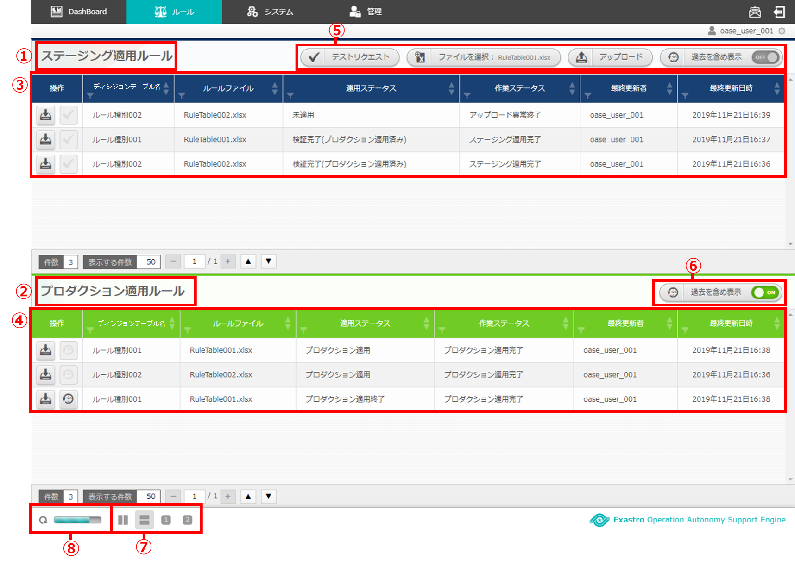

   図 2.1-1-1 画面構成(横に分割)

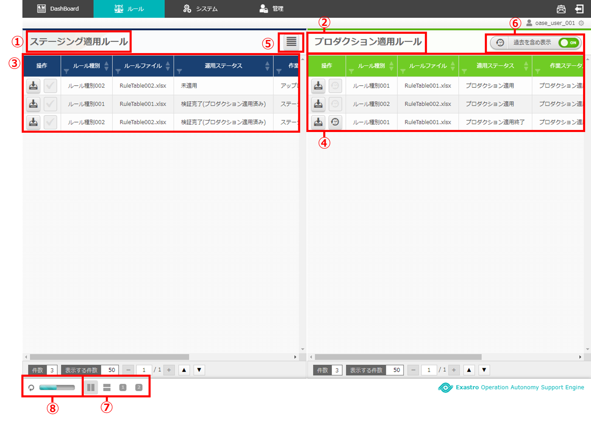

   図 2.1-1-2 画面構成(縦に分割)

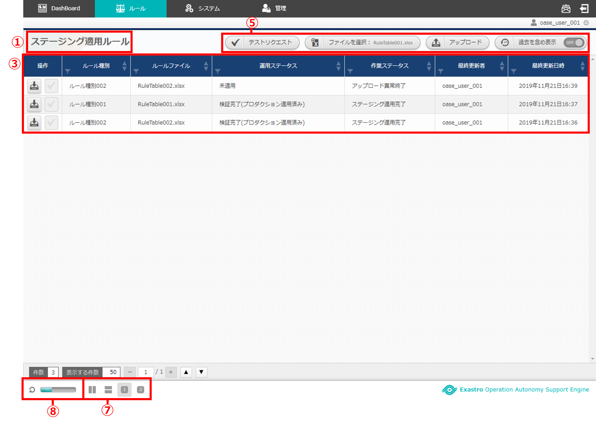

   図 2.1-1-3 画面構成(ステージング適用ルール)

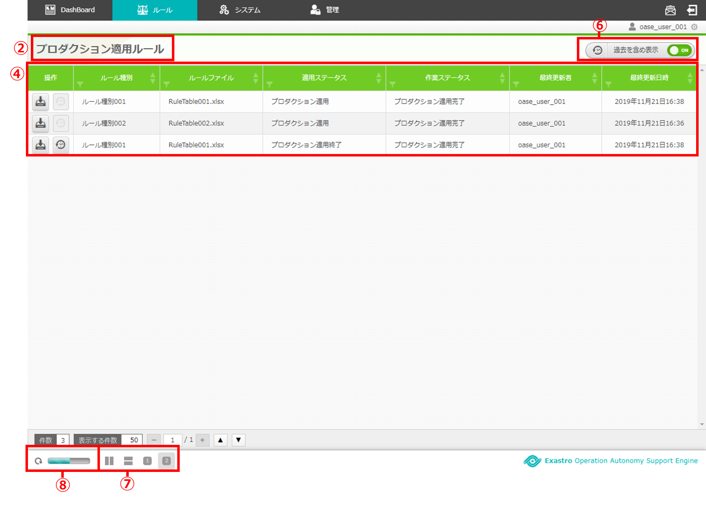

   図 2.1-1-4 画面構成(プロダクション適用ルール)

ルール画面の各構成要素と、その機能は次の表のとおりです。

.. csv-table:: 表 2.1-1 機能説明
   :header: No., 構成要素, 説明
   :widths: 5, 20, 60

   1, 作業フレーム名(ステージング), 現在表示しているステージング環境の作業フレームの名称です。
   2, 作業フレーム名(プロダクション), 現在表示しているプロダクション環境の作業フレームの名称です。
   3, 一覧(ステージング), ステージング環境に適用されているルール情報が表示されます。ディシジョンテーブル画面にて、ユーザの所属グループに対して参照のみ／更新可能いずれかの権限が設定されたディシジョンテーブル名のみ表示対象となります。
   4, 一覧(プロダクション), プロダクション環境に適用されているルール情報が表示されます。ディシジョンテーブル画面にて、ユーザの所属グループに対して参照のみ／更新可能いずれかの権限が設定されたディシジョンテーブル名のみ表示対象となります。
   5, メニュー(ステージング), ステージング環境に対して操作を行うボタン群です。「テストリクエスト」「ファイルを選択」「アップロード」「過去を含め表示」があり、詳細は後述の操作方法 :ref:`label_stg_button` をご参照ください。
   6, メニュー(プロダクション), プロダクション環境に対して操作を行うボタンです。「過去を含め表示」があり、詳細は後述の操作方法 :ref:`label_prd_button` をご参照ください。
   7, 表示方式ボタン群, 作業フレームの表示方式を選択するボタン群です。
   8, 自動更新制御ボタン, ステージング、プロダクションの一覧の自動更新をする／しないを制御するボタンです。更新間隔をバーの伸長により表現します。

| ルールが1件も適用されていない場合は以下のように表示されます。

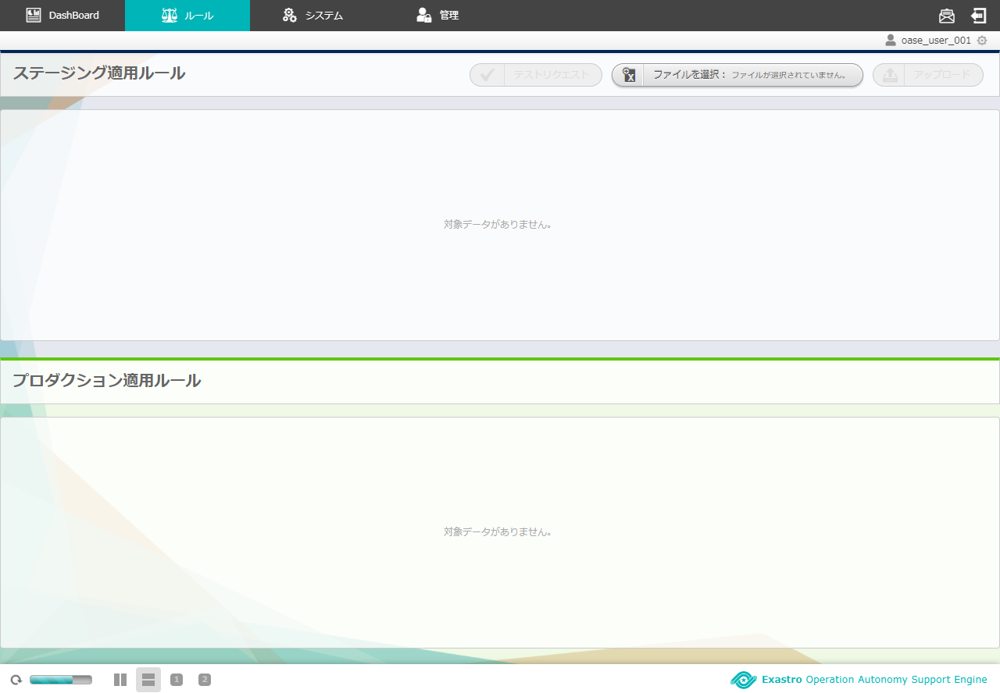

   図 2.1-1-5 画面構成(横に分割)

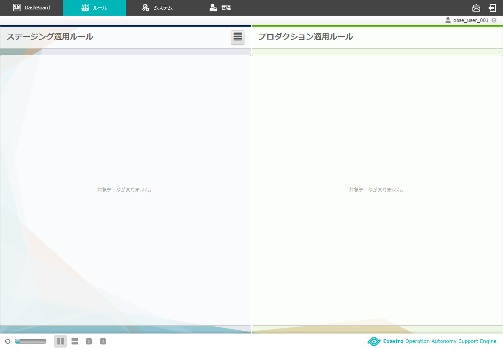

   図 2.1-1-6 画面構成(縦に分割)

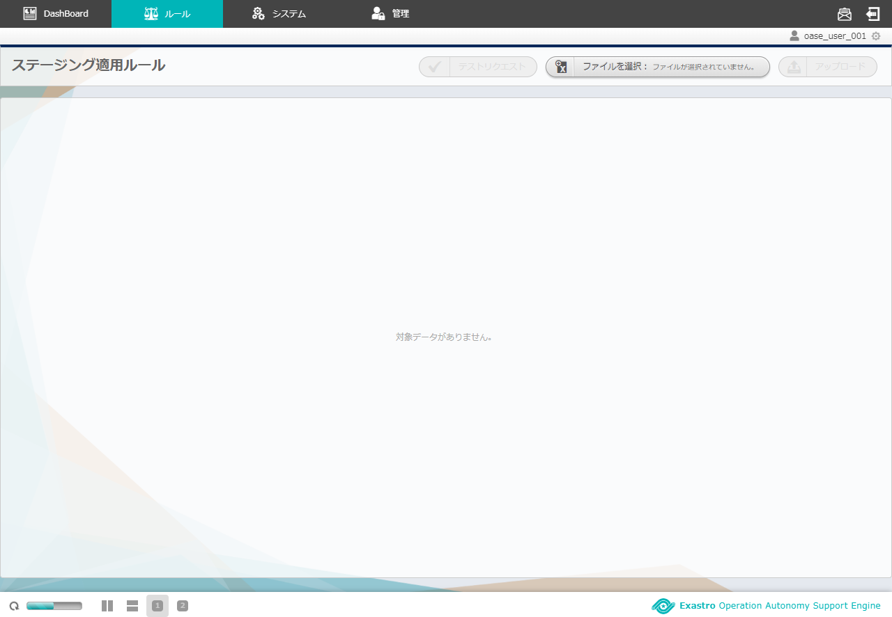

   図 2.1-1-7 画面構成(ステージング適用ルール)

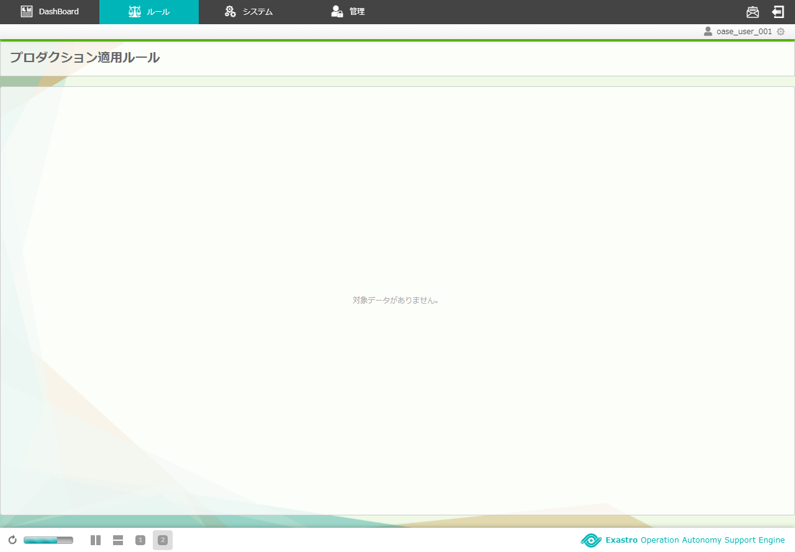

   図 2.1-1-8 画面構成(プロダクション適用ルール)

| 

テストリクエスト画面の種別タブの画面構成は次のとおりです。

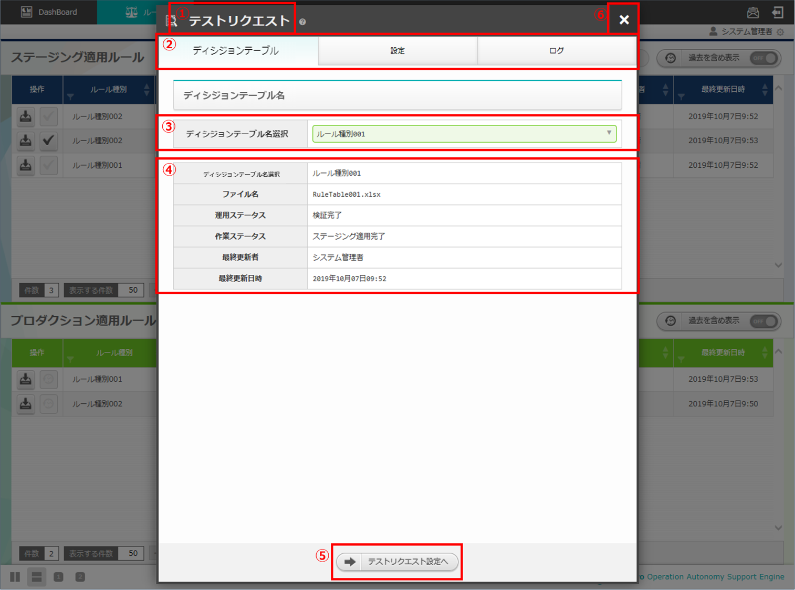

   図 2.1-2-1 画面構成(種別タブ)

テストリクエスト画面の種別タブの各構成要素と、その機能は次の表のとおりです。

.. csv-table:: 表 2.1-2-1 機能説明
   :header: No., 構成要素, 説明
   :widths: 5, 20, 60

   1, 作業画面名, 現在表示している作業画面の名称です。
   2, タブ, テストリクエスト画面を構成する「ディシジョンテーブル」「設定」「ログ」の3つのタブがあり、「設定」「ログ」タブへ遷移できます。
   3, ディシジョンテーブル名選択, テストリクエストの実施対象となるディシジョンテーブル名をプルダウンメニューから選択します。
   4, 選択ルール情報, 上記ディシジョンテーブル名選択にて選択されたディシジョンテーブル名の情報が表示されます。
   5, テストリクエスト設定へボタン, 「設定」タブへ遷移します。
   6, 閉じるボタン, テストリクエスト画面を閉じます。

| 

テストリクエスト画面の設定タブの画面構成は次のとおりです。

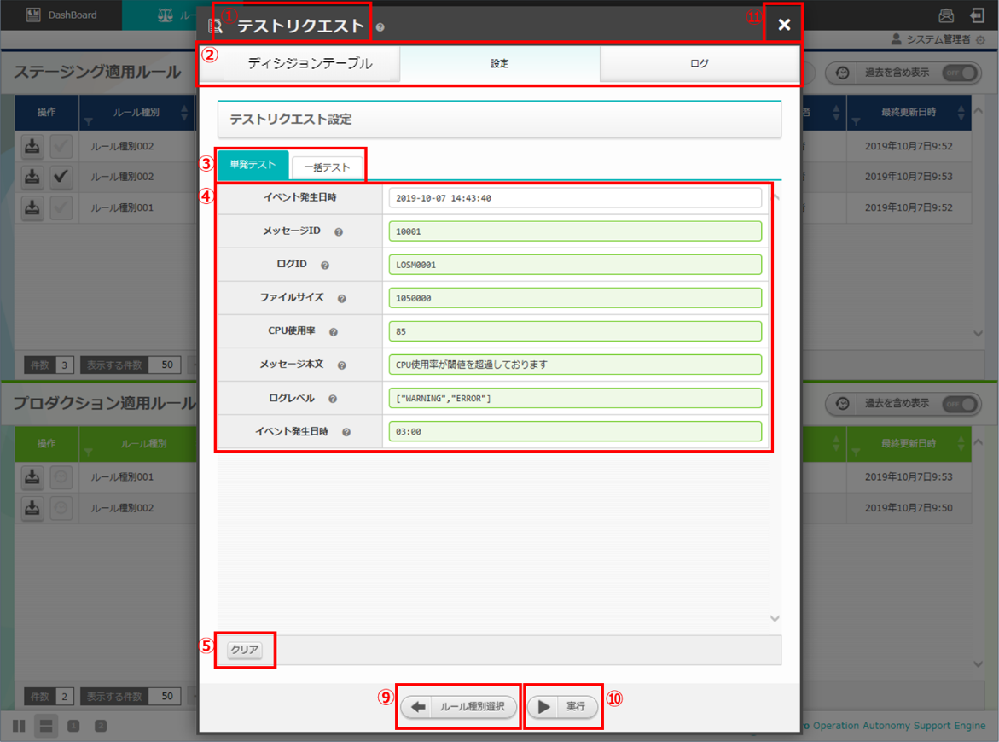

   図 2.1-2-2-1 画面構成(設定タブ単発テスト)

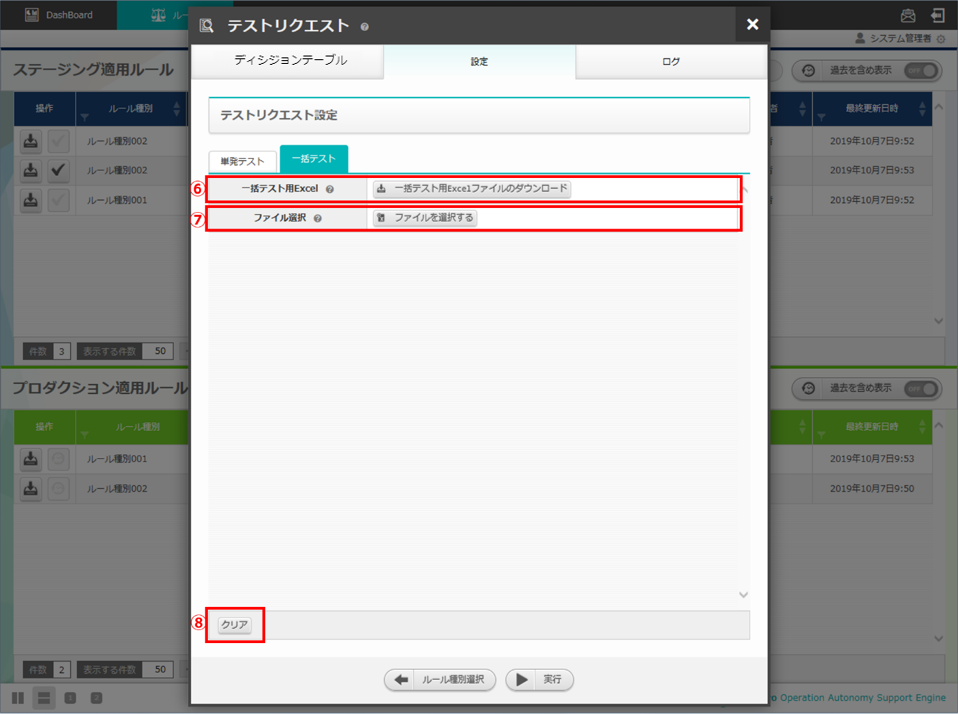

   図 2.1-2-2-2 画面構成(設定タブ一括テスト)

テストリクエスト画面の設定タブの各構成要素と、その機能は次の表のとおりです。

.. csv-table:: 表 2.1-2-2 機能説明
   :header: No., 構成要素, 説明
   :widths: 5, 20, 60

   1, 作業画面名, 現在表示している作業画面の名称です。
   2, タブ, テストリクエスト画面を構成する「ディシジョンテーブル」「設定」「ログ」の3つのタブがあり、「ディシジョンテーブル」「ログ」タブへ遷移できます。
   3, テスト種別選択, テストリクエストの設定対象となるテスト種別をタブ形式で選択します。「単発テスト」「一括テスト」のいずれか一方を選択します。
   4, テストリクエスト設定項目, 「単発テスト」でのみ入力を行う項目です。1行目の「イベント発生日時」は全てのディシジョンテーブル名で表示される項目です。2行目以降は選択されたディシジョンテーブル名に依存する情報となり、ディシジョンテーブル画面にて指定した条件名が列挙されます。同一の条件名が複数ある場合、それらは同一の値でなければならないため、入力項目は一項目に集約されて表示されます。
   5, クリアボタン(単発テスト), 上記テストリクエスト設定項目に対して行った入力をクリアします。ただし、1行目の「イベント発生日時」は除きます。また、「一括テスト」タブの内容はクリアされません。
   6, 一括テスト用Excel, 一括テストリクエストに使用するExcelファイルをダウンロードできます。
   7, ファイル選択, 上記一括テスト用Excelのファイルを選択します。
   8, クリアボタン(一括テスト), 上記ファイル選択項目を未選択状態へ戻します。
   9, ディシジョンテーブル名選択ボタン, 「ディシジョンテーブル」タブへ遷移します。
   10, 実行ボタン, 「ログ」タブへ遷移し、同時に選択中のテスト種別のテストリクエストを実行します。
   11, 閉じるボタン, テストリクエスト画面を閉じます。

| 

テストリクエスト画面のログタブの画面構成は次のとおりです。

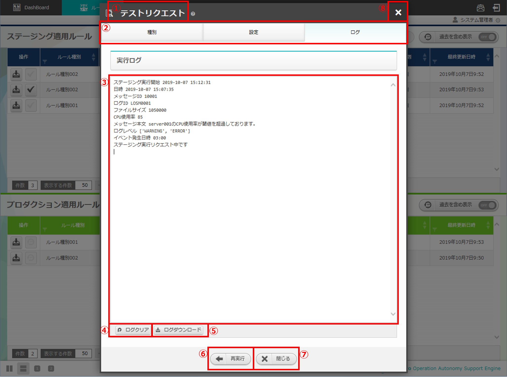

   図 2.1-2-3 画面構成(ログタブ)

.. csv-table:: 表 2.1-2-3 機能説明
   :header: No., 構成要素, 説明
   :widths: 5, 20, 60

   1, 作業画面名, 現在表示している作業画面の名称です。
   2, タブ, テストリクエスト画面を構成する「ディシジョンテーブル」「設定」「ログ」の3つのタブがあり、「ディシジョンテーブル」「設定」タブへ遷移できます。
   3, ログテキスト, 実行したリクエスト情報と実行結果が表示されます。
   4, ログクリアボタン, 上記ログテキストの内容をクリアします。
   5, ログダウンロード, 上記ログテキストの内容をファイル出力します。
   6, 再実行ボタン, 「設定」タブへ遷移します。
   7, 閉じるボタン, テストリクエスト画面を閉じます。
   8, 閉じるボタン, テストリクエスト画面を閉じます。

2.2 ルール画面の操作方法
==========================

構成要素に対する操作方法を説明します。

.. _label_stg_button:

(1)ルール画面(ステージング)
---------------------------

| ルール画面は、登録されているルールをステージング環境とプロダクション環境の2つのフレームに分けて表示します。
| ここでは、ステージング環境について説明します。

一覧
^^^^

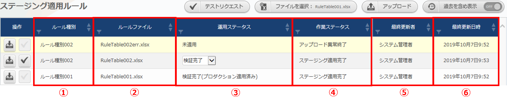

   図 2.2-1-1 一覧に表示される項目

.. csv-table:: 表 2.2-1-1 機能説明
   :header: No., 構成要素, 説明
   :widths: 5, 20, 60

   1, ディシジョンテーブル名, ディシジョンテーブル名が表示されます。
   2, ルールファイル, アップロードしたディシジョンテーブルファイル名が表示されます。
   3, 運用ステータス, ルールファイルに対する運用上の状態が表示されます。詳細は後述の :ref:`label_stg_ope_sts` をご参照ください。
   4, 作業ステータス, ルールファイルに対するOASEシステムの処理上の状態が表示されます。詳細は後述の :ref:`label_stg_sys_sts` をご参照ください。
   5, 最終更新者, ルールファイルを更新したユーザの名前が表示されます。
   6, 最終更新日時, ルールファイルを更新した日時が表示されます。

ファイルを選択
^^^^^^^^^^^^^^
* ルールをステージング環境に適用するには、まずアップロードするディシジョンテーブルファイルを選択する必要があります。
* ディシジョンテーブルファイルはディシジョンテーブル画面からダウンロード可能です。
* ステージング環境へのアクセス権限が「更新可能」の場合のみ、ファイル選択ボタンは押下することができます。

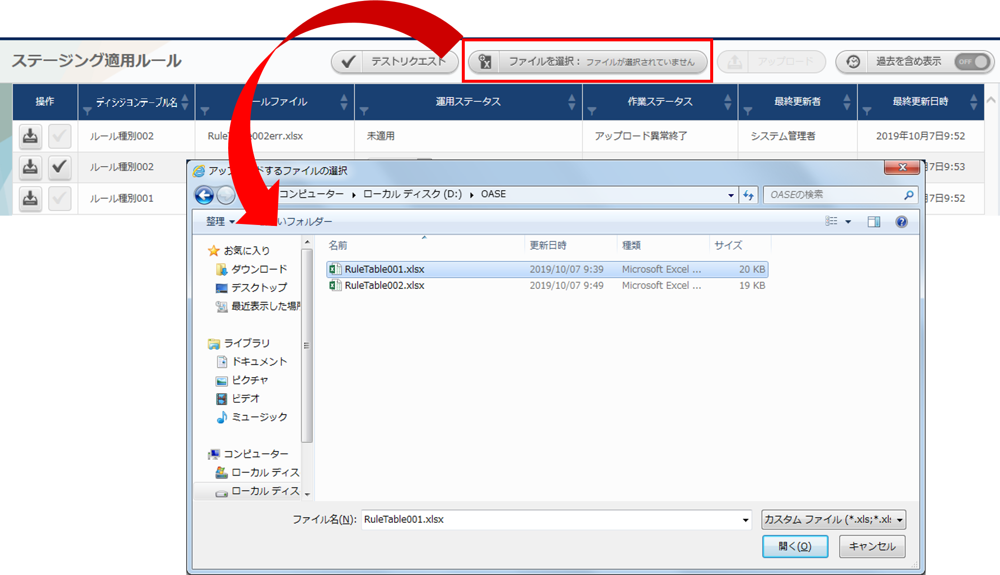

   図 2.2-1-2 ファイルを選択

アップロード
^^^^^^^^^^^^
* ファイルを選択後にアップロードボタンを押下すると「ファイルをアップロードします。よろしいですか？」と確認メッセージが表示されます。
* 「OK」を選択すると、ディシジョンテーブルファイルのアップロードが開始されます。
* ステージング環境へのアクセス権限が「更新可能」の場合のみ、アップロードボタンは押下することができます。

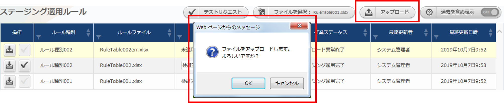

   図 2.2-1-3 アップロード

テストリクエスト
^^^^^^^^^^^^^^^^
* テストリクエストボタンを押下すると、テストリクエスト画面へ遷移します。
* ステージング環境へのアクセス権限が「参照のみ」「更新可能」の場合のみ、テストリクエストボタンは押下することができます。

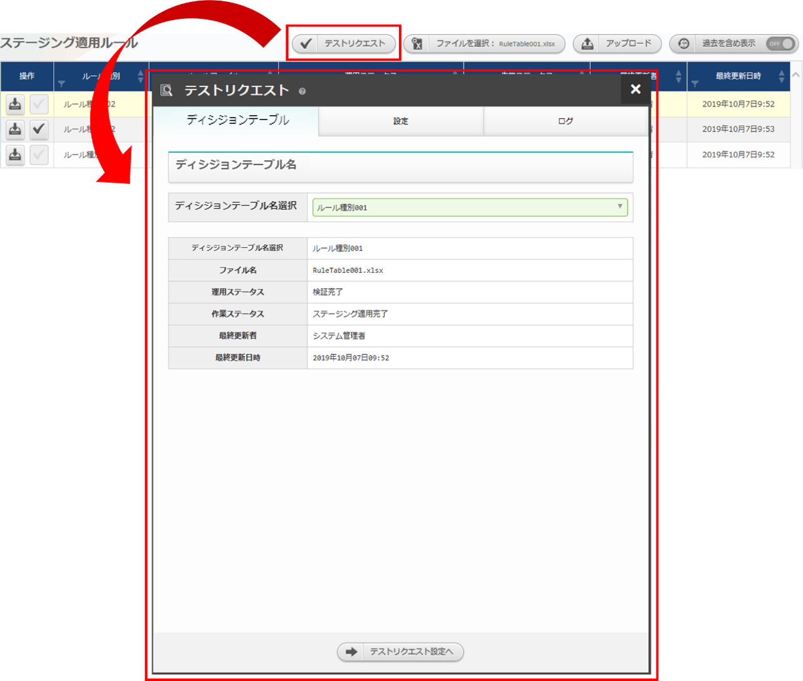

   図 2.2-1-4 テストリクエスト

過去を含め表示
^^^^^^^^^^^^^^
* 通常はOFFとなっており、押下することでON/OFFが切り替わります。
* OFFのとき、一覧に表示されるルール情報は、一つのディシジョンテーブル名につき1～2件となります。「最新の情報である」もしくは「現在ステージング環境に適用されている」のいずれかに該当するルール情報が表示されます。「現在ステージング環境に適用されている」状態につきましては、後述の :ref:`label_stg_ope_sts` をご参照ください。
* ONのとき、最新のものではない過去のルール情報も表示対象となります。

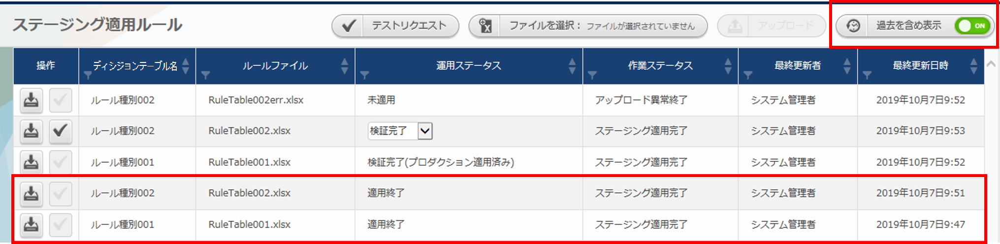

   図 2.2-1-5 過去を含め表示

運用ステータスの変更
^^^^^^^^^^^^^^^^^^^^
* ルールファイルの運用ステータスが「検証未実施」「検証実施中」「検証NG」「検証完了」のいずれかに該当、かつ、プロダクション環境へ適用していない場合、運用者の任意でステータスを変更できます。
* ステージング環境へのアクセス権限が「更新可能」の場合のみ、運用ステータスの変更は押下することができます。

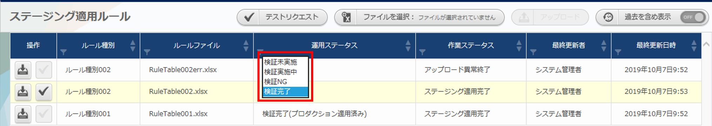

   図 2.2-1-6 運用ステータスの変更

ダウンロード
^^^^^^^^^^^^
* ダウンロードボタンを押下すると、ディシジョンテーブルファイルをダウンロードすることができます。
* 作業ステータスが異常終了の場合にダウンロードボタンを押下すると、ディシジョンテーブルファイルと異常終了時のログテキストファイルの2ファイルをzip形式でダウンロードすることができます。
* ステージング環境へのアクセス権限が「参照のみ」「更新可能」の場合のみ、ダウンロードボタンは押下することができます。

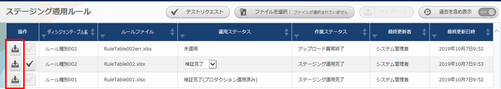

   図 2.2-1-7 ダウンロード

適用
^^^^
* ルールファイルの運用ステータスが「検証完了」の場合、ルールファイルをプロダクション環境へ適用させることができます。
* プロダクション環境へのアクセス権限が「更新可能」の場合のみ、適用ボタンは押下することができます。

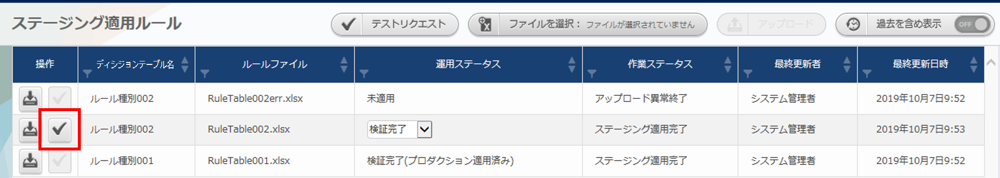

   図 2.2-1-8 プロダクション環境への適用

.. _label_stg_ope_sts:

運用ステータス
^^^^^^^^^^^^^^

.. csv-table:: 表 2.2-1-8-1 運用ステータス説明
   :header: No., ステータス名, 説明
   :widths: 5, 20, 60

   1, 未適用, アップロードを実施直後のルールファイルがこの状態になります。アップロード処理が正常に完了し、ステージング環境に適用されることで「検証未実施」状態へ遷移します。また、アップロード処理が異常終了した場合、この状態のままとなります。
   2, 検証未実施, ステージング環境に適用されているルールに対して、テストリクエストによる検証を実行していない状態です。テストリクエストを行う、もしくは、運用者の任意で「検証実施中」「検証NG」「検証完了」へ遷移可能です。
   3, 検証実施中, ステージング環境に適用されているルールに対して、テストリクエストによる検証が完了していない状態です。テストリクエストを行う、もしくは、運用者の任意で「検証NG」「検証完了」へ遷移可能です。また、運用者の任意で「検証未実施」へ戻すこともできます。
   4, 検証NG, ステージング環境に適用されているルールに対して、テストリクエストによる検証が異常終了した状態です。運用者の任意で「検証未実施」「検証実施中」「検証完了」へ遷移可能です。
   5, 検証完了, ステージング環境に適用されているルールに対して、テストリクエストによる検証が正常終了した状態です。この状態のとき、プロダクション環境への「適用」ボタンを押下することができます。また、プロダクション適用前であれば、運用者の任意で「検証未実施」「検証実施中」「検証NG」へ遷移可能です。
   6, 検証完了(プロダクション適用済み), ルールがステージング環境に適用されている、かつ、プロダクション環境にも適用されている状態です。この状態のとき、運用者の任意で状態遷移はできません。
   7, 適用終了, ステージング環境に適用されている既存のルールと同一ディシジョンテーブル名のルールファイルを新規に適用した場合、既存のルールファイルはこの状態へ遷移します。

.. _label_stg_sys_sts:

作業ステータス
^^^^^^^^^^^^^^

.. csv-table:: 表 2.2-1-8-2 作業ステータス説明
   :header: No., ステータス名, 説明
   :widths: 5, 20, 60

   1, アップロード中, アップロードを実施直後のルールファイルがこの状態になります。
   2, アップロード異常終了, アップロード処理中に異常が発生した場合、この状態へ遷移します。
   3, アップロード完了, アップロード処理が正常終了した場合、この状態へ遷移します。その後、自動的にビルド処理が実行されると「ビルド中」状態へ遷移します。
   4, ビルド中, アップロードされたルールファイルを使用し、Red Hat Decision Manager プロジェクトのビルドを実行している状態です。
   5, ビルド異常終了, ビルド処理中に異常が発生した場合、この状態へ遷移します。
   6, ビルド完了, ビルド処理が正常終了した場合、この状態へ遷移します。その後、自動的にステージング適用処理が実行されると「ステージング適用中」状態へ遷移します。
   7, ステージング適用中, ビルドされたプロジェクトを使用し、Decision Server へのデプロイを実行している状態です。
   8, ステージング適用異常終了, デプロイ処理中に異常が発生した場合、この状態へ遷移します。
   9, ステージング適用完了, デプロイ処理が正常終了した場合、この状態へ遷移します。

.. note::

    自動更新制御ボタンがONであり、アップロード中、ビルド中、ステージング適用中のいずれかのステータスが一覧の中に一つでもある場合、5秒間隔で自動的に一覧の更新が行われます。

.. _label_prd_button:

(2)ルール画面(プロダクション)
-----------------------------

| ルール画面は、登録されているルールをステージング環境とプロダクション環境の2つのフレームに分けて表示します。
| ここでは、プロダクション環境について説明します。

一覧
^^^^

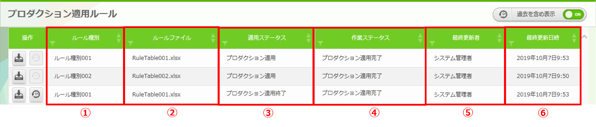

   図 2.2-2-1 一覧に表示される項目

.. csv-table:: 表 2.2-2-1 機能説明
   :header: No., 構成要素, 説明
   :widths: 5, 20, 60

   1, ディシジョンテーブル名, ディシジョンテーブル名が表示されます。
   2, ルールファイル, 適用されたディシジョンテーブルファイル名が表示されます。
   3, 運用ステータス, ルールファイルに対する運用上の状態が表示されます。詳細は後述の :ref:`label_prd_ope_sts` をご参照ください。
   4, 作業ステータス, ルールファイルに対するOASEシステムの処理上の状態が表示されます。詳細は後述の :ref:`label_prd_sys_sts` をご参照ください。
   5, 最終更新者, ルールファイルを更新したユーザの名前が表示されます。
   6, 最終更新日時, ルールファイルを更新した日時が表示されます。

過去を含め表示
^^^^^^^^^^^^^^
* 通常はOFFとなっており、押下することでON/OFFが切り替わります。
* OFFのとき、一覧に表示されるルール情報は、一つのディシジョンテーブル名につき1件となります。
* ONのとき、過去に適用されていたルール情報も表示対象となります。

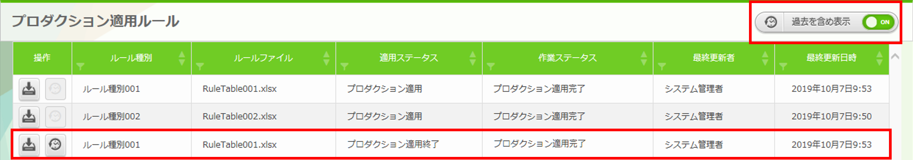

   図 2.2-2-2 過去を含め表示

ダウンロード
^^^^^^^^^^^^
* ダウンロードボタンを押下すると、ディシジョンテーブルファイルをダウンロードすることができます。
* 作業ステータスが異常終了の場合にダウンロードボタンを押下すると、ディシジョンテーブルファイルと異常終了時のログテキストファイルの2ファイルをzip形式でダウンロードすることができます。
* プロダクション環境へのアクセス権限が「参照のみ」「更新可能」の場合のみ、ダウンロードボタンは押下することができます。

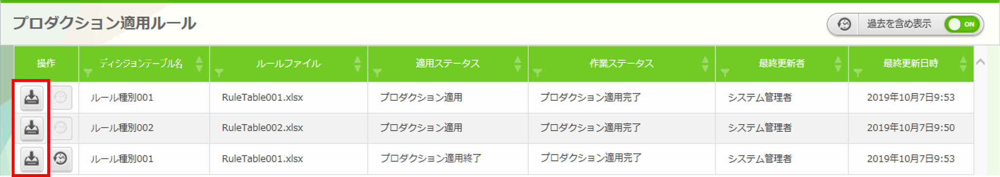

   図 2.2-2-3 ダウンロード

切り戻し
^^^^^^^^
* 過去にプロダクション環境へ適用されていたルールファイルを再度プロダクション環境へ適用させることができます。
* プロダクション環境へのアクセス権限が「更新可能」の場合のみ、切り戻しボタンは押下することができます。

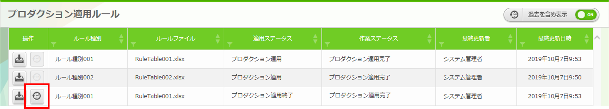

   図 2.2-2-4 プロダクション環境への再適用

.. _label_prd_ope_sts:

運用ステータス
^^^^^^^^^^^^^^

.. csv-table:: 表 2.2-2-4-1 運用ステータス説明
   :header: No., ステータス名, 説明
   :widths: 5, 20, 60

   1, プロダクション未適用, ステージング環境に適用されているルールをプロダクション環境へ適用実施直後にこの状態になります。適用処理が異常終了した場合、この状態のままとなります。
   2, プロダクション適用, プロダクション適用処理が正常終了した場合、この状態へ遷移します。
   3, プロダクション適用終了, プロダクション環境に適用されている既存のルールと同一ディシジョンテーブル名のルールファイルを新規に適用した場合、既存のルールファイルはこの状態へ遷移します。

.. _label_prd_sys_sts:

作業ステータス
^^^^^^^^^^^^^^

.. csv-table:: 表 2.2-2-4-2 作業ステータス説明
   :header: No., ステータス名, 説明
   :widths: 5, 20, 60

   1, プロダクション適用中, ステージング環境に適用されているルールをプロダクション環境へ適用実施直後、もしくは、切り戻しによる再適用の実行直後の状態です。
   2, プロダクション適用異常終了, 適用中に異常が発生した場合、この状態へ遷移します。
   3, プロダクション適用完了, 適用処理が正常終了した場合、この状態へ遷移します。

.. note::

    自動更新制御ボタンがONであり、プロダクション適用中のステータスが一覧の中に一つでもある場合、5秒間隔で自動的に一覧の更新が行われます。

(3)テストリクエスト(ディシジョンテーブルタブ)
---------------------------------------------

| テストリクエスト画面では、ステージング環境に適用されているルールに対してリクエストを送信し、テストを行うことができます。
| ここではテストリクエスト画面の種別タブについて説明します。

ディシジョンテーブル名選択
^^^^^^^^^^^^^^^^^^^^^^^^^^
* テストを行うためには、まずリクエスト送信対象となるディシジョンテーブル名をプルダウンから選択する必要があります。
* ステージング環境へのアクセス権限が「参照のみ」「更新可能」のディシジョンテーブル名が選択候補として表示されます。

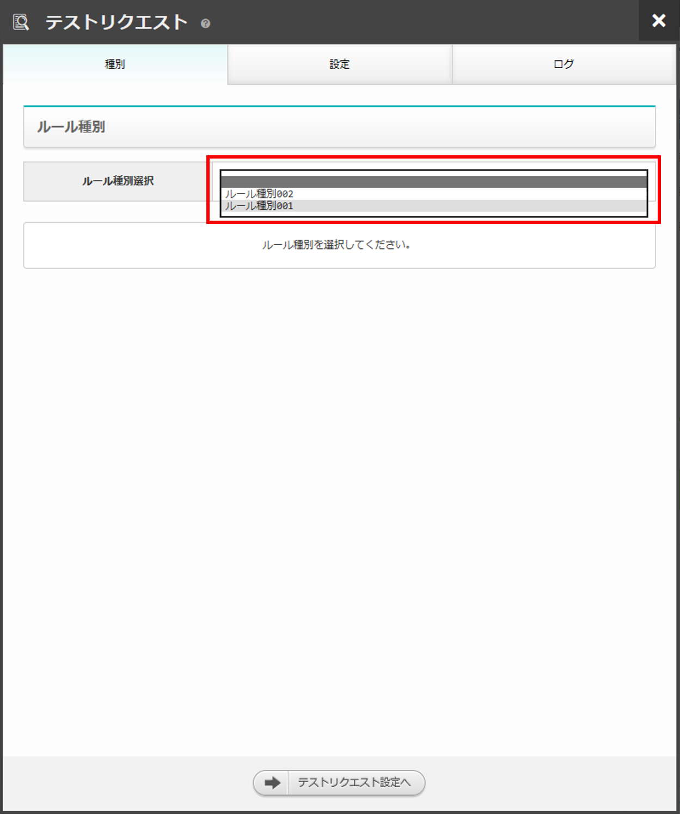

   図 2.2-3-1-1 ディシジョンテーブル名選択前

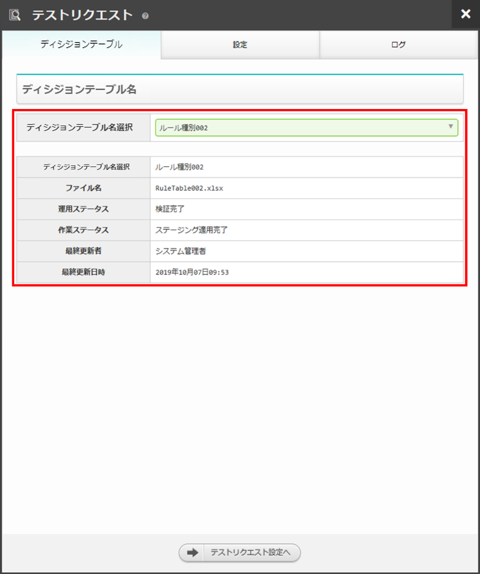

   図 2.2-3-1-2 ディシジョンテーブル名選択後

テストリクエスト設定へ
^^^^^^^^^^^^^^^^^^^^^^
* 設定タブへ遷移します。

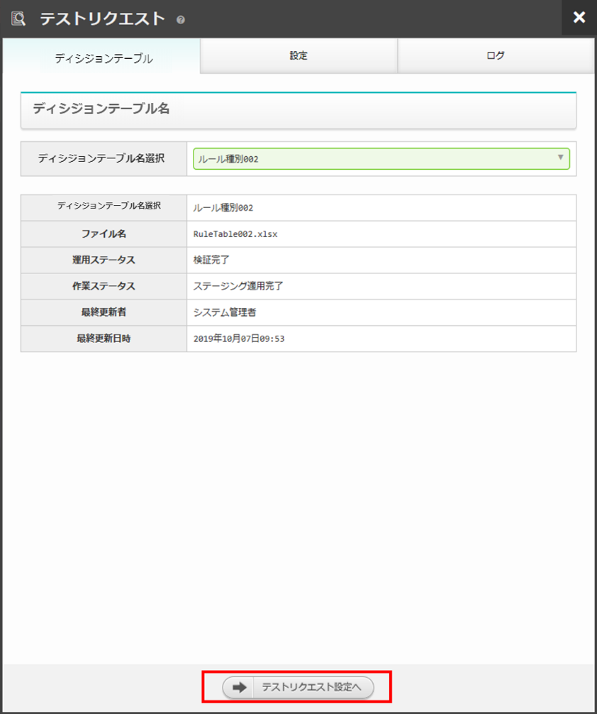

   図 2.2-3-2 「テストリクエスト設定へ」ボタン

設定タブ
^^^^^^^^
* 設定タブへ遷移します。
* 前述の「テストリクエスト設定へ」ボタンと同様です。

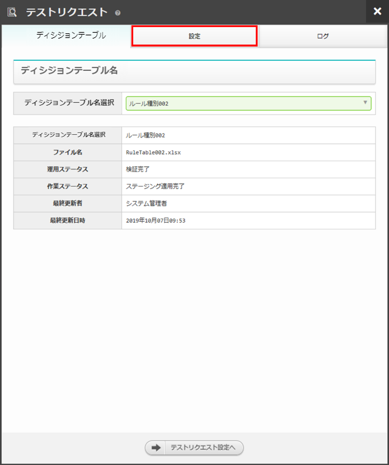

   図 2.2-3-3 設定タブ

ログタブ
^^^^^^^^
* ログタブへ遷移します。

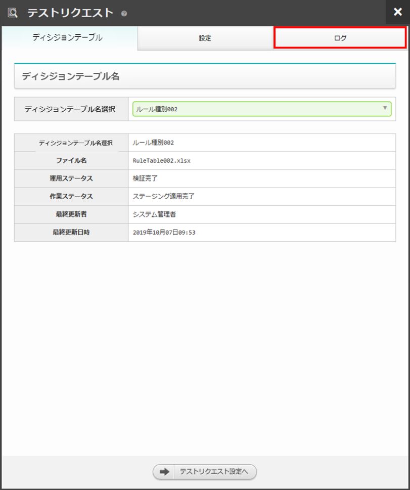

   図 2.2-3-3 ログタブ

閉じる
^^^^^^
* ディシジョンテーブル名選択前の場合、押下と同時にテストリクエスト画面を閉じます。
* ディシジョンテーブル名選択後の場合、押下すると「変更がありますが、破棄して閉じますか？」と確認メッセージが表示されます。
* 「OK」を選択すると、変更した値が破棄された状態でルール画面に戻ります。

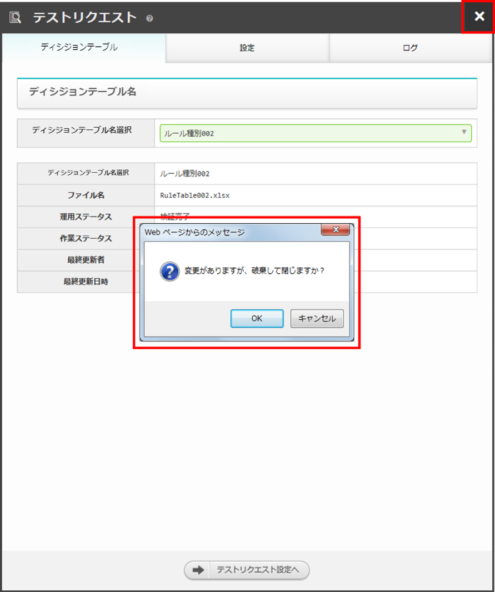

   図 2.2-3-4 閉じる

(4)テストリクエスト(設定タブ)
-----------------------------

| テストリクエスト画面では、ステージング環境に適用されているルールに対してリクエストを送信し、テストを行うことができます。
| ここではテストリクエスト画面の設定タブについて説明します。

単発テスト
^^^^^^^^^^
* リクエストを一つだけ送信して行うテストです。

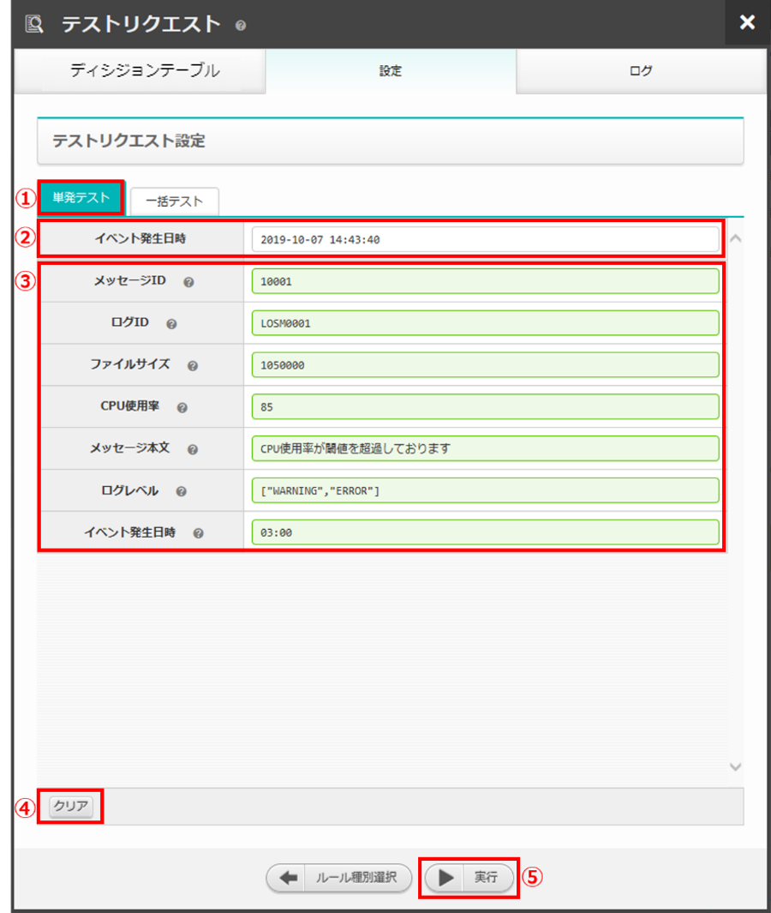

   図 2.2-4-1 単発テスト

.. csv-table:: 表 2.2-4-1 機能説明
   :header: No., 構成要素, 説明
   :widths: 5, 20, 60

   1, 単発テストタブ, 単発テストを選択している状態です。
   2, リクエスト項目(共通), 「イベント発生日時」はディシジョンテーブルを問わずリクエストに必要となる項目です。ディシジョンテーブルタブにてディシジョンテーブル名が選択されていない場合、この項目は表示されません。
   3, リクエスト項目(ディシジョンテーブル), ディシジョンテーブルタブにて選択したディシジョンテーブル名に依存して、項目の数や内容は変化します。ディシジョンテーブルタブにてディシジョンテーブル名が選択されていない場合、この項目は表示されません。
   4, クリアボタン, 上記「リクエスト項目(ディシジョンテーブル)」に入力した値をクリアします。種別タブにてディシジョンテーブル名が選択されていない場合、このボタンは押下することができません。
   5, 実行ボタン, 入力したリクエスト項目(共通／)の値から単発のリクエストを送信し、ログタブへ遷移します。ディシジョンテーブルにてディシジョンテーブル名が選択されていない場合、このボタンは押下することができません。

.. _label_get_button:

一括テスト
^^^^^^^^^^
* 一括テスト用Excelファイルに記述されたリクエストを全て送信して行うテストです。
* 一括テスト用Excelファイルにつきましては、 :doc:`04_bulk_request` をご参照ください。

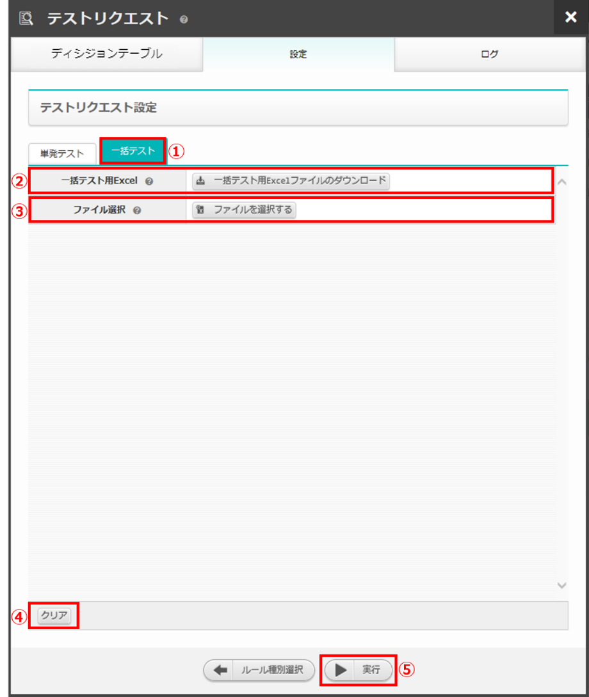

   図 2.2-4-2 一括テスト

.. csv-table:: 表 2.2-4-2 機能説明
   :header: No., 構成要素, 説明
   :widths: 5, 20, 60

   1, 一括テストタブ, 一括テストを選択している状態です。
   2, 一括テスト用Excel, ボタンを押下すると、ダウンロードすることができます。ディシジョンテーブルタブにてディシジョンテーブル名が選択されていない場合、このボタンは押下することができません。
   3, ファイル選択, 上記「一括テスト用Excel」からダウンロードしたファイルに、リクエスト項目を記述したものを選択してください。ディシジョンテーブルタブにてディシジョンテーブル名が選択されていない場合、このボタンは押下することができません。
   4, クリアボタン, 上記「ファイル選択」の選択状態をクリアします。ディシジョンテーブルタブにてディシジョンテーブル名が選択されていない場合、このボタンは押下することができません。
   5, 実行ボタン, 選択した一括テスト用Excelファイルの内容を解析し、記述された全てのリクエストを送信し、ログタブへ遷移します。ディシジョンテーブルタブにてディシジョンテーブル名が選択されていない場合、このボタンは押下することができません。

ディシジョンテーブル名選択
^^^^^^^^^^^^^^^^^^^^^^^^^^
* ディシジョンテーブルタブへ遷移します。

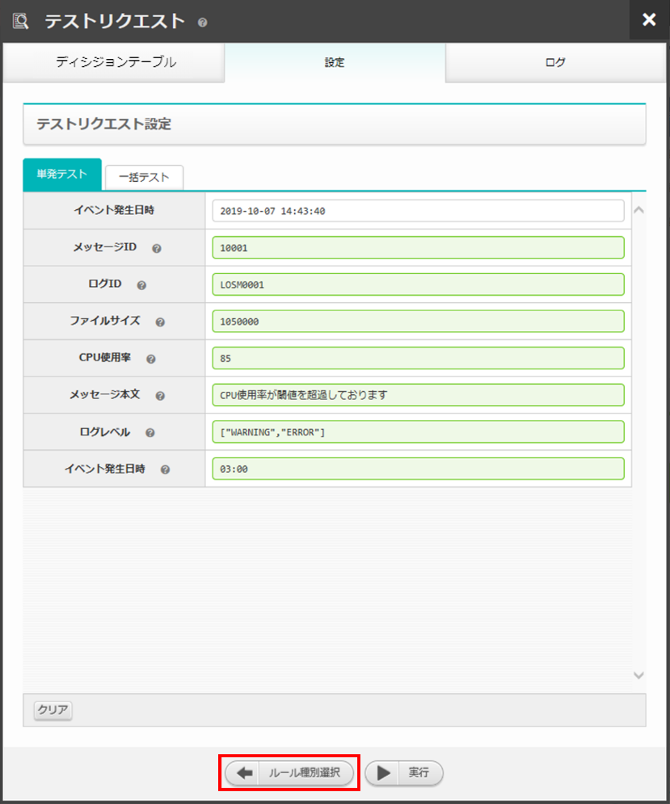

   図 2.2-4-3 ディシジョンテーブル名選択ボタン

ディシジョンテーブルタブ
^^^^^^^^^^^^^^^^^^^^^^^^
* ディシジョンテーブルタブへ遷移します。
* 前述の「ディシジョンテーブル名選択」ボタンと同様です。

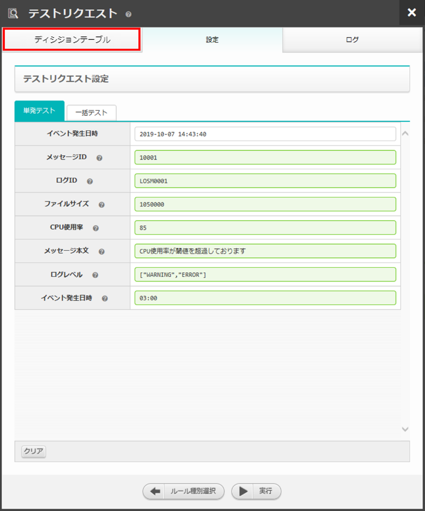

   図 2.2-4-4 設定タブ

ログタブ
^^^^^^^^
* ログタブへ遷移します。
* 単発テスト／一括テストの実行ボタンと異なり、リクエストの送信を行わず、ログタブへ遷移します。

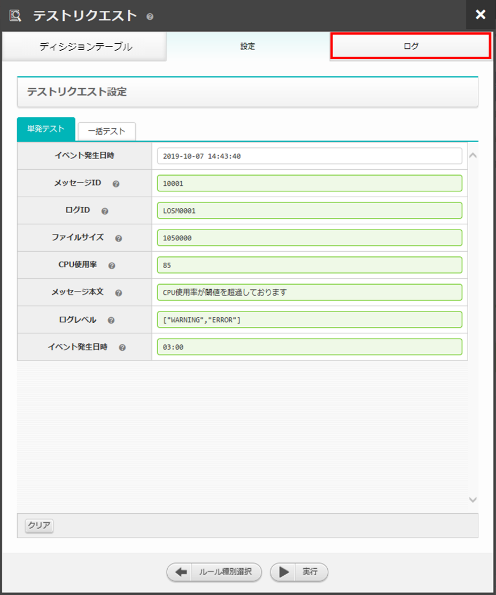

   図 2.2-4-5 ログタブ

閉じる
^^^^^^
* ディシジョンテーブル名選択前の場合、押下と同時にテストリクエスト画面を閉じます。
* ディシジョンテーブル名選択後の場合、押下すると「変更がありますが、破棄して閉じますか？」と確認メッセージが表示されます。
* 「OK」を選択すると、変更した値が破棄された状態でルール画面に戻ります。

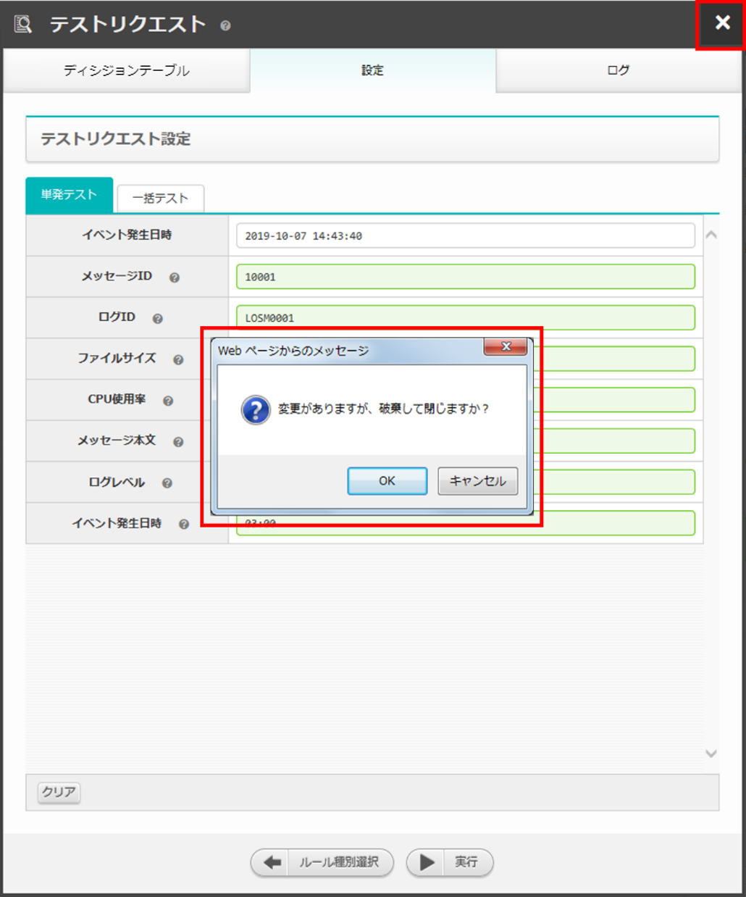

   図 2.2-4-6 閉じる

(5)テストリクエスト(ログタブ)
-----------------------------

| テストリクエスト画面では、ステージング環境に適用されているルールに対してリクエストを送信し、テストを行うことができます。
| ここではテストリクエスト画面のログタブについて説明します。

リクエスト送信の確認
^^^^^^^^^^^^^^^^^^^^
* 設定タブから実行ボタンからログタブに遷移した場合、「リクエストを送信します。よろしいですか？」と確認メッセージが表示されます。
* 「OK」を選択すると、リクエストが送信され、テストが開始されます。

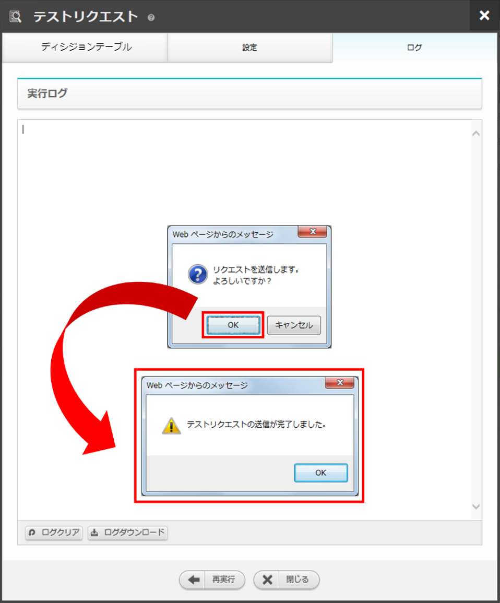

   図 2.2-5-1 実行ボタン経由でのログタブ遷移

実行ログ
^^^^^^^^
* テストが開始されると、その実行状況が「実行ログ」に出力されます。
* 実行状況は定期的に取得され、随時ログの出力内容が更新されます。
* 実行状況の取得は、テストが完了する、もしくは、テストリクエスト画面が閉じられるまで行われます。

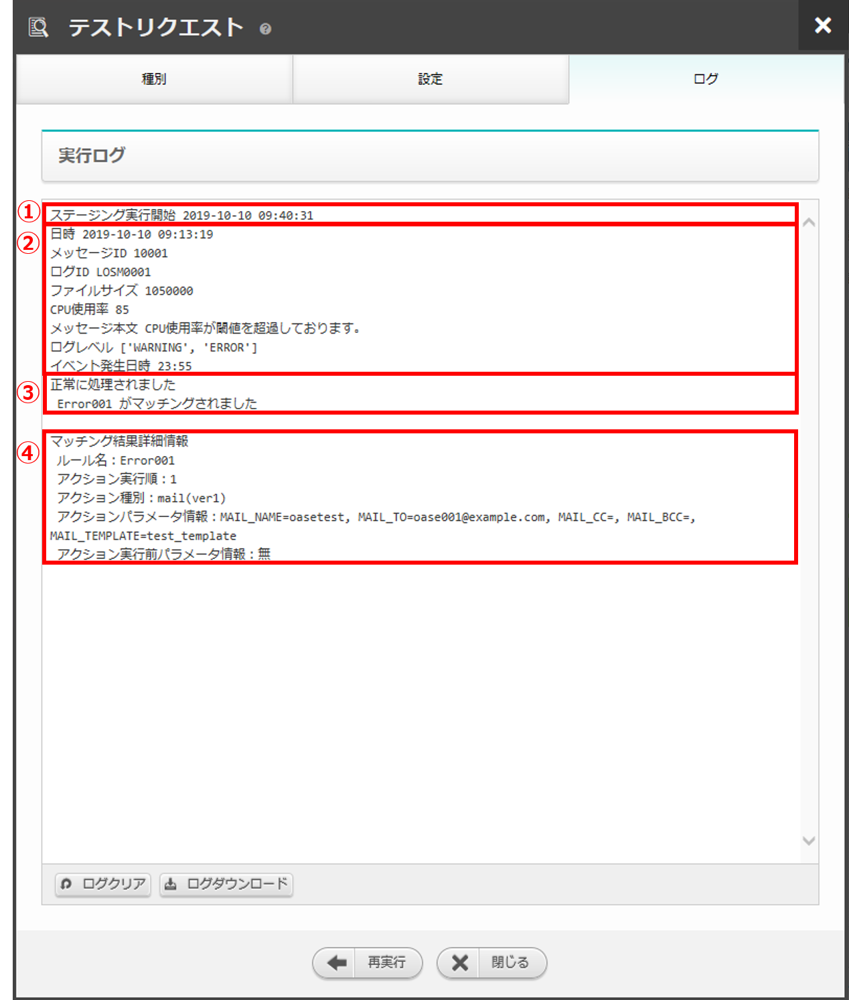

   図 2.2-5-2-1 実行ログ(単発テスト)

.. csv-table:: 表 2.2-5-1-1 機能説明
   :header: No., 構成要素, 説明
   :widths: 5, 20, 60

   1, ステージング実行開始, テストリクエストが実行された日時が表示されます。
   2, リクエスト情報, 設定タブのリクエスト項目にて入力された情報が表示されます。
   3, 実行状態, テストの実行状態が表示されます。
   4, マッチング結果, テストが完了した際、Red Hat Decision Managerから受信したルールのマッチング結果が表示されます。テストが完了していない、もしくは、ルールがマッチングしなかった場合は何も表示されません。

| 

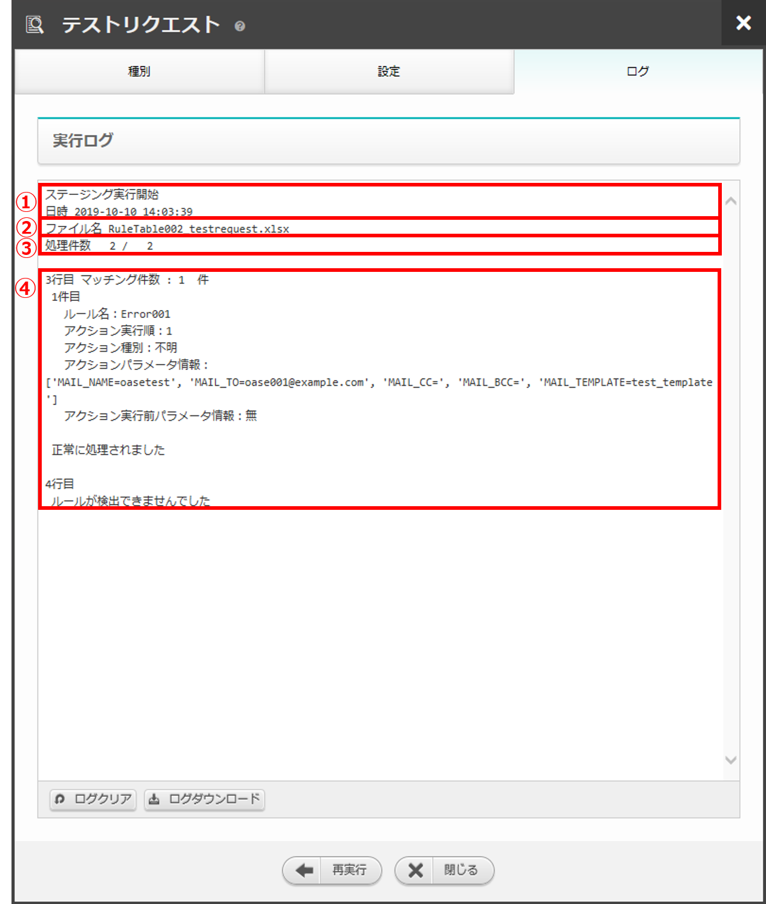

   図 2.2-5-2-2 実行ログ(一括テスト)

.. csv-table:: 表 2.2-5-1-2 機能説明
   :header: No., 構成要素, 説明
   :widths: 5, 20, 60

   1, ステージング実行開始, テストリクエストが実行された日時が表示されます。
   2, ファイル名, リクエストが記述された一括リクエストファイル名が表示されます。
   3, 処理件数, 分母に送信されたリクエスト数、分子にテストが完了したリクエスト数が表示されます。
   4, 実行状態, 各リクエストごとに、ファイル内の記述行、および、テストの実行状態が表示されます。Red Hat Decision Managerからマッチング結果を受信した場合、その件数、および、アクションパラメーターが表示されます。

ログクリア
^^^^^^^^^^
* 実行ログに表示されている内容をクリアします。
* また、ダウンロードボタンを押下することができなくなります。

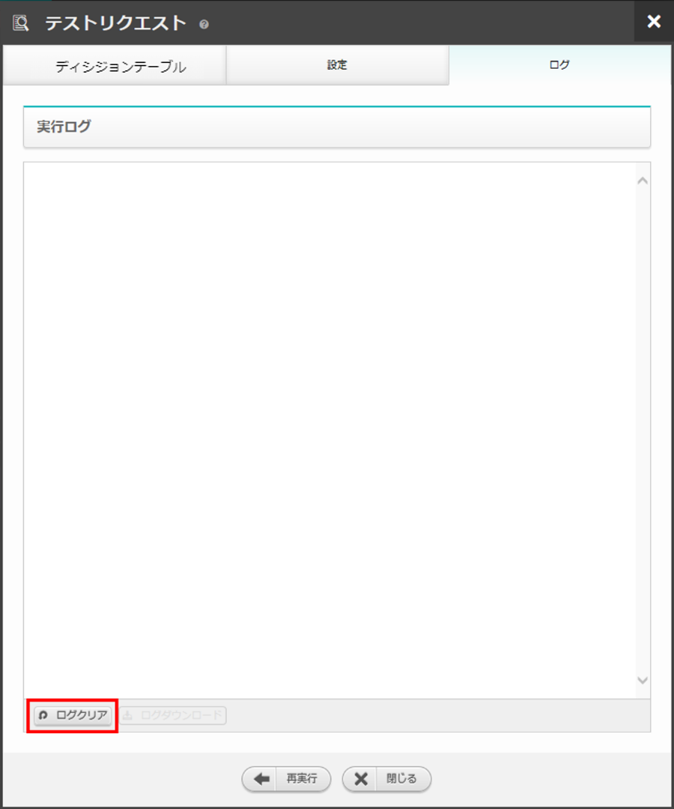

   図 2.2-5-3 ログクリア

ログダウンロード
^^^^^^^^^^^^^^^^
* 実行ログに表示されている内容をテキストファイルに出力して、ダウンロードします。

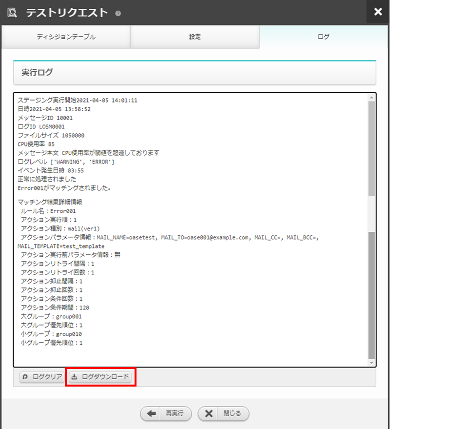

   図 2.2-5-4 ログダウンロード

再実行
^^^^^^
* 設定タブへ遷移します。
* テストが実行中の場合、種別タブの実行ボタンが再度押下されるまで、テストの実行状況の取得は継続して行われます。

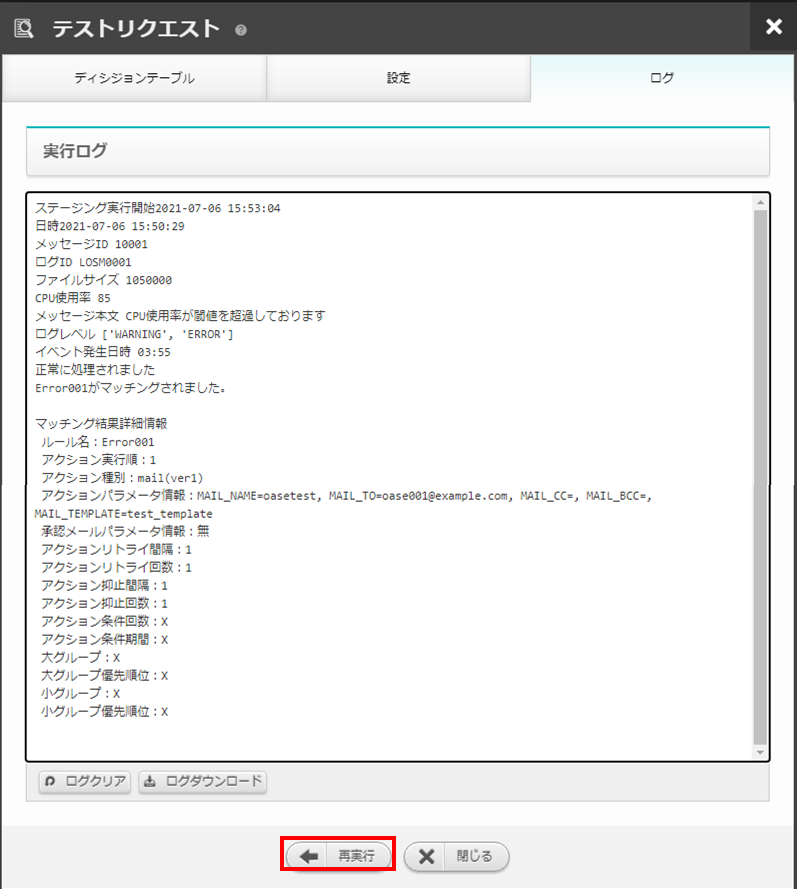

   図 2.2-5-5 再実行

ディシジョンテーブルタブ
^^^^^^^^^^^^^^^^^^^^^^^^
* ディシジョンテーブルタブへ遷移します。
* テストが実行中の場合、種別タブの実行ボタンが再度押下されるまで、テストの実行状況の取得は継続して行われます。

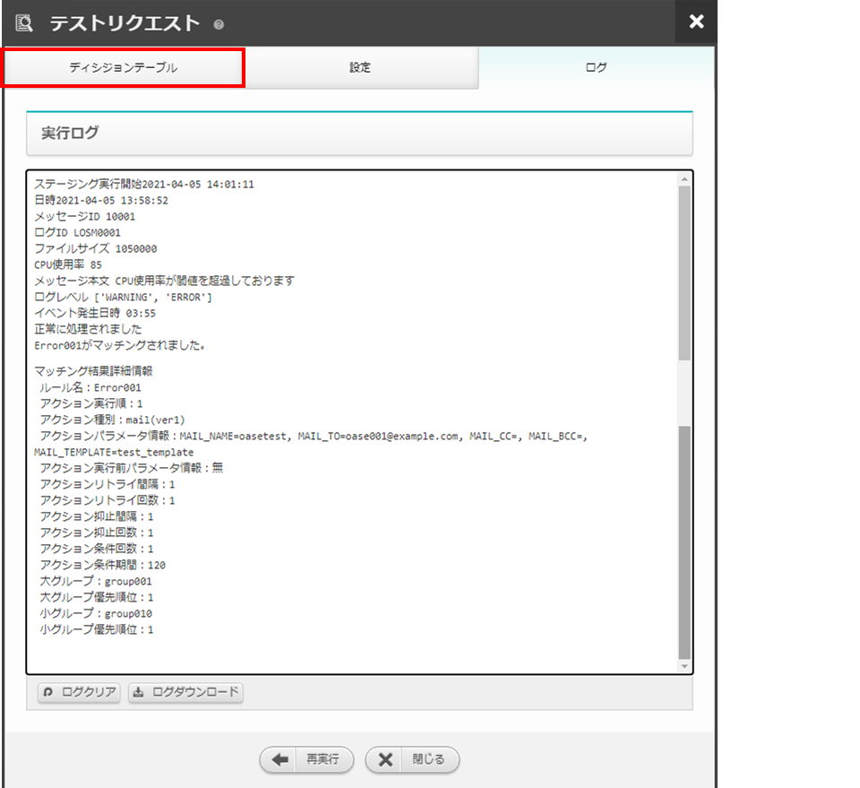

   図 2.2-5-6 ディシジョンテーブルタブ

設定タブ
^^^^^^^^
* 設定タブへ遷移します。
* 前述の「再実行」ボタンと同様です。

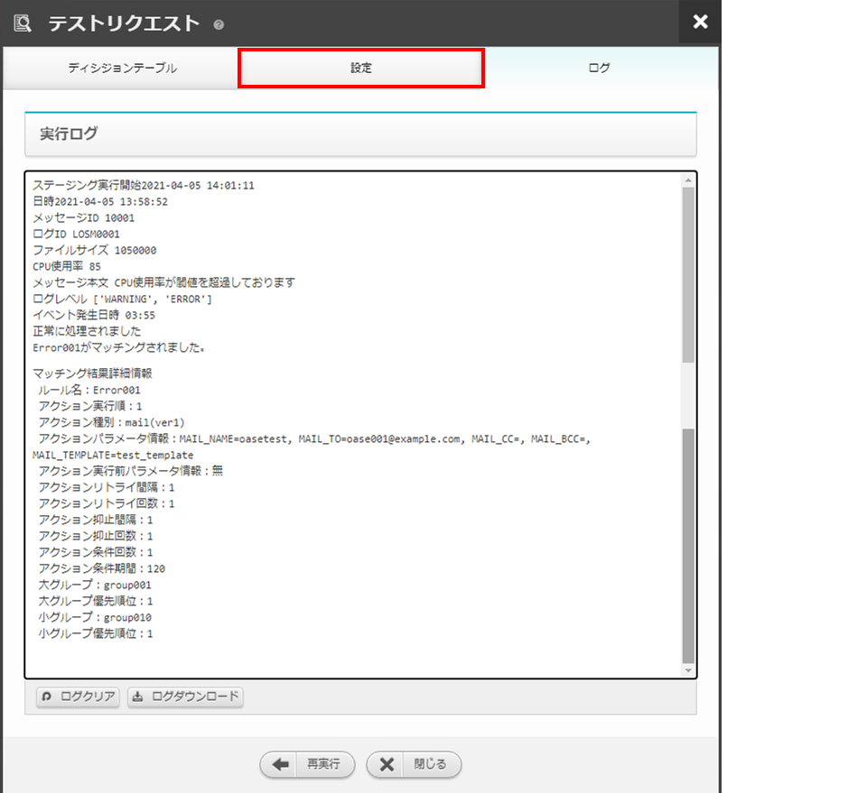

   図 2.2-5-7 設定タブ

閉じる
^^^^^^
* ディシジョンテーブル名選択前の場合、押下と同時にテストリクエスト画面を閉じます。
* ディシジョンテーブル名選択後の場合、押下すると「変更がありますが、破棄して閉じますか？」と確認メッセージが表示されます。
* テストリクエストの実行状態が完了前の場合、「OK」を選択すると、テストの実行状況の取得を中止してルール画面に戻ります。
* テストリクエストの実行状態が完了後の場合、「OK」を選択するとルール画面に戻り、「運用ステータスを検証完了にしてよろしいですか？」と確認メッセージが表示されます。「OK」を選択すると運用ステータスが「検証完了」へ、「キャンセル」を選択すると運用ステータスが「検証実施中」へ遷移します。
* ボタンとアイコンのいずれも同じ挙動をします。

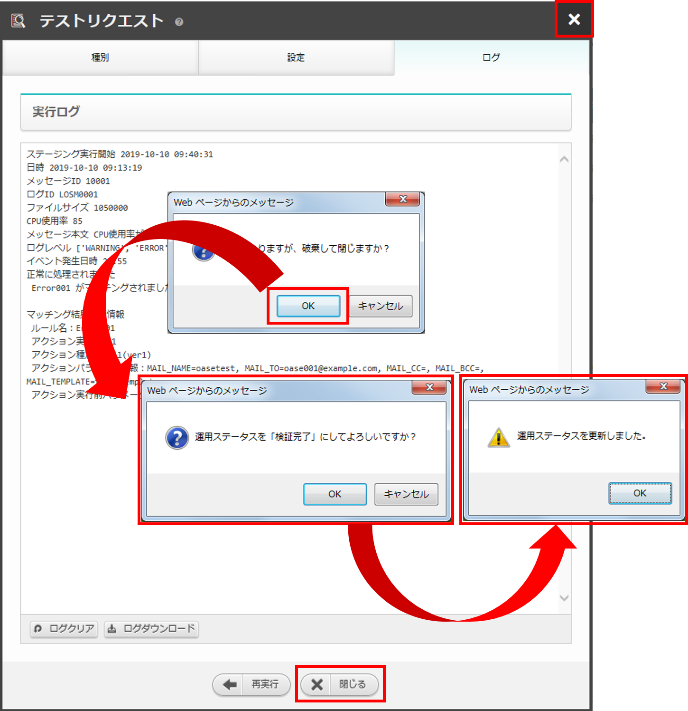

   図 2.2-5-8 閉じる

