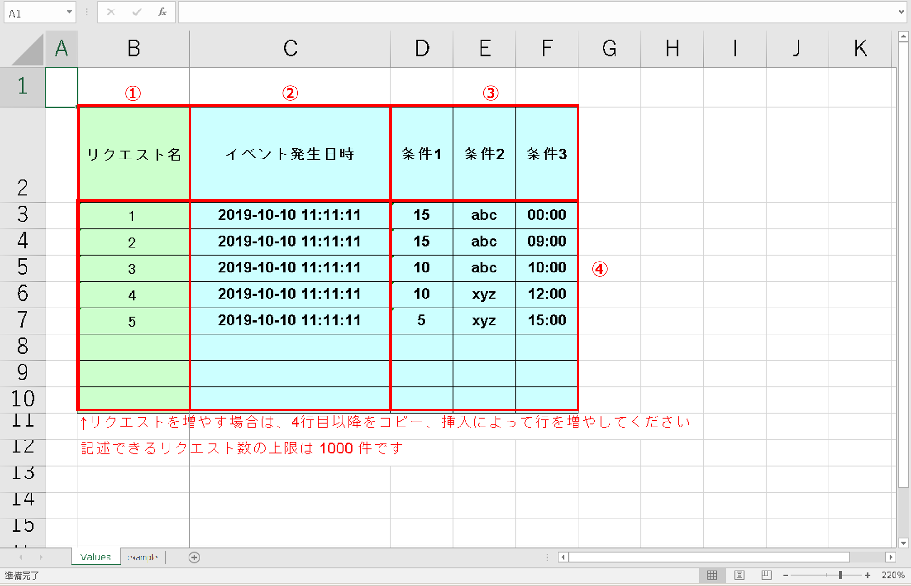

=========================================
4 OASE 一括テスト用Excelファイル
=========================================

| 本章では、一括テスト用Excelファイルについて説明します。

4.1 ファイル取得
================

| 一括テスト用Excelファイルの取得方法は、
| 「2 OASE ルール画面のメニュー 、画面構成」に記載されている :ref:`label_get_button` をご参照ください。

4.2 ファイル構成
================

| 一括テスト用Excelファイルの構成は次のとおりです。

   図 4.2-1 一括テスト用Excelファイル構成

.. csv-table:: 表 4.2-1 一括テスト用Excelファイルの構成説明
   :header: No., 構成要素, 説明
   :widths: 5, 20, 60

   1, リクエスト名, 任意項目です。どのルールの為のリクエストかわかるように記述することをお勧めします。
   2, イベント発生日時, 必須項目です。イベントの発生した日時を記入します。yyyy-m-d h:d:s 形式で記入をして下さい。
   3, 条件名, ルール種別に依存する情報となり、ディシジョンテーブル画面にて指定した条件名が列挙されます。同一の条件名が複数ある場合、それらは同一の値でなければならないため、入力項目は一項目に集約されます。記述する値については、後述で説明する、:ref:`label_ex_button` を参考にしてください。
   4, リクエスト数, 記入できるリクエスト数の上限は1000件になります。

.. _label_ex_button:

4.3 記述例
==========

| 一括テスト用Excelファイルの記述例は次のとおりです。

.. list-table:: 表 4.3-1 記述例
   :header-rows: 1
   :widths: 5, 20, 20

   * - No.
     - 条件式
     - 記述例
   * - 1
     - 等しい(数値)
     - 100
   * - 2
     - 等しくない(数値)
     - 100
   * - 3
     - 等しい(文字列)
     - abc
   * - 4
     - 等しくない(文字列)
     - abc
   * - 5
     - より大きい
     - 100
   * - 6
     - 以上
     - 100
   * - 7
     - より小さい
     - 100
   * - 8
     - 以下
     - 100
   * - 9
     - 正規表現に一致する
     - エラーが発生しました。
   * - 10
     - 正規表現に一致しない
     - エラーが発生しました。
   * - 11
     - 含む
     - ["abc","1","aa"]
   * - 12
     - 含まない
     - ["abc","1","aa"]
   * - 13
     - 時間[HH:mm](From-to)
     - 09:05

