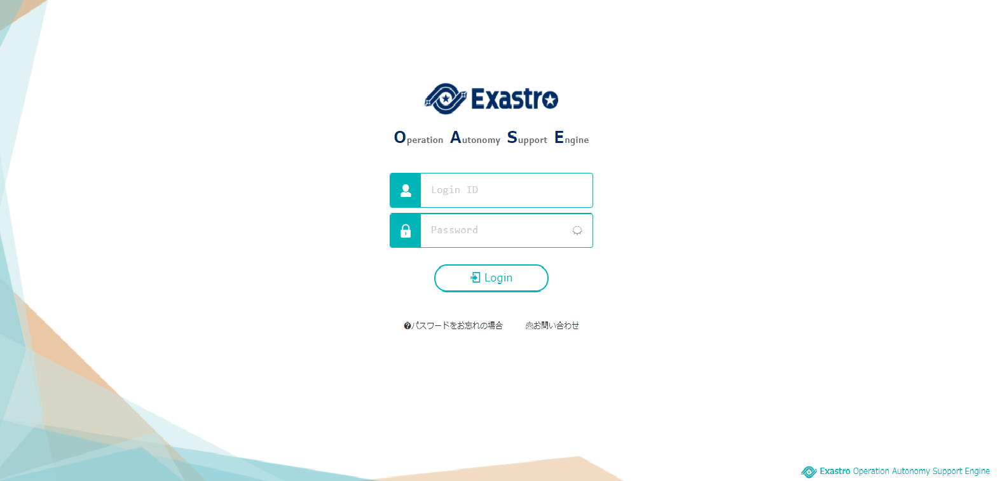
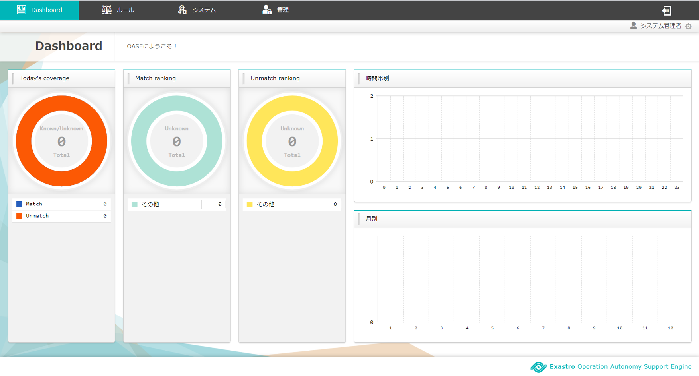

=================================
インストール手順
=================================

OASEのインストール手順を下記に示します。

1. 事前準備
-----------

1.1. タイムゾーンを設定する
~~~~~~~~~~~~~~~~~~~~~~~~~~~

.. code-block:: rst

 # timedatectl status 
 
.. code-block:: bash

 Time zone: Asia/Tokyo (JST, +0900)

★Time zone: Asia/Tokyo 以外の場合

.. code-block:: rst

 # timedatectl set-timezone Asia/Tokyo

1.2. 自分自身のホスト名について名前解決できること
~~~~~~~~~~~~~~~~~~~~~~~~~~~~~~~~~~~~~~~~~~~~~~~~~

.. code-block:: rst

 # ping {自ホスト名}

.. code-block:: bash

 ping: {自ホスト名}: 名前またはサービスが不明です

| ★「名前またはサービスが不明です」となる場合
| 
| hostsで指定するなど、名前解決が可能な状態にすること

2. 汎用ツール追加
-----------------

.. note:: 後続の手順で必要になるツールを先にインストールしておく

2.1. wgetインストール
~~~~~~~~~~~~~~~~~~~~~

.. code-block:: rst

 # yum list | grep wget

.. code-block:: bash

 wget.x86_64    1.14-18.el7_6.1    @updates

★インストールされていない場合

.. code-block:: rst

 # yum install -y wget

2.2. gccインストール
~~~~~~~~~~~~~~~~~~~~

.. code-block:: rst

 # yum list | grep gcc

.. code-block:: bash

 gcc.x86_64     4.8.5-36.el7_6.2    @updates

★インストールされていない場合

.. code-block:: rst

 # yum install -y gcc

3. 必須ソフトウェアインストール
-------------------------------

3.1 環境構築ツール（オンライン版）の実行
~~~~~~~~~~~~~~~~~~~~~~~~~~~~~~~~~~~~~~~~

3.1.1. Githubからの資材ダウンロード
***********************************

| 以下のコマンドで資材をDLします。

.. code-block:: rst

 # wget https://github.com/exastro-suite/oase/releases/download/vx.x.x/exastro-oase-x.x.x.tar.gz

.. note:: バージョン（x.x.x）は適宜変更してください。

3.1.2. 資材の展開
**************************

| tar.gzファイルを解凍します。

.. code-block:: rst

 # tar zxf exastro-oase-x.x.x.tar.gz

3.1.3. ディレクトリ移動
**************************

| 環境構築を行うシェルのあるディレクトリに移動します。

.. code-block:: rst

 # cd oase/oase_install_package/install_scripts

3.1.4. アンサーファイルの編集
*****************************

| OASEのインストール設定を行うアンサーファイル（oase_answers.txt）を事前に作成してください。
| アンサーファイルの各項目の内容は次の表のとおりです。
| 初期値が入っているものは、使用する環境によって適宜変更してください。

.. csv-table:: 表 アンサーファイル項目説明
   :header: No., 項目名, 初期値, 説明
   :widths: 5, 20, 20, 60

   1, install_mode, Install_Online, インストールモードの設定（オンラインインストール：Install_Online/オフラインインストール：Install_Offline/ライブラリ収集：Gather_Library/バージョンアップALL：Versionup_All/バージョンアップOASE：Versionup_OASE/アンインストール：Uninstall）
   2, RabbitMQ_username, admin, RabbitMQのユーザ名
   3, RabbitMQ_password, password, RabbitMQのパスワード
   4, RabbitMQ_queuename, oase, RabbitMQで使用するキュー名
   5, RabbitMQ_ipaddr, , RabbitMQを設定したサーバのIPアドレス
   6, db_root_password, password, MariaDBのルートユーザのパスワード
   7, db_name, OASE_DB, MariaDBで使用するDB名
   8, db_username, OASE_USER, MariaDBで使用するユーザ名
   9, db_password, OASE_PASSWD, MariaDBのパスワード
   10, db_erase, erase, アンインストール時にDBを消すかどうか（消す：erase/残す：leave）
   11, jboss_root_directory, /exastro/JBoss, JBossのインストールディレクトリ
   12, rules_engine, , 使用するルールエンジンを選択(rhdm or drools)
   13, rule_engine_adminname, admin0000, ルールエンジンの管理者名
   14, rule_engine_password, password@1, ルールエンジンのパスワード
   15, rule_engine_ipaddrport, localhost:8080, ルールエンジンのIPアドレスとポート番号
   16, rhdm_path, , RHDMインストーラーファイルのパス(rules_engineにrhdmを指定時のみ入力。絶対パスで指定してください)
   17, jboss_eap_path, , Jboss EAPインストーラーファイルのパス(rules_engineにrhdmを指定時のみ入力。絶対パスで指定してください)
   18, rulefile_rootpath, /exastro/rule, ルールファイルを格納するディレクトリ
   19, apply_ipaddrport, 127.0.0.1:50001, アプライサービスを設定したサーバのIPアドレス
   20, mavenrep_path, /root/.m2/repository/com/oase/, Mavenリポジトリのディレクトリ
   21, oasemail_smtp, "{'IPADDR':'127.0.0.1','PORT':25,'AUTH':False}", OASEで使用するメールのSMTP設定
   22, oase_directory, /exastro, OASEのインストールディレクトリ
   23, ev_location, 127.0.0.1, EVTIMERサーバを設定したサーバのIPアドレス
   24, oase_language, ja_JP, OASEの言語設定（日本語：ja_JP 英語：en_US）
   25, oase_os, , OASEをインストールするサーバのOS（CentOS7/RHEL7/RHEL8）
   26, oase_timezone, , OASEのtimezone設定
   27, oase_base, yes, OASE本体のインストール有無指定
   28, ita_driver, yes, ITAドライバのインストール有無指定
   29, mail_driver, yes, mailドライバのインストール有無指定
   30, servicenow_driver, no, ServiceNowドライバのインストール有無指定
   31, zabbix_adapter, yes, Zabbixアダプタのインストール有無指定
   32, prometheus_adapter, no, Prometheusアダプタのインストール有無指定
   33, grafana_adapter, no, Grafanaアダプタのインストール有無指定
   34, datadog_adapter, no, Datadogアダプタのインストール有無指定
   35, oase_domain, exastro-oase.local, OASEのドメイン名
   36, certificate_path, , ユーザ指定のSSLサーバ証明書に使用するファイルのファイルパス(ユーザ指定のSSL証明書使用時のみ入力。絶対パスで指定してください)
   37, private_key_path, , ユーザ指定のSSL秘密鍵に使用するファイルのファイルパス(ユーザ指定のSSL秘密鍵使用時のみ入力。絶対パスで指定してください)

.. note::

 | OASEのログイン画面、ログイン画面にあるパスワードをお忘れの場合から遷移されるパスワード変更画面、
 | インストールで登録されるユーザ、グループ、デシジョンテーブルファイル、一括テスト用Excelファイルはインストール時のOASEの言語設定により、日本語または英語を表示します。
 | それ以外に関しては個人設定画面からユーザ毎に日本語、英語を選択/表示できます。

3.1.5. アンサーファイルのサンプル
*********************************

| アンサーファイル（oase_answers.txt）のサンプルを以下に示します。

.. code-block:: rst

 # Select install mode. 
 # ("Install_Online","Install_Offline","Gather_Library","Versionup_All", "Versionup_OASE", "Uninstall")
 # e.g) install_mode:Install_Online
 install_mode:Install_Online

 ##############################
 # RabbitMQ
 ##############################
 # Decide the RabbitMQ_username.
 # e.g) RabbitMQ_username:sample_rabbitmq_username
 RabbitMQ_username:admin

 # Decide the RabbitMQ_password.
 # e.g) RabbitMQ_password:sample_rabbitmq_password
 RabbitMQ_password:password

 # Decide the RabbitMQ_queuename.
 # e.g) RabbitMQ_queuename:oase
 RabbitMQ_queuename:oase

 # Enter IP address for RabbitMQ.
 # e.g) RabbitMQ_ipaddr:xxx.xxx.xxx.xxx
 RabbitMQ_ipaddr:127.0.0.1

 ##############################
 # MariaDB
 ##############################
 # Enter the MariaDB root user's password
 # e.g) db_root_password:sample_root_password
 db_root_password:password

 # Decide the database name, username, and password for OASE.
 # e.g) db_name:sample_db_name
 db_name:OASE_DB
 # e.g) db_username:sample_db_username
 db_username:OASE_USER
 # e.g) db_password:sample_db_password
 db_password:OASE_PASSWD

 # In uninstall mode,
 # Select "erase" or "leave" oase database
 # e.g) db_erase:erase
 db_erase:erase

 ##############################
 # JBoss
 ##############################
 # Enter JBoss install directory.
 # e.g) jboss_root_directory:/exastro/JBoss
 jboss_root_directory:/exastro/JBoss

 ##############################
 # Rules Engine
 ##############################
 # Rules engine to be used.("rhdm" or "drools")
 # e.g) rules_engine:drools
 rules_engine:rhdm

 # Decide the Administrator name, password.
 # e.g) rule_engine_adminname:admin0000
 rule_engine_adminname:admin0000
 # e.g) rule_engine_password:password@1
 rule_engine_password:password@1

 # Enter IP address & port for Rule Engine.
 # e.g) rule_engine_ipaddrport:localhost:8080
 rule_engine_ipaddrport:localhost:8080

 ##############################
 # RHDM
 ##############################
 # Full path of RHDM materials.
 # e.g) rhdm_path:/tmp/rhdm-installer-x.x.x.jar
 rhdm_path:/tmp/rhdm-installer-7.3.1.jar

 # Full path of jboss-eap materials.
 # Only used for RHDM.
 # e.g) jboss_eap_path:/tmp/jboss-eap-x.x.x-installer.jar
 jboss_eap_path:/tmp/jboss-eap-7.2.0-installer.jar

 ##############################
 # RULEFILE
 ##############################
 # Enter root path for RULEFILE.
 # e.g) rulefile_rootpath:/exastro/rule
 rulefile_rootpath:/exastro/rule

 ##############################
 # APPLY
 ##############################
 # Enter IP address & port for APPLY SERVICE.
 # e.g) apply_ipaddrport:127.0.0.1:50001
 apply_ipaddrport:127.0.0.1:50001

 ##############################
 # Maven
 ##############################
 # Enter repository path for Maven.
 # e.g) mavenrep_path:/root/.m2/repository/com/oase/
 mavenrep_path:/root/.m2/repository/com/oase/

 ##############################
 # OASEメールSMTP設定
 ##############################
 # Enter smtp settings.
 # e.g) oasemail_smtp:"{'IPADDR':'127.0.0.1','PORT':25,'AUTH':False}"
 oasemail_smtp:"{'IPADDR':'127.0.0.1','PORT':25,'AUTH':False}"

 ##############################
 # OASEインストールディレクトリ
 ##############################
 # Enter OASE install directory.
 # e.g) oase_directory:/exastro
 oase_directory:/exastro

 ##############################
 # settings.py
 ##############################
 # Decide the EVTIMER SERVER location
 # e.g) ev_location:127.0.0.1
 ev_location:127.0.0.1

 # Select language. ("ja" or "en")
 # e.g) oase_language:ja
 oase_language:ja

 # Select Operation System. ("CentOS7" or "RHEL7" or "RHEL8")
 # e.g) oase_os:RHEL7
 oase_os:RHEL7

 # Enter time_zone.
 # e.g) time_zone:Asia/Tokyo
 oase_timezone:Asia/Tokyo

 ##############################
 # Installation package
 ##############################
 # Select the target you need to install.
 # yes : need
 # no  : no need
 oase_base:yes
 ita_driver:yes
 mail_driver:yes
 servicenow_driver:no
 zabbix_adapter:yes
 prometheus_adapter:no
 grafana_adapter:no
 datadog_adapter:no

 ##############################
 # SSLサーバ証明書
 ##############################
 # Enter the oase domain name.
 # e.g) oase_domain:exastro-oase.local
 oase_domain:exastro-oase.local

 # Enter when using user-specified certificates and private keys.
 # If no file path is entered for both "certificate_path" and "private_key_path",
 # the OASE installer creates and installs a self-certificate and private key
 # using the values entered in "oase_domain".

 # Enter the file path where the certificate to be install.
 # e.g) certificate_path:/temp/etc_pki_tls_certs/exastro-oase.crt
 certificate_path:

 # Enter the file path where the private key to be install.
 # e.g) private_key_path:/temp/etc_pki_tls_certs/exastro-oase.key
 private_key_path:

3.1.6. 環境構築ツール（オンライン版）実行
*****************************************

| 1. 以下のコマンドで、環境構築ツールを実行します。

.. code-block:: rst

 # sh oase_installer.sh

| 2. 処理の確認
| 環境構築ツールを実行するとoase_install.logに処理内容が出力されます。

.. note:: ログ格納パス： /(インストール資材展開先)/oase_install_package/install_scripts/logs

| 3. インストーラー終了確認
| 標準出力に下記のように表示された場合はインストールが正常に完了しております。

.. code-block:: rst

 [2020-11-12 08:59:43] INFO : Finished to install
 [2020-11-12 08:59:43] #####################################
 [2020-11-12 08:59:43] INFO : Install Finished
 [2020-11-12 08:59:43] #####################################

| 4. setings.pyの編集
| settings.pyのHOST_NAMEの部分に以下のようにURLを記載してください。

.. code-block:: rst

 # vi (OASEをインストールしたディレクトリのパス)/OASE/oase-root/confs/frameworkconfs/settings.py

| HOST_NAME = 'https://(サーバのIPアドレス)'

.. code-block:: rst

 例：HOST_NAME = 'https://127.0.0.1'

| その後httpdサービスを再起動してください。

.. code-block:: rst

 # systemctl restart httpd

| 5. URL接続
| 以下のURLより、ログイン画面にアクセスしてください。
| URL：https://(サーバのIPアドレス)

| 6. ログイン
| OASEのログイン画面が表示されたら、指定のログインID、初期パスワードを入力して、[Login]ボタンを押下してください。
| ・ログインID　　： administrator
| ・初期パスワード： oaseoaseoase

   図1 ログイン画面

.. note::

 | インストール後に初めてログインした場合は、「パスワード変更画面」に遷移します。
 | パスワード変更画面から、初期パスワードを変更してください。
 | ログイン画面の詳細については「利用手順マニュアル -ログイン画面編-」をご参照ください。

| 7. Dashboard画面
| ログイン後、図2の画面が表示されます。

   図2 Dashboard画面

| OASEのインストール作業は以上となります。
| 次にドライバインストールを行いますので、「環境構築マニュアル -ドライバインストール編-」をご参照ください。
| 監視ツールと連携を行う場合は「環境構築マニュアル -アダプタインストール編-」をご参照ください。
| ActiveDirectoryを行いたい場合は「環境構築マニュアル -ActiveDirectory編-」をご参照ください。

.. note::

 | OASEをインストールする環境で、既にインストール済みのソフトウェアはスキップを行います。
 | 標準出力に下記のようにSKIP LISTが表示された場合は、スキップ処理が行われています。
 | その場合は「7. スキップ処理の確認」の手順を実施してください。

 .. code-block:: rst

  [2020-11-12 08:59:43] INFO : Finished to install
  [2020-11-12 08:59:43] #####################################
  [2020-11-12 08:59:43] SKIP LIST(Please check the Settings) 
  [2020-11-12 08:59:43] ・rabbitmq-server
  [2020-11-12 08:59:43] ・mariadb-server
  [2020-11-12 08:59:43] #####################################
  [2020-11-12 08:59:43] INFO : Install Finished
  [2020-11-12 08:59:43] #####################################

| 8. スキップ処理の確認
| RabbitMQやMariaDBをスキップした場合は、OASE用に設定が必要になります。

| 8.1 RabbitMQ
| OASE用のユーザ作成を実施するため、以下のコマンドを実行してください。

| 1 ユーザ作成

.. code-block:: rst

 # rabbitmqctl add_user {RabbitMQ_username} {RabbitMQ_password}

| 2 ユーザの権限設定

.. code-block:: rst

 # rabbitmqctl set_user_tags {RabbitMQ_username} administrator

| 3 ユーザのパーミッション設定

.. code-block:: rst

 # rabbitmqctl set_permissions -p / {RabbitMQ_username} ".*" ".*" ".*"

.. note:: 3.1.4 アンサーファイルの編集にて記述頂きました、ユーザ名/パスワードでユーザ作成してください。

| 8.2 MariaDB
| OASE用のデータベース、ユーザ作成を実施するため、以下のコマンドを実行してください。

| 1 OASE用のデータベースとユーザ作成

.. code-block:: rst

 # mysql -u root -p{db_root_password}

.. code-block:: rst

 MariaDB [(none)]> CREATE DATABASE {db_name} CHARACTER SET utf8;
 MariaDB [(none)]> CREATE USER '{db_username}' IDENTIFIED BY '{db_password}';
 MariaDB [(none)]> GRANT ALL ON {db_name}.* TO '{db_username}';
 MariaDB [(none)]> quit

.. note:: 3.1.4 アンサーファイルの編集にて記述頂きました、rootパスワード、データベース名、ユーザ名、パスワードで作成してください。

.. danger:: 注意

 | OASEのインストールではインストール済みのソフトウェアはスキップを行います。
 | アップグレードは行いませんのでご注意ください。

4. 注意事項
-------------------------------

4 ディシジョンテーブル作成可能数
~~~~~~~~~~~~~~~~~~~~~~~~~~~~~~~~~~

| ディシジョンマネージャは環境によって作成できるディシジョンテーブル数が変動します。
| ディシジョンテーブルの最大作成可能数はデフォルトでは4ファイル程度となります。
| 記載ルール数またはルール自体の複雑度によってディシジョンテーブル作成数が前後する可能性があります。
| より多くのディシジョンテーブルの作成を実施したい場合はチューニングが必要となります。

.. danger:: 注意

 | ディシジョンテーブルの最大作成数を超えた場合、ディシジョンテーブルのアップロード・プロダクション適用に失敗する可能性があります。
 | 失敗した場合、以下のディレクトリのログを確認してください。
 | RHDMの場合
 | /var/log/jboss-eap/console.log
 | droolsの場合
 | [JBossのインストールディレクトリ]/wildfly-x.x.x.Final/standalone/log/server.log
 | OutOfMemoryErrorの障害が発生している場合は再起動コマンドを実行してください。
 | RHDMの場合
 | # systemctl restart jboss-eap-rhel.service
 | droolsの場合
 | # systemctl restart drools.service
 | 再起動後、以下のコマンドを実行して、KIEコンテナーの一覧を確認します。
 | # curl -u [ルールエンジン管理ユーザー名]:[ルールエンジン管理パスワード] -H "accept: application/json" -X GET "http://[IPアドレス]:8080/decision-central/rest/controller/management/servers"
 | 削除したいKIEコンテナーのcontainer-idを指定して以下のコマンドを実行することにより、KIEコンテナーが削除されます。
 | # curl -u [ルールエンジン管理ユーザー名]:[ルールエンジン管理パスワード] -X DELETE "http://[IPアドレス]:8080/decision-central/rest/controller/management/servers/default-kieserver/containers/[container-id]" -H "accept: application/json"
 | ※IPアドレスはルールエンジンをインストールしたサーバのアドレス
 |
 | ※ルールエンジンを変更した場合、変更前のルールは移行されず、アンインストール時に削除されます。

.. note::

 | より多くのディシジョンテーブルの作成を実施したい場合はJBOSSヒープサイズのチューニングを行う必要があります。
 | チューニング方法は下記の通りです。
 | RHDMの場合
 | # systemctl stop jboss-eap-rhel.service
 | # vi {jboss_root_directory}/bin/standalone.conf
 | 以下の行のサイズを修正する。
 | JAVA_OPTS="-Xms64m -Xmx1024m -XX:MetaspaceSize=96M -XX:MaxMetaspaceSize=1024m -Djava.net.preferIPv4Stack=true"
 | # systemctl start jboss-eap-rhel.service
 | droolsの場合
 | # systemctl stop drools.service
 | # vi {jboss_root_directory}/wildfly-x.x.x.Final/bin/standalone.conf
 | 以下の行のサイズを修正する。
 | JAVA_OPTS="-Xms64m -Xmx1024m -XX:MetaspaceSize=96M -XX:MaxMetaspaceSize=1024m -Djava.net.preferIPv4Stack=true"
 | # systemctl start drools.service
 | ※{jboss_root_directory}はoase_answers.txtのjboss_root_directory項目に記述したディレクトリパスに置換してください。
