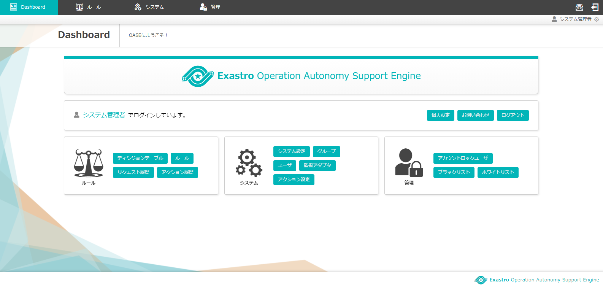

=================================
インストール手順
=================================

OASEのインストール手順を下記に示します。

1. 事前準備
-----------

1.1 ファイアーウォール停止
~~~~~~~~~~~~~~~~~~~~~~~~~~

・ステータス確認

.. code-block:: rst

 # systemctl status firewalld

★Active: activeの場合

.. code-block:: rst

 # systemctl stop firewalld
 # systemctl disable firewalld

1.2. SELinux無効化
~~~~~~~~~~~~~~~~~~

・ステータス確認

.. code-block:: rst

 # getenforce

★Enforcingの場合

.. code-block:: rst

 # vi /etc/sysconfig/selinux

.. code-block:: bash

 SELINUX=disabled

 ※ Enforcing から disabled へ変更

.. code-block:: rst
 
 # reboot

1.3. タイムゾーンを設定する
~~~~~~~~~~~~~~~~~~~~~~~~~~~

.. code-block:: rst

 # timedatectl status 
 
.. code-block:: bash

 Time zone: Asia/Tokyo (JST, +0900)

★Time zone: Asia/Tokyo 以外の場合

.. code-block:: rst

 # timedatectl set-timezone Asia/Tokyo

1.4. 自分自身のホスト名について名前解決できること
~~~~~~~~~~~~~~~~~~~~~~~~~~~~~~~~~~~~~~~~~~~~~~~~~

.. code-block:: rst

 # ping {自ホスト名}

.. code-block:: bash

 ping: {自ホスト名}: 名前またはサービスが不明です

| ★「名前またはサービスが不明です」となる場合
| 
| hostsで指定するなど、名前解決が可能な状態にすること

2. 汎用ツール追加
-----------------

.. note:: 後続の手順で必要になるツールを先にインストールしておく

2.1. wgetインストール
~~~~~~~~~~~~~~~~~~~~~

.. code-block:: rst

 # yum list | grep wget

.. code-block:: bash

 wget.x86_64    1.14-18.el7_6.1    @updates

★インストールされていない場合

.. code-block:: rst

 # yum install -y wget

2.2. gccインストール
~~~~~~~~~~~~~~~~~~~~

.. code-block:: rst

 # yum list | grep gcc

.. code-block:: bash

 gcc.x86_64     4.8.5-36.el7_6.2    @updates

★インストールされていない場合

.. code-block:: rst

 # yum install -y gcc

3. 必須ソフトウェアインストール
-------------------------------

3.1 環境構築ツール（オンライン版）の実行
~~~~~~~~~~~~~~~~~~~~~~~~~~~~~~~~~~~~~~~~

3.1.1. Githubからの資材ダウンロード
***********************************

| 以下のコマンドで資材をDLします。

.. code-block:: rst

 # wget https://github.com/exastro-suite/oase/releases/download/vx.x.x/exastro-oase-x.x.x.tar.gz

.. note:: バージョン（x.x.x）は適宜変更してください。

3.1.2. 資材の展開
**************************

| tar.gzファイルを解凍します。

.. code-block:: rst

 # tar zxf exastro-oase-x.x.x.tar.gz

3.1.3. ディレクトリ移動
**************************

| 環境構築を行うシェルのあるディレクトリに移動します。

.. code-block:: rst

 # cd oase/oase_install_package/install_scripts

3.1.4. アンサーファイルの編集
*****************************

| OASEのインストール設定を行うアンサーファイル（oase_answers.txt）を事前に作成してください。
| アンサーファイルの各項目の内容は次の表のとおりです。
| 初期値が入っているものは、使用する環境によって適宜変更してください。

.. csv-table:: 表 アンサーファイル項目説明
   :header: No., 項目名, 初期値, 説明
   :widths: 5, 20, 20, 60

   1, install_mode, Install, インストールモードの設定（インストール：Install）
   2, RabbitMQ_username, administrator, RabbitMQのユーザ名
   2, RabbitMQ_password, password, RabbitMQのパスワード
   3, RabbitMQ_queuename, oase, RabbitMQで使用するキュー名
   4, RabbitMQ_ipaddr, , RabbitMQを設定したサーバのIPアドレス
   5, db_root_password, password, MySQLのルートユーザのパスワード
   6, db_name, OASE_DB, MySQLで使用するDB名
   7, db_username, OASE_USER, MySQLで使用するユーザ名
   8, db_password, OASE_PASSWD, MySQLのパスワード
   9, db_erase, erase, アンインストール時にDBを消すかどうか（消す：erase/残す：leave）
   10, wildfly_root_directory, /exastro/WildFly, WildFlyのインストールディレクトリ
   11, drools_adminname, admin0000, Droolsの管理者名
   12, drools_password, password@1, Droolsの管理者パスワード
   13, dm_ipaddrport, localhost:8080, ディシジョンマネージャを設定したサーバのIPアドレス
   14, rulefile_rootpath, /exastro/rule, ルールファイルを格納するディレクトリ
   15, apply_ipaddrport, 127.0.0.1:50001, アプライサービスを設定したサーバのIPアドレス
   16, mavenrep_path, /root/.m2/repository/com/oase/, Mavenリポジトリのディレクトリ
   17, oasemail_smtp, "{'IPADDR':'127.0.0.1','PORT':25,'AUTH':False}", OASEで使用するメールのSMTP設定
   18, oase_directory, /exastro, OASEのインストールディレクトリ
   19, oase_session_engine, file, OASEのセッション管理方法（DB：db/ファイル：file/キャッシュ：cache）
   20, ev_location, 127.0.0.1, EVTIMERサーバを設定したサーバのIPアドレス
   21, oase_language, ja, OASEの言語設定（日本語：ja）
   22, oase_os, , OASEをインストールするサーバのOS（CentOS7/RHEL7）

3.1.5. アンサーファイルのサンプル
*********************************

| アンサーファイル（oase_answers.txt）のサンプルを以下に示します。

.. code-block:: rst

 #Select install mode. ("Install")
 # e.g) install_mode:Install
 install_mode:Install

 ##############################
 # RabbitMQ
 ##############################
 # Decide the RabbitMQ_username.
 # e.g) RabbitMQ_username:sample_rabbitmq_username
 RabbitMQ_username:administrator

 # Decide the RabbitMQ_password.
 # e.g) RabbitMQ_password:sample_rabbitmq_password
 RabbitMQ_password:password

 # Decide the RabbitMQ_queuename.
 # e.g) RabbitMQ_queuename:oase
 RabbitMQ_queuename:oase

 # Enter IP address for RabbitMQ.
 # e.g) RabbitMQ_ipaddr:xxx.xxx.xxx.xxx
 RabbitMQ_ipaddr:xxx.xxx.xxx.xxx

 ##############################
 # MySQL
 ##############################
 # Enter the MySQL root user's password
 # e.g) db_root_password:sample_root_password
 db_root_password:password

 # Decide the database name, username, and password for OASE.
 # e.g) db_name:sample_db_name
 db_name:OASE_DB
 # e.g) db_username:sample_db_username
 db_username:OASE_USER
 # e.g) db_password:sample_db_password
 db_password:OASE_PASSWD

 # In uninstall mode,
 # Select "erase" or "leave" oase database
 # e.g) db_erase:erase
 db_erase:erase

 ##############################
 # WildFly
 ##############################
 # Enter WildFly install directory.
 # e.g) wildfly_root_directory:/exastro/WildFly
 wildfly_root_directory:/exastro/WildFly

 ##############################
 # Drools
 ##############################
 # Decide the Administrator name, password.
 # e.g) drools_adminname:admin0000
 drools_adminname:admin0000
 # e.g) drools_password:password@1
 drools_password:password@1

 # Enter IP address & port for Decision Manager.
 # e.g) dm_ipaddrport:localhost:8080
 dm_ipaddrport:localhost:8080

 ##############################
 # RULEFILE
 ##############################
 # Enter root path for RULEFILE.
 # e.g) rulefile_rootpath:/exastro/rule
 rulefile_rootpath:/exastro/rule

 ##############################
 # APPLY
 ##############################
 # Enter IP address & port for APPLY SERVICE.
 # e.g) apply_ipaddrport:127.0.0.1:50001
 apply_ipaddrport:127.0.0.1:50001

 ##############################
 # Maven
 ##############################
 # Enter repository path for Maven.
 # e.g) mavenrep_path:/root/.m2/repository/com/oase/
 mavenrep_path:/root/.m2/repository/com/oase/

 ##############################
 # OASEメールSMTP設定
 ##############################
 # Enter smtp settings.
 # e.g) oasemail_smtp:"{'IPADDR':'127.0.0.1','PORT':25,'AUTH':False}"
 oasemail_smtp:"{'IPADDR':'127.0.0.1','PORT':25,'AUTH':False}"

 ##############################
 # OASEインストールディレクトリ
 ##############################
 # Enter OASE install directory.
 # e.g) oase_directory:/exastro
 oase_directory:/exastro

 ##############################
 # settings.py
 ##############################
 # Select Session management.("db" or "file" or "cache")
 # e.g) oase_session_engine:cache
 oase_session_engine:file

 # Decide the EVTIMER SERVER location
 # e.g) ev_location:127.0.0.1
 ev_location:127.0.0.1

 # Select language. ("ja")
 # e.g) oase_language:ja
 oase_language:ja

 # Select Operation System. ("CentOS7" or "RHEL7")
 # e.g) oase_os:RHEL7
 oase_os:RHEL7

3.1.6. 環境構築ツール（オンライン版）実行
*****************************************

| 1. 以下のコマンドで、環境構築ツールを実行します。

.. code-block:: rst

 # sh oase_online_installer.sh

| 2. 処理の確認
| 環境構築ツールを実行するとoase_install.logに処理内容が出力されます。

.. note:: ログ格納パス：　/(インストール資材展開先)/oase_install_package/install_scripts/logs

| 3. インストーラー終了確認
| 標準出力に下記のように表示された場合はインストールが正常に完了しております。

.. code-block:: rst

 [2020-11-12 08:59:43] INFO : Finished to install
 [2020-11-12 08:59:43] #####################################
 [2020-11-12 08:59:43] INFO : Install Finished
 [2020-11-12 08:59:43] #####################################

| 4. URL接続
| 以下のURLより、ログイン画面にアクセスしてください。
| URL：https://（サーバのIPアドレス）

| 5. ログイン
| OASEのログイン画面が表示されたら、指定のログインID、初期パスワードを入力して、[Login]ボタンを押下してください。
| ・ログインID　　： administrator
| ・初期パスワード： oaseoaseoase

.. figure:: ../images/install/oase_login.png
   :scale: 100%
   :align: center

   図1 ログイン画面

.. note::

 | インストール後に初めてログインした場合は、「パスワード変更画面」に遷移します。
 | パスワード変更画面から、初期パスワードを変更してください。
 | ログイン画面の詳細については「利用手順マニュアル -ログイン画面編-」をご参照ください。

| 6. Dashboard画面
| ログイン後、図2の画面が表示されます。

   図2 Dashboard画面

| OASEのインストール作業は以上となります。
| 次にドライバインストールを行いますので、「環境構築マニュアル -ドライバインストール編-」をご参照ください。
| 監視ツールと連携を行う場合は「環境構築マニュアル -アダプタインストール編-」をご参照ください。
| ActiveDirectoryを行いたい場合は「環境構築マニュアル -ActiveDirectory編-」をご参照ください。

.. note::

 | OASEをインストールする環境で、既にインストール済みのソフトウェアはスキップを行います。
 | 標準出力に下記のようにSKIP LISTが表示された場合は、スキップ処理が行われています。
 | その場合は「7. スキップ処理の確認」の手順を実施してください。

 .. code-block:: rst

  [2020-11-12 08:59:43] INFO : Finished to install
  [2020-11-12 08:59:43] #####################################
  [2020-11-12 08:59:43] SKIP LIST(Please check the Settings) 
  [2020-11-12 08:59:43] ・rabbitmq-server
  [2020-11-12 08:59:43] ・mysql80-community-release
  [2020-11-12 08:59:43] #####################################
  [2020-11-12 08:59:43] INFO : Install Finished
  [2020-11-12 08:59:43] #####################################

| 7. スキップ処理の確認
| RabbitMQやMySQLをスキップした場合は、OASE用に設定が必要になります。

| 7.1 RabbitMQ
| OASE用のユーザ作成を実施するため、以下のコマンドを実行してください。

| 1 ユーザ作成

.. code-block:: rst

 # rabbitmqctl add_user {RabbitMQ_username} {RabbitMQ_password}

| 2 ユーザの権限設定

.. code-block:: rst

 # rabbitmqctl set_user_tags {RabbitMQ_username} administrator

| 3 ユーザのパーミッション設定

.. code-block:: rst

 # rabbitmqctl set_permissions -p / {RabbitMQ_username} ".*" ".*" ".*"

.. note:: 3.1.4 アンサーファイルの編集にて記述頂きました、ユーザ名/パスワードでユーザ作成してください。

| 7.2 MySQL
| OASE用のデータベース、ユーザ作成を実施するため、以下のコマンドを実行してください。

| 1 OASE用のデータベースとユーザ作成

.. code-block:: rst

 # mysql -u root -p{db_root_password}

.. code-block:: rst

 mysql> CREATE DATABASE {db_name} CHARACTER SET utf8;
 mysql> CREATE USER '{db_username}' IDENTIFIED BY '{db_password}';
 mysql> GRANT ALL ON {db_name}.* TO '{db_username}';
 mysql> quit

.. note:: 3.1.4 アンサーファイルの編集にて記述頂きました、rootパスワード、データベース名、ユーザ名、パスワードで作成してください。

.. danger:: 注意

 | OASEのインストールではインストール済みのソフトウェアはスキップを行います。
 | アップグレードは行いませんのでご注意ください。

4. 注意事項
-------------------------------

4 ディシジョンテーブル作成可能数
~~~~~~~~~~~~~~~~~~~~~~~~~~~~~~~~~~

| ディシジョンマネージャは環境によって作成できるディシジョンテーブル数が変動します。
| ディシジョンテーブルの最大作成可能数はデフォルトでは4ファイル程度となります。
| 記載ルール数またはルール自体の複雑度によってディシジョンテーブル作成数が前後する可能性があります。
| より多くのディシジョンテーブルの作成を実施したい場合はチューニングが必要となります。

.. danger:: 注意

 | ディシジョンテーブルの最大作成数を超えた場合、ディシジョンテーブルのアップロード・プロダクション適用に失敗する可能性があります。
 | 失敗した場合、以下のディレクトリのログを確認してください。
 | /var/log/jboss-eap/console.log
 | OutOfMemoryErrorの障害が発生している場合は再起動コマンドを実行してください。
 | # systemctl restart jboss-eap-rhel.service
 | 再起動後、以下のコマンドを実行して、KIEコンテナーの一覧を確認します。
 | # curl -u [RHDM管理ユーザー名]:[RHDM管理パスワード] -H "accept: application/json" -X GET "http://[IPアドレス]:8080/decision-central/rest/controller/management/servers"
 | 削除したいKIEコンテナーのcontainer-idを指定して以下のコマンドを実行することにより、KIEコンテナーが削除されます。
 | # curl -u [RHDM管理ユーザー名]:[RHDM管理パスワード] -X DELETE "http://[IPアドレス]:8080/decision-central/rest/controller/management/servers/default-kieserver/containers/[container-id]" -H "accept: application/json"
 | ※IPアドレスはRHDMをインストールしたサーバのアドレス

