=====================================================
2 OASE SSO設定画面のメニュー 、画面構成
=====================================================

本章では、OASE SSO設定画面の画面構成と、各構成要素について説明します。

2.1 基本画面構成
================

SSO設定画面の画面構成は次のとおりです。

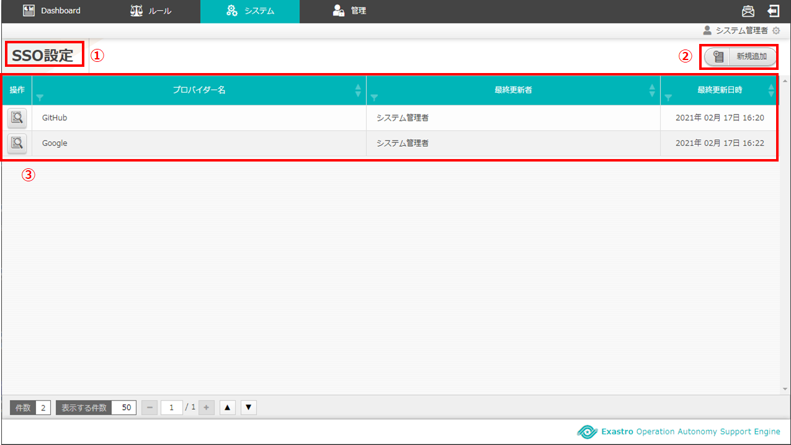

   図 2.1-1 画面構成

SSO設定画面の各構成要素と、その機能は次の表のとおりです。

.. csv-table:: 表 2.1-1 機能説明
   :header: No., 構成要素, 説明
   :widths: 5, 20, 60

   1, 作業画面名, 現在表示している作業画面の名称です。
   2, 新規追加ボタン,新規追加画面に遷移し、SSO基本情報、SSO属性情報を登録します。
   3, 一覧, 現在登録されているSSO設定情報が表示されます。

SSO設定情報が1件も登録されていない場合は以下のように表示されます。

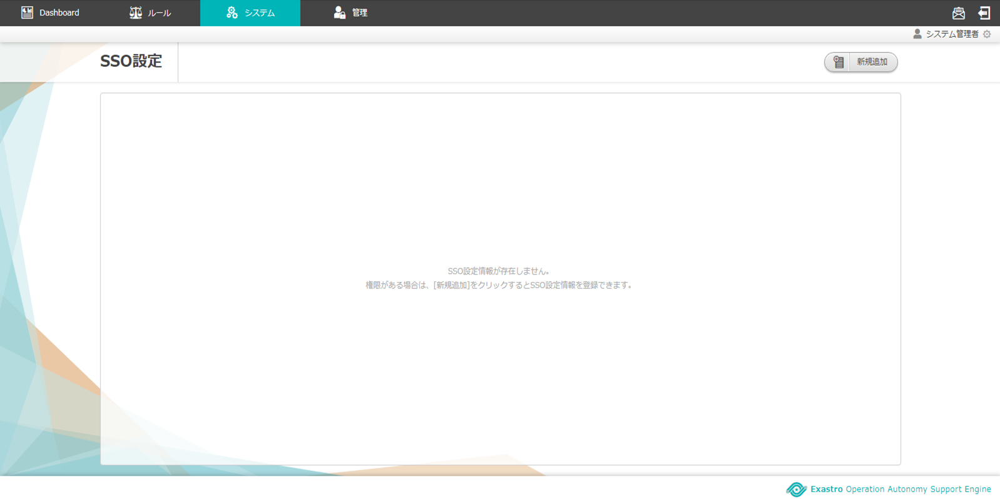

   図 2.1-2 画面構成

新規追加(SSO基本情報)画面の画面構成は次のとおりです。

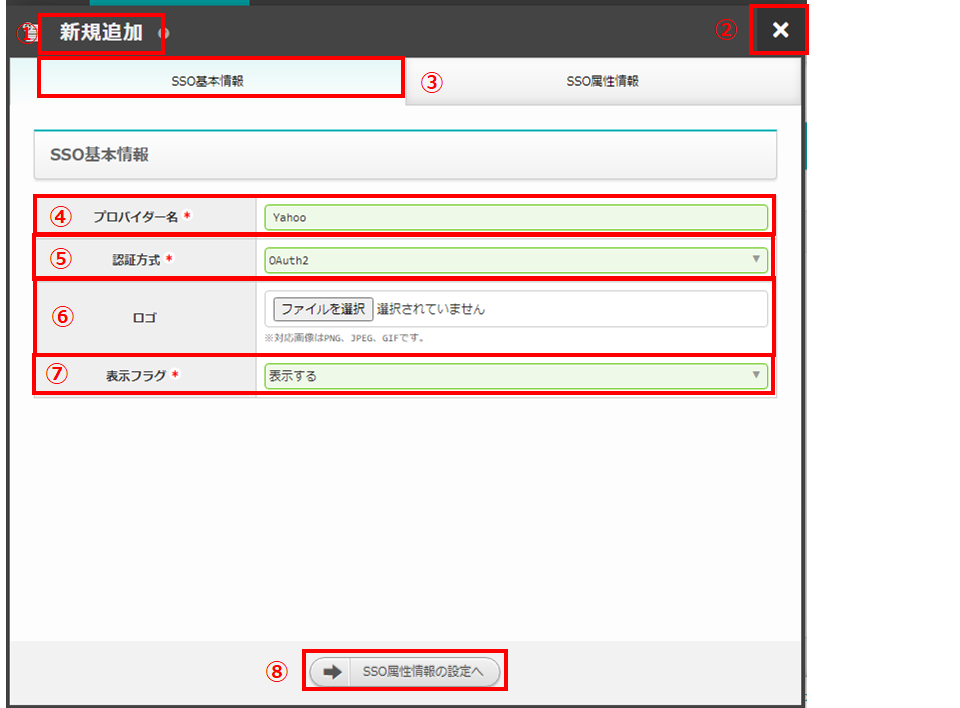

   図 2.1-3 画面構成

新規追加(SSO基本情報)画面の各構成要素と、その機能は次の表のとおりです。

.. csv-table:: 表 2.1-3 機能説明
   :header: No., 構成要素, 説明
   :widths: 5, 20, 60

   1, 作業画面名, 現在表示している作業画面の名称です。
   2, 閉じるボタン, 新規追加画面を閉じてSSO設定画面に戻ります。
   3, 作業タブ名, 現在表示している作業タブの名称です。
   4, プロバイダー名, 任意のプロバイダー名を入力できます。
   5, 認証方式, 認証方式をプルダウン選択できます。
   6, ロゴ, ファイルを選択ボタンを押下し、ロゴとなる画像ファイルを選択できます。
   7, 表示フラグ, 表示フラグをプルダウン選択できます。
   8, SSO属性情報の設定へボタン, SSO基本情報タブの情報を保持したままSSO属性情報タブへ遷移します。

新規追加(SSO属性情報タブ)画面の画面構成は次のとおりです。

.. figure:: ../images/sso_info/sso_info_04.png
   :scale: 100%
   :align: center

   図 2.1-4 画面構成

新規追加(SSO属性情報タブ)画面の各構成要素と、その機能は次の表のとおりです。

.. csv-table:: 表 2.1-4 機能説明
   :header: No., 構成要素, 説明
   :widths: 5, 20, 60

   1, 作業画面名, 現在表示している作業画面の名称です。
   2, 閉じるボタン, 新規追加画面を閉じてSSO設定画面に戻ります。
   3, 作業タブ名, 現在表示している作業タブの名称です。
   4, clientId, 認証クライアント識別子を入力することができます。
   5, clientSecret, 認証クライアントシークレットを入力することができます。
   6, authorizationUri, ユーザー認証エンドポイントを入力することができます。
   7, accessTokenUri, accessToken 取得エンドポイントを入力することができます。
   8, resourceOwnerUri, ユーザー情報取得エンドポイントを入力することができます。
   9, scope, ユーザー情報の開示(取得)範囲を入力することができます。
   10, id, ユーザーID キー名を入力することができます。
   11, name, ユーザー名キー名を入力することができます。
   12, email, ユーザーメールアドレスキー名を入力することができます。
   13, imageUrl, ユーザー画像 URL キー名を入力することができます。
   14, proxy, プロキシを入力することができます。
   15, キャンセルボタン,新規追加画面を閉じてSSO設定画面に戻ります。
   16, 保存ボタン,新規追加情報を保存してSSO設定画面に戻ります。

プロバイダー詳細(SSO基本情報)画面の画面構成は次のとおりです。

.. figure:: ../images/sso_info/sso_info_05.png
   :scale: 100%
   :align: center

   図 2.1-5 画面構成

プロバイダー詳細(SSO基本情報)画面の各構成要素と、その機能は次の表のとおりです。

.. csv-table:: 表 2.1-5 機能説明
   :header: No., 構成要素, 説明
   :widths: 5, 20, 60

   1, 作業画面名, 現在表示している作業画面の名称です。
   2, 閉じるボタン, プロバイダー詳細画面を閉じてSSO設定画面に戻ります。
   3, 作業タブ名, 現在表示している作業タブの名称です。
   4, プロバイダー名, SSO設定画面で選択したプロバイダー名が表示されます。
   5, 認証方式, SSO設定画面で選択したSSO情報の認証方式が表示されます。
   6, ロゴ, SSO設定画面で選択したSSO情報のロゴのファイル名が表示されます。
   7, 表示フラグ, SSO設定画面で選択したSSO情報の表示フラグが表示されます。
   8, 削除ボタン, SSO設定画面で選択したSSO情報を削除しプロバイダー詳細画面を閉じてSSO設定画面に戻ります。
   9, 編集ボタン, SSO設定画面で選択したSSO情報を編集することができます。

プロバイダー詳細(SSO属性情報)画面の画面構成は次のとおりです。

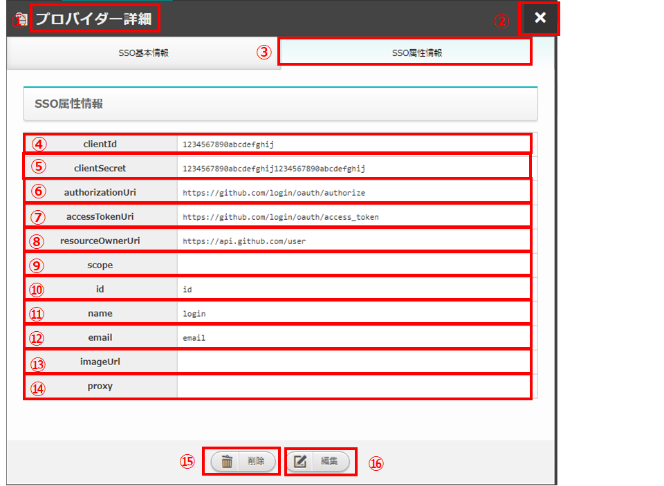

   図 2.1-6 画面構成

プロバイダー詳細(SSO属性情報)画面の各構成要素と、その機能は次の表のとおりです。

.. csv-table:: 表 2.1-6 機能説明
   :header: No., 構成要素, 説明
   :widths: 5, 20, 60

   1, 作業画面名,現在表示している作業画面の名称です。
   2, 閉じるボタン,プロバイダー詳細画面を閉じてSSO設定画面に戻ります。
   3, 作業タブ名,現在表示している作業タブの名称です。
   4, clientId, SSO設定画面で選択したSSO情報の認証クライアント識別子が表示されます。
   5, clientSecret, SSO設定画面で選択したSSO情報の認証クライアントシークレットが表示されます。
   6, authorizationUri, SSO設定画面で選択したSSO情報のユーザー認証エンドポイントが表示されます。
   7, accessTokenUri, SSO設定画面で選択したSSO情報のaccessToken 取得エンドポイントが表示されます。
   8, resourceOwnerUri, SSO設定画面で選択したSSO情報のユーザー情報取得エンドポイントが表示されます。
   9, scope, SSO設定画面で選択したSSO情報のユーザー情報の開示(取得)範囲が表示されます。
   10, id, SSO設定画面で選択したSSO情報のユーザーID キー名が表示されます。
   11, name, SSO設定画面で選択したSSO情報のユーザー名キー名をが表示されます。
   12, email, SSO設定画面で選択したSSO情報のユーザーメールアドレスキー名が表示されます。
   13, imageUrl, SSO設定画面で選択したSSO情報のユーザー画像 URL キー名が表示されます。
   14, proxy, SSO設定画面で選択したSSO情報のプロキシが表示されます。
   15, 削除ボタン, SSO設定画面で選択したSSO情報を削除しプロバイダー詳細画面を閉じてSSO設定画面に戻ります。
   16, 編集ボタン, SSO設定画面で選択したSSO情報を編集することができます。

プロバイダー編集(SSO基本情報)画面の画面構成は次のとおりです。

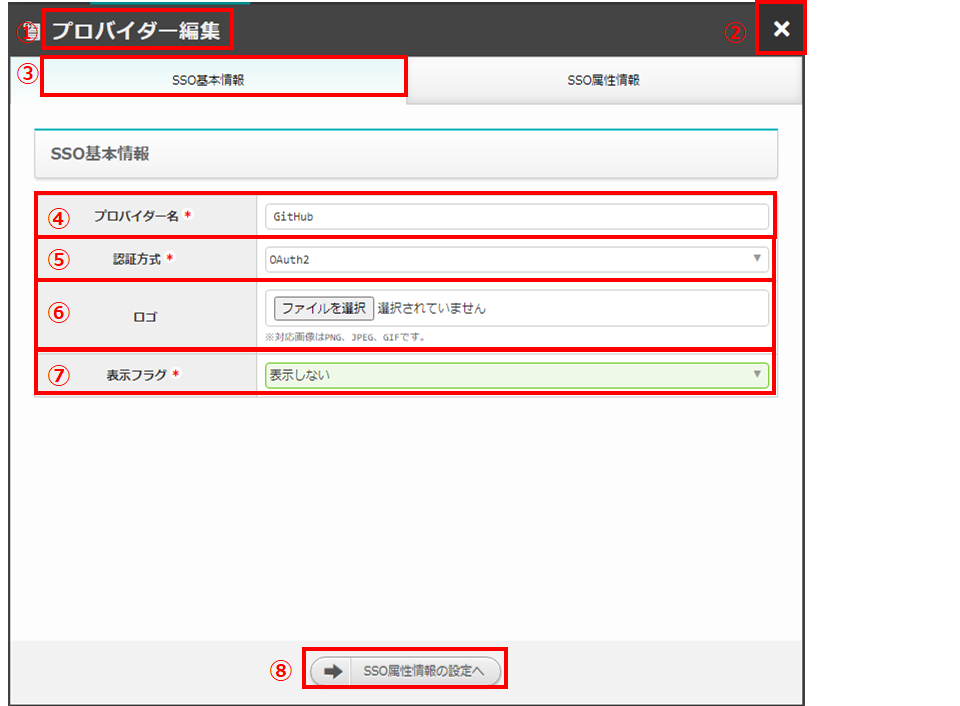

   図 2.1-7 画面構成

プロバイダー編集(SSO基本情報)画面の各構成要素と、その機能は次の表のとおりです。

.. csv-table:: 表 2.1-7 機能説明
   :header: No., 構成要素, 説明
   :widths: 5, 20, 60

   1, 作業画面名, 現在表示している作業画面の名称です。
   2, 閉じるボタン, プロバイダー編集画面を閉じてSSO設定画面に戻ります。
   3, 作業タブ名, 現在表示している作業タブの名称です。
   4, プロバイダー名, SSO設定画面で選択したSSO情報のプロバイダー名が表示され、編集可能です。
   5, 認証方式, SSO設定画面で選択したSSO情報の認証方式が表示され、編集可能です。
   6, ロゴ, SSO設定画面で選択したSSO情報のロゴが表示され、編集可能です。
   7, 表示フラグ, SSO設定画面で選択したSSO情報の表示フラグが表示され、編集可能です。
   8, SSO属性情報の設定へボタン, SSO基本情報タブの情報を保持したままSSO属性情報タブへ遷移します。

プロバイダー編集(SSO属性情報)画面の画面構成は次のとおりです。

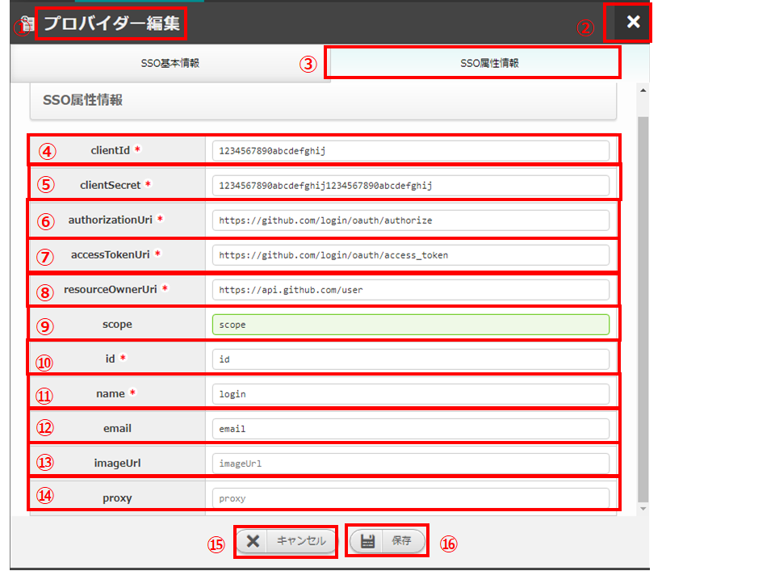

   図 2.1-8 画面構成

プロバイダー編集(SSO属性情報)画面の各構成要素と、その機能は次の表のとおりです。

.. csv-table:: 表 2.1-8 機能説明
   :header: No., 構成要素, 説明
   :widths: 5, 20, 60

   1, 作業画面名,現在表示している作業画面の名称です。
   2, 閉じるボタン,プロバイダー編集画面を閉じてSSO設定画面に戻ります。
   3, 作業タブ名,現在表示している作業タブの名称です。
   4, clientId, SSO設定画面で選択したSSO情報の認証クライアント識別子が表示され、編集可能です。
   5, clientSecret, SSO設定画面で選択したSSO情報の認証クライアントシークレットが表示され、編集可能です。
   6, authorizationUri, SSO設定画面で選択したSSO情報のユーザー認証エンドポイントが表示され、編集可能です。
   7, accessTokenUri, SSO設定画面で選択したSSO情報のaccessToken 取得エンドポイントが表示され、編集可能です。
   8, resourceOwnerUri, SSO設定画面で選択したSSO情報のユーザー情報取得エンドポイントが表示され、編集可能です。
   9, scope, SSO設定画面で選択したSSO情報のユーザー情報の開示(取得)範囲が表示され、編集可能です。
   10, id, SSO設定画面で選択したSSO情報のユーザーID キー名が表示され、編集可能です。
   11, name, SSO設定画面で選択したSSO情報のユーザー名キー名をが表示され、編集可能です。
   12, email, SSO設定画面で選択したSSO情報のユーザーメールアドレスキー名が表示され、編集可能です。
   13, imageUrl, SSO設定画面で選択したSSO情報のユーザー画像 URL キー名が表示され、編集可能です。
   14, proxy, SSO設定画面で選択したSSO情報のプロキシが表示され、編集可能です。
   15, キャンセルボタン,プロバイダー編集画面を閉じてSSO設定画面に戻ります。
   16, 保存ボタン,編集情報を保存してSSO設定画面に戻ります。

2.2 SSO設定画面の操作方法
========================================

構成要素に対する操作方法を説明します。

(1)SSO設定画面
--------------
| 登録されているSSO設定情報を一覧で表示します。
| 新規追加ボタンについては各権限ごとに異なります。ここでは共通機能について説明します。

詳細表示ボタン
^^^^^^^^^^^^^^

選択したプロダイバー名の詳細を表示します。

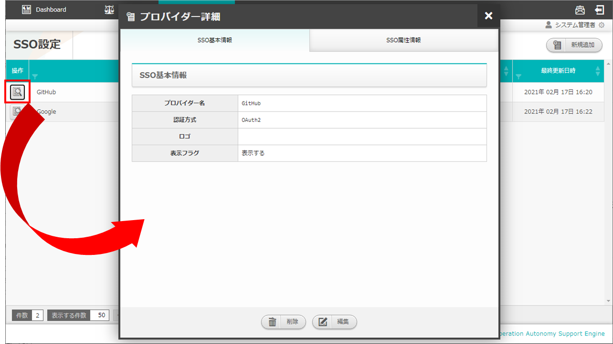

   図 2.2-1-1 「GitHub」の詳細表示ボタンを押下した場合に表示される画面

一覧
^^^^
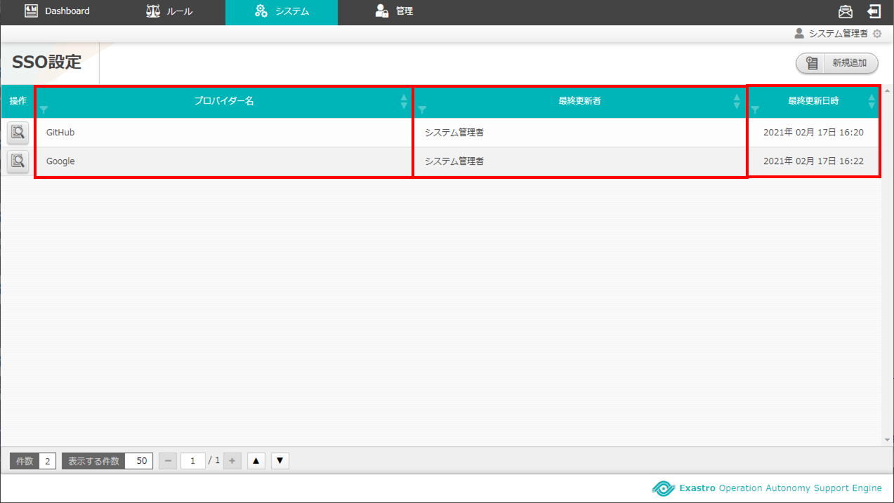

   図 2.2-1-2 SSO設定画面の一覧の各項目

.. csv-table:: 表 2.2-1-2 機能説明
   :header: No., 構成要素, 説明
   :widths: 5, 20, 60

   1, プロバイダー名, プロバイダー名が表示されます。
   2, 最終更新者, SSO設定情報を更新したユーザの名前が表示されます。
   3, 最終更新日時, SSO設定情報を更新した日時が表示されます。

.. note::
   SSO設定画面へのアクセス権限が「更新可能」以外の場合、新規追加ボタンは表示されません。

(2)新規追加画面(SSO基本情報)
----------------------------
SSO設定画面へのアクセス権限が「更新可能」の場合のみ、新規追加画面を表示することができます。

入力欄
^^^^^^

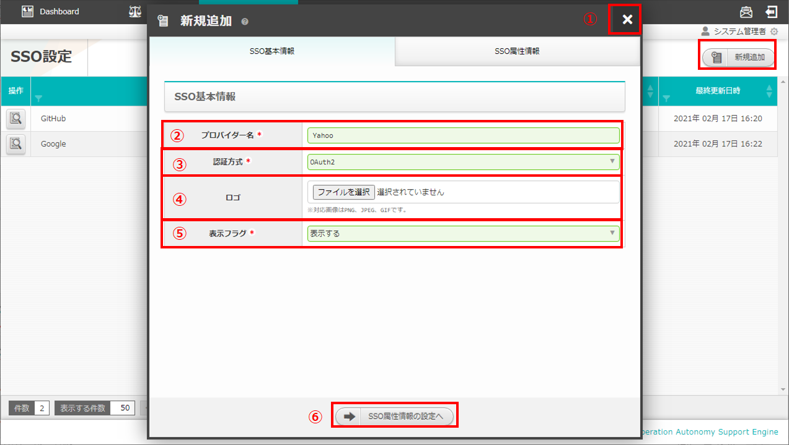

   図 2.2-2-1 新規追加画面(SSO基本情報)

.. csv-table:: 表 2.2-2-1 機能説明
   :header: No., 構成要素, 説明
   :widths: 5, 20, 60

   1, 閉じるボタン, 新規追加画面を閉じてSSO設定画面に戻ります。
   2, プロバイダー名, 入力必須項目です。128文字以内で入力してください。
   3, 認証方式, 必須項目です。プルダウン選択してください。
   4, ロゴ, 任意項目です。アップロードする画像ファイル名は64文字以内にしてください。
   5, 表示フラグ, 必須項目です。プルダウン選択してください。
   6, SSO属性情報の設定へボタン, SSO基本情報タブの情報を保持したままSSO属性情報タブへ遷移します。

(3)新規追加画面(SSO属性情報)
-------------------------------
SSO設定画面へのアクセス権限が「更新可能」の場合のみ、新規追加画面を表示することができます。

入力欄
^^^^^^^

.. figure:: ../images/sso_info/sso_info_12.png
   :scale: 100%
   :align: center

   図 2.2-3-1 新規追加画面(SSO属性情報)

.. csv-table:: 表 2.2-3-1 機能説明
   :header: No., 構成要素, 説明
   :widths: 5, 20, 60

   1, 閉じるボタン, 新規追加画面を閉じてSSO設定画面に戻ります。
   2, clientId, 必須項目です。256文字以内で入力してください。
   3, clientSecret, 必須項目です。256文字以内で入力してください。
   4, authorizationUri, 必須項目です。256文字以内で入力してください。
   5, accessTokenUri, 必須項目です。256文字以内で入力してください。
   6, resourceOwnerUri, 必須項目です。256文字以内で入力してください。
   7, scope, 任意項目です。256文字以内で入力してください。
   8, id, 必須項目です。256文字以内で入力してください。
   9, name, 必須項目です。256文字以内で入力してください。
   10, email, 任意項目です。256文字以内で入力してください。
   11, imageUrl, 任意項目です。256文字以内で入力してください。
   12, proxy, 任意項目です。256文字以内で入力してください。
   13, キャンセルボタン,新規追加画面を閉じてSSO設定画面に戻ります。
   14, 保存ボタン,新規追加情報を保存してSSO設定画面に戻ります。

(4)プロバイダー詳細画面
-----------------------
SSO設定画面へのアクセス権限が「更新可能」の場合のみ、編集/削除ボタンを表示することができます。

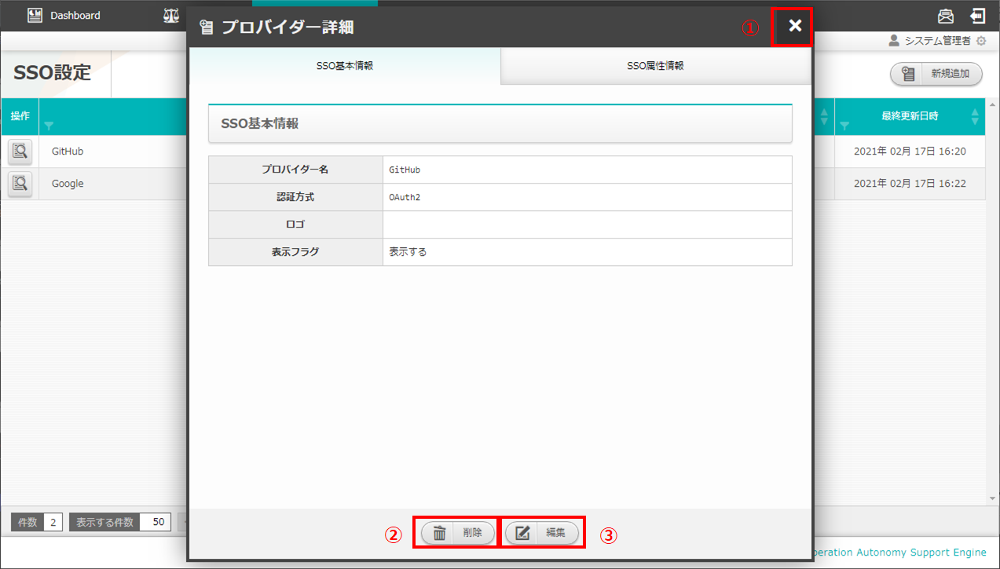

   図 2.2-4-1 プロバイダー詳細画面

.. csv-table:: 表 2.2-4-1 機能説明
   :header: No., 構成要素, 説明
   :widths: 5, 20, 60

   1, 閉じるボタン, プロバイダー詳細画面を閉じ、SSO設定画面に戻ります。
   2, 削除ボタン, SSO設定画面で選択したSSO情報を削除しプロバイダー詳細画面を閉じてSSO設定画面に戻ります。
   3, 編集ボタン, SSO設定画面で選択したSSO情報を編集することができます。

(5)プロバイダー編集画面(SSO基本情報)
------------------------------------

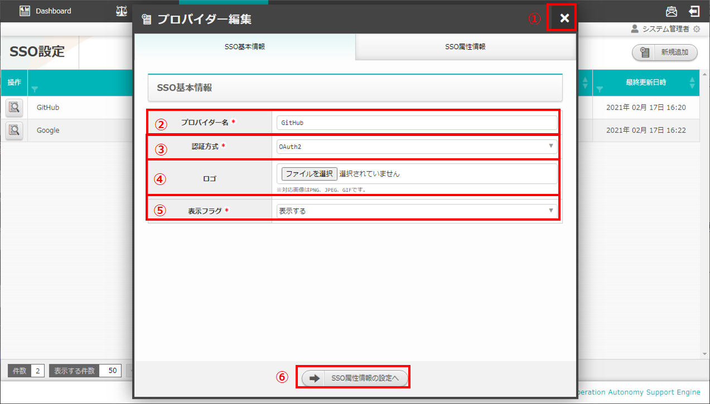

   図 2.2-5-1 プロバイダー編集画面(SSO基本情報)

.. csv-table:: 表 2.2-5-1 機能説明
   :header: No., 構成要素, 説明
   :widths: 5, 20, 60

   1, 閉じるボタン, 変更内容を破棄してプロバイダー編集画面を閉じ、SSO設定画面に戻ります。
   2, プロバイダー名, SSO設定画面で選択したSSO情報のプロバイダー名が表示され、編集可能です。入力必須項目です。128文字以内で入力してください。
   3, 認証方式, SSO設定画面で選択したSSO情報の認証方式が表示され、編集可能です。必須項目です。プルダウン選択してください。
   4, ロゴ, SSO設定画面で選択したSSO情報のロゴが表示され、編集可能です。任意項目です。アップロードする画像ファイル名は64文字以内にしてください。
   5, 表示フラグ, SSO設定画面で選択したSSO情報の表示フラグが表示され、編集可能です。必須項目です。プルダウン選択してください。
   6, SSO属性情報の設定へボタン, SSO基本情報タブの情報を保持したままSSO属性情報タブへ遷移します。

(6)プロバイダー編集画面(SSO属性情報)
------------------------------------

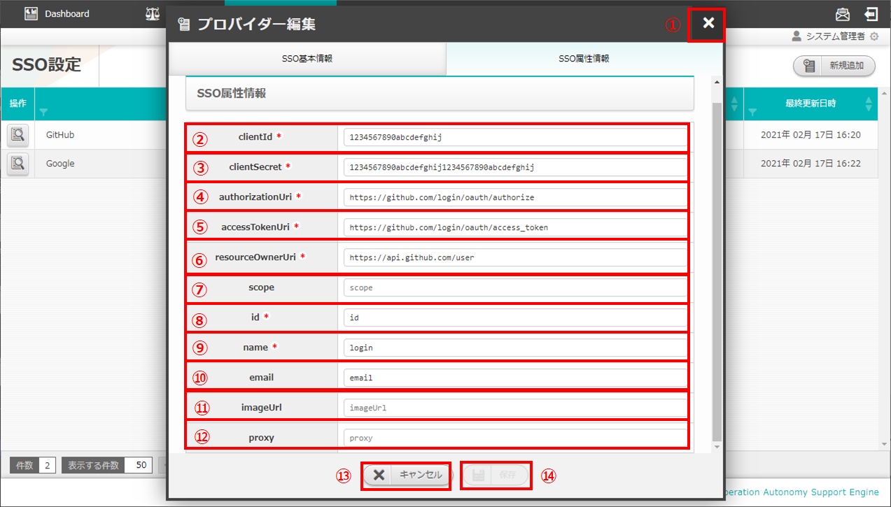

   図 2.2-6-1 プロバイダー編集画面(SSO属性情報)

.. csv-table:: 表 2.2-6-1 機能説明
   :header: No., 構成要素, 説明
   :widths: 5, 20, 60

   1, 閉じるボタン, 変更内容を破棄してプロバイダー編集画面を閉じ、SSO設定画面に戻ります。
   2, clientId, SSO設定画面で選択したSSO情報の認証クライアント識別子が表示され、編集可能です。必須項目です。256文字以内で入力してください。
   3, clientSecret, SSO設定画面で選択したSSO情報の認証クライアントシークレットが表示され、編集可能です。必須項目です。256文字以内で入力してください。
   4, authorizationUri, SSO設定画面で選択したSSO情報のユーザー認証エンドポイントが表示され、編集可能です。必須項目です。256文字以内で入力してください。
   5, accessTokenUri, SSO設定画面で選択したSSO情報のaccessToken 取得エンドポイントが表示され、編集可能です。必須項目です。256文字以内で入力してください。
   6, resourceOwnerUri, SSO設定画面で選択したSSO情報のユーザー情報取得エンドポイントが表示され、編集可能です。必須項目です。256文字以内で入力してください。
   7, scope, SSO設定画面で選択したSSO情報のユーザー情報の開示(取得)範囲が表示され、編集可能です。任意項目です。256文字以内で入力してください。
   8, id, SSO設定画面で選択したSSO情報のユーザーID キー名が表示され、編集可能です。必須項目です。256文字以内で入力してください。
   9, name, SSO設定画面で選択したSSO情報のユーザー名キー名をが表示され、編集可能です。必須項目です。256文字以内で入力してください。
   10, email, SSO設定画面で選択したSSO情報のユーザーメールアドレスキー名が表示され、編集可能です。任意項目です。256文字以内で入力してください。
   11, imageUrl, SSO設定画面で選択したSSO情報のユーザー画像 URL キー名が表示され、編集可能です。任意項目です。256文字以内で入力してください。
   12, proxy, SSO設定画面で選択したSSO情報のプロキシが表示され、編集可能です。任意項目です。256文字以内で入力してください。
   13, キャンセルボタン, 変更内容を破棄してプロバイダー詳細画面を閉じ、SSO設定画面に戻ります。
   14, 保存ボタン, 編集情報を保存してSSO設定画面に戻ります。入力変更がない場合、保存ボタンは活性化されません。

