=============================================
2 OASE システム設定画面のメニュー 、画面構成
=============================================

本章では、OASE システム設定画面の画面構成と、各構成要素について説明します。

2.1 基本画面構成
================ 

システム設定画面のログ設定の画面構成は次のとおりです。

.. _system_disp:

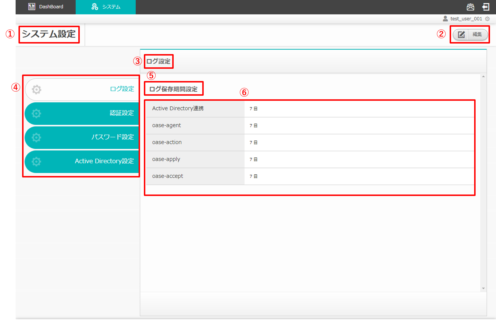
   
   図 2.1-1 画面構成

システム設定画面のログ設定の各構成要素と、その機能は次の表のとおりです。

.. csv-table:: 表 2.1-1 機能説明
   :header: No., 構成要素, 説明
   :widths: 5, 20, 60

   1, 作業画面名, 現在表示している作業画面の名称です。
   2, 編集ボタン,編集画面に遷移し、システム設定を編集できます。
   3, 設定名, 現在表示している設定名です。
   4, タブ, 各設定のタブです。
   5, カテゴリー名, 作業設定名に関連するカテゴリーの名称です。
   6, 一覧, ログ設定に登録されている情報が表示されます。

システム設定のログ設定の編集画面の画面構成は次のとおりです。

.. _system_edit:

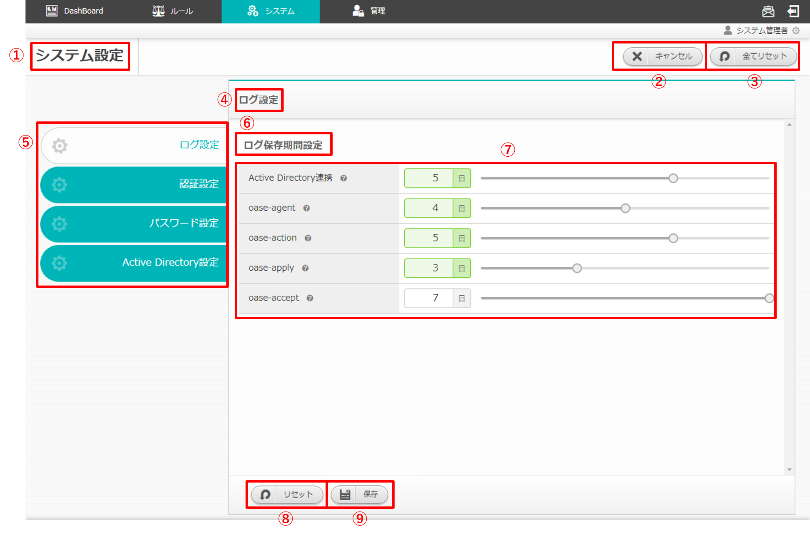

   図 2.1-2 画面構成

システム設定のログ設定の編集画面の各構成要素と、その機能は次の表のとおりです。

.. csv-table:: 表 2.1-2 機能説明
   :header: No., 構成要素, 説明
   :widths: 5, 20, 60

   1, 作業画面名, 現在表示している作業画面の名称です。
   2, キャンセルボタン,編集作業をキャンセルし、システム設定画面に戻ります。
   3, 全てリセットボタン,全ての編集途中の内容を編集前の値にリセットします。
   4, 作業設定名, 現在選択している設定の情報が表示されます。
   5, タブ, 各設定のタブです。
   6, カテゴリー名, 作業設定名に関連するカテゴリーの名称です。
   7, 設定項目一覧,ログ設定に関する設定を編集できます。
   8, リセットボタン,編集途中の内容を編集前の値にリセットします。
   9, 保存ボタン,編集内容を保存します。

   
| 認証設定の画面構成はログ設定同様です。
| 詳細は前述の「システム設定画面のログ設定」 :ref:`system_disp` および、
| 「システム設定のログ設定の編集画面」 :ref:`system_edit` をご参照ください。

   
   図 2.1-3 画面構成

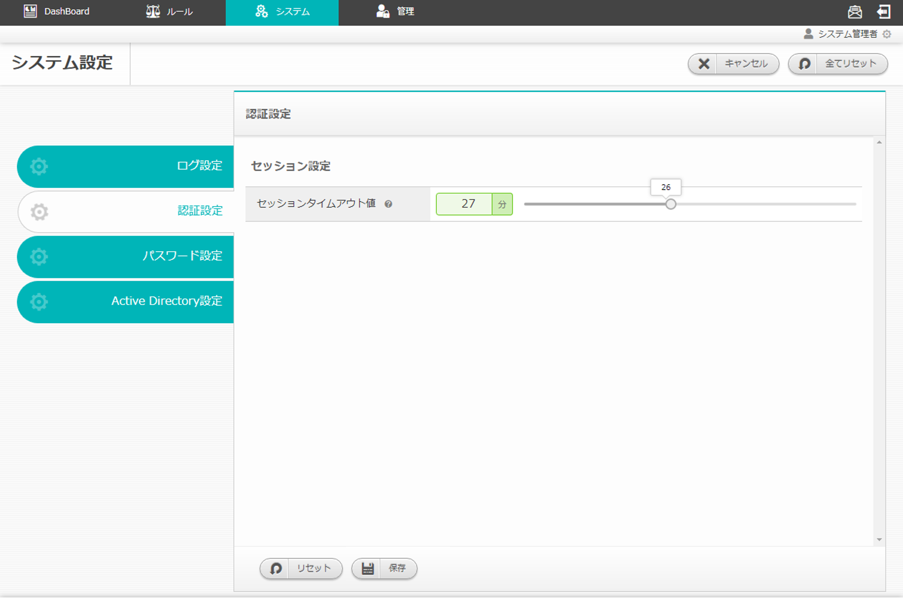
   
   図 2.1-4 画面構成

| パスワード設定の画面構成はログ設定同様です。
| 詳細は前述の「システム設定画面のログ設定」 :ref:`system_disp` および、
| 「システム設定のログ設定の編集画面」 :ref:`system_edit` をご参照ください。
| ※AD連携時にはシステム管理者以外には表示されません。

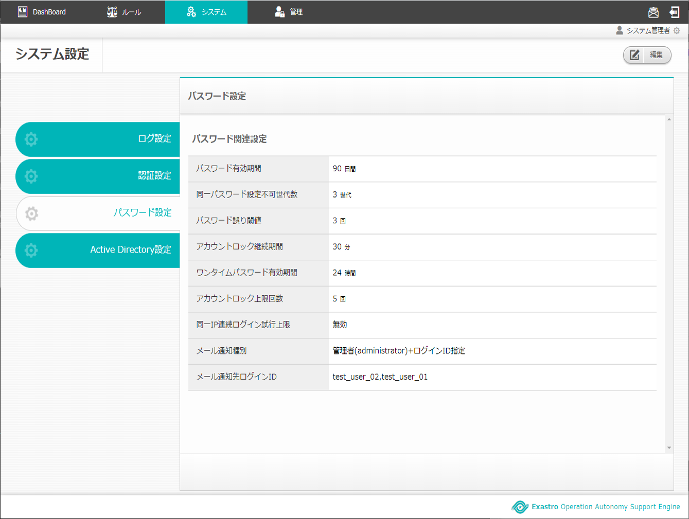
   
   図 2.1-5 画面構成

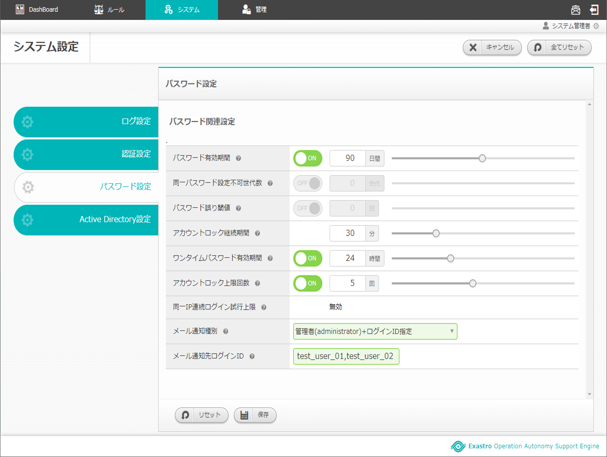
   
   図 2.1-6 画面構成

| Active Directory設定の画面構成はログ設定同様です。
| 詳細は前述の「システム設定画面のログ設定」 :ref:`system_disp` および、
| 「システム設定のログ設定の編集画面」 :ref:`system_edit` をご参照ください。
| ※Active Directory未連携時は管理者ユーザなどの設定項目は表示されません。

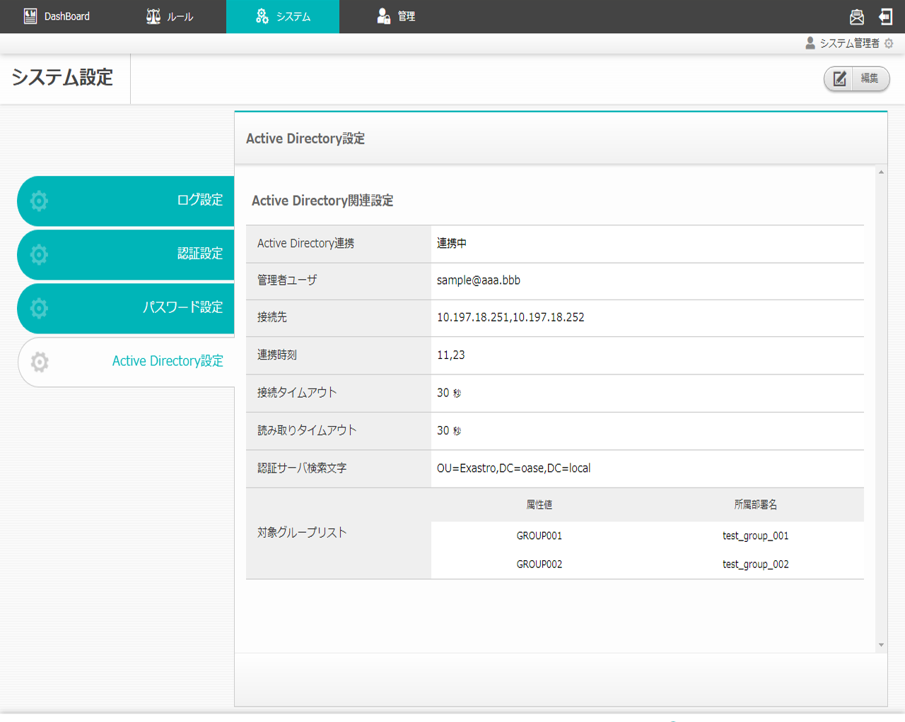
   
   図 2.1-7 画面構成

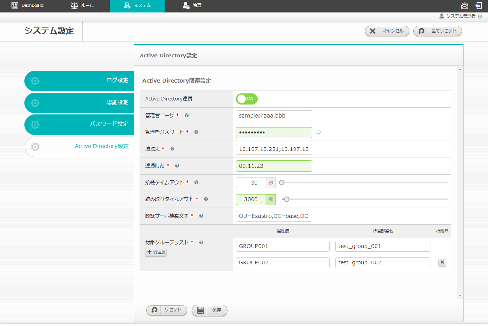
   
   図 2.1-8 画面構成

2.2 システム設定画面の操作方法
==============================

構成要素に対する操作方法を説明します。

(1)システム設定画面
-------------------
| 登録されている設定を設定名毎に一覧で表示します。

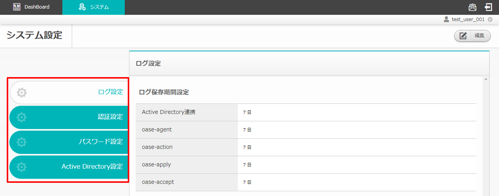

   図 2.2-1-1 設定名が表示されたタブ 

一覧
^^^^

.. csv-table:: 表 2.2-1-1 機能説明
   :header: No., 構成要素, 説明
   :widths: 5, 25, 60

   1, タブ, 参照したいタブ名を押下すると画面が切り替わります。

(2)システム設定編集画面
-----------------------
| システム設定を編集することができます。
| システム設定画面へのアクセス権限が「更新可能」の場合のみ、システム設定編集画面を表示することができます。

   図 2.2-2-1 アクセス権限が「更新可能」であるため「編集ボタン」が表示される

ボタン説明
^^^^^^^^^^

.. figure:: ../images/system_config/system_button.png
   :scale: 100%
   :align: center

   図 2.2-2-2 各種ボタン 

.. csv-table:: 表 2.2-2-2 機能説明
   :header: No., 構成要素, 説明
   :widths: 5, 25, 60

   1, キャンセル, 変更した値が破棄された状態でシステム設定画面に戻ります。
   2, 全てリセット, 値を変更する前のシステム設定編集画面に戻ります。

(3)ログ設定タブ
-------------------
| 登録されているログ設定を一覧で表示します。

一覧
^^^^

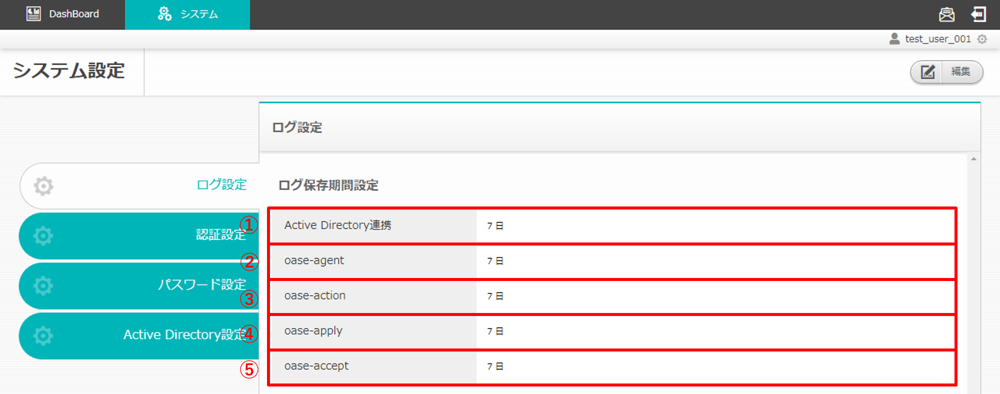

   図 2.2-3-1 一覧に表示される項目

.. csv-table:: 表 2.2-3-1 機能説明
   :header: No., 構成要素, 説明
   :widths: 5, 25, 60

   1, Active Directory連携, AD連携のログ保存期間が表示されます。
   2, oase-agent, oase-agent.serviceのログ保存期間が表示されます。
   3, oase-action, oase-action.serviceのログ保存期間が表示されます。
   4, oase-apply, oase-apply.serviceのログ保存期間が表示されます。
   5, oase-accept, oase-accept.serviceのログ保存期間が表示されます。

(4)ログ設定タブ (編集時)
------------------------
| ログ設定を編集することができます。

入力覧
^^^^^^
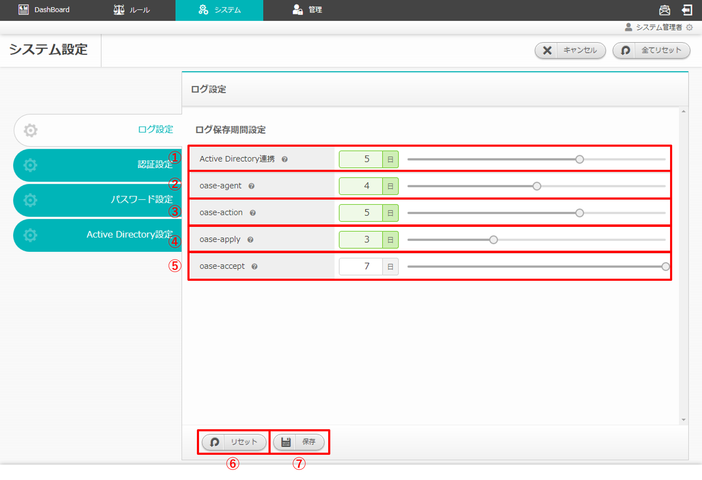

   図 2.2-4-1 ログ設定編集画面の各項目

.. csv-table:: 表 2.2-4-1 機能説明
   :header: No., 構成要素, 説明
   :widths: 5, 25, 60

   1, Active Directory連携, 1から7の値を設定できます。 
   2, oase-agent, 1から7の値を設定できます。
   3, oase-action, 1から7の値を設定できます。
   4, oase-apply, 1から7の値を設定できます。
   5, oase-accept,1から7の値を設定できます。
   6, リセットボタン, 値を変更する前のログ設定編集画面に戻ります。
   7, 保存ボタン, ログ設定の編集内容が反映され、システム設定画面に移ります。

(5)認証設定タブ
-------------------
| 登録されている認証設定を一覧で表示します。

一覧
^^^^

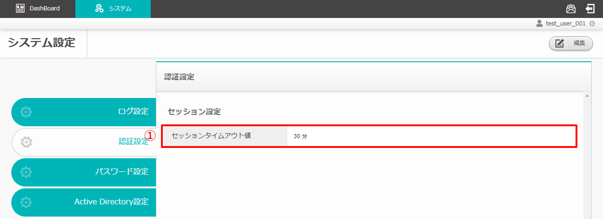

   図 2.2-5-1 一覧に表示される項目

.. csv-table:: 表 2.2-5-1 機能説明
   :header: No., 構成要素, 説明
   :widths: 5, 30, 60

   1, セッションタイムアウト値, セッションのタイムアウト値が表示されます。

(6)認証設定タブ (編集時)
-------------------------
| 認証設定を編集することができます。

入力覧
^^^^^^
.. figure:: ../images/system_config/authentication_column_edit.png
   :scale: 100%
   :align: center

   図 2.2-6-1 ログ設定編集画面の各項目

.. csv-table:: 表 2.2-6-1 機能説明
   :header: No., 構成要素, 説明
   :widths: 5, 30, 60

   1, セッションタイムアウト値, 1から60の値を設定できます。
   2, リセットボタン, 値を変更する前の認証設定編集画面に戻ります。
   3, 保存ボタン, 認証設定の編集内容が反映され、システム設定画面に移ります。

(7)パスワード設定タブ
---------------------
| 登録されているパスワード設定を一覧で表示します。

一覧
^^^^

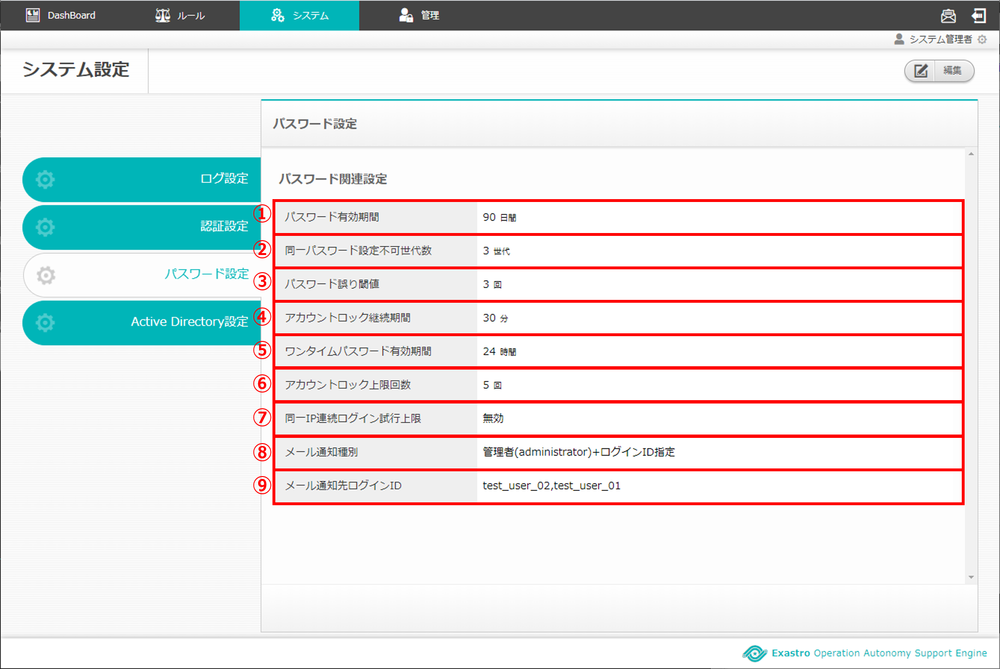

   図 2.2-7-1 一覧に表示される項目

.. csv-table:: 表 2.2-7-1 機能説明
   :header: No., 構成要素, 説明
   :widths: 5, 40, 60

   1, パスワード有効期間, パスワード有効期間が表示されます。
   2, 同一パスワード設定不可世代数, 同一パスワード設定不可世代数が表示されます。
   3, パスワード誤り閾値, ログイン時のパスワード誤り閾値が表示されます。
   4, アカウントロック継続期間, アカウントロック継続期間が表示されます。
   5, ワンタイムパスワード有効期間, ワンタイムパスワード有効期間が表示されます。
   6, アカウントロック上限回数, アカウントロック上限回数が表示されます。
   7, 同一IP連続ログイン試行上限, 同一IP連続ログイン試行上限が表示されます。※この項目は「ブラック/ホワイトリスト」機能が無効の場合は「無効」と表示されます。「ブラック/ホワイトリスト」機能はsettings.pyで設定します。
   8, メール通知種別, メール通知種別が表示されます。
   9, メール通知先ログインID, メール通知先のログインIDが表示されます。※この項目はメール通知種別が'管理者(administrator)+ログインID指定'の場合表示されます。

(8)パスワード設定タブ (編集時)
-------------------------------
| パスワード設定を編集することができます。

入力覧
^^^^^^
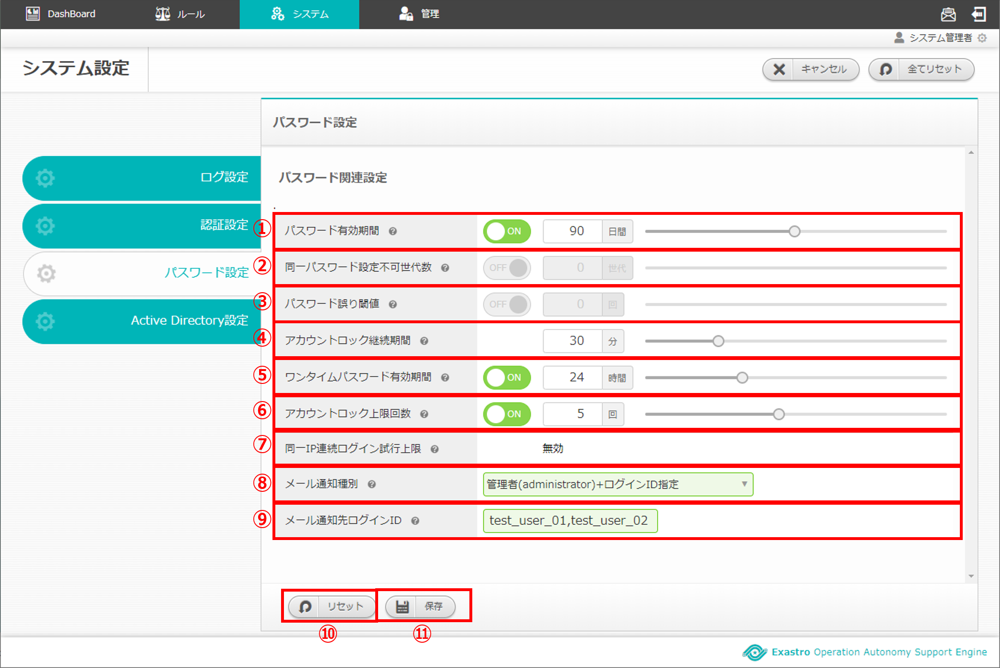

   図 2.2-8-1 パスワード設定編集画面の各項目

.. csv-table:: 表 2.2-8-1 機能説明
   :header: No., 構成要素, 説明
   :widths: 5, 40, 60

   1, パスワード有効期間, 1から180の値を設定できます。OFFにすると有効期間が無期限になります。
   2, 同一パスワード設定不可世代数, 1から5の値を設定できます。OFFにすると無制限になります。
   3, パスワード誤り閾値, 1から10の値を設定できます。OFFにすると無制限になります。※パスワード誤り閾値を超えたユーザは、アカウントが一時的にロックされます。
   4, アカウントロック継続期間, 1から120の値を設定できます。※パスワード誤り閾値を超えたユーザはこの設定値に応じて一時的にロックされます。
   5, ワンタイムパスワード有効期間, 1から72の値を設定できます。OFFにすると無期限になります。ワンタイムパスワードはユーザを新規追加した時に発行されます。
   6, アカウントロック上限回数, 1から10の値を設定できます。OFFにすると無制限になります。※アカウントロック上限を超えたユーザは、アカウントロックユーザに登録されます。
   7, 同一IP連続ログイン試行上限, 1から1000の値を設定できます。OFFにすると無制限になります。※同一IPが連続でログインに失敗し上限を超えた場合ブラックリストに登録されます。また、「ブラック/ホワイトリスト」機能が無効の場合は「無効」と表示されます。「ブラック/ホワイトリスト」機能はsettings.pyで設定します。
   8, メール通知種別, "'管理者(administrator)のみ','管理者(administrator)+ユーザ更新権限のあるユーザ','管理者(administrator)+ログインID指定'の3種類から選択できます。※アカウントロックユーザやブラックリストが登録された際に、選択した種別に応じてメールが送信されます。"
   9, メール通知先ログインID, メール通知したいログインIDを入力して下さい。カンマ区切りで複数指定可能です。※この項目はメール通知種別を'管理者(administrator)+ログインID指定'を選択した場合表示されます。
   10, リセットボタン, 値を変更する前のパスワード設定編集画面に戻ります。
   11, 保存ボタン, パスワード設定の編集内容が反映され、システム設定画面に移ります。

(9)Active Directory設定タブ
-----------------------------
| 登録されているActive Directory設定を一覧で表示します。

一覧
^^^^

   図 2.2-9-1 一覧に表示される項目

.. csv-table:: 表 2.2-9-1 機能説明
   :header: No., 構成要素, 説明
   :widths: 5, 30, 60

   1, Active Directory連携, AD連携の状態が表示されます。
   2, 管理者ユーザ, 認証サーバ接続ユーザ名が表示されます。
   3, 接続先, 接続先が表示されます。
   4, 連携時刻, 連携時刻が表示されます。単位は(時)です。
   5, 接続タイムアウト, 接続タイムアウト値が表示されます。
   6, 読み取りタイムアウト, 読み取りタイムアウト値が表示されます。
   7, 認証サーバ検索文字, 認証サーバ検索文字が表示されます。
   8, 対象グループリスト, 対象グループリストが表示されます。

.. note::

    AD未連携時は「表 2.6-1-1 機能説明」の2～8は表示されません。

(10)Active Directory設定タブ (編集時)
--------------------------------------
| Active Directory設定を編集することができます。

入力覧
^^^^^^

   図 2.2-10-1 Active Directory設定編集画面の各項目

.. csv-table:: 表 2.2-10-1 機能説明
   :header: No., 構成要素, 説明
   :widths: 5, 25, 60

   1, Active Directory連携, AD連携の状態を選択してください。
   2, 管理者ユーザ, 入力必須項目です。64文字以内で入力してください。認証サーバ接続ユーザ名を入力して下さい。
   3, 管理者パスワード, 入力必須項目です。認証サーバ接続パスワードを入力して下さい。
   4, 接続先, 入力必須項目です。512文字以内で入力してください。認証サーバ接続先ドメインを優先度が高い順にカンマ区切りで設定して下さい。
   5, 連携時刻, 入力必須項目です。80文字以内で入力してください。1日におけるAD連携実行時刻を入力して下さい。複数時間設定する場合はカンマ区切りで設定してください。
   6, 接続タイムアウト, 1から99999の値を設定できます。
   7, 読み取りタイムアウト,1から99999の値を設定できます。
   8, 認証サーバ検索文字, 入力必須項目です。256文字以内で入力してください。Active Directoryから取得できる識別名を指定してください。
   9, 行追加ボタン, 対象グループリスト情報入力欄を1行ずつ追加します。対象グループリストは30件まで登録可能です。
   10,属性値,入力必須項目です。40文字以内で入力してください。Active Directoryに設定済みのグループ(commonName)を属性値に指定してください。
   11,所属部署名,入力必須項目です。40文字以内で入力してください。所属部署名はOASEのグループ名として使用されます。
   12,削除ボタン,追加した行を削除します。
   13, リセットボタン, 値を変更する前のActive Directory設定編集画面に戻ります。
   14, 保存ボタン, Active Directory設定の編集内容が反映され、システム設定画面に移ります。Active Directoryとの連携に失敗した場合、保存されません。

.. note::

    AD連携を実行するとシステム管理者を除く現在登録中のグループ・ユーザ情報が全て削除され、ADから取得したグループ・ユーザを設定します。AD連携を解除するとADから取得したグループ・ユーザが全て削除されます。
    
