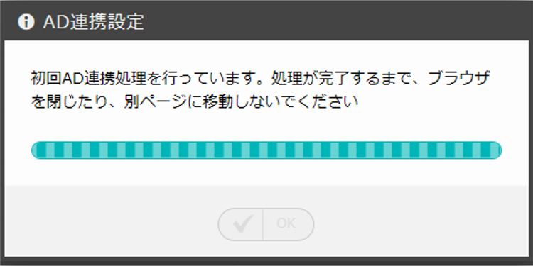
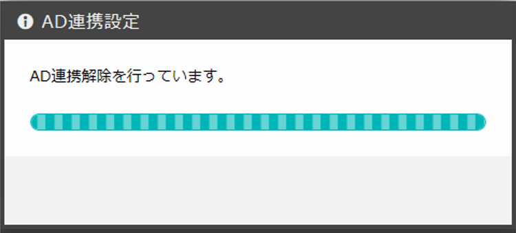

====================================
3 Active Directory連携の設定について
====================================

| 本章では、OASE のシステム設定画面のActive Directory連携の設定について説明します。

Active Directory との連携を行う契機として、以下の3つが挙げられます。

* システム設定画面の「Active Directory連携」の設定項目をOFFからONに切り替え保存する
* システム設定画面の「Active Directory連携」の設定項目をONからOFFに切り替え保存する
* システム設定画面の「AD連携時刻」に設定された時刻を迎える

これらを契機に処理される連携関連の処理は、それぞれ異なる挙動をします。

3.1 OFFからONに切り替えた際の挙動
=================================

OFFからONに切り替えた際、システム画面にて入力された「Active Directory設定」の各項目をDBに保存します。
その後、一台のサーバに対して、Active Directory連携のcronを設定します。

DBの保存、および、cronの設定が成功すると、認証サーバへ接続、認証を行い、ユーザとグループの情報を取得します。
取得されたユーザとグループの情報は、OASE内のユーザとグループの情報として保存されます。

   図 3.1 Active Directory連携ON

.. note::
    画面に表示されているとおり、処理が完了するまでブラウザを閉じたり、別のページへ移動しないようご注意ください。
    もし、ブラウザを閉じたり、別ページへ移動した場合、正常に連携が行われていない可能性があります。
    その際は、一度「Active Directory連携」の設定項目をOFFにして保存した後、再度、ONにして設定をやり直してください。
    また、エラーにより正常に連携ができなかった際も、同様の試みをしてください。

3.2 ONからOFFに切り替えた際の挙動
=================================

ONからOFFに切り替えた際、既存の「Active Directory設定」の各項目は初期化されます。
その後、Active Directory連携のcron設定が削除されます。

各項目の初期化、および、cron設定の削除が成功すると、
ADから取得したグループ・ユーザが全て削除されます。

   図 3.2 Active Directory連携ON

3.3 AD連携時刻を迎えた際の挙動
==============================

Active Directory連携がONの場合、「AD連携時刻」に設定された時刻にcronによる連携処理が行われます。

そのため、Active Directoryへユーザやグループの情報を更新しても、即時にOASEへは反映されません。
AD連携時刻を迎えるまでは、更新前の情報がOASE内では有効となっております。

AD連携時刻を迎えると、認証サーバへ接続、認証を行い、ユーザとグループの情報を取得します。
取得されたユーザとグループの情報は、OASE内のユーザとグループの情報として保存されます。

