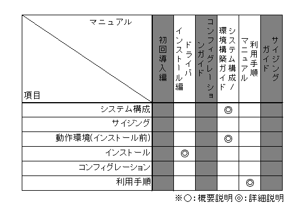

=========================
はじめに
=========================

| 本書では、NEC Operation Autonomy Support Engine (以降、OASEと略)システム運用
| の為のシステム構成と、環境構築について説明します。

・OASE基本機能

.. image:: ../images/base-oase.png
   :scale: 100%
   :align: center

・オプション機能

