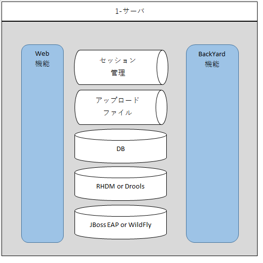

=================================
システム構成
=================================

webコンテンツ、BackYardコンテンツ、データベースは、次のようなサーバ構成で運用が可能です。

.. csv-table::
   :header: No., 構成, 説明, メリット, デメリット
   :widths: 5, 16, 20, 15, 15

   1, オールインワン（シングル）型, OASE システムを一つのサーバ上で組み立てる最も簡単で安価な構築型,構築が簡易かつ低コスト,バックアップ無し

以降に、各型のイメージ図を記載します。

| ・オールインワン（シングル）型

