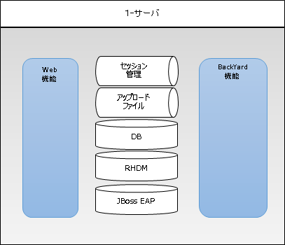

=================================
システム構成
=================================

システム構成パターン
********************

webコンテンツ、BackYardコンテンツ、データベースは、次のようなサーバ構成で運用が可能です。

.. csv-table::
   :header: No., 構成, 説明, メリット, デメリット
   :widths: 5, 16, 20, 15, 15

   1, オールインワン（シングル）型, OASE システムを一つのサーバ上で組み立てる最も簡単で安価な構築型,構築が簡易かつ低コスト,バックアップ無し

以降に、各型のイメージ図を記載します。

| ・オールインワン（シングル）型

システムの通信要件
******************

| 本システム構成において、各サービス間の通信要件は以下の通りです。

.. csv-table:: 表 通信要件一覧
   :header: No., FROM, TO, プロトコル, 主な用途
   :widths: 5, 20, 20, 30, 50

   1, 端末, Web, "http(s)
                 [80(443)/tcp]", OASEのWebコンテンツへのアクセス
   2, Web/BackYard, MariaDB, "tcp
                             [3306/tcp]", DBサーバへのアクセス
   3, Web, RabbitMQ, "tcp
                     [4369/tcp
                      5672/tcp
                       25672/tcp]", メッセージの送受信
   4, 端末, RabbitMQ, "tcp
                      [15672/tcp]", メッセージキューの管理
   5, BackYard, RHDM, "http
                      [8080/tcp]", ディシジョンテーブルのコンテナ管理
   6, 端末, RHDM, "http
                  [9990/tcp]", ディシジョンテーブルのコンテナ管理
   7, web, BackYard, "tcp
                     [50001/tcp]", ディシジョンテーブルのファイル管理
   8, BackYard, Exastro IT Automation, "http(s)
                                       [80(443)/tcp]※", Exastro IT Automationの作業実行をリクエストする
   9, web/BackYard, SMTP, "tcp
                          [25/tcp]※", メールを送信する

※代表的な例を記載。OASE外部のサービスに準拠するため適宜変更してください。

