=====================================================
2 OASE トークン払い出し画面のメニュー 、画面構成
=====================================================

本章では、OASE トークン払い出し画面の画面構成と、各構成要素について説明します。

2.1 基本画面構成
================

トークン払い出し画面の画面構成は次のとおりです。

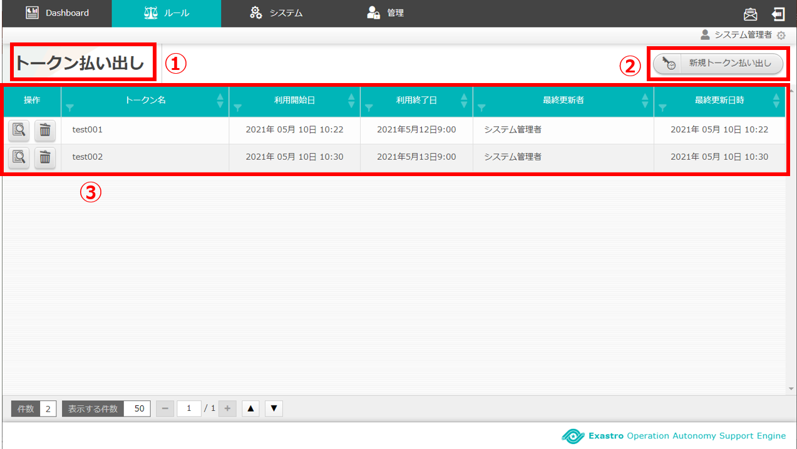

   図 2.1-1 画面構成

トークン払い出し画面の各構成要素と、その機能は次の表のとおりです。

.. csv-table:: 表 2.1-1 機能説明
   :header: No., 構成要素, 説明
   :widths: 5, 20, 60

   1, 作業画面名, 現在表示している作業画面の名称です。
   2, 新規トークン払い出しボタン,新規トークン払い出し画面に遷移し、トークン情報を入力して新規にトークンを払い出します。
   3, 一覧, 現在払い出されているトークン情報が表示されます。

トークン情報が1件も登録されていない場合は以下のように表示されます。

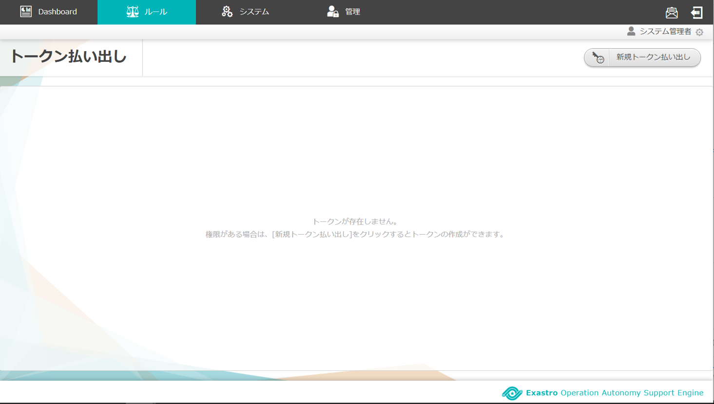

   図 2.1-2 画面構成(空)

新規トークン払い出し画面の画面構成は次のとおりです。

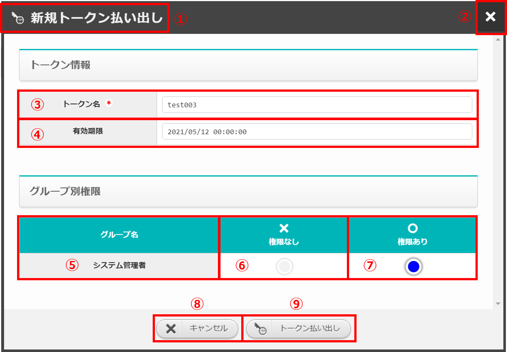

   図 2.1-3 画面構成(新規トークン払い出し)

新規トークン払い出し画面の各構成要素と、その機能は次の表のとおりです。

.. csv-table:: 表 2.1-3 機能説明(新規)
   :header: No., 構成要素, 説明
   :widths: 5, 20, 60

   1, 作業画面名, 現在表示している作業画面の名称です。
   2, 閉じるボタン, 新規トークン払い出し画面を閉じてトークン払い出し画面に戻ります。
   3, トークン名, 払い出すトークンの名称です。
   4, 有効期限, 払い出すトークンの有効期限です。
   5, グループ名, 権限を設定するためのグループ名を表示します。
   6, 権限なし, ラジオボタンを有効の場合、対象のトークンの表示、編集権限がありません。
   7, 権限あり, ラジオボタンを有効の場合、対象のトークンの表示、編集権限があります。
   8, キャンセルボタン, 新規トークン払い出し画面を閉じてトークン払い出し画面に戻ります。
   9, トークン払い出しボタン, 入力したトークン情報をもとにトークンを払い出して、トークン表示画面に遷移します。

トークン払い出し一覧画面の画面構成は次のとおりです。

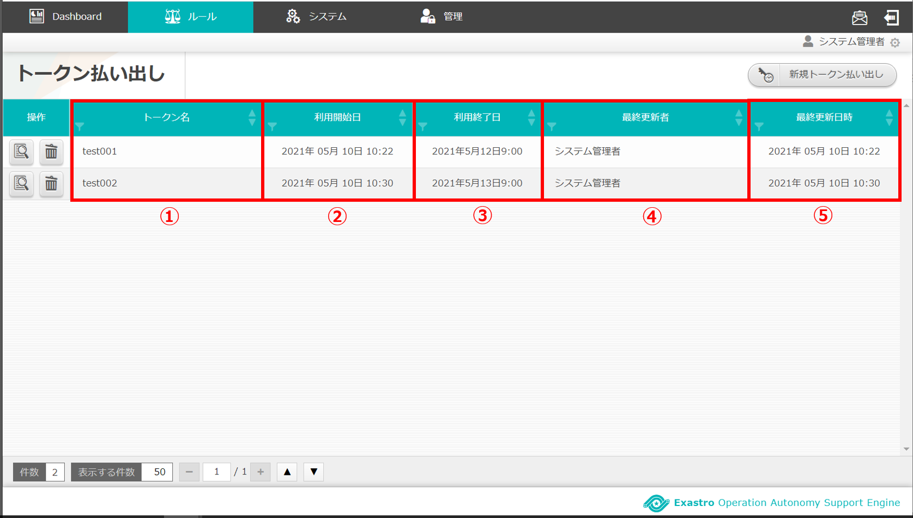

   図 2.1-4 画面構成(一覧)

トークン払い出し画面一覧の各構成要素と、その機能は次の表のとおりです。

.. csv-table:: 表 2.1-4 機能説明(一覧)
   :header: No., 構成要素, 説明
   :widths: 5, 20, 60

   1, トークン名, 払い出しているトークン情報の名前です。
   2, 利用開始日, トークンを払い出して、利用し始めた日時が表示されます。
   3, 利用終了日, 払い出したトークンの有効期限(日時)が表示されます。
   4, 最終更新者, トークン情報を更新したユーザの名前が表示されます。
   5, 最終更新日時, トークン情報を更新した日時が表示されます。

トークン詳細画面の画面構成は次のとおりです。

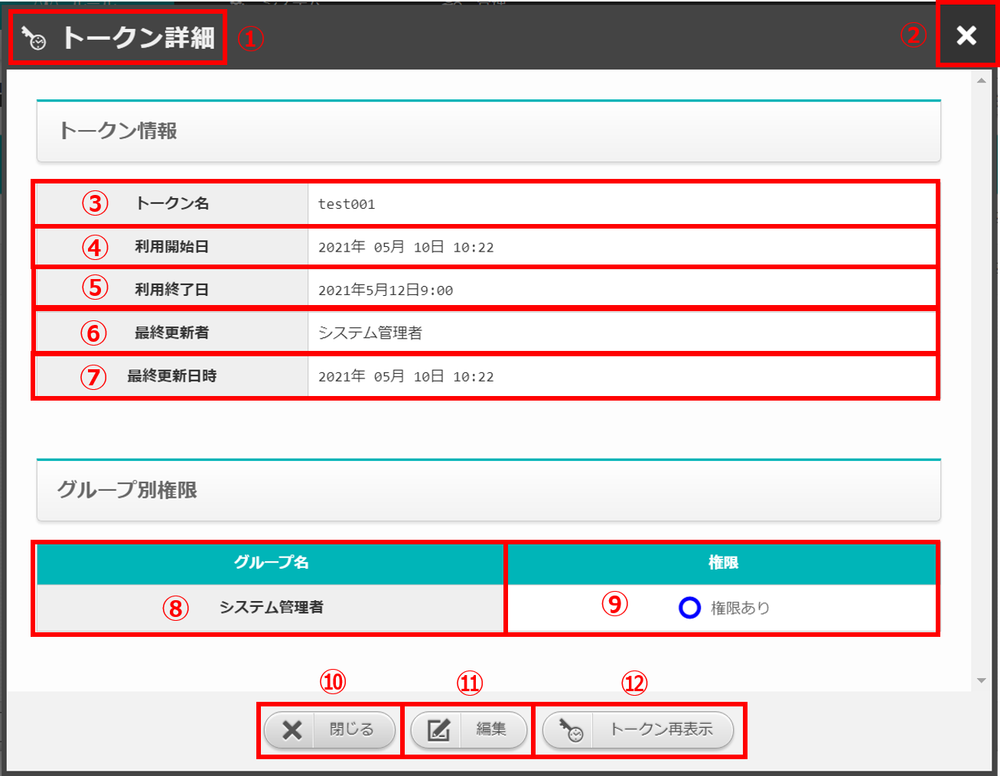

   図 2.1-5 画面構成(詳細)

トークン詳細画面の各構成要素と、その機能は次の表のとおりです。

.. csv-table:: 表 2.1-5 機能説明(詳細)
   :header: No., 構成要素, 説明
   :widths: 5, 20, 60

   1, 作業画面名, 現在表示している作業画面の名称です。
   2, 閉じるボタン, トークン詳細画面を閉じてトークン払い出し画面に戻ります。
   3, トークン名, 払い出しているトークン情報の名前です。
   4, 利用開始日, トークンを払い出して、利用し始めた日時が表示されます。
   5, 利用終了日, 払い出したトークンの有効期限(日時)が表示されます。
   6, 最終更新者, トークン情報を更新したユーザの名前が表示されます。
   7, 最終更新日時, トークン情報を更新した日時が表示されます。
   8, グループ名, 設定されているグループ名が表示されます。
   9, 権限, 対象グループに紐づいたトークンの権限あり/権限なしが表示されます。
   10, 閉じるボタン, トークン情報を更新した日時が表示されます。
   11, 編集ボタン, トークン情報を更新した日時が表示されます。
   12, トークン再表示ボタン, トークン情報を更新した日時が表示されます。

トークン編集画面の画面構成は次のとおりです。

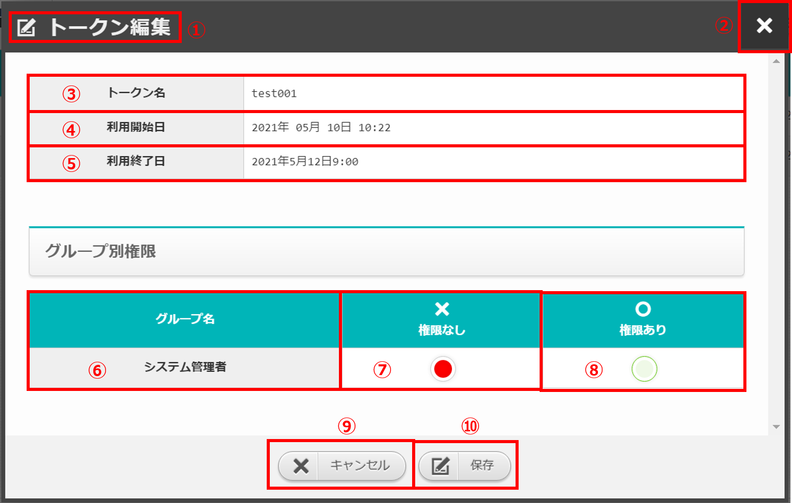

   図 2.1-6 画面構成(編集)

トークン編集画面の各構成要素と、その機能は次の表のとおりです。

.. csv-table:: 表 2.1-6 機能説明(編集)
   :header: No., 構成要素, 説明
   :widths: 5, 20, 60

   1, 作業画面名, 現在表示している作業画面の名称です。
   2, 閉じるボタン, トークン編集画面を閉じてトークン払い出し画面に戻ります。
   3, トークン名, 払い出しているトークン情報の名前です。
   4, 利用開始日, トークンを払い出して、利用し始めた日時が表示されます。
   5, 利用終了日, 払い出したトークンの有効期限(日時)が表示されます。
   6, グループ名, 設定されているグループ名が表示されます。
   7, 権限なし, ラジオボタンを有効の場合、対象のトークンの表示、編集権限がありません。
   8, 権限あり, ラジオボタンを有効の場合、対象のトークンの表示、編集権限があります。
   9, キャンセルボタン, トークン編集画面を閉じてトークン払い出し画面に戻ります。
   10, 保存ボタン, トークン情報を保存してトークン払い出し画面に戻ります。

2.2 トークン払い出し画面の操作方法
========================================

構成要素に対する操作方法を説明します。

(1)トークン払い出し画面
-----------------------
| 払い出されているトークン情報を一覧で表示します。

詳細表示ボタン
^^^^^^^^^^^^^^

選択したトークン名の詳細を表示します。

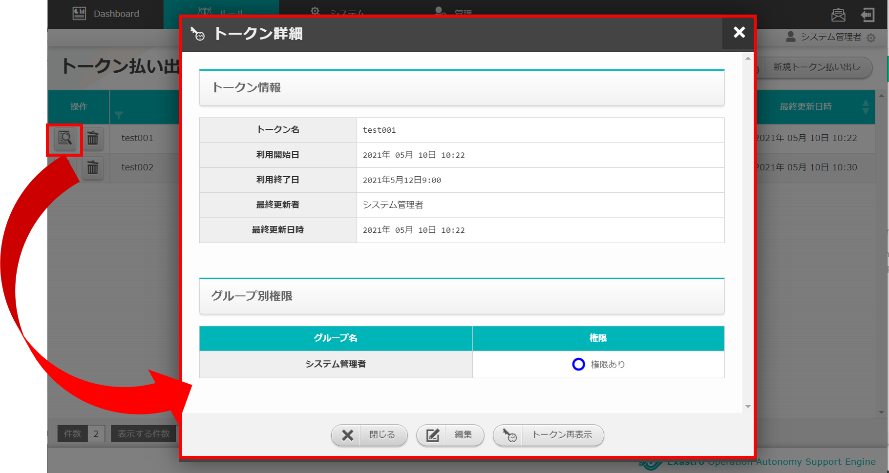

   図 2.2-1-1 詳細表示ボタンを押下した場合に表示される画面

トークン再表示ボタン
^^^^^^^^^^^^^^^^^^^^

パスワードの再入力が求められ、入力した後に払い出したトークンを再表示します。

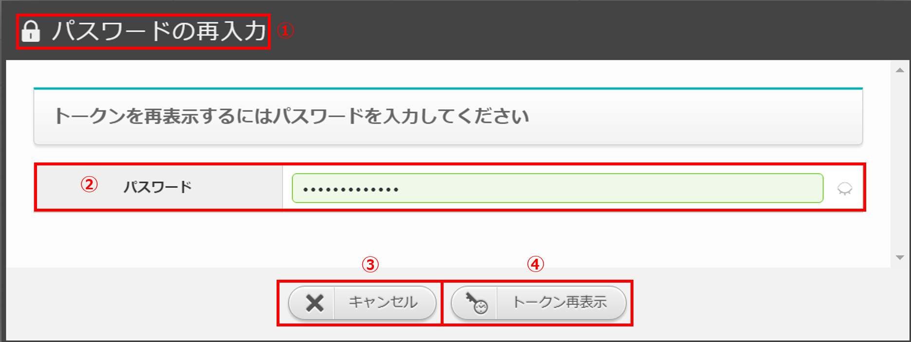

   図 2.2-1-2 パスワードの再入力画面

パスワード再入力画面の各構成要素と、その機能は次の表のとおりです。

.. csv-table:: 表 2.2-1-1 パスワード再入力画面
   :header: No., 構成要素, 説明
   :widths: 5, 20, 60

   1, 作業画面名, 現在表示している作業画面の名称です。
   2, パスワード, 現在のユーザがログイン時に入力したパスワードです。
   3, キャンセルボタン, パスワード再入力画面を閉じてトークン払い出し画面に戻ります。
   4, トークン再表示ボタン, パスワードが正しい場合はトークン表示画面に遷移します。

払い出されたトークンを再表示します。

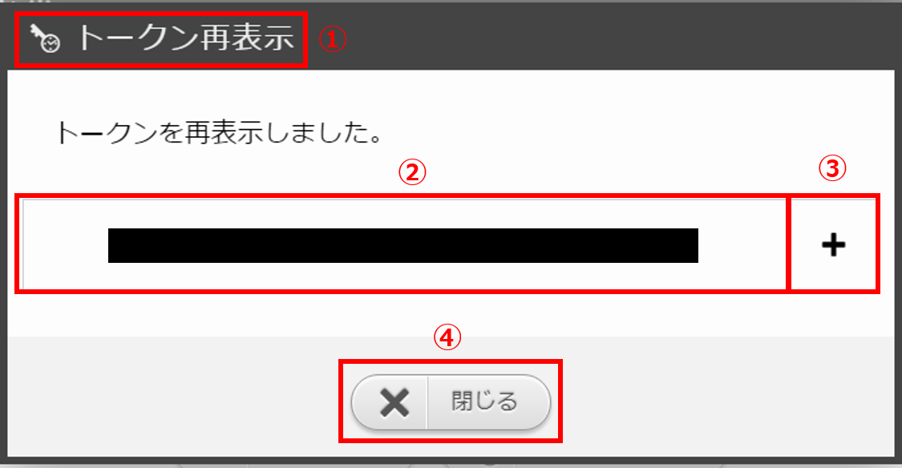

   図 2.2-1-3 トークン再表示画面

トークン再表示画面の各構成要素と、その機能は次の表のとおりです。

.. csv-table:: 表 2.2-1-2 トークン再表示画面
   :header: No., 構成要素, 説明
   :widths: 5, 20, 60

   1, 作業画面名, 現在表示している作業画面の名称です。
   2, トークン, 払い出しているトークンの値です。
   3, クリップボードにコピーボタン, トークンの値をクリップボードに保存されます。
   3, 閉じるボタン, トークン再表示画面を閉じてトークン払い出し画面に戻ります。

(2)新規トークン払い出し画面
---------------------------
| 新規でトークンの払い出しができます。

新規トークン払い出しボタン
^^^^^^^^^^^^^^^^^^^^^^^^^^

新規トークン払い出し画面を表示します。

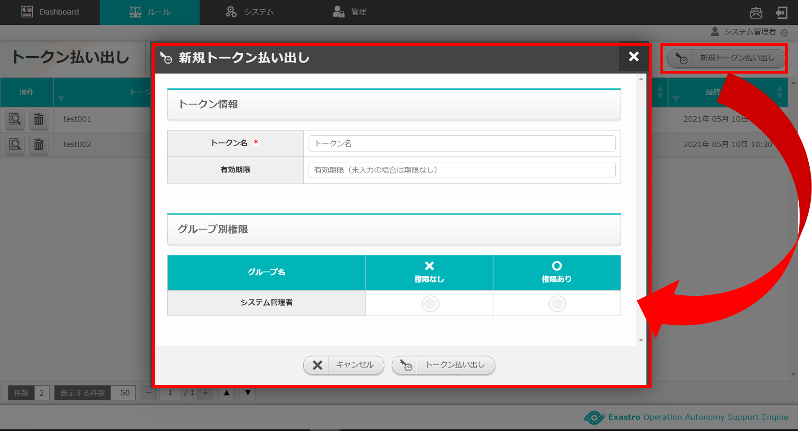

   図 2.2-2-1 新規トークン払い出し画面に遷移

新規トークン払い出し画面の項目を入力して、トークンの払い出しを行います。

| 入力欄

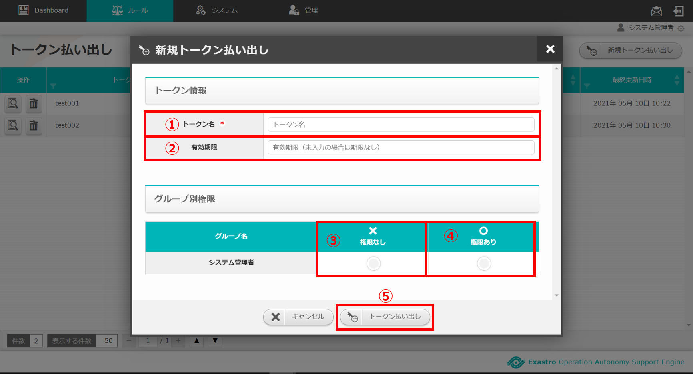

   図 2.2-2-2 新規トークン払い出し画面(入力)

.. csv-table:: 表 2.2-2-1 新規トークン払い出し入力欄
   :header: No., 構成要素, 説明
   :widths: 5, 20, 60

   1, トークン名, 入力必須項目です。64文字以内で入力してください。
   2, 有効期限, 払い出すトークンの有効期限を入力してください。※未入力の場合は期限なしとなります。
   3, 権限なし, ラジオボタンを有効にし保存すると、対象のトークンの表示、編集権限を失います。
   4, 権限あり, ラジオボタンを有効にし保存すると、対象のトークンの表示、編集権限を得ます。
   5, トークン払い出しボタン, 入力したトークン情報をもとにトークンを払い出して、トークン表示画面に遷移します。

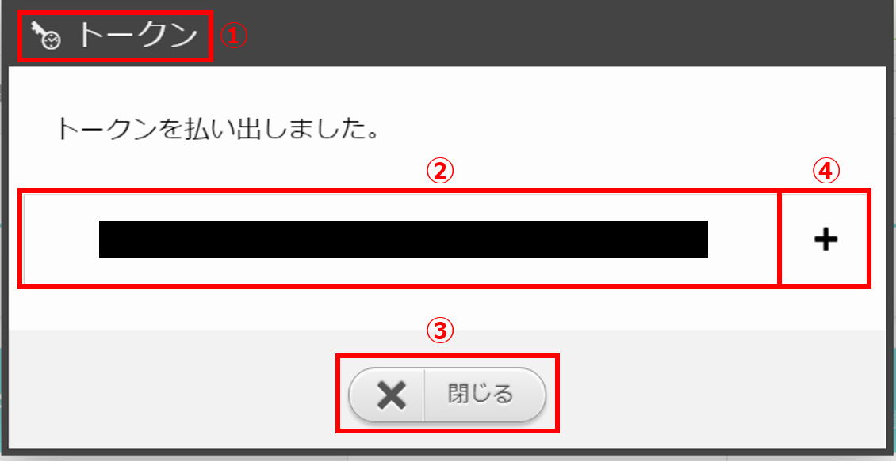

   図 2.2-2-3 トークン表示画面

.. csv-table:: 表 2.2-2-2 トークン表示画面
   :header: No., 構成要素, 説明
   :widths: 5, 20, 60

   1, 作業画面名, 現在表示している作業画面の名称です。
   2, トークン, 払い出しているトークンの値です。
   3, クリップボードにコピーボタン, トークンの値をクリップボードに保存されます。
   4, 閉じるボタン, トークン再表示画面を閉じてトークン払い出し画面に戻ります。

(3)トークン編集画面
---------------------------
| 払い出したトークンの編集ができます。

編集ボタン
^^^^^^^^^^

トークン編集画面を表示します。

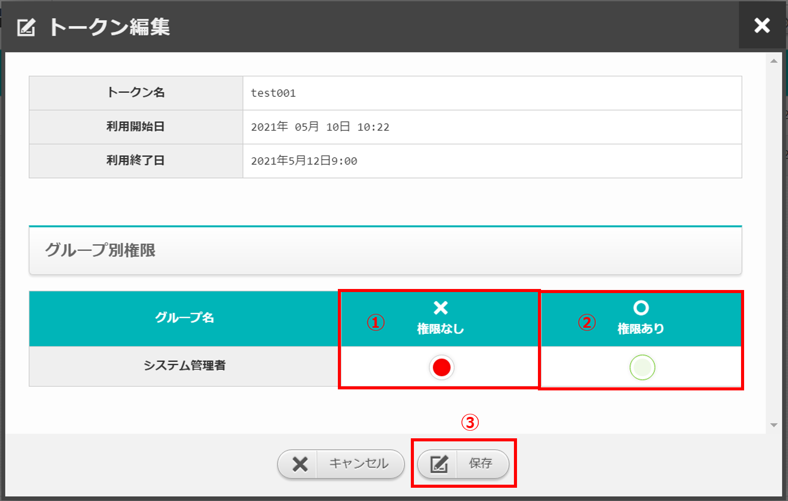

   図 2.2-3-1 トークン編集画面(入力)

.. csv-table:: 表 2.2-3-1 トークン編集入力欄
   :header: No., 構成要素, 説明
   :widths: 5, 20, 60

   1, 権限なし, ラジオボタンを有効にし保存すると、対象のトークンの表示、編集権限を失います。
   2, 権限あり, ラジオボタンを有効にし保存すると、対象のトークンの表示、編集権限を得ます。
   3, 保存ボタン, トークン情報を保存してトークン払い出し画面に戻ります。

