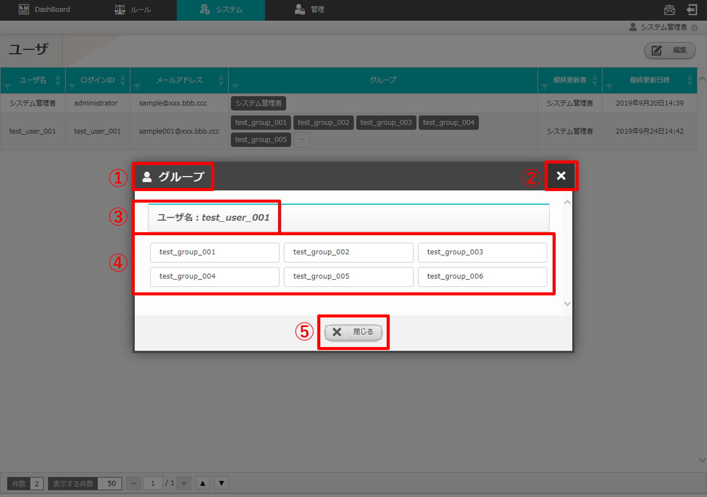
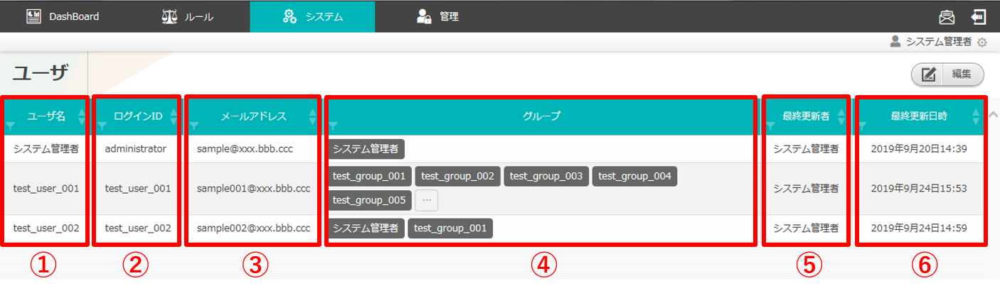

========================================
2 OASE ユーザ画面のメニュー 、画面構成
========================================

本章では、OASE ユーザ画面の画面構成と、各構成要素について説明します。

2.1 基本画面構成
================ 

ユーザ画面の画面構成は次のとおりです。

   図 2.1-1 画面構成

ユーザ画面の各構成要素と、その機能は次の表のとおりです。

.. csv-table:: 表 2.1-1 機能説明
   :header: No., 構成要素, 説明
   :widths: 5, 20, 60

   1, 作業画面名, 現在表示している作業画面の名称です。
   2, 編集ボタン,編集画面に遷移し、ユーザの追加、編集、削除をします。※AD連携時には表示されません。
   3, システム管理者,最初から登録されてるユーザです。編集できません。※AD連携時でも表示されます。
   4, グループボタン,ユーザの所属グループが6つ以上の場合表示されます。このボタンをクリックすると、所属しているグループを全て表示します。

   
グループの画面構成は次のとおりです。

   図 2.1-2 画面構成

.. csv-table:: 表 2.1-2 機能説明
   :header: No., 構成要素, 説明
   :widths: 5, 20, 60

   1, 作業画面名, 現在表示している作業画面の名称です。
   2, 閉じるボタン, グループ画面を閉じてユーザ画面に戻ります。
   3, ユーザ名, グループ画面を表示されているユーザ名が表示されます。
   4, 所属グループ, 所属しているグループが全て表示されます。
   5, 閉じるボタン, グループ画面を閉じてユーザ画面に戻ります。

| ユーザの編集画面の画面構成は次のとおりです。
| ※AD連携時には表示されません。

   図 2.1-3 画面構成

ユーザの編集画面の各構成要素と、その機能は次の表のとおりです。

.. csv-table:: 表 2.1-3 機能説明
   :header: No., 構成要素, 説明
   :widths: 5, 20, 60

   1, 作業画面名, 現在表示している作業画面の名称です。
   2, キャンセルボタン,編集作業をキャンセルし、グループ画面に戻ります。
   3, リセットボタン,編集途中の内容を編集前の値にリセットします。
   4, 追加ボタン,グループ情報入力欄を1行ずつ追加します。
   5, 保存ボタン,編集内容を保存します。
   6, 更新メニュー,既存のグループに対し「更新」または「削除」を選択できます。※「4.追加ボタン」押下による新規追加グループには表示されません。
   7, ユーザ名,任意のユーザ名を入力できます。
   8, ログインID,ログインIDを入力できます。
   9, メールアドレス,メールアドレスを入力できます。
   10, グループの選択ボタン,グループ画面を表示します。
   11, 削除ボタン,追加した行を削除します。

グループの選択画面の画面構成は次のとおりです。

   図 2.1-4 画面構成

.. csv-table:: 表 2.1-4 機能説明
   :header: No., 構成要素, 説明
   :widths: 5, 20, 60

   1, 作業画面名, 現在表示している作業画面の名称です。
   2, 閉じるボタン, 所属グループ編集画面を閉じてユーザ画面に戻ります。
   3, グループ選択,編集途中の内容を編集前の値にリセットします。
   4, キャンセルボタン,編集作業をキャンセルし、ユーザの編集画面に戻ります。
   5, 適用ボタン,編集内容を適用します。

2.2 ユーザ画面の操作方法
==========================

構成要素に対する操作方法を説明します。

(1)ユーザ画面
---------------
| 登録されているユーザを一覧で表示します。
| 編集ボタンについては各権限ごとに異なります。ここでは共通機能について説明します。

一覧
^^^^

   図 2.2-1-1 ユーザ画面の一覧の各項目

.. csv-table:: 表 2.2-1-1 機能説明
   :header: No., 構成要素, 説明
   :widths: 5, 20, 60

   1, ユーザ名,ユーザのユーザ名が表示されます。
   2, ログインID,ログインIDが表示されます。
   3, メールアドレス,メールアドレスが表示されます。
   4, グループ,所属しているグループが表示されます。所属グループが6つ以上の場合省略されます。
   5, 最終更新者,ユーザの情報を更新したユーザの名前が表示されます。
   6, 最終更新日時,ユーザの情報を更新した日時が表示されます。

.. note::
    AD連携時はユーザ画面の編集ボタンが表示されません。また、AD連携をしていない状態でも、ユーザ画面へのアクセス権限が「更新可能」以外の場合、同様に編集ボタンは表示されません。 

グループ
^^^^^^^^

* 所属グループが6つ以上の場合、グループボタンが追加されます。グループボタンをクリックすると、グループ画面が表示され、所属しているグループをすべて見ることができます。

   図 2.2-1-2 グループ画面の各項目

(2)ユーザ編集画面
-------------------
| ユーザを新規追加および、すでに登録されているユーザを更新、削除することができます。
| ユーザ画面へのアクセス権限が「更新可能」の場合のみ、ユーザ編集画面を表示することができます。

   図 2.2-2-1 アクセス権限が「更新可能」であるため「編集ボタン」が表示される

入力欄
^^^^^^

   図 2.2-2-2 ユーザ編集画面の各項目

.. csv-table:: 表 2.2-2-2 機能説明
   :header: No., 構成要素, 説明
   :widths: 5, 18, 60

   1,キャンセル,変更内容を破棄してユーザ編集画面を閉じ、ユーザ画面に戻ります。
   2,リセット,値を変更する前のユーザ編集画面に戻ります。
   3,追加, 編集欄が1行追加されます。
   4,保存,変更内容を保存してユーザ編集画面を閉じ、ユーザ画面に戻ります。新規追加されたユーザには登録されたメールアドレスにログインID通知メールとパスワード通知メールが送られます。
   5,更新,既存のユーザを更新する場合はプルダウンメニューから「更新」を選択してください。また、削除する場合は「削除」を選択してください。選択状態で「保存ボタン」を押下すると、選択した内容が反映されます。※新規追加行にはプルダウンメニューは表示されません。
   6,ユーザ名,入力必須項目です。64文字以内で入力してください。
   7,ログインID,入力必須項目です。32文字以内で入力してください。入力可能文字は半角英数字、記号(.@_-)です。
   8,メールアドレス,入力必須項目です。256文字以内で入力してください。
   9,グループ,入力必須項目です。グループの選択ボタンを押下して選択してください。所属グループが6つ以上の場合省略されグループボタンが追加されます。ただし新規追加の場合は全て表示されます。
   10,最終更新者,ユーザ編集画面の「保存ボタン」を押下したユーザ名が自動で反映されます。
   11,最終更新日時,ユーザ編集画面の「保存ボタン」を押下した時刻が自動で反映されます。
   12,追加行削除ボタン,ユーザ編集画面の「追加ボタン」を押下した場合、欄内に押下可能な「×」ボタンが表示されます。「×」ボタンを押下すると、追加行が削除されます。

グループの選択画面の入力欄
^^^^^^^^^^^^^^^^^^^^^^^^^^

   図 2.2-2-3 グループの選択画面の各項目

.. csv-table:: 表 2.2-2-3 機能説明
   :header: No., 構成要素, 説明
   :widths: 5, 20, 60

   1, 閉じるボタン,グループの選択画面を閉じてユーザ編集画面に戻ります。
   2, グループ一覧,チェックボックスを有効にし、適用すると所属するグループが適用されます。1つ以上選択してください。
   3, キャンセルボタン,グループの選択画面を閉じてユーザ編集画面に戻ります。
   4, 適用ボタン,編集した権限情報を適用してユーザ編集画面に移ります。

.. note::
   1つのユーザに複数のグループを指定すると、それらのグループの中で一番権限の強い権限が反映されます。

